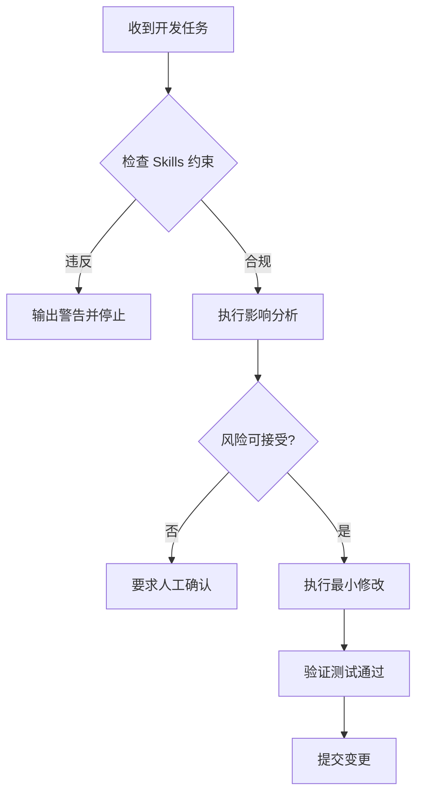

# Claude Skills 约束体系

本项目采用**受约束的 AI 开发模式**，通过 Claude Skills 约束体系确保代码质量、架构稳定性和系统可靠性。

## 📋 约束体系概览

| Skill | 用途 | 约束等级 | 核心目标 |
|-------|------|----------|----------|
| minimal_change | 最小修改策略 | 🔴 RED | 防止过度重构，保持系统稳定 |
| architecture_boundary | 架构边界保护 | 🔴 RED | 维护清晰的层次结构 |
| test_guard | 测试质量保护 | 🔴 RED | 确保测试的真实价值 |
| context_lock | 核心模块冻结 | 🔴 RED | 保护系统基石不被破坏 |
| change_impact | 变更影响分析 | 🔴 RED | 充分评估每次修改的影响 |

## 📁 目录结构

```
.claude/
├── skills/                           # 项目专用技能 (12个)
│   ├── code-quality/                # 代码质量管理
│   ├── football-prediction/         # ⭐ 比赛预测分析
│   ├── report-generation/           # ⭐ 报告和可视化
│   ├── machine-learning-engineering/# ML工程工具
│   ├── data-collection/             # ⭐⭐ API数据收集
│   ├── performance-monitoring/      # ⭐⭐ 性能和监控
│   ├── deployment-management/       # ⭐⭐ 部署和运维
│   ├── database-operations/         # ⭐ 数据库管理
│   ├── api-testing/                 # API测试工具
│   ├── data-engineering/            # 数据管道工具
│   ├── docker-devops/               # Docker和DevOps
│   └── fastapi-development/         # FastAPI最佳实践
├── minimal_change.skill.md          # 最小修改策略
├── architecture_boundary.skill.md   # 架构边界保护
├── test_guard.skill.md              # 测试质量保护
├── context_lock.skill.md            # 核心模块冻结
├── change_impact.skill.md           # 变更影响分析
├── CLAUDE.md                        # 项目级上下文（位于根目录）
├── mcp-config.json                  # MCP服务器配置
├── settings.local.json              # 本地工具权限
└── README.md                        # 本文件
```

## 🎯 核心原则

### 1. 稳定性优先
- 当前阶段：**稳定性 > 可维护性 > 扩展性 > 重构美观**
- 禁止为了"美观"或"个人偏好"的修改
- 每次修改必须是最小必要改动

### 2. 架构完整性
- 严格遵守分层架构
- 禁止跨层污染
- 维护清晰的依赖关系

### 3. 测试保护网
- 测试是保护网，不是负担
- 优先修复源码，而非放宽测试
- 每个测试必须有明确的业务价值

### 4. 核心冻结保护
- P0/P1/P2 级别核心模块严格保护
- 任何修改都需要充分评估
- 确保系统可靠性和准确性

## 🤖 Claude Code 行为规范

### 默认行为
1. **修改前必查**
   - 检查是否违反 Skills 约束
   - 执行影响分析
   - 确认风险评估

2. **最小修改**
   - 禁止新建文件（除非必要）
   - 禁止版本类文件（*_v2, *_new）
   - 单次修改控制在最小范围

3. **架构守护**
   - 检查跨层依赖
   - 验证层次边界
   - 维护架构纯净

4. **测试守护**
   - 反对弱断言
   - 要求测试价值说明
   - 保护测试覆盖率

### 交互流程


## 🔓 约束突破条件

在以下情况下，可以申请突破 Skill 约束：

### 1. 紧急 Bug 修复
- **条件**: 生产环境故障
- **流程**:
  1. 说明紧急性
  2. 提供 hotfix 方案
  3. 承诺事后完善

### 2. 安全漏洞修复
- **条件**: 发现安全漏洞
- **流程**:
  1. 漏洞等级评估
  2. 修复方案说明
  3. 安全团队审批

### 3. 性能瓶颈改造
- **条件**: 关键性能问题
- **流程**:
  1. 性能基准数据
  2. 改造必要性论证
  3. 架构师审批

### 4. 架构债务清理
- **条件**: 积累的技术债务
- **流程**:
  1. 债务影响评估
  2. 清理计划
  3. 分阶段实施

## 👨‍💼 人类开发者职责

### 最终裁决权
- **人类开发者拥有最终决策权**
- 可以否决 AI 的建议
- 可以授权突破约束

### 监督责任
- 审查 AI 的变更建议
- 确保约束体系有效执行
- 持续优化约束规则

### 培训指导
- 明确业务需求优先级
- 提供架构决策指导
- 解释复杂业务规则

## 📊 约束效果监控

### 关键指标
- 约束违反次数
- 修改影响范围
- 测试覆盖率变化
- 系统稳定性指标

### 持续改进
- 定期评估约束有效性
- 根据项目演进调整规则
- 优化自动化检测机制

## 🚨 紧急联系

如果遇到约束体系无法处理的特殊情况：
1. 立即停止自动修改
2. 联系项目架构师
3. 记录具体情况
4. 共同制定解决方案

---

## 📚 原有技能说明

### 🎯 技能总览 (12个技能)

### ⭐ 核心业务技能 (4个)

#### 1. Football Prediction (`football-prediction`)
**触发**: "预测比赛", "match prediction", "球队分析"
- XGBoost 2.0+ ML model with 67.2% accuracy
- Real-time predictions (<100ms response)
- Professional feature engineering (12+ features)
- Batch prediction support

#### 2. Report Generation (`report-generation`)
**触发**: "生成报告", "generate report", "可视化"
- Multi-format output (PDF, Word, Excel)
- Professional data visualization
- Pre-match analysis reports (8-10 pages)
- Excel dashboards and charts

#### 3. Machine Learning Engineering (`machine-learning-engineering`)
**触发**: "模型优化", "特征工程", "ML模型"
- XGBoost hyperparameter tuning
- SHAP model explanations
- Feature importance analysis
- Model performance optimization

#### 4. Data Collection (`data-collection`)
**触发**: "收集数据", "数据采集", "FotMob数据", "实时数据" ⭐⭐
- FotMob API L2 data extraction
- Real-time match statistics collection
- Odds data gathering and validation
- Batch and incremental data processing

### ⭐⭐ 运维支撑技能 (4个)

#### 5. Performance Monitoring (`performance-monitoring`)
**触发**: "性能监控", "系统监控", "性能分析", "Grafana", "指标" ⭐⭐
- Prometheus metrics collection
- Grafana dashboard visualization
- Real-time system health monitoring
- Alert management and notification

#### 6. Deployment Management (`deployment-management`)
**触发**: "部署", "发布", "生产环境", "Docker部署" ⭐⭐
- Docker container orchestration
- Blue-green and rolling deployments
- Service health checks and monitoring
- Automated rollback mechanisms

#### 7. Database Operations (`database-operations`)
**触发**: "数据库操作", "数据迁移", "PostgreSQL", "查询优化" ⭐
- PostgreSQL connection pooling
- Query optimization and indexing
- Database migration management
- Backup and recovery operations

### 🔧 开发工具技能 (5个)

#### 8. Code Quality (`code-quality`)
**触发**: "代码质量", "quality check", "测试"
- Integrated with Makefile commands
- Automated formatting and linting
- Test coverage monitoring (80%+ target)
- CI/CD pipeline integration

#### 5. API Testing (`api-testing`)
**触发**: "API测试", "接口测试", "endpoint测试"
- FastAPI endpoint testing
- Request/response validation
- Performance testing
- Integration test suites

#### 6. Data Engineering (`data-engineering`)
**触发**: "数据处理", "ETL", "数据管道"
- PostgreSQL data loading
- Feature pipeline optimization
- Data validation and cleaning
- Batch processing workflows

#### 7. Docker DevOps (`docker-devops`)
**触发**: "Docker", "容器化", "部署"
- Container orchestration
- Service health monitoring
- Production deployment
- Docker compose management

#### 8. FastAPI Development (`fastapi-development`)
**触发**: "FastAPI", "异步API", "web开发"
- Async/await best practices
- API design patterns
- Performance optimization
- Security implementation

## 💡 Usage Examples

### Match Prediction
```
User: "预测曼联对阿森纳的比赛"
→ Claude loads football-prediction skill
→ Runs: python scripts/predict_match_v2.py --home "曼联" --away "阿森纳"
```

### Report Generation
```
User: "生成比赛分析报告"
→ Claude loads report-generation skill
→ Creates professional PDF with analysis and charts
```

### Code Quality Check
```
User: "检查代码质量"
→ Claude loads code-quality skill
→ Runs: make quality && make test
```

## 🔧 Development Workflow

### Daily Development
```bash
# 1. Start environment
make dev
docker-compose up -d

# 2. Quality checks (handled by skill)
make quality
make test

# 3. Pre-commit validation
make prepush
./ci-verify.sh
```

### Skill-Based Development
When working with Claude Code, simply describe your task:

**核心业务**:
- "预测曼联对阿森纳的比赛" → Loads football-prediction skill
- "收集FotMob实时数据" → Loads data-collection skill
- "生成比赛分析报告" → Loads report-generation skill

**运维支撑**:
- "检查系统性能" → Loads performance-monitoring skill
- "部署到生产环境" → Loads deployment-management skill
- "优化数据库查询" → Loads database-operations skill

**开发工具**:
- "分析这个新特征的性能" → Loads ML engineering skill
- "创建API测试" → Loads API testing skill
- "优化Docker配置" → Loads Docker DevOps skill
- "处理比赛数据" → Loads data engineering skill
- "改进FastAPI性能" → Loads FastAPI development skill

## 📊 Project Context

### Architecture Highlights
- **Service Layer v2.0**: Modern microservice architecture
- **ML Inference Engine**: XGBoost model integration
- **Async-First**: FastAPI with async/await
- **Full Containerization**: Docker + docker-compose
- **Production Ready**: Monitoring, logging, health checks

### Key Metrics
- Test Coverage: 80%+ target
- Response Time: <100ms (predictions)
- Cache Hit Rate: >80%
- Model Accuracy: 67.2%

## 🚀 Best Practices Applied

1. **Skill Modularity**: Each skill addresses one specific capability
2. **Clear Descriptions**: Include usage triggers in skill descriptions
3. **Standard Structure**: All skills follow the `SKILL.md` format
4. **Version Control**: All skills are committed to git
5. **Team Sharing**: Skills automatically shared with team members

## 🔍 Skills vs Commands

- **Skills** (model-invoked): Claude autonomously decides when to use them based on your request
- **Commands** (user-invoked): Explicitly called with `/command-name`

Example:
- ✅ Skill: "分析比赛数据" → Claude loads appropriate skill automatically
- ❌ Command: Would require `/analyze-data` explicit invocation

## 📝 Adding New Skills

To add a new skill:

1. Create directory: `.claude/skills/your-skill/`
2. Add `SKILL.md` with YAML frontmatter:
   ```yaml
   ---
   name: your-skill
   description: Brief description with usage triggers
   ---
   ```
3. Test the skill by asking relevant questions
4. Commit to git to share with team

## 🛠️ Configuration Files

- `settings.local.json`: Local tool permissions (do not commit)
- Skills are automatically discovered from `.claude/skills/`
- No additional configuration needed

## 📚 Resources

- [Claude Code Skills Documentation](https://code.claude.com/docs/en/skills)
- [Skill Authoring Best Practices](https://platform.claude.com/docs/en/agents-and-tools/agent-skills/best-practices)
- [Claude Code Best Practices](https://www.anthropic.com/engineering/claude-code-best-practices)

---

## 🤖 MCP (Model Context Protocol) 服务器配置

本项目已启用最小权限、工程导向的 MCP 服务器，用于后端开发、测试与运维辅助。

### 已启用 MCP 列表

| MCP 服务器 | 权限级别 | 允许行为 | 禁止行为 |
|-----------|----------|----------|----------|
| **postgres** | READ-ONLY | SELECT / DESCRIBE / EXPLAIN | INSERT / UPDATE / DELETE / DDL |
| **filesystem** | PROJECT ROOT | 读 / diff / 受控写 | 访问 home / root / 系统目录 |
| **git** | READ-ONLY | commit history / diff / blame | commit / push / reset / rebase |
| **pytest** | RESTRICTED | 运行 pytest / 列出测试 | 修改测试 / 运行任意 shell 命令 |
| **docker** | READ-ONLY | docker compose ps / logs | build / push / prune / 文件访问 |

### 人工介入边界

**必须人工确认的情况：**
1. 任何可能导致生产环境数据修改的操作
2. 超出 MCP 权限范围的系统变更请求
3. 测试执行失败时的源码修复决策
4. 数据库结构变更或数据迁移操作
5. Docker 容器重建或配置修改

**MCP 自动化范围：**
1. ✅ 代码文件只读分析和差异检查
2. ✅ 测试用例执行和结果收集
3. ✅ 数据库只读查询和性能分析
4. ✅ Git 历史查询和代码审计
5. ✅ Docker 服务状态监控

### 重要声明

**MCP 不拥有生产环境控制权。**
- 所有 MCP 服务器均在严格权限限制下运行
- 禁止任何不可逆或高风险自动化操作
- 单人开发模式下，MCP 仅作为"能力补充"，不执行"系统接管"
- 遵循最小权限原则（Least Privilege）

### MCP 配置文件

- 主配置：`.claude/mcp-config.json`
- 实现文件：`mcp_servers/` 目录
- 修改 `.claude/mcp-config.json` 或 `mcp_servers/*.py` 后，需要退出并重启当前客户端会话
- 严格与 Claude Skills 约束兼容

---

**记住：约束体系的目的是保护系统，而不是限制创新。合理的约束带来更高的开发效率和更好的系统质量。**

最后更新：2025-12-21
版本：v1.1 (新增 MCP 配置)
