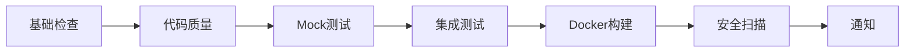
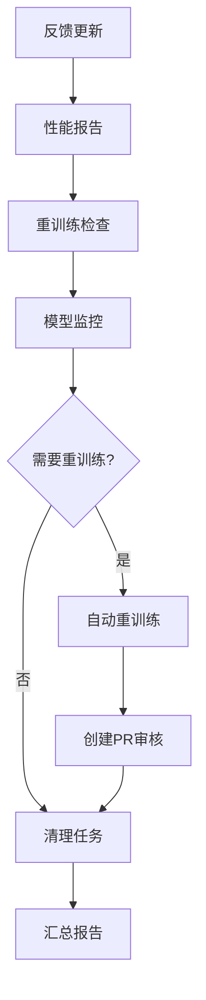
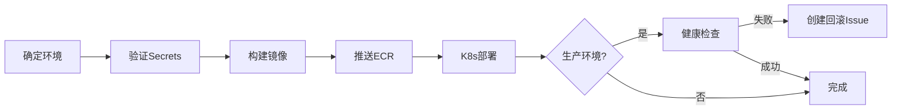

# GitHub Actions 工作流文档

## 🎯 概览

本项目采用优化后的工作流架构，从原来的15+个工作流精简为**4个核心工作流**，建立了完整的CI/CD和MLOps自动化体系。

### 📊 优化成果

| 指标 | 优化前 | 优化后 | 改进 |
|------|--------|--------|------|
| 工作流数量 | 15+ | 4 | ⬇️ 73% |
| 重复配置 | 多处 | 统一 | ✅ 100% |
| 依赖管理 | 混乱 | 标准化 | ✅ 统一路径 |
| 覆盖率配置 | 分散 | 集中 | ✅ 单一来源 |
| 安全验证 | 缺失 | 完整 | ✅ Secrets验证 |
| 通知机制 | 无 | Slack集成 | ✅ 实时通知 |

---

## 🚀 核心工作流

### 1. **CI流水线.yml** - 持续集成

**触发条件:**

- Push到 `main`, `develop`, `hotfix/**` 分支
- Pull Request到 `main`, `develop` 分支

**执行阶段:**



**关键特性:**

- ✅ 智能执行：基于文件变更决定是否运行完整流程
- ✅ 统一依赖：使用 `requirements/requirements.lock`
- ✅ 覆盖率监控：目标80%（软约束，不阻止CI）
- ✅ Slack通知：成功/失败实时通知
- ✅ 缓存优化：加速依赖安装

**覆盖率说明:**

```yaml
# 从 pytest.ini 读取配置
# 默认目标：80%
# 当前策略：软警告，不阻止CI通过
```

---

### 2. **MLOps机器学习流水线.yml** - 机器学习运维

**触发条件:**

- 定时：每日 8:00 UTC (北京时间 16:00)
- 手动：workflow_dispatch
- Push到 `main` 分支（仅影响 `src/models/**`, `scripts/**`）

**执行阶段:**



**⚠️ 重要改进：自动重训练需要人工审核**

```yaml
# 旧流程（风险）：
自动重训练 → 自动部署到生产 ❌

# 新流程（安全）：
自动重训练 → 创建PR → 人工审核 → 合并部署 ✅
```

**PR自动创建内容:**

- 📊 性能对比报告
- 🔍 验证指标详情
- 📦 模型文件备份
- ⚠️ 明确标注需要审核

**手动触发选项:**

```bash
# 可选任务
- all              # 运行所有任务
- feedback-update  # 仅更新反馈
- performance-report # 仅生成报告
- retrain-check   # 仅检查重训练
- model-monitor   # 仅监控模型
- cleanup         # 仅清理数据
```

---

### 3. **部署流水线.yml** - 自动化部署

**触发条件:**

- CI流水线成功后自动触发
- 手动触发（可选环境：staging/production）

**部署流程:**



**环境策略:**

- **Staging**: 从 `main` 分支自动部署
- **Production**: 需要手动触发，包含额外检查

**安全特性:**

- ✅ Secrets验证：部署前验证所有必需的凭证
- ✅ 健康检查：生产环境部署后自动验证
- ✅ 自动回滚：失败时创建回滚Issue
- ✅ 资源配置：生产环境3副本，staging环境1副本

**必需的Secrets:**

```yaml
AWS_ACCESS_KEY_ID
AWS_SECRET_ACCESS_KEY
```

---

### 4. **项目维护流水线.yml** - 定期维护

**触发条件:**

- 定时：每周一凌晨 2:00 UTC
- 手动：workflow_dispatch

**维护任务:**

| 任务 | 功能 | 频率 |
|------|------|------|
| 📚 文档更新 | API文档、README统计、贡献者列表 | 每周 |
| 🧹 清理任务 | 旧分支、工作流运行、artifacts | 每周 |
| 📊 统计报告 | 项目指标、贡献热图 | 每周 |
| 📦 归档报告 | 压缩旧报告（>3个月） | 每周 |
| 🔔 Stale Issues | 30天标记，60天关闭 | 每周 |

**清理策略:**

```yaml
工作流运行: 保留90天
Artifacts: 保留30天  
Stale Issues: 30天标记 → 60天关闭
旧报告: 90天归档 → 365天压缩
```

---

## 🔧 配置与约定

### 依赖管理

**标准路径:**

```
requirements/
├── base.txt          # 基础依赖
├── requirements.lock # 锁定版本（生产）
├── dev.lock         # 开发依赖锁定
├── ml.txt           # 机器学习依赖
└── api.txt          # API专用依赖
```

**工作流中的使用:**

```bash
# 首选：锁定依赖
if [ -f "requirements/requirements.lock" ]; then
  pip install -r requirements/requirements.lock
# 备选：基础依赖
elif [ -f "requirements/base.txt" ]; then
  pip install -r requirements/base.txt
fi
```

### 覆盖率配置

**集中管理：** `pytest.ini`

```ini
[coverage:report]
precision = 2
show_missing = True
# 目标：80% (软目标)
# fail_under = 80  # 取消注释强制执行
```

**CI中的使用:**

```bash
# 自动从 coverage.json 读取
# 低于80%时警告，但不阻止CI
```

### Secrets管理

**必需的Secrets:**

| Secret | 用途 | 工作流 |
|--------|------|--------|
| `AWS_ACCESS_KEY_ID` | AWS认证 | 部署 |
| `AWS_SECRET_ACCESS_KEY` | AWS认证 | 部署 |
| `DATABASE_URL` | 数据库连接 | MLOps (可选) |
| `REDIS_URL` | Redis连接 | MLOps (可选) |
| `MLFLOW_TRACKING_URI` | MLFlow追踪 | MLOps (可选) |
| `SLACK_WEBHOOK_URL` | Slack通知 | CI/MLOps (可选) |

**验证机制:**

```bash
# 所有关键工作流都包含验证步骤
- name: Verify required secrets
  run: |
    # 检查必需的secrets
    # 失败时提供清晰的错误信息
```

---

## 🔔 通知机制

### Slack集成 (可选)

**配置方法:**

1. 创建Slack Incoming Webhook
2. 添加到GitHub Secrets: `SLACK_WEBHOOK_URL`
3. 工作流自动发送通知

**通知内容:**

- ✅ CI成功/失败状态
- 📊 关键指标摘要
- 🔗 工作流运行链接
- 👤 触发者信息

**示例通知:**

```
✅ CI Pipeline - owner/repo
CI Pipeline completed successfully!

Branch: main
Commit: abc1234
Author: username
Workflow: View Details
```

---

## 🎓 使用指南

### 日常开发流程

```bash
# 1. 创建功能分支
git checkout -b feature/new-feature

# 2. 开发并提交
git add .
git commit -m "feat: add new feature"

# 3. 推送（触发CI）
git push origin feature/new-feature
# → 自动运行：基础检查 → 质量检查 → 测试

# 4. 创建PR
# → 完整CI流程 + 覆盖率报告

# 5. 合并到main
# → CI成功 → 自动部署到staging
```

### MLOps操作

```bash
# 查看最新的模型性能报告
# 每日自动生成，无需手动操作

# 手动触发重训练检查
# Actions → MLOps机器学习流水线 → Run workflow
# 选择 task: retrain-check

# 如果创建了模型更新PR：
# 1. 查看 artifacts 中的对比报告
# 2. 审核性能提升
# 3. 批准并合并PR
# 4. 自动部署新模型
```

### 紧急回滚

```bash
# 如果部署失败：
# 1. 自动创建回滚Issue
# 2. 按照Issue中的命令执行：

kubectl rollout undo deployment/football-prediction -n production
kubectl rollout status deployment/football-prediction -n production
```

---

## 📈 性能优化

### 缓存策略

所有工作流都使用智能缓存：

```yaml
- uses: actions/cache@v3
  with:
    path: ~/.cache/pip
    key: ${{ runner.os }}-pip-${{ hashFiles('requirements/**/*.lock') }}
    restore-keys: |
      ${{ runner.os }}-pip-
```

### 并行执行

```yaml
# 质量检查 和 Mock测试 并行运行
quality-check:
  needs: [basic-checks]
  
mocked-coverage:
  needs: [basic-checks]  # 同时依赖，并行执行
```

### 条件执行

```yaml
# 只在相关文件变更时运行
if: needs.basic-checks.outputs.should-run == 'true'
```

---

## 🐛 故障排查

### CI失败

**问题：依赖安装失败**

```bash
# 检查 requirements/requirements.lock 是否存在
# 如果不存在，工作流会降级使用 base.txt
```

**问题：覆盖率低于阈值**

```bash
# 新策略：只警告，不阻止CI
# 查看日志中的覆盖率报告
# 逐步提升测试覆盖
```

### MLOps问题

**问题：重训练PR未创建**

```bash
# 检查 comparison_report.json
# 新模型可能性能未超过当前模型
# 查看 artifacts 获取详细报告
```

**问题：模型验证失败**

```bash
# 检查 validation_metrics.json
# 确保测试数据质量
# 调整重训练阈值参数
```

### 部署失败

**问题：Secrets验证失败**

```bash
# 确认所有必需的Secrets已配置：
# Settings → Secrets and variables → Actions
# 添加缺失的Secrets
```

**问题：K8s部署超时**

```bash
# 检查镜像是否成功推送到ECR
# 验证EKS集群健康状态
# 查看Pod日志排查问题
```

---

## 📚 最佳实践

### 1. Commit规范

使用[Conventional Commits](https://www.conventionalcommits.org/)：

```
feat: 新功能
fix: 修复bug
docs: 文档更新
style: 代码格式
refactor: 重构
test: 测试相关
chore: 构建/工具
```

### 2. PR策略

- ✅ 保持PR小而专注
- ✅ 确保CI通过后再请求审核
- ✅ 审核模型更新PR时检查artifacts
- ✅ 关键更改需要至少1个审核

### 3. 分支管理

```
main        # 生产代码，受保护
  └─ develop    # 开发分支（如果使用）
  └─ feature/*  # 功能分支
  └─ hotfix/*   # 紧急修复
  └─ auto-retrain/*  # 自动生成的模型更新PR
```

### 4. 监控与告警

- 📊 定期查看MLOps每日报告
- 🔔 配置Slack通知避免遗漏
- 📈 关注覆盖率趋势
- ⚠️ 及时处理自动创建的Issue

---

## 🔄 持续改进

### 已完成的优化 ✅

1. ✅ 删除重复工作流（减少73%）
2. ✅ 统一依赖管理路径
3. ✅ 添加Secrets验证
4. ✅ MLOps改为PR审核模式
5. ✅ 集成Slack通知
6. ✅ 统一覆盖率配置到pytest.ini

### 未来计划 🚧

1. 🔜 添加工作流监控面板
2. 🔜 集成更多安全扫描工具
3. 🔜 A/B测试部署支持
4. 🔜 自动化性能基准测试
5. 🔜 蓝绿部署策略

---

## 📞 支持

遇到问题？

1. 查看本文档的[故障排查](#-故障排查)部分
2. 检查工作流运行日志
3. 创建Issue并附上相关日志

---

**最后更新**: 2025-10-07  
**维护者**: AI Assistant & Team  
**版本**: 2.0 (优化后)
