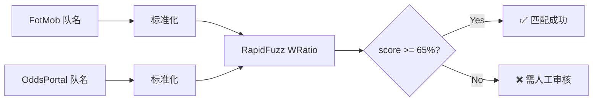
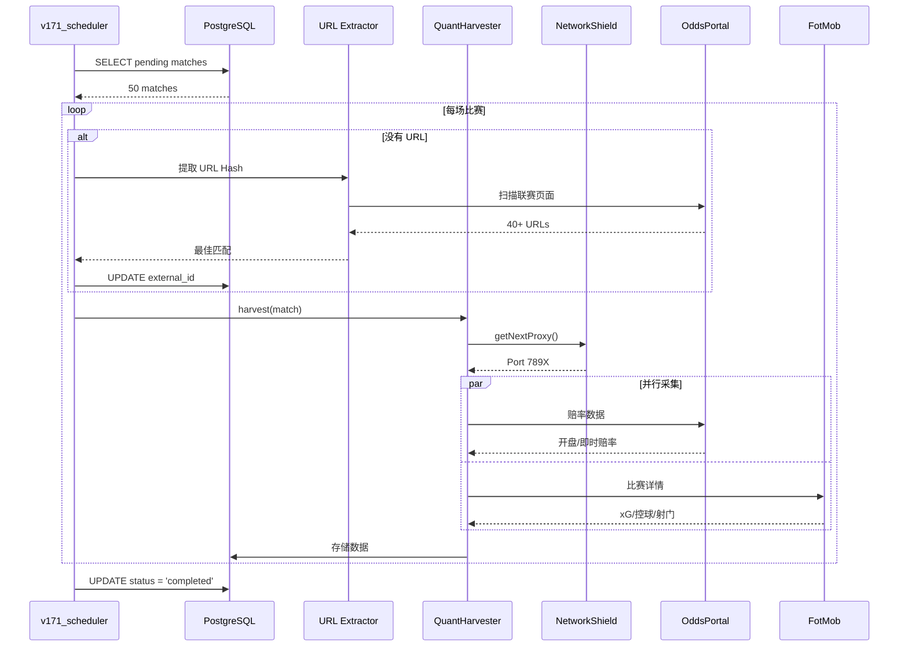

# V171 架构设计文档

> **版本**: V171.2.0
> **最后更新**: 2026-02-25
> **作者**: V171 Engineering Team

---

## 目录

1. [系统概览](#1-系统概览)
2. [C++ 模糊匹配引擎](#2-c-模糊匹配引擎)
3. [NetworkShield 代理池](#3-networkshield-代理池)
4. [数据流架构](#4-数据流架构)
5. [预测引擎](#5-预测引擎)

---

## 1. 系统概览

V171 采用**分层架构**，从数据发现到预测输出形成完整闭环：

```
┌─────────────────────────────────────────────────────────────────┐
│                     V171 全息收割系统                           │
├─────────────────────────────────────────────────────────────────┤
│                                                                  │
│  L1 Discovery ──► C++ Bridge ──► L2/L3 Harvest ──► V171 Engine │
│       │              │               │                │         │
│       ▼              ▼               ▼                ▼         │
│   [Pending]    [URL Hash]     [Odds + xG]      [Predictions]    │
│                                                                  │
└─────────────────────────────────────────────────────────────────┘
```

---

## 2. C++ 模糊匹配引擎

### 2.1 设计原理

OddsPortal 和 FotMob 使用不同的队名格式，例如：

| FotMob | OddsPortal |
|--------|-------------|
| Man Utd | manchester-united |
| Spurs | tottenham-hotspur |
| Wolves | wolverhampton |

C++ 桥接引擎使用 **RapidFuzz** 实现 Levenshtein 距离计算：

```cpp
// RapidFuzz 核心 API
WRatio("manchester united", "man utd") = 58.3%
WRatio("liverpool", "liverpool fc") = 95.0%
```

### 2.2 URL Hash 提取

OddsPortal URL 格式：
```
/football/england/premier-league/{home}-{away}-{HASH}/
```

其中 `HASH` 是 8 字符的唯一标识符：
```
liverpool-west-ham-KbUrxW1T/
                    ^^^^^^^^
                    8-char hash
```

提取正则表达式：
```javascript
const HASH_PATTERN = /[A-Za-z0-9]{8}\/?$/;
```

### 2.3 模糊匹配流程



### 2.4 代码示例

```python
from rapidfuzz import fuzz, process

# 队名标准化
def normalize_team_name(name: str) -> str:
    return name.lower().strip()

# 模糊匹配
fotmob_teams = ["Man Utd", "Liverpool", "Arsenal"]
oddsportal_teams = ["manchester-united", "liverpool-fc", "arsenal-london"]

for fotmob_name in fotmob_teams:
    best_match = process.extractOne(
        normalize_team_name(fotmob_name),
        [normalize_team_name(t) for t in oddsportal_teams],
        scorer=fuzz.WRatio
    )
    print(f"{fotmob_name} → {best_match}")
```

---

## 3. NetworkShield 代理池

### 3.1 架构设计

NetworkShield 管理 **22 个 Clash Verge 代理节点**：

```
┌──────────────────────────────────────────────────────────────┐
│                    NetworkShield V1.1.0                      │
├──────────────────────────────────────────────────────────────┤
│                                                               │
│  Nodes: 22                                                   │
│  Port Range: 7891 - 7912                                     │
│  Protocol: HTTP                                               │
│                                                               │
│  ┌─────┐ ┌─────┐ ┌─────┐     ┌─────┐                        │
│  │7891│ │7892│ │7893│ ... │7912│                         │
│  └──┬──┘ └──┬──┘ └──┬──┘     └──┬──┘                        │
│     │       │       │           │                            │
│     └───────┴───────┴───────────┘                            │
│                     │                                         │
│              [Health Checker]                                 │
│                     │                                         │
│              [Circuit Breaker]                                │
│                                                               │
└──────────────────────────────────────────────────────────────┘
```

### 3.2 熔断机制

每个代理节点配置熔断器：

```javascript
const CIRCUIT_BREAKER_CONFIG = {
    // 连续失败阈值
    maxConsecutiveFailures: 2,

    // 冷却时间 (分钟)
    cooldownMinutes: 15,

    // 会话超时 (分钟)
    sessionTimeoutMinutes: 30
};
```

**状态转换**：

```
INITIALIZED ──► CLOSED ──► OPEN ──► HALF_OPEN ──► CLOSED
    │              │          │          │
    │              │          │          │
    └──────────────┴──────────┴──────────┘
              失败次数 >= 2
```

### 3.3 会话绑定

每个收割会话绑定一个代理，确保 IP 一致性：

```javascript
// Session 绑定
const session = {
    id: "SESSION-1",
    proxyPort: 7891,
    expiresAt: Date.now() + 30 * 60 * 1000, // 30 分钟
    matchId: "EPL_20260228_LIV_WHU"
};
```

### 3.4 健康检查

```javascript
async function healthCheck() {
    const results = await Promise.all(
        ports.map(port => checkPort(port))
    );

    return {
        healthy: results.filter(r => r.healthy).length,
        total: ports.length,
        avgLatency: average(results.map(r => r.latency))
    };
}
```

---

## 4. 数据流架构

### 4.1 收割流程



### 4.2 数据表结构

```sql
-- 比赛索引
CREATE TABLE matches (
    match_id VARCHAR(50) PRIMARY KEY,
    home_team VARCHAR(200),
    away_team VARCHAR(200),
    league_name VARCHAR(100),
    match_date TIMESTAMP,
    external_id VARCHAR(500),  -- OddsPortal URL
    status VARCHAR(50) DEFAULT 'pending'
);

-- 预测结果
CREATE TABLE predictions (
    match_id VARCHAR(50),
    predicted_result VARCHAR(10),
    final_confidence DECIMAL(5,4),
    model_version VARCHAR(20),
    PRIMARY KEY (match_id, model_version)
);

-- 基本面数据
CREATE TABLE match_fundamentals (
    match_id VARCHAR(50) PRIMARY KEY,
    home_formation VARCHAR(20),
    away_formation VARCHAR(20),
    market_value_gap DECIMAL(15,2)
);
```

---

## 5. 预测引擎

### 5.1 多模型验证

V171 使用 **3 模型共识**：

| 模型 | 特征维度 | 用途 |
|------|---------|------|
| Model A | 37 | 通用预测 |
| Model B | 6000+ | 联赛专项 |
| Model C | 19 | 赔率模型 |

### 5.2 共识逻辑

```python
def validate_consensus(predictions: list[Prediction]) -> ConsensusResult:
    """
    3 模型共识验证

    规则:
    - UNANIMOUS: 3/3 一致
    - MAJORITY: 2/3 一致
    - SPLIT: 无共识
    """
    results = [p.result for p in predictions]

    if len(set(results)) == 1:
        return ConsensusResult(level="UNANIMOUS", confidence=1.0)

    # 统计投票
    votes = Counter(results)
    majority = votes.most_common(1)[0]

    if majority[1] >= 2:
        return ConsensusResult(level="MAJORITY", confidence=0.7)

    return ConsensusResult(level="SPLIT", confidence=0.5)
```

### 5.3 SSR 信号检测

**SSR (Super Strong Recommendation)** 条件：
- 置信度 ≥ 80%
- 共识级别 = UNANIMOUS

```python
def is_ssr(result: ConsensusResult) -> bool:
    return (
        result.confidence >= 0.8 and
        result.level == "UNANIMOUS"
    )
```

---

## 附录

### A. 配置参数

详见 [.env.example](./.env.example)

### B. 错误代码

| 代码 | 描述 |
|------|------|
| `E001` | 数据库连接失败 |
| `E002` | 代理不可用 |
| `E003` | URL Hash 未找到 |
| `E004` | 模型加载失败 |

### C. 性能指标

| 指标 | 目标 | 实际 |
|------|------|------|
| URL 提取 | < 30s | ~10s |
| 单场收割 | < 60s | ~35s |
| 预测延迟 | < 100ms | ~50ms |

---

*文档最后更新: 2026-02-25*
