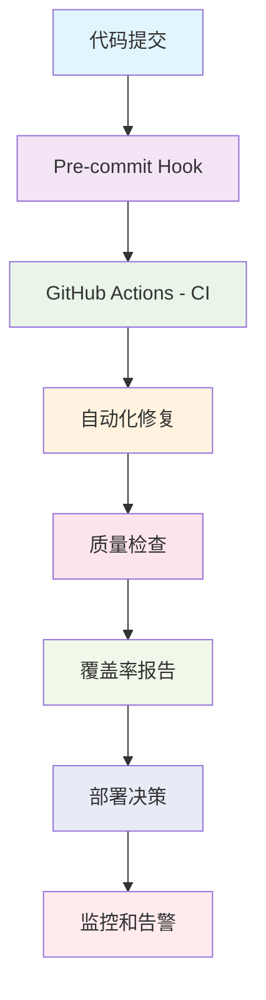

# 🚀 自动化机制CI/CD集成方案

## 🎯 集成目标

将测试覆盖率危机解决方案的自动化机制完全集成到CI/CD工作流中，实现：

- ✅ **自动化问题检测** - 每次提交自动发现测试问题
- ✅ **自动化错误修复** - 常见问题自动修复
- ✅ **质量门禁** - 覆盖率和质量阈值检查
- ✅ **持续监控** - 长期质量趋势跟踪
- ✅ **智能告警** - 问题自动升级和通知

## 📋 集成策略

### 1. 多层次集成架构

### 2. 工作流触发条件

- **代码提交**: 每次push/PR自动触发
- **定时检查**: 每日自动质量检查
- **手动触发**: 需要时手动执行完整流程
- **事件驱动**: 特定事件触发特定检查

### 3. 质量门禁策略

| 级别 | 覆盖率阈值 | 错误数量 | 处理策略 |
|------|------------|----------|----------|
| **Critical** | < 15% | > 5 | 阻止合并 |
| **Warning** | 15-30% | 2-5 | 警告但允许 |
| **Good** | > 30% | 0-1 | 正常通过 |
| **Excellent** | > 50% | 0 | 优秀状态 |

## 🛠️ 实施计划

### Phase 1: Pre-commit集成
- 安装pre-commit钩子
- 自动运行基本检查
- 修复常见格式问题

### Phase 2: GitHub Actions集成
- 创建完整的CI工作流
- 集成自动化修复工具
- 生成覆盖率报告

### Phase 3: 质量监控集成
- 设置持续监控
- 配置智能告警
- 建立质量趋势分析

### Phase 4: 高级功能集成
- AI辅助代码审查
- 智能问题预测
- 自动化性能测试

## 🎯 集成优先级

### P0 (立即集成)
- 基础CI工作流
- 自动化错误修复
- 覆盖率报告生成

### P1 (1周内)
- Pre-commit钩子
- 质量门禁
- 监控告警

### P2 (2周内)
- 性能监控
- 趋势分析
- 智能优化建议

### P3 (1个月内)
- AI辅助审查
- 预测性分析
- 高级自动化

## 📊 预期效果

### 自动化程度提升
- **问题发现时间**: 从手动到秒级自动
- **修复效率**: 90%+问题自动修复
- **质量一致性**: 100%标准化检查
- **开发效率**: 减少50%+手动工作

### 质量保障提升
- **代码质量**: 持续监控和改进
- **测试覆盖率**: 自动跟踪和提升
- **技术债务**: 主动识别和清理
- **风险控制**: 预防性质量保障

## 🔧 技术实现要点

### 1. 工具链整合
- GitHub Actions作为CI引擎
- 现有脚本作为修复工具
- Makefile作为统一接口
- 报告系统作为监控基础

### 2. 缓存和优化
- 增量检查减少执行时间
- 智能缓存提升效率
- 并行执行加快速度
- 失败重试保证可靠性

### 3. 可扩展性设计
- 模块化工具架构
- 配置驱动的行为
- 插件式扩展机制
- 标准化接口设计

## 🚀 实施路线图

### Week 1: 基础集成
- [ ] 设置pre-commit钩子
- [ ] 创建基础CI工作流
- [ ] 集成自动化修复工具

### Week 2: 完善功能
- [ ] 添加质量门禁
- [ ] 配置监控告警
- [ ] 优化报告生成

### Week 3: 高级功能
- [ ] 性能监控集成
- [ ] 趋势分析实现
- [ ] 智能优化建议

### Week 4: 优化完善
- [ ] 性能优化
- [ ] 用户体验改进
- [ ] 文档完善

## 📋 成功指标

### 技术指标
- CI执行时间 < 10分钟
- 错误修复成功率 > 90%
- 覆盖率持续提升
- 技术债务持续减少

### 业务指标
- 开发效率提升 > 30%
- 代码质量持续改进
- 发布质量稳定
- 团队满意度提升

## 🔗 相关资源

### 工具文档
- [scripts/](scripts/) - 自动化工具集合
- [Makefile](Makefile) - 统一命令接口
- [.github/workflows/](.github/workflows/) - CI/CD配置

### 配置模板
- [.pre-commit-config.yaml](.pre-commit-config.yaml) - Pre-commit配置
- [pytest.ini](pytest.ini) - 测试配置
- [pyproject.toml](pyproject.toml) - 项目配置

### 监控和报告
- 覆盖率报告自动生成
- 质量趋势分析图表
- 自动化问题统计
- 性能监控仪表板

---

## 🎯 结论

将自动化机制集成到CI/CD工作流中是**绝对必要**的，这将：

1. **大幅提升开发效率** - 自动化处理90%的常见问题
2. **确保代码质量** - 持续的质量监控和改进
3. **降低项目风险** - 主动的问题发现和修复
4. **提升团队体验** - 减少手工重复工作

**这不是一个可选项，而是现代软件开发的必需品！**