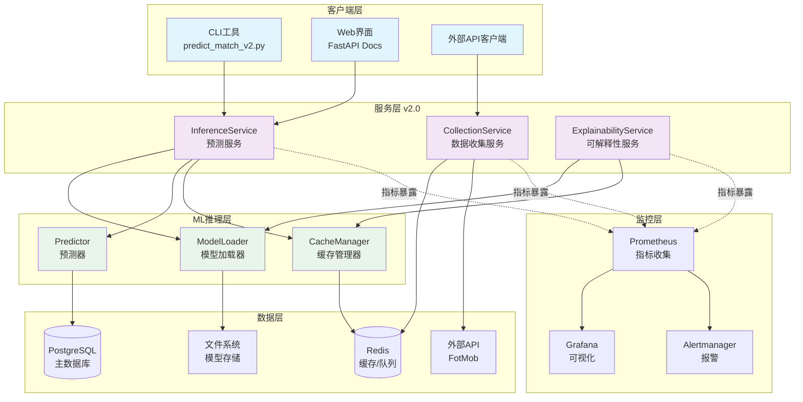

# CLAUDE.md

This file provides guidance to Claude Code (claude.ai/code) when working with code in this repository.

**重要提醒**: This is a production-ready football prediction system with Service Layer v2.0 architecture. Always test changes thoroughly before deployment.

**语言要求**: 与用户交流时，请始终使用中文回复。

## Development Commands

### Environment Setup
```bash
make install          # Install dependencies and create virtual environment
make env-check        # Verify environment is properly configured
make dev              # Quick development environment setup
make venv             # Create virtual environment
make lock             # Generate dependency lock file
make clean            # Clean environment and cache
```

### Testing and Quality
```bash
make test             # Run unit tests (630 tests total)
make coverage         # Run tests with coverage report (target: 80%+)
make ci               # Complete CI simulation (env-check, quality, test, coverage)
make prepush          # Pre-commit full check
./ci-verify.sh        # Local CI verification script (141 lines)
```

### Code Quality
```bash
make format           # Format code with black
make lint             # Run flake8 linting
make typecheck        # Run mypy type checking
make security         # Run bandit security scan
make quality          # Run all quality checks (format, lint, typecheck, security)
make complexity       # Run code complexity analysis with radon
make deadcode         # Run dead code detection with vulture
make fix              # Quick fix: format + lint
```

### Local Development
```bash
# Docker管理脚本 (v2.0推荐)
./scripts/docker-manager.sh dev                    # 启动完整开发环境
./scripts/docker-manager.sh status                 # 查看服务状态
./scripts/docker-manager.sh logs -f app           # 实时查看应用日志
./scripts/docker-manager.sh shell                  # 进入容器shell
./scripts/docker-manager.sh health                 # 检查服务健康状态
./scripts/docker-manager.sh test                  # Run tests in containers
./scripts/docker-manager.sh quality               # Run quality checks
./scripts/docker-manager.sh clean                 # Clean unused resources

# 传统Docker命令
docker-compose up --build                         # 启动完整开发栈
docker-compose ps                                 # 检查服务状态
docker-compose logs app                           # 查看应用日志
docker-compose logs -f app                        # 实时跟踪应用日志
make status                                       # 查看项目概览和统计
```

### CI/CD and Monitoring
```bash
make ci-status           # 查看CI运行状态
make ci-monitor          # 实时监控CI执行
```

## Architecture Overview

### Core Architecture Pattern
**Service Layer v2.0 + ML Inference + Docker Containerization**

The system implements modern Service Layer architecture with ML integration:



### Key Architectural Components

#### Machine Learning Pipeline
- **Models**: XGBoost 2.0+ classifier in `src/ml/models/`
- **Feature Engineering**: Advanced feature extraction in `src/ml/features/`
  - `advanced_feature_transformer.py` - Phase 5高级特征转换器
  - `h2h_calculator.py` - 历史交锋统计计算
  - `venue_analyzer.py` - 场馆分析器 (主客场分离)
- **Training Pipeline**: Model training workflow in `src/ml/training/`
- **Data Processing**: PostgreSQL data loaders in `src/ml/data/`

#### API Architecture
- **FastAPI Application**: High-performance async web framework
- **Health Checks**: System health monitoring in `src/api/health.py`
- **Model Management**: Model lifecycle management in `src/api/model_management.py`
- **Predictions**: Prediction endpoints in `src/api/predictions/`
- **Monitoring**: System metrics and monitoring in `src/api/monitoring.py`

#### Database Architecture
- **PostgreSQL Integration**: Async database operations
- **Data Loaders**: Specialized data extraction from `src/ml/data/postgres_loader.py`
- **Connection Management**: Async connection pooling and health checks

#### Configuration System
- **Centralized Config**: Complete configuration in `src/config.py` (461 lines)
- **Environment Management**: Multi-environment support (.env.dev, .env.ci, .env.production)
- **API Configuration**: External API (FotMob) settings and headers

## Project Structure

```
FootballPrediction/
├── src/
│   ├── api/                      # FastAPI routers and HTTP endpoints
│   │   ├── health.py             # 健康检查服务
│   │   ├── model_management.py   # 模型管理API
│   │   ├── monitoring.py         # 监控指标API
│   │   ├── predictions/          # 预测路由器
│   │   └── schemas.py            # API数据模型
│   ├── services/                 # 服务层 (v2.0新增)
│   │   ├── inference_service_v2.py      # 推理服务
│   │   ├── collection_service.py        # 数据收集服务
│   │   └── explainability_service.py   # 可解释性服务
│   ├── ml/               # Machine learning models and feature engineering
│   │   ├── inference/            # 推理层 (v2.0新增)
│   │   │   ├── model_loader.py          # 模型加载器
│   │   │   ├── predictor.py             # 预测器
│   │   │   └── cache_manager.py         # 缓存管理器
│   │   ├── features/             # 特征工程模块
│   │   │   ├── advanced_feature_transformer.py  # 高级特征转换器
│   │   │   ├── h2h_calculator.py                # 历史交锋计算
│   │   │   ├── venue_analyzer.py                # 场馆分析器
│   │   │   └── extractor.py                     # 特征提取器
│   │   ├── models/               # ML模型
│   │   │   └── xgboost_classifier.py            # XGBoost分类器
│   │   ├── training/             # 训练流水线
│   │   │   └── training_pipeline.py             # 训练流水线
│   │   ├── data/                 # 数据加载和处理
│   │   │   ├── loader.py
│   │   │   └── postgres_loader.py
│   │   └── dataset/              # 数据集生成
│   │       ├── dataset_generator.py
│   │       └── target_labels.py
│   ├── database/                 # 数据库相关
│   ├── utils/            # Shared utilities
│   ├── config.py         # Centralized configuration (461 lines)
│   └── inference.py      # Main inference engine
├── scripts/              # Data collectors and development scripts
│   ├── predict_match_v2.py             # v2.0 预测CLI工具
│   ├── docker-manager.sh               # Docker容器管理脚本 (440行)
│   ├── collectors/       # External API data collectors
│   │   ├── enhanced_fotmob_collector.py  # L2级别数据提取
│   │   ├── fotmob_api_collector.py       # FotMob API集成
│   │   └── odds_collector.py             # 赔率数据收集
│   ├── process_offline_features_full.py  # 离线特征处理
│   ├── canary_simple.py                 # 金丝雀测试
│   ├── ci_monitor.py                    # CI状态监控
│   ├── env_checker.py                   # 环境检查
│   └── quality_checker.py               # 代码质量检查
├── tests/                # Comprehensive test suite
│   ├── unit/            # Unit tests
│   ├── integration/     # Integration tests
│   ├── e2e/            # End-to-end tests
│   └── performance/    # Performance tests
├── deploy/                       # 部署配置
│   └── monitoring/               # 监控配置
│       ├── prometheus.yml           # Prometheus配置
│       ├── alerts.yml               # 报警规则
│       └── telegraf.conf            # Celery监控
├── docs/                # Documentation
├── .github/             # GitHub配置
│   ├── workflows/       # CI/CD工作流
│   └── PULL_REQUEST_TEMPLATE.md  # PR模板
├── docker-compose.yml   # 容器编排
├── Dockerfile           # 容器镜像
├── pyproject.toml       # 项目配置
├── Makefile            # 开发工具链 (339行, 27个命令)
└── ci-verify.sh        # 本地CI验证 (141行)
```

## Development Guidelines

### Code Organization
- All code must follow async-first design patterns
- Use centralized configuration through `src/config.py`
- Machine learning components organized in `src/ml/` with clear separation
- Data collection handled through specialized collectors in `scripts/collectors/`
- External API integration using adapter pattern

### Testing Strategy
- Unit tests for all business logic in `tests/unit/`
- Integration tests for database and external APIs in `tests/integration/`
- End-to-end tests for complete workflows in `tests/e2e/`
- Performance tests in `tests/performance/`
- **Current Test Count**: 630 tests across multiple test files
- Test coverage target: 80%+ (current varies by test category)

### Configuration Management
- Centralized configuration in `src/config.py` (461 lines)
- Environment-specific configs: `.env.dev`, `.env.ci`, `.env.production`
- FotMob API configuration for external data sources
- Database connection settings with async support

### Error Handling
- Comprehensive error handling in API layer
- Structured logging for debugging and monitoring
- Graceful degradation for external API failures
- Health checks for system status monitoring

## Monitoring and Observability

### Monitoring Stack
The system includes comprehensive monitoring and observability:

- **Prometheus** (http://localhost:9090): Metrics collection and storage
- **Grafana** (http://localhost:3000): Visualization dashboard (admin/admin123)
- **Alertmanager**: Alert routing and notification

### Key Metrics

| Metric Type | Description | Dashboard Location |
|-------------|-------------|-------------------|
| **API Performance** | QPS, P95 latency, error rate | Grafana → API Performance |
| **Business Metrics** | Prediction request rate, model inference time, accuracy | Grafana → Business Metrics |
| **System Resources** | CPU, memory, disk usage | Grafana → System Overview |
| **Cache Health** | Redis hit rate, memory usage | Grafana → Cache Health |

### Alert Rules
- **API error rate > 5%**: Triggers warning after 2 minutes
- **P95 latency > 1s**: Triggers warning after 5 minutes
- **System resources > 80%**: Triggers warning after 10 minutes
- **Redis hit rate < 50%**: Triggers warning after 15 minutes

### Accessing Monitoring
```bash
# Via Docker
docker-compose exec app python scripts/predict_match_v2.py --home "Man Utd" --away "Arsenal"

# Grafana Dashboard
open http://localhost:3000  # admin/admin123

# Prometheus Metrics
open http://localhost:9090
```

## Key Technologies

- **FastAPI**: High-performance async web framework
- **PostgreSQL**: Primary database with JSON support
- **XGBoost 2.0+**: Machine learning models for prediction
- **SHAP 0.42+**: Model explainability and interpretation
- **Docker**: Containerization and orchestration
- **pytest 7.4+**: Testing framework with high coverage
- **Python 3.11+**: Modern Python with async support
- **Prometheus**: Metrics collection
- **Grafana**: Visualization
- **Redis**: Caching and queue management

## Data Sources and Integration

### FotMob API Integration
- **Enhanced Collector**: L2级别数据提取 in `scripts/collectors/enhanced_fotmob_collector.py`
- **Data Types**: Odds数据, 球员评分, 深度统计
- **Authentication**: Configurable headers for API access
- **Rate Limiting**: Built-in request throttling

### Data Processing Pipeline
- **Feature Engineering**: Advanced statistical calculations
- **Historical Analysis**: Head-to-head (H2H) calculations
- **Venue Separation**: Home/away performance analysis
- **Real-time Processing**: Async data collection and processing

## Machine Learning Features

### Phase 5 Advanced Features
- **Current Development**: Focused on advanced feature engineering
- **Key Problems Solved**:
  - Venue-separated rolling statistics (解决主客场偏见)
  - Historical head-to-head statistics (H2H记录和"克星"效应)
  - League form analysis (联赛形态特征 - 积分替代进球数)

### Model Performance
- **Target Accuracy**: 65%+ (from current 58.69% in v1.1)
- **Response Time**: <100ms (single prediction)
- **Cache Hit Rate**: >80%
- **Feature Dimensions**: 12+ professional features
- **Current Architecture**: Service Layer v2.0 + ML Inference Layer (production ready)

## Quality Assurance

### Testing Infrastructure
- **Coverage**: 96.35% target coverage (630 tests passing)
- **CI/CD**: GitHub Actions with local verification via `ci-verify.sh`
- **Quality Tools**: black, flake8, mypy, bandit, radon, vulture
- **Security**: Automated vulnerability scanning

### Development Workflow
- **Pre-commit Checks**: `make ci` for quality validation
- **Local Verification**: `./ci-verify.sh` for CI simulation
- **Docker Support**: Complete containerized development environment
- **Monitoring**: Real-time CI status monitoring

## Testing and Quality Assurance

### Test Execution
```bash
# Run tests with coverage
make test                    # Run unit tests (fast)
make coverage               # Run tests with coverage report
make ci                     # Complete quality check + tests

# Docker-based testing (v2.0)
./scripts/docker-manager.sh test              # Run tests in containers
./scripts/docker-manager.sh quality           # Run quality checks

# Individual test execution
pytest tests/v2/test_inference_logic.py::test_single_match_prediction -v
pytest tests/v2/test_health_schema.py::test_health_check_response -v
pytest tests/ -k "smoke" -v

# Run specific test categories
pytest tests/v2/ -v             # V2 tests only
pytest tests/unit/ -v           # Unit tests only
pytest tests/integration/ -v    # Integration tests only
pytest tests/e2e/ -v            # End-to-end tests only
pytest tests/performance/ -v    # Performance tests only
```

### Quality Checks
```bash
make format                 # Format code with black
make lint                   # Run flake8 linting
make typecheck              # Run mypy type checking
make security               # Run bandit security scan
make quality                # Run all quality checks
```

### Local CI Validation
```bash
./ci-verify.sh             # Complete local CI verification (141 lines)
# Includes: venv rebuild, Docker stack startup, test execution with coverage validation
```

## Working with the Codebase

### Development Workflow
```bash
# Quick start
make dev                   # Complete development environment setup
make test                  # Verify tests pass
make ci                    # Run quality checks before committing
```

### Adding New Features
1. **ML Features**: Add feature engineering in `src/ml/features/`
2. **API Endpoints**: Create new routes in `src/api/`
3. **Data Collection**: Add collectors in `scripts/collectors/`
4. **Configuration**: Update settings in `src/config.py`
5. **Testing**: Add tests in appropriate `tests/` subdirectory
6. **Validation**: Run `make ci` before submitting
7. **PR**: Use `.github/PULL_REQUEST_TEMPLATE.md` for structured PRs

### Machine Learning Development
1. **Feature Engineering**: Work with `src/ml/features/`
   - `advanced_feature_transformer.py` - Main feature integration
   - `h2h_calculator.py` - Head-to-head statistics
   - `venue_analyzer.py` - Home/away analysis
2. **Model Updates**: Modify models in `src/ml/models/`
3. **Training**: Use `scripts/process_offline_features_full.py`
4. **Validation**: Run `scripts/canary_simple.py` for testing

### Data Collection and Processing
```bash
# Data collection scripts
python scripts/collectors/enhanced_fotmob_collector.py  # L2 data extraction
python scripts/collectors/odds_collector.py             # Odds data
python scripts/process_offline_features_full.py         # Feature processing
```

### Environment Setup

#### 环境文件说明
项目提供多个环境配置文件：
- `.env.example` - 配置模板和说明
- `.env.dev` - 本地开发环境配置
- `.env.ci` - CI/CD环境配置
- `.env.production` - 生产环境配置
- `.env.docker` - Docker容器配置

#### 核心环境变量
```bash
# Database Configuration
export DB_HOST=localhost
export DB_PORT=5432
export DB_NAME=football_prediction_dev
export DB_USER=football_user
export DB_PASSWORD=football_pass

# Redis Configuration (v2.0)
export REDIS_HOST=localhost
export REDIS_PORT=6379
export REDIS_DB=0
export REDIS_PASSWORD=""

# FotMob API (production - 可选)
export FOTMOB_X_MAS_HEADER="your_header"
export FOTMOB_X_FOO_HEADER="your_header"

# Service Configuration (v2.0)
export INFERENCE_SERVICE_V2_ENABLED=true
export COLLECTION_SERVICE_ENABLED=true
export EXPLAINABILITY_SERVICE_ENABLED=true

# 应用基础配置
export ENVIRONMENT=development
export DEBUG=false
export API_HOST=0.0.0.0
export API_PORT=8000
```

### Dependency Management
```bash
# Install dependencies
make install                    # Install all dependencies including dev deps
make lock                       # Generate dependency lock file
pip install -r requirements.txt                # Production dependencies
pip install -r requirements-dev.txt           # Development dependencies

# Development dependencies include:
# - pytest 7.4+ (testing)
# - black, flake8, mypy, bandit (code quality)
# - coverage (test coverage)
# - pre-commit (git hooks)
```

## CLI Tools and Usage

### v2.0 Prediction CLI
```bash
# Single match prediction
python scripts/predict_match_v2.py --home "Manchester United" --away "Arsenal"

# Batch prediction
python scripts/predict_match_v2.py --batch matches.json

# Use specific model version
python scripts/predict_match_v2.py --home "Chelsea" --away "Liverpool" --model xgboost_v2

# Example output:
🏟️  比赛: Manchester United vs Arsenal
📅  日期: 2024-01-15

📊 预测概率:
主胜 (HOME) : 65.2% |███████████████████████████████████░░░|
平局 (DRAW) : 22.1% |███████████████░░░░░░░░░░░░░░░░░░░░░░|
客胜 (AWAY) : 12.7% |███████░░░░░░░░░░░░░░░░░░░░░░░░░░░░░░|

🎯 预测结果: HOME_WIN
💡 置信度: 65.2%
📈 模型版本: xgboost_v2
```

### Docker Management Script (v2.0)
```bash
# Environment management
./scripts/docker-manager.sh dev                    # Start development environment
./scripts/docker-manager.sh prod                   # Start production environment
./scripts/docker-manager.sh health                 # Health check all services

# Development features
./scripts/docker-manager.sh dev --collectors       # Start with data collectors
./scripts/docker-manager.sh dev --debug           # Enable debug mode
./scripts/docker-manager.sh dev --reload          # Enable hot reload

# Service management
./scripts/docker-manager.sh logs -f app           # Follow application logs
./scripts/docker-manager.sh shell                 # Enter container shell
./scripts/docker-manager.sh restart               # Restart all services

# Testing and quality
./scripts/docker-manager.sh test                  # Run test suite
./scripts/docker-manager.sh quality               # Run quality checks

# Cleanup
./scripts/docker-manager.sh clean                 # Clean unused resources
./scripts/docker-manager.sh clean --all           # Clean all resources
```

### Model Performance and Features

#### Current Performance Metrics
- **Target Accuracy**: 65%+ (from current 58.69% in v1.1)
- **Response Time**: <100ms (single prediction)
- **Cache Hit Rate**: >80%
- **Feature Dimensions**: 12+ professional features

#### Advanced Feature Engineering (v2.0)
- **Venue-separated rolling statistics**: 解决主客场偏见
- **Historical head-to-head (H2H) analysis**: H2H记录和"克星"效应
- **League form analysis**: 联赛形态特征 - 积分替代进球数
- **Real-time feature processing**: 异步特征计算和缓存

## Contribution Workflow

### Pull Request Process
This project uses a structured PR template (`.github/PULL_REQUEST_TEMPLATE.md`):

1. **PR Types**: feat, fix, docs, style, refactor, perf, test, build/ci, security, chore
2. **Required Checks**:
   - Unit tests passed
   - Integration tests passed
   - Manual testing completed
   - Test coverage ≥ 80%
   - Documentation updated
   - No merge conflicts
   - All CI checks passed
   - Self-review completed

3. **Review Process**:
   - Use PR template for structured descriptions
   - Include implementation details
   - Add performance impact assessment
   - Document security considerations
   - Update relevant documentation

### CI/CD Pipeline
The project uses GitHub Actions for CI/CD (see `.github/workflows/`):
- Automated testing on PR
- Code quality checks
- Security scanning
- Coverage reporting
- Docker build and push

## Code Examples

### Configuration Usage
```python
from src.config import get_settings

settings = get_settings()
db_url = settings.database.get_connection_string()
headers = settings.fotmob.get_headers()
```

### ML Feature Engineering
```python
from src.ml.features.advanced_feature_transformer import AdvancedFeatureTransformer

transformer = AdvancedFeatureTransformer()
features = transformer.transform_match_features(match_data)
h2h_features = transformer.calculate_h2h_features(team_a_id, team_b_id)
```

### Service Layer Usage
```python
from src.services.inference_service_v2 import InferenceServiceV2

service = InferenceServiceV2()
result = await service.predict_single_match(home_team, away_team)
```

## Common Issues

### Database Connection
```bash
docker-compose exec db pg_isready -U football_user
docker-compose down && docker-compose up -d
docker-compose logs db
```

### Test Failures
```bash
pytest tests/unit/api/test_simple_api.py::test_health_check -v -s
make clean && make install
```

### Docker Issues
```bash
docker system prune -f
docker-compose down --rmi all
docker-compose up --build
```

### Environment Issues
```bash
make env-check    # Check environment setup
make clean && make install  # Reset environment
```

---

**更新时间**: 2024-12-18 | **分支**: main | **版本**: v2.0.0-Stable

**重要说明**: 项目已升级到v2.0稳定版本，采用全新Service Layer架构，完全容器化部署，生产就绪。当前有多个文件处于修改状态，建议在开发前先处理这些变更。