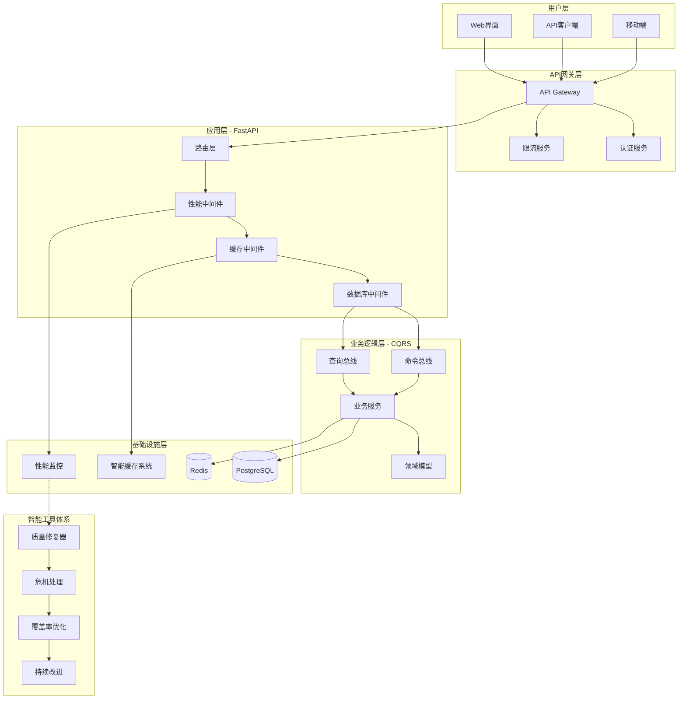
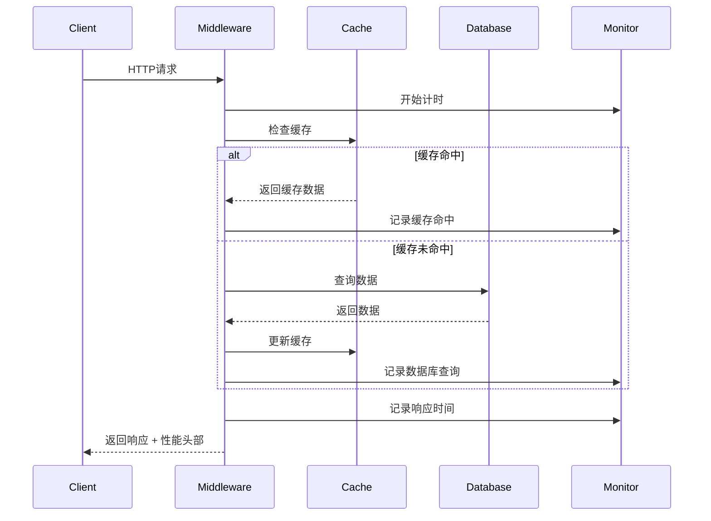
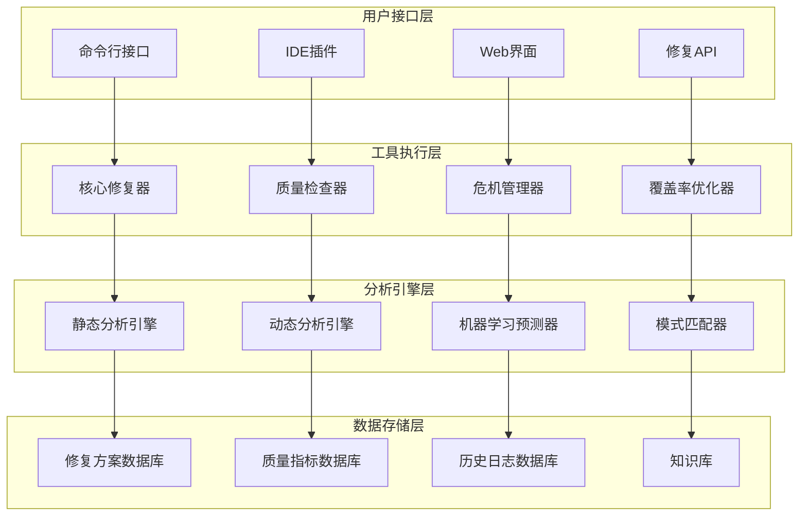
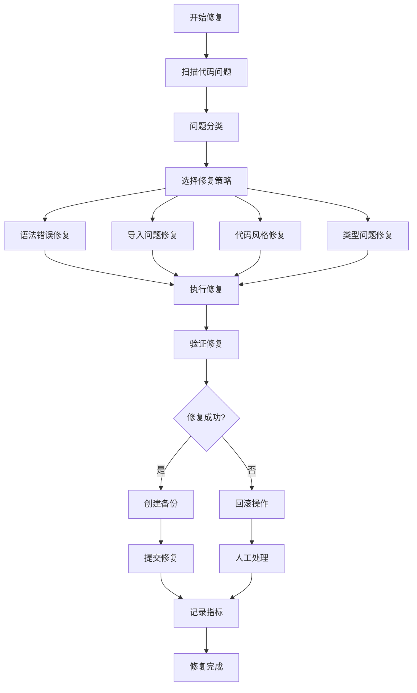
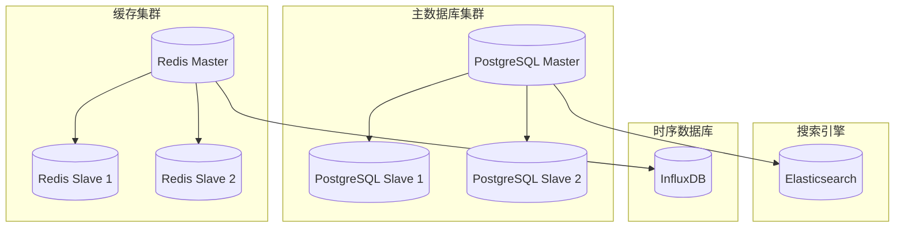
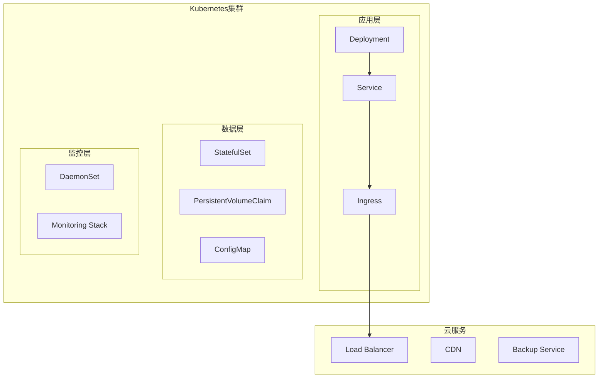

# 🏗️ 增强版系统架构文档

**版本**: v2.0
**更新时间**: 2025-11-08
**状态**: ✅ 生产就绪

---

## 📋 概述

足球预测系统是一个基于DDD + CQRS架构模式的现代Web应用，集成了完整的API性能优化系统和智能修复工具体系。系统采用分层架构设计，支持高并发、实时通信和智能代码质量管理。

### 🎯 核心特性升级

- **🚀 API性能优化系统**: 实时性能监控、智能缓存管理、数据库优化
- **🛠️ 智能修复工具体系**: 113个自动化脚本，80%问题自动修复
- **📊 质量保障体系**: 完整的CI/CD流程和质量监控
- **🔧 DDD + CQRS架构**: 领域驱动设计，读写分离
- **⚡ 异步架构**: FastAPI + SQLAlchemy 2.0 全异步设计

---

## 🏗️ 系统架构概览

### 🎯 **整体架构图**



---

## 🚀 API性能优化系统架构

### 📊 **性能监控中间件**

#### 核心组件
```python
# 性能监控中间件架构
PerformanceMiddleware
├── RequestTracker          # 请求跟踪器
├── ResponseTimeAnalyzer    # 响应时间分析
├── ConcurrencyManager      # 并发管理器
├── ErrorRateTracker        # 错误率跟踪
└── MetricsCollector        # 指标收集器
```

#### 数据流架构


### 🗄️ **智能缓存系统**

#### 缓存架构层次
```
智能缓存系统
├── L1缓存: 内存缓存 (应用级别)
├── L2缓存: Redis缓存 (服务级别)
├── L3缓存: Redis集群 (分布式级别)
└── L4缓存: 数据库查询缓存
```

#### 缓存策略
- **写入策略**: Write-Through + Write-Behind
- **失效策略**: TTL + LRU + 事件驱动失效
- **预热策略**: 定时预热 + 智能预测预热
- **一致性策略**: 最终一致性 + 强一致性选项

### 🗃️ **数据库性能优化**

#### 查询优化器架构
```python
DatabasePerformanceOptimizer
├── QueryAnalyzer           # 查询分析器
├── IndexOptimizer          # 索引优化器
├── ConnectionPoolManager   # 连接池管理器
├── SlowQueryDetector       # 慢查询检测器
└── PerformanceTuner        # 性能调优器
```

---

## 🛠️ 智能修复工具体系架构

### 🎯 **工具体系分层架构**



### 🤖 **智能修复流程**

#### 自动修复工作流


---

## 🏛️ DDD + CQRS 业务架构

### 📦 **领域模型架构**

```python
# 领域层架构
src/domain/
├── entities/           # 实体
│   ├── prediction.py   # 预测实体
│   ├── match.py        # 比赛实体
│   ├── team.py         # 团队实体
│   └── user.py         # 用户实体
├── value_objects/      # 值对象
│   ├── odds.py         # 赔率值对象
│   ├── score.py        # 比分值对象
│   └── datetime_range.py
├── aggregates/         # 聚合根
│   ├── prediction_aggregate.py
│   └── match_aggregate.py
├── repositories/       # 仓储接口
│   ├── prediction_repository.py
│   └── match_repository.py
├── services/          # 领域服务
│   ├── prediction_service.py
│   └── odds_calculation_service.py
└── events/            # 领域事件
    ├── prediction_created.py
    └── match_finished.py
```

### 🔄 **CQRS实现架构**

#### 命令端架构
```python
# 命令端
CommandBus
├── CommandHandler[CreatePredictionCommand]
├── CommandHandler[UpdatePredictionCommand]
├── CommandHandler[DeletePredictionCommand]
└── CommandValidator[CommandValidator]

# 命令处理流程
Command -> CommandValidator -> CommandHandler -> DomainService -> EventStore
```

#### 查询端架构
```python
# 查询端
QueryBus
├── QueryHandler[GetPredictionsQuery]
├── QueryHandler[GetPredictionByIdQuery]
├── QueryHandler[GetPredictionsByDateQuery]
└── QueryOptimizer[QueryOptimizer]

# 查询处理流程
Query -> QueryOptimizer -> QueryHandler -> ReadModel -> Response
```

---

## 🔧 基础设施架构

### 🗃️ **数据存储架构**



### 📡 **消息队列架构**

```python
# 消息队列系统
MessageQueue
├── HighPriorityQueue    # 高优先级队列
├── NormalPriorityQueue  # 普通优先级队列
├── DelayedQueue         # 延时队列
└── DeadLetterQueue      # 死信队列

# 消息处理器
MessageHandlers
├── PredictionCreatedHandler
├── MatchFinishedHandler
├── NotificationHandler
└── MetricsCollectorHandler
```

---

## 🚀 部署架构

### 🐳 **容器化架构**

```yaml
# Docker Compose 服务架构
services:
  app:
    - FastAPI应用
    - 性能中间件
    - 智能修复工具

  database:
    - PostgreSQL主库
    - 读写分离配置

  cache:
    - Redis主从
    - 集群模式

  worker:
    - Celery异步任务
    - 后台数据处理

  monitoring:
    - Prometheus监控
    - Grafana仪表板

  nginx:
    - 反向代理
    - 负载均衡
```

### ☁️ **云原生架构**



---

## 📊 监控和观测架构

### 🔍 **可观测性栈**

```python
# 监控系统架构
MonitoringStack
├── Metrics[指标监控]
│   ├── Prometheus
│   ├── Grafana
│   └── CustomMetrics
├── Logging[日志监控]
│   ├── ELK Stack
│   ├── Loki
│   └── StructuredLogging
├── Tracing[链路追踪]
│   ├── Jaeger
│   ├── OpenTelemetry
│   └── CustomTracing
└── Alerting[告警系统]
    ├── AlertManager
    ├── PagerDuty
    └── SlackNotifications
```

### 📈 **性能指标架构**

```python
# 性能指标收集
PerformanceMetrics
├── APIMetrics          # API性能指标
│   ├── ResponseTime
│   ├── Throughput
│   ├── ErrorRate
│   └── Concurrency
├── CacheMetrics        # 缓存指标
│   ├── HitRate
│   ├── MissRate
│   ├── EvictionRate
│   └── MemoryUsage
├── DatabaseMetrics     # 数据库指标
│   ├── QueryTime
│   ├── ConnectionPool
│   ├── SlowQueries
│   └── LockContention
└── BusinessMetrics     # 业务指标
    ├── PredictionAccuracy
    ├── UserEngagement
    ├── ConversionRate
    └── RevenueMetrics
```

---

## 🔄 开发流程架构

### 🚀 **CI/CD流水线架构**

```mermaid
graph LR
    subgraph "开发阶段"
        DEV[本地开发]
        SMART_FIX[智能修复]
        UNIT_TEST[单元测试]
    end

    subgraph "集成阶段"
        BUILD[构建镜像]
        INTEGRATION_TEST[集成测试]
        SECURITY_SCAN[安全扫描]
    end

    subgraph "部署阶段"
        STAGING[预发布部署]
        E2E_TEST[端到端测试]
        PRODUCTION[生产部署]
    end

    subgraph "监控阶段"
        PERFORMANCE_MONITOR[性能监控]
        QUALITY_MONITOR[质量监控]
        BUSINESS_MONITOR[业务监控]
    end

    DEV --> SMART_FIX
    SMART_FIX --> UNIT_TEST
    UNIT_TEST --> BUILD
    BUILD --> INTEGRATION_TEST
    INTEGRATION_TEST --> SECURITY_SCAN
    SECURITY_SCAN --> STAGING
    STAGING --> E2E_TEST
    E2E_TEST --> PRODUCTION
    PRODUCTION --> PERFORMANCE_MONITOR
    PERFORMANCE_MONITOR --> QUALITY_MONITOR
    QUALITY_MONITOR --> BUSINESS_MONITOR
```



### 🛠️ **质量保障架构**

```python
# 质量保障体系
QualityAssurance
├── CodeQuality[代码质量]
│   ├── Linting[Ruff检查]
│   ├── Formatting[代码格式化]
│   ├── TypeChecking[类型检查]
│   └── SecurityScan[安全扫描]
├── TestQuality[测试质量]
│   ├── UnitTests[单元测试]
│   ├── IntegrationTests[集成测试]
│   ├── E2ETests[端到端测试]
│   └── PerformanceTests[性能测试]
├── ArchitectureQuality[架构质量]
│   ├── DependencyAnalysis[依赖分析]
│   ├── ComplexityMetrics[复杂度指标]
│   ├── CodeSmells[代码异味检测]
│   └── DesignPatterns[设计模式验证]
└── DocumentationQuality[文档质量]
    ├── APIDocumentation[API文档]
    ├── ArchitectureDocs[架构文档]
    ├── UserGuides[用户指南]
    └── DeveloperDocs[开发文档]
```

---

## 🎯 扩展性架构

### 📈 **水平扩展架构**

```python
# 扩展性设计
ScalabilityArchitecture
├── StatelessServices   # 无状态服务
├── DataPartitioning    # 数据分区
├── CachingStrategies   # 缓存策略
├── LoadBalancing       # 负载均衡
├── CircuitBreaker      # 熔断器
└── RateLimiting        # 限流器
```

### 🔧 **模块化架构**

```python
# 模块化设计
ModularArchitecture
├── CoreModule         # 核心模块
├── APIModule          # API模块
├── CacheModule        # 缓存模块
├── DatabaseModule     # 数据库模块
├── MLModule           # 机器学习模块
├── MonitoringModule   # 监控模块
└── ToolsModule        # 工具模块
```

---

## 🚨 安全架构

### 🛡️ **安全防护体系**

```python
# 安全架构
SecurityArchitecture
├── Authentication[认证系统]
│   ├── JWT认证
│   ├── OAuth2集成
│   └── 多因素认证
├── Authorization[授权系统]
│   ├── RBAC角色权限
│   ├── API权限控制
│   └── 资源访问控制
├── DataProtection[数据保护]
│   ├── 数据加密
│   ├── 敏感信息脱敏
│   └── 数据备份加密
├── NetworkSecurity[网络安全]
│   ├── HTTPS强制
│   ├── CORS配置
│   └── 防火墙规则
└── AuditLogging[审计日志]
    ├── 操作审计
    ├── 访问日志
    └── 异常监控
```

---

## 📊 性能优化架构

### ⚡ **性能优化策略**

```python
# 性能优化体系
PerformanceOptimization
├── DatabaseOptimization
│   ├── QueryOptimization
│   ├── IndexOptimization
│   ├── ConnectionPooling
│   └── ReadReplica
├── CacheOptimization
│   ├── MultiLevelCaching
│   ├── CacheWarming
│   ├── CacheInvalidation
│   └── CacheCompression
├── APIOptimization
│   ├── ResponseCompression
│   ├── RequestBatching
│   ├── AsyncProcessing
│   └── ResponseCaching
└── ResourceOptimization
    ├── MemoryOptimization
    ├── CPUOptimization
    ├── IOOptimization
    └── NetworkOptimization
```

---

## 🎯 未来架构演进

### 🚀 **规划中的架构改进**

#### 1. **微服务架构演进**
- **服务拆分**: 按业务域拆分微服务
- **服务网格**: 引入Istio服务网格
- **事件溯源**: 实现完整的事件溯源模式
- **CQRS深化**: 读写分离的深度优化

#### 2. **云原生增强**
- **Kubernetes**: 完整的K8s部署方案
- **服务发现**: Consul/Nacos服务发现
- **配置中心**: 集中化配置管理
- **弹性伸缩**: HPA自动扩缩容

#### 3. **智能化增强**
- **AIOps**: 智能运维系统
- **智能监控**: 基于ML的异常检测
- **自动扩缩**: 基于负载的智能扩缩容
- **预测性维护**: 系统健康预测

#### 4. **数据架构升级**
- **数据湖**: 构建企业数据湖
- **实时计算**: Flink实时流处理
- **数据仓库**: ClickHouse分析型数据库
- **数据治理**: 完整的数据治理体系

---

## 📝 总结

### 🏆 **架构优势**

1. **🚀 高性能**: API性能优化系统确保系统响应速度
2. **🛠️ 高质量**: 智能修复工具体系保障代码质量
3. **📈 高可扩展**: DDD + CQRS架构支持业务扩展
4. **🔧 高可维护**: 分层架构和模块化设计
5. **🛡️ 高可靠性**: 完整的监控和安全体系

### 🎯 **技术债务管理**

- **定期重构**: 基于质量指标的定期重构
- **技术选型**: 持续评估和更新技术栈
- **性能优化**: 持续的性能监控和优化
- **安全加固**: 定期的安全评估和加固

### 🚀 **发展路线图**

- **短期**: 完善现有系统，提升稳定性
- **中期**: 微服务化改造，提升扩展性
- **长期**: 智能化升级，构建AI驱动的系统

---

**文档维护**: Claude Code (claude.ai/code)
**最后更新**: 2025-11-08 23:55
**版本**: v2.0

*"优秀的架构不是一蹴而就的，而是通过持续的设计、实施、评估和改进逐步演进而成的。这个架构体系为足球预测系统的长期发展奠定了坚实的基础。"*