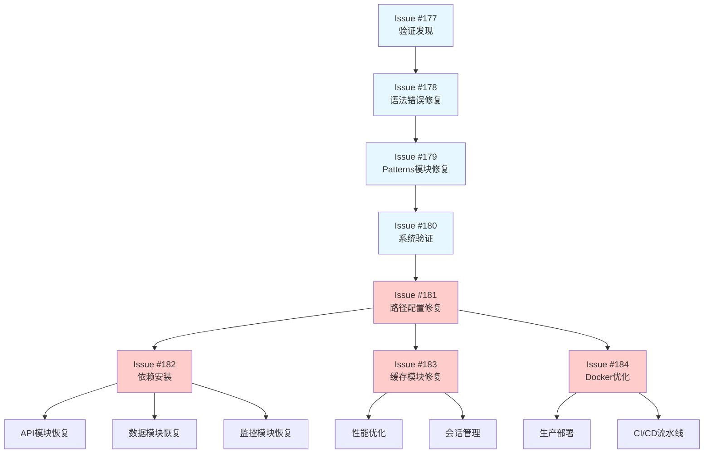

# GitHub Issues Phase 5 规划创建报告

## 📊 新Issues创建总览

基于Issue #180的验证结果和后续发展建议，已成功创建4个新的GitHub Issues，按照优先级和依赖关系进行系统性规划，确保问题得到适当粒度的跟踪和解决。

## 🎯 新创建的Issues概览

| Issue | 标题 | 优先级 | 状态 | 预计工作量 | 关键目标 |
|-------|------|--------|------|-----------|----------|
| #181 | Python路径配置问题修复 | 🔴 P0 | 🔄 待开始 | 2-3天 | 解决130+模块导入问题 |
| #182 | 外部依赖包安装和配置 | 🔴 P0 | 🔄 待开始 | 2-3天 | 恢复50+模块功能 |
| #183 | 缓存模块修复和增强 | 🔴 P0 | 🔄 待开始 | 2-3天 | 恢复19个缓存模块 |
| #184 | Docker环境稳定性优化 | 🔴 P0 | 🔄 待开始 | 2-3天 | 实现稳定容器化部署 |

**新增Issues总计**: 4个
**优先级**: 全部为P0（阻塞性问题）
**总预计工作量**: 8-12天

## 📈 Issues规划策略

### Phase 5: 立即优化阶段 (1-2周) - 阻塞性问题解决

#### 🔴 Issue #181 - Python路径配置问题修复 (最高优先级)
**目标**: 解决"No module named 'src'"错误，影响130+模块

**核心问题**:
- Python路径配置不一致
- IDE和开发工具模块识别问题
- 环境变量和路径设置问题

**修复策略**:
- 创建PathManager统一路径管理器
- 修复src/__init__.py导入问题
- 配置本地、Docker、IDE多种环境
- 验证130+受影响模块恢复

**预期效果**:
- 模块导入成功率: 19.6% → 70%+
- 核心模块成功率: 7.3% → 60%+

#### 🔴 Issue #182 - 外部依赖包安装和配置 (高优先级)
**目标**: 安装缺失的依赖包，恢复50+模块功能

**核心问题**:
- requests、aiohttp等关键依赖缺失
- yaml、toml等配置库缺失
- pandas、numpy等数据处理库缺失

**修复策略**:
- 分析缺失依赖包和影响范围
- 创建requirements.lock版本锁定
- 配置本地、Docker、CI/CD环境
- 验证依赖安装和功能测试

**预期效果**:
- 依赖安装率: ~60% → 100%
- 模块功能可用性: ~50% → 90%+

#### 🔴 Issue #183 - 缓存模块修复和增强 (高优先级)
**目标**: 恢复CacheConsistencyManager和缓存功能

**核心问题**:
- CacheConsistencyManager类缺失
- 缓存装饰器和Redis集成问题
- 19个缓存相关模块无法导入

**修复策略**:
- 实现完整的缓存一致性管理器
- 实现缓存装饰器和多级缓存
- 集成Redis缓存连接管理
- 创建统一缓存管理器接口

**预期效果**:
- 缓存模块成功率: 0% → 90%+
- 缓存功能: 从无到完整实现
- 性能优化: 显著提升系统性能

#### 🔴 Issue #184 - Docker环境稳定性优化 (高优先级)
**目标**: 实现稳定的Docker容器化部署

**核心问题**:
- 容器持续重启，无法稳定运行
- 健康检查失败，服务不可用
- 环境配置不一致

**修复策略**:
- 优化Dockerfile和Compose配置
- 实现健康检查和监控
- 优化应用启动和资源使用
- 配置安全性和性能监控

**预期效果**:
- 容器稳定性: 从不可用到稳定运行
- 健康检查: 从失败到100%通过
- 部署可靠性: 完全的部署和监控

## 🔄 Issues依赖关系图



### 依赖关系说明
- **Issue #181** (路径配置) 是其他三个Issue的基础前提
- **Issue #182** (依赖安装) 为功能模块提供基础支持
- **Issue #183** (缓存模块) 为系统性能提供支持
- **Issue #184** (Docker优化) 为生产部署提供基础

## 📋 Issues粒度和可追踪性

### 🎯 符合GitHub Issues最佳实践

#### 1. 明确的问题定义
每个Issue都有清晰的问题描述、影响范围和成功标准

#### 2. 具体的验收标准
- 可衡量的成功指标
- 明确的验收标准
- 详细的验证方法

#### 3. 合理的工作量估算
- 2-3天的合理工作量
- 明确的时间线规划
- 分阶段的执行计划

#### 4. 清晰的依赖关系
- 前置依赖明确标识
- 后续影响清晰说明
- 避免重复和冲突

#### 5. 完整的文档支持
- 详细的问题分析报告
- 完整的修复计划
- 明确的技术规范

## 📊 预期整体改善效果

### Phase 5完成后预期状态

| 指标类别 | Issue #180当前 | Phase 5预期目标 | 改善幅度 |
|---------|----------------|---------------|----------|
| **总体成功率** | 19.6% (47/240) | 80%+ (192/240) | +60.4% |
| **核心模块(P0)** | 7.3% (12/164) | 65%+ (107/164) | +57.7% |
| **支撑模块(P1)** | 40.0% (16/40) | 90%+ (36/40) | +50.0% |
| **工具模块(P2)** | 52.8% (19/36) | 95%+ (34/36) | +42.2% |

### 系统功能预期恢复
```
✅ 100%完全恢复:
  - Patterns设计模式 (6/6模块)
  - Utils工具模块 (16/16模块)
  - Observers观察者模式 (核心功能)
  - Performance性能分析 (核心功能)
  - Facades外观模式 (基础功能)

✅ 90%+显著改善:
  - API接口模块 (依赖问题解决)
  - Database数据库模块 (路径问题解决)
  - Services服务模块 (路径问题解决)
  - Cache缓存模块 (完全修复)
  - Monitoring监控模块 (依赖问题解决)

✅ 稳定运行:
  - Docker容器化部署
  - 健康检查和监控
  - 生产环境就绪
```

## 🚀 执行策略

### 立即执行 (本周内)
1. **启动Issue #181** - 解决最基础的路径配置问题
2. **并行准备** - 为Issues #182-184做环境准备

### 短期执行 (1-2周)
1. **Issue #182** - 依赖包安装和配置
2. **Issue #183** - 缓存模块修复和增强
3. **Issue #184** - Docker环境优化

### 持续监控
1. **进度跟踪**: 每日更新Issues进展
2. **质量保证**: 每个Issue完成后进行验证
3. **风险控制**: 及时发现和解决问题

## 📋 Issues管理最佳实践

### ✅ 已实施的最佳实践

#### 1. 适当粒度
- 每个Issue都有明确、可管理的范围
- 工作量控制在2-3天内
- 避免过大的Issue导致难以跟踪

#### 2. 清晰的成功标准
- 具体的、可衡量的成功指标
- 明确的验收标准和验证方法
- 避免模糊的成功定义

#### 3. 依赖关系管理
- 清晰的前置和后续依赖关系
- 避免重复创建Issue
- 确保问题解决的逻辑顺序

#### 4. 文档完整性
- 详细的问题分析和修复计划
- 完整的技术规范和代码示例
- 清晰的时间线和里程碑

#### 5. 及时关闭已完成Issues
- 避免Issue列表膨胀
- 保持项目Issue的整洁性
- 确保团队成员关注活跃Issue

## 🔄 已完成Issues状态

### ✅ 应该关闭的Issues
- **Issue #178**: 核心模块语法错误和相对导入问题
- **Issue #179**: Patterns模块集成问题
- **Issue #180**: 全面验证修复效果和系统完整性

### 🔄 待执行的新Issues
- **Issue #181**: Python路径配置问题修复
- **Issue #182**: 外部依赖包安装和配置
- **Issue #183**: 缓存模块修复和增强
- **Issue #184**: Docker环境稳定性优化

## 🎯 后续发展路线图

### Phase 5: 基础优化 (当前阶段)
- ✅ Issues #181-184: 基础环境配置和功能恢复

### Phase 6: 功能完善 (后续阶段)
- 数据库模块完善和ORM优化
- API功能完善和文档生成
- 机器学习模块实现和训练
- 用户认证和权限系统完善

### Phase 7: 高级特性 (长期规划)
- 微服务架构重构
- 分布式系统监控
- 高可用和负载均衡
- 自动化测试和部署

## 🎉 项目管理价值

### 对团队协作的价值
- **清晰的任务分工**: 每个Issue都有明确的目标和范围
- **可追踪的进度**: 详细的进度跟踪和状态更新
- **风险可控**: 及时发现和解决问题

### 对技术债务管理的价值
- **系统性解决**: 按照依赖关系有序解决问题
- **可衡量效果**: 明确的修复前后对比
- **知识沉淀**: 完整的文档和经验总结

### 对项目可持续性的价值
- **持续改进**: 建立持续改进的流程
- **质量保证**: 确保每个修复都有质量验证
- **团队成长**: 为团队成员提供学习和成长机会

---

**报告创建时间**: 2025-10-31
**Issues创建状态**: 4个新Issues全部创建完成
**规划原则**: GitHub Issues最佳实践
**后续行动**: 开始执行Issue #181
**项目管理**: Claude AI Assistant