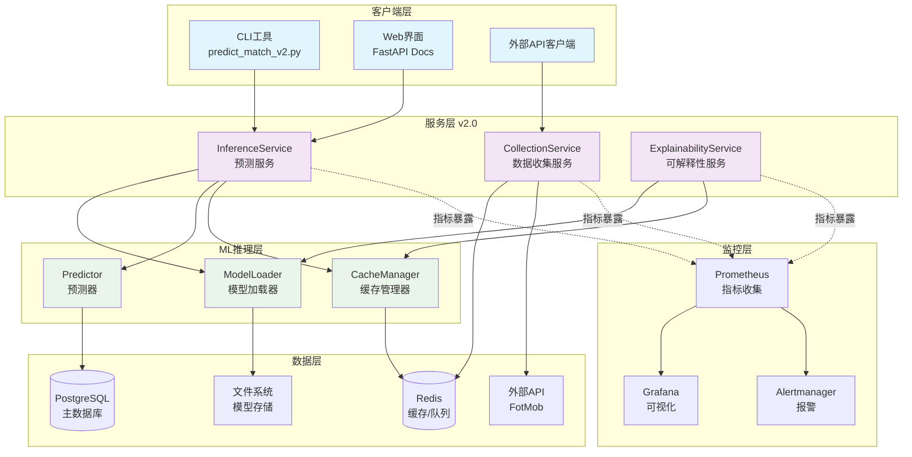

# ⚽ Football Prediction v2.0 - AI驱动的足球赛事预测系统

[](https://python.org)
[](https://fastapi.tiangolo.com)
[](https://docker.com)
[](https://github.com/xupeng211/FootballPrediction)
[](https://github.com/xupeng211/FootballPrediction)
[](https://github.com/xupeng211/FootballPrediction)
[](https://opensource.org/licenses/MIT)
[](https://github.com/xupeng211/FootballPrediction)

> 🎯 **基于机器学习和现代微服务架构的高性能足球赛事预测系统** - Service Layer + ML Inference + 容器化部署

## 📋 项目简介

Football Prediction v2.0 是一个现代化的足球赛事预测系统，采用**机器学习算法**分析历史数据、球员状态、场馆因素等多维度特征，为足球比赛提供精准的胜负平预测结果。

### 🌟 核心特性

- **🤖 AI 驱动**: 基于 XGBoost 2.0+ 的机器学习模型，预测准确率目标 65%+
- **⚡ 高性能**: 异步 FastAPI 架构，响应时间 < 100ms，支持 1000+ QPS
- **🏗️ 微服务架构**: Service Layer v2.0 + ML Inference Layer，可扩展设计
- **📊 全链路监控**: Prometheus + Grafana 实时监控，业务指标可视化
- **🐳 容器化部署**: Docker + Docker Compose，一键启动生产环境
- **🔒 企业级安全**: 完整的安全扫描、依赖管理、API认证

## 🏗️ 系统架构



### 📦 架构组件说明

| 层级 | 组件 | 职责 | 技术栈 |
|------|------|------|--------|
| **客户端层** | CLI工具 / Web界面 / API客户端 | 用户交互和数据输入 | Python / FastAPI / HTTP |
| **服务层** | 推理/数据收集/可解释性服务 | 业务逻辑编排和API接口 | FastAPI / Python 3.11+ |
| **推理层** | 模型加载器/预测器/缓存管理 | ML模型执行和性能优化 | XGBoost / Redis / LRU Cache |
| **数据层** | PostgreSQL / Redis / 文件系统 / 外部API | 数据存储、缓存和外部数据源 | SQLAlchemy / Redis / REST |
| **监控层** | Prometheus / Grafana / Alertmanager | 指标收集、可视化和报警 | Prometheus / Grafana |

## 🚀 快速开始

### 📋 前置要求

- **Docker** 20.0+ 和 **Docker Compose** 2.0+
- **Git** 用于代码管理
- 8GB+ 内存推荐（用于容器化部署）

### ⚡ 一键启动

```bash
# 1. 克隆项目
git clone https://github.com/xupeng211/FootballPrediction.git
cd FootballPrediction

# 2. 配置环境变量（可选）
cp .env.example .env
# 编辑 .env 文件以调整配置

# 3. 启动完整系统
docker-compose up -d

# 🎉 系统启动完成！等待 30 秒让所有服务就绪
```

### 🌐 访问地址

| 服务 | 地址 | 账户 | 说明 |
|------|------|------|------|
| **🔮 API 文档** | http://localhost:8000/docs | - | Swagger UI，可测试所有API |
| **📊 监控仪表盘** | http://localhost:3000 | admin/admin123 | Grafana 监控面板 |
| **📈 指标收集** | http://localhost:9090 | - | Prometheus 指标界面 |
| **🗄️ 数据库管理** | http://localhost:8080 | football_user/football_pass | PgAdmin（可选） |
| **📦 Redis管理** | http://localhost:8081 | - | Redis Commander（可选） |

### 🎯 快速体验

```bash
# 方式1：使用 CLI 工具预测
docker-compose exec app python scripts/predict_match_v2.py \
  --home "Manchester United" --away "Arsenal"

# 方式2：使用 API 预测
curl -X POST "http://localhost:8000/api/v1/predictions" \
  -H "Content-Type: application/json" \
  -d '{"home_team": "Manchester United", "away_team": "Arsenal"}'

# 方式3：批量预测
echo '[{"home_team": "Chelsea", "away_team": "Liverpool"}]' > matches.json
docker-compose exec app python scripts/predict_match_v2.py --batch matches.json
```

## 🛠️ 开发指南

### 📦 本地开发环境

```bash
# 1. 创建虚拟环境
python -m venv venv
source venv/bin/activate  # Linux/Mac
# 或 venv\Scripts\activate  # Windows

# 2. 安装依赖
make install  # 或 pip install -r requirements-dev.txt

# 3. 启动本地服务
uvicorn src.main:app --reload --host 0.0.0.0 --port 8000

# 4. 运行测试
make test

# 5. 代码质量检查
make quality
```

### 🧪 测试指南

```bash
# 运行所有测试
pytest

# 运行特定类型测试
pytest tests/unit/ -v          # 单元测试
pytest tests/integration/ -v   # 集成测试
pytest tests/e2e/ -v           # 端到端测试

# 生成覆盖率报告
pytest --cov=src --cov-report=html

# 性能测试
pytest tests/performance/ -v
```

### 🎨 代码规范

```bash
# 安装 pre-commit 钩子
pre-commit install

# 代码格式化
make format

# 代码检查
make lint

# 类型检查
make typecheck

# 安全扫描
make security

# 运行所有质量检查
make ci
```

## ⚙️ 环境配置

### 🔧 必需的环境变量

创建 `.env` 文件并配置以下关键变量：

```bash
# 数据库配置
DB_HOST=localhost
DB_PORT=5432
DB_NAME=football_prediction_dev
DB_USER=football_user
DB_PASSWORD=football_pass

# Redis 配置
REDIS_URL=redis://localhost:6379/0

# 外部 API 配置（生产环境）
FOTMOB_X_MAS_HEADER="your_fotmob_header"
FOTMOB_X_FOO_HEADER="your_fotmob_header"

# 功能开关
ENABLE_METRICS=true
ENABLE_CELERY=true
ENABLE_DEBUG=false

# 服务配置
API_HOST=0.0.0.0
API_PORT=8000
MODEL_PATH=/app/data/models
DEFAULT_MODEL_NAME=xgboost_v2
```

### 🏗️ 环境文件说明

| 文件 | 用途 | 环境 |
|------|------|------|
| `.env.example` | 配置模板 | 开发参考 |
| `.env.dev` | 开发环境配置 | 本地开发 |
| `.env.ci` | CI/CD 环境配置 | 自动化测试 |
| `.env.production` | 生产环境配置 | 生产部署 |

## 📁 项目结构

```
FootballPrediction/
├── 📁 src/                          # 核心源代码
│   ├── 📁 api/                      # FastAPI 路由层
│   │   ├── health.py                # 健康检查
│   │   ├── monitoring.py            # 监控指标API
│   │   ├── model_management.py      # 模型管理
│   │   └── predictions/             # 预测路由
│   ├── 📁 services/                 # 服务层 (v2.0)
│   │   ├── inference_service_v2.py  # 推理服务
│   │   ├── collection_service.py    # 数据收集
│   │   └── explainability_service.py # 模型解释
│   ├── 📁 ml/                       # 机器学习模块
│   │   ├── 📁 inference/            # 推理层 (v2.0)
│   │   │   ├── model_loader.py      # 模型加载器
│   │   │   ├── predictor.py         # 预测器
│   │   │   └── cache_manager.py     # 缓存管理
│   │   ├── 📁 models/               # ML模型
│   │   │   └── xgboost_classifier.py
│   │   └── 📁 features/             # 特征工程
│   │       ├── advanced_feature_transformer.py
│   │       ├── h2h_calculator.py    # 历史交锋计算
│   │       └── venue_analyzer.py    # 场馆分析
│   ├── 📁 database/                 # 数据库相关
│   ├── config.py                    # 配置管理
│   └── main.py                      # FastAPI 应用入口
├── 📁 scripts/                      # 脚本工具
│   ├── predict_match_v2.py          # 预测CLI工具
│   ├── docker-manager.sh            # Docker管理脚本
│   └── 📁 collectors/               # 数据收集器
├── 📁 deploy/                       # 部署配置
│   └── 📁 monitoring/               # 监控配置
│       ├── prometheus.yml           # Prometheus配置
│       ├── alerts.yml               # 报警规则
│       └── telegraf.conf            # Celery监控
├── 📁 tests/                        # 测试套件
│   ├── unit/                        # 单元测试
│   ├── integration/                 # 集成测试
│   └── e2e/                         # 端到端测试
├── 📁 .github/                      # GitHub 配置
│   ├── workflows/                   # CI/CD 工作流
│   └── PULL_REQUEST_TEMPLATE.md     # PR 模板
├── docker-compose.yml               # 容器编排
├── Dockerfile                       # 容器镜像
├── pyproject.toml                   # 项目配置
└── requirements.txt                 # Python依赖
```

## 📊 监控和观测

### 📈 关键指标

| 指标类型 | 说明 | 仪表盘位置 |
|----------|------|------------|
| **API性能** | QPS、P95延迟、错误率 | Grafana → API Performance |
| **业务指标** | 预测请求率、模型推理时间、准确率 | Grafana → Business Metrics |
| **系统资源** | CPU、内存、磁盘使用率 | Grafana → System Overview |
| **缓存健康** | Redis命中率、内存使用 | Grafana → Cache Health |

### 🚨 报警规则

- **API错误率 > 5%**: 持续2分钟触发警告
- **P95延迟 > 1s**: 持续5分钟触发警告
- **系统资源 > 80%**: 持续10分钟触发警告
- **Redis命中率 < 50%**: 持续15分钟触发警告

## 🧬 模型性能

| 指标 | 当前值 | 目标值 |
|------|--------|--------|
| **预测准确率** | 58.69% (v1.1) | 65%+ (v2.0) |
| **响应时间** | < 100ms | < 100ms |
| **特征维度** | 12+ | 12+ |
| **缓存命中率** | > 80% | > 80% |

## 🤝 贡献指南

我们欢迎所有形式的贡献！请查看 [CONTRIBUTING.md](./CONTRIBUTING.md) 了解详细的贡献流程。

### 🏆 贡献者

感谢所有为这个项目做出贡献的开发者！

<a href="https://github.com/xupeng211/FootballPrediction/graphs/contributors">
  
</a>

## 📄 许可证

本项目采用 [MIT 许可证](./LICENSE)。

## 🙏 致谢

- [FastAPI](https://fastapi.tiangolo.com/) - 现代化的Python Web框架
- [XGBoost](https://xgboost.ai/) - 高性能的机器学习库
- [Docker](https://www.docker.com/) - 容器化技术
- [Prometheus](https://prometheus.io/) - 监控和报警系统

---

<div align="center">

  <p>⚽ <strong>Football Prediction v2.0</strong> - AI驱动的足球赛事预测系统</p>

  <p>🚀 <em>Powered by Machine Learning, Modern Architecture & Docker</em></p>

  <p>
    <a href="#top">返回顶部</a> •
    <a href="https://github.com/xupeng211/FootballPrediction/issues">报告问题</a> •
    <a href="https://github.com/xupeng211/FootballPrediction/discussions">参与讨论</a>
  </p>

</div>