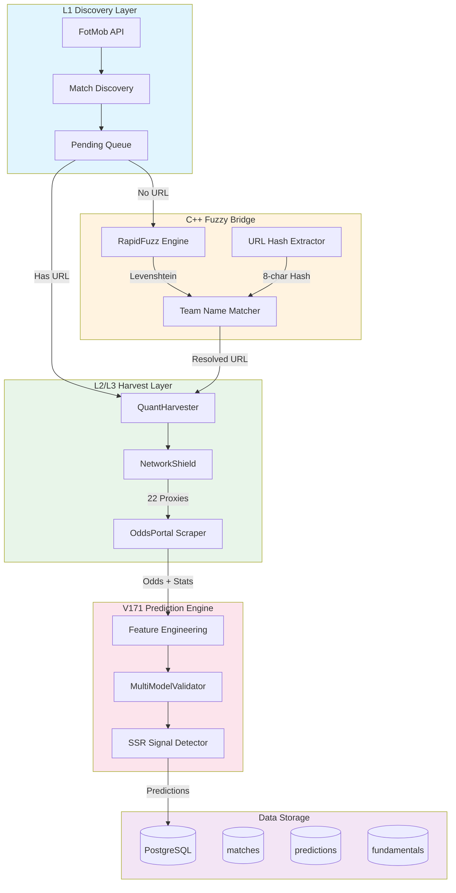

# FootballPrediction V171

> **工业级足球预测平台** - 全息收割系统

[](https://github.com/xupeng211/FootballPrediction)
[](LICENSE)
[](https://nodejs.org/)
[](https://python.org)

---

## 🎯 项目简介

V171 是一个**工业级足球预测平台**，通过多源数据采集、C++ 模糊匹配和 AI 多模型共识，实现高精度的比赛预测。

### 核心特性

- 🔍 **L1 Discovery**: 自动发现未来 7 天的比赛
- 🔗 **C++ Fuzzy Bridge**: RapidFuzz 高性能队名匹配
- 🌐 **L2/L3 Harvest**: 多源数据采集 (FotMob + OddsPortal)
- 🧠 **V171 Prediction**: 3 模型共识预测
- 🛡️ **NetworkShield**: 22 节点代理池熔断保护

---

## 🚀 快速收割三部曲

> **3 步完成从数据采集到预测输出的完整闭环**

### 📍 Step 1: 目标锁定 (URL 提取)

```bash
# 提取未来比赛的 OddsPortal URL Hash
npm run extract-urls

# 输出示例:
# ✅ Liverpool vs West Ham → KbUrxW1T
# ✅ Arsenal vs Chelsea → CE2gREmB
```

### 📍 Step 2: 全息收割 (数据采集)

```bash
# 批量收割 50 场比赛
npm run harvest

# 或限制数量
npm run harvest:limit 10
```

**收割内容:**
- L2 (FotMob): xG, 控球率, 射门, 球员评分
- L3 (OddsPortal): 开盘赔率, 即时赔率, 变动轨迹

### 📍 Step 3: 战果验收 (预测查看)

```bash
# 查看黄金名单
python scripts/ops/check_daily_bets.py

# 或直接查询数据库
docker-compose exec db psql -U football_user -d football_db \
  -c "SELECT * FROM predictions WHERE final_confidence > 0.65"
```

---

## 🛠️ 技术栈

| 层级 | 技术 | 用途 |
|------|------|------|
| **运行时** | Node.js 18+ / Python 3.11+ | 双语言架构 |
| **模糊匹配** | RapidFuzz (C++) | 队名 Levenshtein 匹配 |
| **浏览器自动化** | Playwright | 页面采集 |
| **代理管理** | NetworkShield | 22 节点熔断 |
| **数据库** | PostgreSQL 15 | 数据存储 |
| **AI 模型** | Scikit-learn / XGBoost | 预测模型 |

---

## 📊 系统架构



---

## 📋 完整命令列表

### 核心收割

| 命令 | 描述 |
|------|------|
| `npm run harvest` | 批量收割 (50 场) |
| `npm run harvest:quick` | 快速收割测试 |
| `npm run harvest:limit 10` | 限制收割 10 场 |
| `npm run extract-urls` | 提取真实 URL Hash |
| `npm run scheduler` | 启动无人值守调度器 |

### 代码质量

| 命令 | 描述 |
|------|------|
| `npm run lint` | ESLint 检查 |
| `npm run lint:fix` | ESLint 自动修复 |
| `npm run format` | Prettier 格式化 |
| `npm run lint:python` | Ruff Python 检查 |
| `npm run qa` | 全量检查 |

### 测试

| 命令 | 描述 |
|------|------|
| `npm test` | 运行所有测试 |
| `npm run test:v171` | V171 专项测试 |
| `npm run test:python` | Python 测试 |

---

## 🔧 故障自愈指南

### 代理熔断

```bash
# 症状: Connection refused, Port 789X failed
# 诊断:
curl -x http://172.25.16.1:7891 https://httpbin.org/ip

# 解决方案 1: 重启容器
docker-compose restart dev

# 解决方案 2: 检查 Clash 是否运行
# (在宿主机上检查 Clash Verge)
```

### 数据库连接超时

```bash
# 症状: Connection timed out, ECONNREFUSED
# 诊断:
docker-compose ps db

# 解决方案 1: 重启数据库
docker-compose restart db

# 解决方案 2: 检查连接
docker-compose exec db pg_isready
```

### URL Hash 提取失败

```bash
# 症状: No matching URL found
# 解决方案: 手动提取并更新
npm run extract-urls -- --limit 50 --update-db
```

### Git 推送超时

```bash
# 解决方案: 配置代理
git config --global http.proxy http://172.25.16.1:7890
git config --global https.proxy http://172.25.16.1:7890

# 增大缓存
git config --global http.postBuffer 524288000
```

---

## 🏆 黄金名单示例

| 比赛 | 预测 | 置信度 | 身价差 | 信号 |
|------|------|--------|--------|------|
| Liverpool vs West Ham | HOME | 68.0% | €850M | 📊 接近 SSR |
| Arsenal vs Chelsea | HOME | 55.0% | €450M | 📈 中等 |

**SSR 阈值**: 置信度 ≥ 80% + 3 模型一致

---

## 📁 项目结构

```
FootballPrediction/
├── config/                 # 配置模块
│   ├── database.js        # 数据库配置
│   ├── logger.js          # 日志配置
│   └── active_registry.json # 代理注册表
├── scripts/ops/           # 运维脚本
│   ├── v171_scheduler.js  # 全自动调度器
│   ├── v171_mass_harvest.js # 批量收割
│   └── v171_real_url_extractor.js # URL 提取
├── src/
│   ├── infrastructure/    # 基础设施
│   │   └── engines/       # 核心引擎
│   ├── ml/               # 机器学习
│   │   └── inference/    # 推理模块
│   └── utils/            # 工具
│       └── cpp_bridge_radar.py # C++ 桥接
├── tests/                 # 测试文件
├── logs/                  # 日志目录
├── .env.example          # 环境变量模板
├── CLAUDE.md             # AI 助手指南
├── ARCHITECTURE.md       # 架构文档
├── package.json          # Node.js 配置
└── requirements.txt      # Python 依赖
```

---

## 🔧 环境变量

详见 [.env.example](.env.example)

| 变量 | 描述 | 默认值 |
|------|------|--------|
| `DB_HOST` | 数据库主机 | localhost |
| `DB_PORT` | 数据库端口 | 5432 |
| `DB_NAME` | 数据库名称 | football_db |
| `DB_USER` | 数据库用户 | football_user |
| `DB_PASSWORD` | 数据库密码 | **必填** |
| `LOG_LEVEL` | 日志级别 | info |
| `ENABLE_PROXY_ROTATION` | 启用代理轮换 | false |

---

## 📖 文档

- [CLAUDE.md](./CLAUDE.md) - AI 助手操作指南
- [ARCHITECTURE.md](./ARCHITECTURE.md) - 详细技术架构

---

## 🤝 贡献

欢迎提交 Issue 和 Pull Request！

---

## 📄 许可证

[MIT License](LICENSE)

---

<p align="center">
  Made with ❤️ by V171 Engineering Team
</p>
