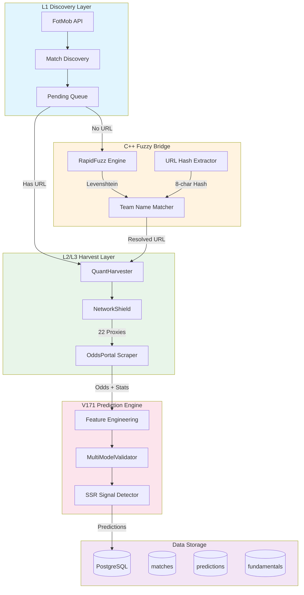

# FootballPrediction V175

> **工业级足球预测平台** - 模块化 Master-Worker 架构

[](https://github.com/xupeng211/FootballPrediction)
[](LICENSE)
[](https://nodejs.org/)
[](https://python.org)

---

## 🎯 项目简介

V175 是一个**工业级足球预测平台**，采用模块化 Master-Worker 架构，通过多源数据采集、C++ 模糊匹配和 AI 多模型共识，实现高精度的比赛预测。

### 核心特性

- 🏗️ **模块化架构**: 12 个独立模块，高内聚低耦合
- 👷 **Master-Worker**: 分布式收割，支持 10 Worker 并发
- 🔍 **L1 Discovery**: 自动发现未来 7 天的比赛
- 🔗 **C++ Fuzzy Bridge**: RapidFuzz 高性能队名匹配
- 🌐 **L2/L3 Harvest**: 多源数据采集 (FotMob + OddsPortal)
- 🧠 **Multi-Model Consensus**: 3 模型共识预测
- 🛡️ **NetworkShield**: 22 节点代理池熔断保护
- 📊 **实时监控大屏**: 查看收割进度和状态
- 🧹 **V175 加固**: 统一工具模块、防御性编程、万级因子数据

---

## 🚀 一键部署

```bash
# 1. 克隆项目
git clone https://github.com/xupeng211/FootballPrediction.git
cd FootballPrediction

# 2. 配置环境变量
cp env.example .env
# 编辑 .env 设置 DB_PASSWORD

# 3. 启动开发环境
docker-compose -f docker-compose.dev.yml up -d

# 4. 执行收割
docker-compose -f docker-compose.dev.yml exec dev npm run harvest
```

---

## 📋 快速收割指南

### 单 Worker 模式 (最稳定)

```bash
docker-compose -f docker-compose.dev.yml exec dev npm run harvest
```

### 多 Worker 模式 (高吞吐)

```bash
docker-compose -f docker-compose.dev.yml exec -e MAX_WORKERS=2 dev npm run harvest
```

### 监控大屏

```bash
docker-compose -f docker-compose.dev.yml exec dev npm run watch
```

**收割内容:**
- L2 (FotMob): xG, 控球率, 射门, 球员评分
- L3 (OddsPortal): 开盘赔率, 即时赔率, 变动轨迹

### 📍 Step 3: 战果验收 (预测查看)

```bash
# 查看黄金名单
python scripts/ops/check_daily_bets.py

# 或直接查询数据库
docker-compose exec db psql -U football_user -d football_db \
  -c "SELECT * FROM predictions WHERE final_confidence > 0.65"
```

---

## 🛠️ 技术栈

| 层级 | 技术 | 用途 |
|------|------|------|
| **运行时** | Node.js 18+ / Python 3.11+ | 双语言架构 |
| **模糊匹配** | RapidFuzz (C++) | 队名 Levenshtein 匹配 |
| **浏览器自动化** | Playwright | 页面采集 |
| **代理管理** | NetworkShield | 22 节点熔断 |
| **数据库** | PostgreSQL 15 | 数据存储 |
| **AI 模型** | Scikit-learn / XGBoost | 预测模型 |

---

## 📊 系统架构



---

## 📋 完整命令列表

### 核心收割

| 命令 | 描述 |
|------|------|
| `npm run harvest` | 批量收割 (50 场) - V173 装甲群模式 |
| `npm run harvest:quick` | 快速收割测试 |
| `npm run harvest:limit 10` | 限制收割 10 场 |
| `npm run extract-urls` | 提取真实 URL Hash |
| `npm run scheduler` | 启动无人值守调度器 |

### V173 监控与诊断

| 命令 | 描述 |
|------|------|
| `npm run watch` | 启动中央监控大屏 (实时进度) |
| `npm run status` | 查看当前收割状态 |
| `npm run report` | 生成资产报告 |
| `npm run diagnose` | 运行诊断实验 |

### 代码质量

| 命令 | 描述 |
|------|------|
| `npm run lint` | ESLint 检查 |
| `npm run lint:fix` | ESLint 自动修复 |
| `npm run format` | Prettier 格式化 |
| `npm run lint:python` | Ruff Python 检查 |
| `npm run qa` | 全量检查 |

### 测试

| 命令 | 描述 |
|------|------|
| `npm test` | 运行所有测试 |
| `npm run test:v171` | V171 专项测试 |
| `npm run test:python` | Python 测试 |

---

## 🕵️ V173 网页渗透模式

V173 引入了全新的**网页渗透模式**，绕过 API 限制，直接从 FotMob 网页版提取数据。

### 工作原理

```
传统 API 模式:
  API 请求 → JSON 响应 → 数据存储

网页渗透模式:
  浏览器访问 → __NEXT_DATA__ 提取 → 数据转换 → 存储
```

### 核心优势

- **绕过 API 限制**: 直接从网页提取数据，无需 API 密钥
- **更丰富的数据**: 包含 API 不提供的详细统计
- **动态 UA 轮换**: 20 个主流 User-Agent 随机切换
- **深度静默模式**: 连续失败时自动进入冷却期

### 使用方式

```bash
# 启动 V173 装甲群收割器
docker-compose -f docker-compose.dev.yml exec dev npm run harvest

# 查看实时进度
docker-compose -f docker-compose.dev.yml exec dev npm run watch

# 查看状态文件 (实时更新的 JSON)
cat /app/logs/live_status.json
```

---

## 📊 中央监控大屏

V173 新增**中央监控大屏**，实时查看收割进度。

### 启动监控

```bash
npm run watch
```

### 监控内容

- **Worker 状态**: 每个 Worker 的运行状态、成功/失败次数
- **总进度**: 实时进度条、预估剩余时间
- **代理状态**: 22 个代理端口的使用情况
- **心跳机制**: 每 10 秒更新一次状态文件

### 状态文件

状态文件位于 `/app/logs/live_status.json`，包含：

```json
{
  "version": "V173.0.0",
  "timestamp": "2026-02-28T10:00:00Z",
  "total": 100,
  "processed": 45,
  "success": 42,
  "failed": 3,
  "progressPct": "45.0",
  "workers": { ... },
  "proxyStatus": { ... }
}
```

---

## 🔧 故障自愈指南

### 代理熔断

```bash
# 症状: Connection refused, Port 789X failed
# 诊断:
curl -x http://172.25.16.1:7891 https://httpbin.org/ip

# 解决方案 1: 重启容器
docker-compose restart dev

# 解决方案 2: 检查 Clash 是否运行
# (在宿主机上检查 Clash Verge)
```

### 数据库连接超时

```bash
# 症状: Connection timed out, ECONNREFUSED
# 诊断:
docker-compose ps db

# 解决方案 1: 重启数据库
docker-compose restart db

# 解决方案 2: 检查连接
docker-compose exec db pg_isready
```

### URL Hash 提取失败

```bash
# 症状: No matching URL found
# 解决方案: 手动提取并更新
npm run extract-urls -- --limit 50 --update-db
```

### Git 推送超时

```bash
# 解决方案: 配置代理
git config --global http.proxy http://172.25.16.1:7890
git config --global https.proxy http://172.25.16.1:7890

# 增大缓存
git config --global http.postBuffer 524288000
```

---

## 🏆 黄金名单示例

| 比赛 | 预测 | 置信度 | 身价差 | 信号 |
|------|------|--------|--------|------|
| Liverpool vs West Ham | HOME | 68.0% | €850M | 📊 接近 SSR |
| Arsenal vs Chelsea | HOME | 55.0% | €450M | 📈 中等 |

**SSR 阈值**: 置信度 ≥ 80% + 3 模型一致

---

## 📁 项目结构

```
FootballPrediction/
├── config/                 # 配置模块
│   ├── database.js        # 数据库配置
│   ├── logger.js          # 日志配置
│   └── active_registry.json # 代理注册表
├── scripts/ops/           # 运维脚本
│   ├── v171_scheduler.js  # 全自动调度器
│   ├── v171_mass_harvest.js # 批量收割
│   └── v171_real_url_extractor.js # URL 提取
├── src/
│   ├── infrastructure/    # 基础设施
│   │   └── engines/       # 核心引擎
│   ├── ml/               # 机器学习
│   │   └── inference/    # 推理模块
│   └── utils/            # 工具
│       └── cpp_bridge_radar.py # C++ 桥接
├── tests/                 # 测试文件
├── logs/                  # 日志目录
├── .env.example          # 环境变量模板
├── CLAUDE.md             # AI 助手指南
├── ARCHITECTURE.md       # 架构文档
├── package.json          # Node.js 配置
└── requirements.txt      # Python 依赖
```

---

## 🔧 环境变量

详见 [.env.example](.env.example)

| 变量 | 描述 | 默认值 |
|------|------|--------|
| `DB_HOST` | 数据库主机 | localhost |
| `DB_PORT` | 数据库端口 | 5432 |
| `DB_NAME` | 数据库名称 | football_db |
| `DB_USER` | 数据库用户 | football_user |
| `DB_PASSWORD` | 数据库密码 | **必填** |
| `LOG_LEVEL` | 日志级别 | info |
| `ENABLE_PROXY_ROTATION` | 启用代理轮换 | false |

---

## 📖 文档

- [CLAUDE.md](./CLAUDE.md) - AI 助手操作指南
- [ARCHITECTURE.md](./ARCHITECTURE.md) - 详细技术架构

---

## 🤝 贡献

欢迎提交 Issue 和 Pull Request！

---

## 📄 许可证

[MIT License](LICENSE)

---

<p align="center">
  Made with ❤️ by V171 Engineering Team
</p>
