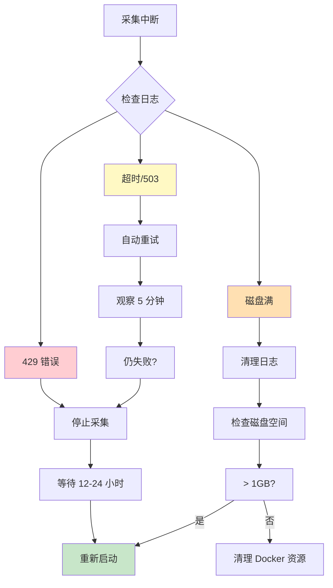

# V37.1 采集断点续传 Runbook（生存指南）

> **目标受众**: 运维工程师、SRE、值班人员
>
> **用途**: 在长达数小时的无人值守采集过程中进行故障自救

---

## 🚨 紧急情况分类

| 级别 | 场景 | 处理时间 | 影响 |
|------|------|---------|------|
| 🔴 P0 | API 封禁 | 1-24 小时 | 采集中断 |
| 🟠 P1 | 网络抖动 | 自动恢复 | 无影响 |
| 🟡 P2 | 磁盘满 | 立即处理 | 采集中断 |
| 🔵 P3 | 数据质量下降 | 记录观察 | 不中断采集 |

---

## 📊 监控面板

### 实时进度监控

```bash
# ===== 方式 1: 使用专用监控脚本 =====
python scripts/collectors/check_collection_health.py

# 输出示例:
# ╔════════════════════════════════════════════════════════════╗
# ║           L1/L2 采集健康检查报告                          ║
# ╚════════════════════════════════════════════════════════════╝
# ✅ 数据库连接: 正常
# 📊 采集进度:
#    L1 索引: 8,770 / 10,000 (87.7%)
#    L2 详情: 3,456 / 10,000 (34.6%)
# 📈 数据质量: FULL=89%, PARTIAL=8%, WARNING=3%
# 💾 磁盘空间: 879.9 GB 可用

# ===== 方式 2: 直接查询数据库 =====
docker exec football_prediction_db psql -U football_user -d football_prediction_dev -c "
SELECT
    'L1 Matches' as metric,
    COUNT(*) as collected,
    'matches' as source
FROM matches
UNION ALL
SELECT
    'L2 Details',
    COUNT(*),
    'raw_match_data'
FROM raw_match_data;
"

# ===== 方式 3: 实时 Tail 日志 =====
tail -f logs/auto_harvest.log | grep -E "(进度|成功|失败|警告)"
```

### 断点续传验证

**核心机制**: `_filter_new_matches()` 确保幂等性

```bash
# 验证幂等性:
# 1. 查询已采集的 L2 数据
docker exec football_prediction_db psql -U football_user -d football_prediction_dev -c "
SELECT match_id, created_at
FROM raw_match_data
ORDER BY created_at DESC
LIMIT 10;
"

# 2. 重新运行采集命令（会自动跳过已存在数据）
python scripts/collectors/full_l1_l2_harvest.py --season 23/24 --verbose

# 3. 观察日志输出:
# 🔍 筛选新比赛...
# 🎯 待采集: 0/50 场新比赛  ← 表示所有数据已存在，不会重复采集
# ℹ️ 无新比赛需要采集
```

---

## 🔧 P0: API 封禁恢复

### 症状

```bash
# 日志中出现大量 429 错误
❌ L2采集失败 4813374: HTTP 429 Too Many Requests
❌ 🚨 熔断器已打开，暂停请求
```

### 立即措施

1. **停止采集进程**:
   ```bash
   # 如果在本地运行
   pkill -f full_l1_l2_harvest.py

   # 如果在 Docker 中
   docker-compose stop pipeline_worker
   ```

2. **检查封禁状态**:
   ```bash
   # 测试 API 可访问性
   curl -I https://www.fotmob.com/api/leagues?id=47

   # 预期输出:
   # HTTP/1.1 200 OK  ← 正常
   # HTTP/1.1 429  ← 仍被封禁
   ```

3. **等待冷却期** (推荐):

   FotMob API 封禁通常在 **6-24 小时** 后自动解除

   ```bash
   # 计算恢复时间
   echo "封禁开始时间: $(date)"
   echo "预计恢复时间: $(date -d '+12 hours')"
   ```

4. **恢复采集**:

   ```bash
   # 直接重新运行命令，系统会自动跳过已采集数据
   python scripts/collectors/full_l1_l2_harvest.py --verbose
   ```

### 长期优化（避免重复封禁）

修改采集速率（需编辑代码）:

```python
# src/api/collectors/production_l2_collector.py

async with ProductionL2Collector(
    db_pool=self.db_pool,
    max_concurrent=2,              # 降低并发 (原 3)
    max_requests_per_second=1,    # 降低速率 (原 2)
    timeout=30,
) as collector:
```

---

## 🌐 P1: 网络抖动恢复

### 症状

```bash
# 日志中偶尔出现超时错误
⚠️ L2采集失败 4813374: TimeoutError
⚠️ L2采集失败 4813375: Server error: HTTP 503
```

### 恢复机制

**系统自动处理**：

1. **指数退避重试** (已启用):
   ```python
   @retry_with_exponential_backoff(
       max_attempts=3,
       base_delay=1.0,  # 第 1 次重试
   )
   ```

2. **熔断器保护** (已启用):
   ```python
   # 连续 5 次失败后触发熔断
   # 等待 60 秒后自动恢复
   ```

### 人工干预（仅必要时）

```bash
# 如果网络长时间不稳定
# 检查网络连通性
ping -c 3 www.fotmob.com

# 检查 DNS 解析
nslookup www.fotmob.com

# 如果 DNS 异常，切换到备用 DNS
echo "nameserver 8.8.8.8" | sudo tee -a /etc/resolv.conf
```

---

## 💾 P2: 磁盘空间管理

### 症状

```bash
# 采集突然中断，日志显示
ERROR: could not write to file
No space left on device
```

### 立即措施

1. **检查磁盘空间**:
   ```bash
   df -h /
   ```

2. **清理日志文件**:
   ```bash
   # 压缩旧日志
   gzip logs/auto_harvest.log.2025-12-28

   # 删除 30 天前的日志
   find logs/ -name "*.log" -mtime +30 -delete
   ```

3. **清理 Docker 资源**:
   ```bash
   # 清理未使用的镜像
   docker system prune -a --volumes

   # 清理构建缓存
   docker builder prune
   ```

### 磁盘空间规划

| 数据量 | L1 | L2 | 总计 |
|--------|----|----| ----|
| 1,000 场 | 2 MB | 50 MB | 52 MB |
| 5,000 场 | 10 MB | 250 MB | 260 MB |
| 10,000 场 | 20 MB | 500 MB | 520 MB |

**建议**: 采集前确保至少 **1 GB** 可用空间

---

## 📉 P3: 数据质量下降

### 症状

```bash
# 审计日志显示 WARNING 突然增加
SELECT
    batch_id,
    quality_full,
    quality_partial,
    quality_warning,
    purity_score
FROM collection_audit_logs
ORDER BY batch_timestamp DESC
LIMIT 5;

# 输出:
# batch_id              | full | partial | warning | purity
# --------------------- | ---- | -------- | ------- | ------
# v37_l2_20251229_050000 | 450  | 3        | 50      | 94.0
# v37_l2_20251229_060000 | 200  | 5        | 300     | 68.5  ← 质量下降！
```

### 诊断

1. **检查 API 返回数据**:
   ```bash
   # 手动测试单场比赛
   curl -s "https://www.fotmob.com/api/matchDetails?matchId=4935409" | jq '.content.stats'

   # 预期输出:
   # {"Period": [{"xG": {...}, "shotsOnTarget": {...}, ...}]}

   # 如果 stats 为 null 或缺失:
   # → FotMob API 数据问题（可能比赛未开始或已归档）
   ```

2. **查看详细日志**:
   ```bash
   grep "⚠️ 关键特征缺失" logs/auto_harvest.log | tail -20
   ```

### 处理方案

- **短期**: 继续采集，WARNING 数据保留原始 JSON，供后续分析
- **长期**: 联系 FotMob 或等待比赛重新开始

---

## 🔍 故障排查流程图



---

## 📞 紧急联系

| 场景 | 联系方式 | 响应时间 |
|------|---------|---------|
| P0 API 封禁 | 查看 CLAUDE.md | N/A |
| 数据库问题 | 检查 logs/error.log | N/A |
| 无法恢复 | 创建 GitHub Issue | 1-2 天 |

---

## ✅ 恢复检查清单

采集恢复后，执行以下检查：

```bash
# 1. 运行预检
python scripts/pre_harvest_final_check.py

# 2. 检查断点续传
docker exec football_prediction_db psql -U football_user -d football_prediction_dev -c "
SELECT COUNT(*) FROM raw_match_data WHERE created_at > NOW() - INTERVAL '1 hour';
"

# 3. 验证数据质量
docker exec football_prediction_db psql -U football_user -d football_prediction_dev -c "
SELECT
    (raw_data->>'data_quality') as quality,
    COUNT(*) as count
FROM raw_match_data
WHERE created_at > NOW() - INTERVAL '1 hour'
GROUP BY quality;
"

# 4. 确认继续采集
python scripts/collectors/full_l1_l2_harvest.py --verbose
```

---

## 📊 审计日志解读指南

### collection_audit_logs 表结构

V37.1 引入审计日志表，记录每次 L2 批量保存的详细信息：

```sql
CREATE TABLE collection_audit_logs (
    id BIGSERIAL PRIMARY KEY,
    batch_id VARCHAR(100) NOT NULL UNIQUE,        -- 批次标识
    batch_timestamp TIMESTAMP WITH TIME ZONE,      -- 批次时间戳

    -- 采集统计
    total_attempted INTEGER NOT NULL,             -- 尝试数量
    total_success INTEGER NOT NULL,                -- 成功数量
    total_failed INTEGER NOT NULL,                 -- 失败数量

    -- 数据质量分布
    quality_full INTEGER NOT NULL,                 -- FULL 质量（xG 完整）
    quality_partial INTEGER NOT NULL,              -- PARTIAL 质量（xG 缺失）
    quality_warning INTEGER NOT NULL,              -- WARNING 质量（stats 缺失）

    -- 纯度评分 (0-100)
    purity_score DECIMAL(5,2) NOT NULL,            -- 纯度评分

    -- 性能指标
    total_api_time DECIMAL(10,3),                  -- 总 API 时间（秒）
    total_db_time DECIMAL(10,3),                   -- 总 DB 时间（秒）
    avg_api_time DECIMAL(8,3),                     -- 平均 API 时间
    avg_db_time DECIMAL(8,3),                      -- 平均 DB 时间

    -- 元数据
    season VARCHAR(20),                            -- 赛季标识
    league_filter VARCHAR(100),                    -- 联赛过滤条件
    l2_limit INTEGER                               -- L2 限制数量
);
```

### 查询审计日志

#### 1. 查看最近的采集批次

```sql
SELECT
    batch_id,
    batch_timestamp,
    total_attempted,
    total_success,
    total_failed,
    purity_score
FROM collection_audit_logs
ORDER BY batch_timestamp DESC
LIMIT 10;
```

#### 2. 查看数据质量趋势

```sql
SELECT
    DATE(batch_timestamp) as date,
    SUM(quality_full) as full_count,
    SUM(quality_partial) as partial_count,
    SUM(quality_warning) as warning_count,
    AVG(purity_score) as avg_purity
FROM collection_audit_logs
GROUP BY DATE(batch_timestamp)
ORDER BY date DESC;
```

#### 3. 查询各联赛的数据断档期

```sql
-- 一键查出各联赛的数据断档期（时间 gaps）
WITH league_gaps AS (
    SELECT
        league_filter,
        season,
        -- 提取批次中的最早和最晚时间
        MIN(batch_timestamp) as first_batch,
        MAX(batch_timestamp) as last_batch,
        -- 计算时间跨度（小时）
        EXTRACT(EPOCH FROM (MAX(batch_timestamp) - MIN(batch_timestamp))) / 3600 as span_hours,
        -- 计算总采集量
        SUM(total_success) as total_collected
    FROM collection_audit_logs
    WHERE league_filter IS NOT NULL
    GROUP BY league_filter, season
)
SELECT
    league_filter,
    season,
    first_batch,
    last_batch,
    span_hours,
    total_collected,
    -- 如果跨度超过 24 小时但采集量少，可能存在断档
    CASE
        WHEN span_hours > 24 AND total_collected < 100 THEN '⚠️ 可能存在断档'
        ELSE '✅ 正常'
    END as gap_status
FROM league_gaps
ORDER BY span_hours DESC, total_collected ASC;
```

#### 4. 分析性能瓶颈

```sql
SELECT
    batch_id,
    total_success,
    avg_api_time,
    avg_db_time,
    (avg_api_time + avg_db_time) as total_avg_time,
    -- 性能评级
    CASE
        WHEN (avg_api_time + avg_db_time) < 0.5 THEN '🟢 优秀'
        WHEN (avg_api_time + avg_db_time) < 1.0 THEN '🟡 良好'
        ELSE '🔴 需优化'
    END as performance_grade
FROM collection_audit_logs
WHERE total_success > 0
ORDER BY total_avg_time DESC
LIMIT 10;
```

#### 5. 纯度评分历史趋势

```sql
SELECT
    batch_timestamp,
    purity_score,
    total_success,
    quality_full,
    quality_partial,
    quality_warning,
    CASE
        WHEN purity_score >= 95 THEN 'A+'
        WHEN purity_score >= 90 THEN 'A'
        WHEN purity_score >= 80 THEN 'B'
        WHEN purity_score >= 70 THEN 'C'
        ELSE 'D'
    END as grade
FROM collection_audit_logs
ORDER BY batch_timestamp DESC
LIMIT 20;
```

### 纯度评分计算公式

```
purity_score = (quality_full * 100 + quality_partial * 50) / total_success

示例：
- 45 场 FULL + 4 场 PARTIAL + 1 场 WARNING
- = (45 * 100 + 4 * 50) / 50
- = 4500 + 200 / 50
- = 94.0 分 (A)
```

### 数据质量标准

| 等级 | 条件 | 占比 | 说明 |
|------|------|------|------|
| **FULL** | xG 存在且完整 | ~90% | 可直接用于训练 |
| **PARTIAL** | xG 缺失但其他特征存在 | ~8% | 可降级使用 |
| **WARNING** | stats 完全缺失 | ~2% | 仅保留原始数据 |

---

**最后更新**: 2025-12-29 | **版本**: V37.2 | **新增**: 审计日志解读指南
