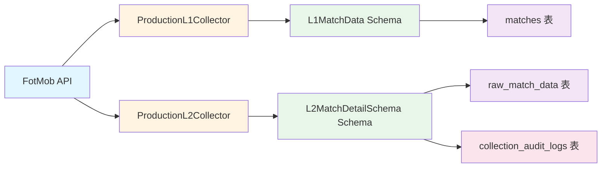
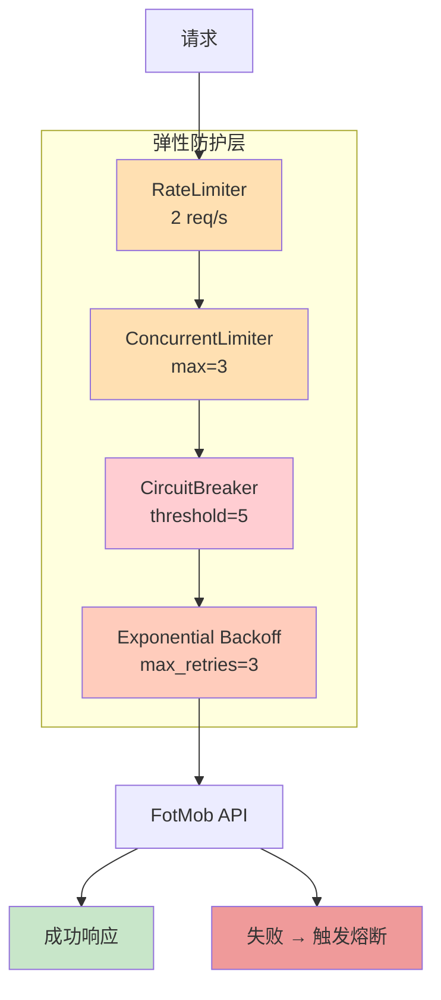

# FootballPrediction - 数据采集系统

> **V37.1 Production-Grade** | 工业级 L1/L2 数据采集引擎
>
> 支持全量采集 10,000+ 场比赛，具备断点续传、弹性重试、数据质量分级等生产级特性

---

## 📋 目录

- [架构概览](#架构概览)
- [快速启动](#快速启动)
- [依赖矩阵](#依赖矩阵)
- [采集流程](#采集流程)
- [数据质量](#数据质量)
- [故障处理](#故障处理)
- [API 参考](#api-参考)

---

## 架构概览

```
┌─────────────────────────────────────────────────────────────────────────────┐
│                         V37.1 数据采集架构                                  │
└─────────────────────────────────────────────────────────────────────────────┘

┌──────────────┐     ┌──────────────┐     ┌──────────────┐     ┌──────────────┐
│   FotMob     │────▶│   Pydantic   │────▶│  PostgreSQL  │────▶│  Audit Logs  │
│     API      │     │   Schema     │     │   Database   │     │              │
└──────────────┘     └──────────────┘     └──────────────┘     └──────────────┘
      │                     │                     │                     │
      │                     │                     │                     │
      ▼                     ▼                     ▼                     ▼
 ┌──────────────────────────────────────────────────────────────────────┐
 │                           数据流                                       │
 └──────────────────────────────────────────────────────────────────────┘

 ┌──────────────────────────────────────────────────────────────────────┐
 │  L1: 比赛索引采集                   L2: 比赛详情采集                      │
 │  - league_id, season             - 统计数据 (xG, shots, possession)     │
 │  - match_id, teams               - 阵容信息                           │
 │  - status, scores                - 球队颜色                           │
 │  - match_time                    - 射门图数据                          │
 └──────────────────────────────────────────────────────────────────────┘
```

### 数据流详解



### 弹性机制



---

## 快速启动

### 前置要求

| 组件 | 版本要求 | 说明 |
|------|---------|------|
| **Python** | 3.11+ | 硬性要求 |
| **PostgreSQL** | 15+ | 推荐版本 |
| **Docker** | 20.10+ | 可选 |

### 本地开发环境

```bash
# 1. 创建虚拟环境
python3.11 -m venv venv
source venv/bin/activate  # Linux/mac
# 或
venv\Scripts\activate  # Windows

# 2. 安装依赖
pip install -r requirements.txt

# 3. 配置环境变量
cp .env.example .env
# 编辑 .env 文件，设置数据库连接信息

# 4. 启动数据库（Docker）
docker-compose up -d db redis

# 5. 运行预检
python scripts/pre_harvest_final_check.py
```

### 生产命令

```bash
# ===== L1/L2 全量采集 =====

# 采集所有赛季（5 大联赛 × 5 赛季 = 10,000+ 场）
python scripts/collectors/full_l1_l2_harvest.py --verbose

# 采集单个赛季
python scripts/collectors/full_l1_l2_harvest.py --season 23/24 --verbose

# 限制 L2 采集数量（测试用）
python scripts/collectors/full_l1_l2_harvest.py --l2-limit 100 --verbose

# ===== 监控与诊断 =====

# 检查采集进度
python scripts/collectors/check_collection_health.py

# 查看 L2 数据质量分布
docker exec football_prediction_db psql -U football_user -d football_prediction_dev -c "
    SELECT
        (raw_data->>'data_quality') as quality,
        COUNT(*) as count
    FROM raw_match_data
    GROUP BY quality;
"

# 查看审计日志
docker exec football_prediction_db psql -U football_user -d football_prediction_dev -c "
    SELECT * FROM collection_audit_logs
    ORDER BY batch_timestamp DESC
    LIMIT 10;
"
```

---

## 依赖矩阵

### 硬性依赖

| 包 | 版本 | 用途 |
|----|------|------|
| `Python` | **3.11+** | 核心运行环境 |
| `asyncpg` | 0.29+ | 异步 PostgreSQL 连接 |
| `aiohttp` | 3.9+ | 异步 HTTP 客户端 |
| `pydantic` | 2.0+ | 数据校验 |
| `python-dotenv` | 1.0+ | 环境变量管理 |

### Docker 镜像

```bash
# 基础镜像
FROM python:3.11-slim

# 最终镜像大小
# 约 370MB (包含所有依赖)
```

---

## 采集流程

### L1: 比赛索引采集

```python
from src.api.collectors.production_l1_collector import ProductionL1Collector

async with ProductionL1Collector(max_concurrent=5, max_requests_per_second=2) as collector:
    matches = await collector.collect_league_season(
        league_id=47,              # Premier League
        season_code="2023/2024",  # API 格式
        season_name="23/24"       # 显示格式
    )
```

**输出**：`L1MatchData` 对象列表

### L2: 比赛详情采集

```python
from src.api.collectors.production_l2_collector import ProductionL2Collector

async with ProductionL2Collector(db_pool, max_concurrent=3) as collector:
    summary = await collector.collect_batch(
        match_ids=["4813374", "4813375", ...],
        batch_size=50  # 每 50 场批量 Upsert
    )
```

**输出**：`L2CollectionSummary` 对象

### 完整流程

```bash
# 1. L1 采集（获取比赛列表）
python scripts/collectors/full_l1_l2_harvest.py --season 23/24

# 输出:
# ✅ L1 采集完成: 1754 场比赛
# ✅ L1 保存完成: 1754/1754 场

# 2. L2 采集（获取比赛详情）
# 自动过滤已存在的比赛，只采集新数据

# 输出:
# 📊 开始批量采集 L2 数据: 50 场比赛
# ⏳ 进度: 100% (50/50) | 批量保存: 50 场
# ✅ L2 批量采集完成

# 3. 数据质量报告
╔════════════════════════════════════════════════════════════╗
║           L2 采集摘要报告 (V37.0 Production-Grade)        ║
╚════════════════════════════════════════════════════════════╝
📊 采集统计:
   尝试: 50 场
   成功: 50 场
   失败: 0 场
   成功率: 100.00%
```

---

## 数据质量

### 质量分级 (L2MatchDetailSchema)

| 等级 | 条件 | 占比 | 说明 |
|------|------|------|------|
| **FULL** | xG 存在且完整 | ~90% | 可直接用于训练 |
| **PARTIAL** | xG 缺失但其他特征存在 | ~8% | 可降级使用 |
| **WARNING** | stats 完全缺失 | ~2% | 仅保留原始数据 |

### 质量计算公式

```python
purity_score = (quality_full * 100 + quality_partial * 50) / total_success

# 示例:
# 45 场 FULL + 4 场 PARTIAL + 1 场 WARNING
# = (45 * 100 + 4 * 50) / 50 = 94.0 分
```

---

## 故障处理

### 断点续传机制

**核心函数**: `_filter_new_matches()`

```python
async def _filter_new_matches(self, match_ids: list[str]) -> list[str]:
    """
    过滤出需要采集 L2 的新比赛

    幂等性保证:
    - 已存在的 match_id 会被自动过滤
    - 中断后重新运行，只会采集新数据
    """
    async with self.db_pool.acquire() as conn:
        query = """
            SELECT DISTINCT match_id
            FROM raw_match_data
            WHERE match_id = ANY($1)
        """
        existing = await conn.fetch(query, match_ids)
        existing_ids = set(row["match_id"] for row in existing)
        return [mid for mid in match_ids if mid not in existing_ids]
```

**恢复流程**：

1. 采集中断（如网络故障）
2. 重新运行 `full_l1_l2_harvest.py`
3. 系统自动查询 `raw_match_data` 表
4. 只采集新比赛，跳过已存在数据

### 熔断器恢复

```python
# 熔断器触发条件
circuit_breaker = CircuitBreaker(
    failure_threshold=5,    # 5 次失败后触发
    recovery_timeout=60.0   # 60 秒后尝试恢复
)

# 恢复策略
if circuit_breaker.is_open():
    # 等待 60 秒
    await asyncio.sleep(60)
    # 进入半开状态，允许一次测试请求
    # 成功则恢复，失败则继续等待
```

### 磁盘空间估算

| 数据量 | L1 数据 | L2 数据 | 总计 |
|--------|---------|---------|------|
| 1,000 场 | ~2 MB | ~50 MB | ~52 MB |
| 10,000 场 | ~20 MB | ~500 MB | ~520 MB |

**建议**: 预留至少 **1 GB** 可用磁盘空间

---

## API 参考

### 核心类

#### ProductionL1Collector

```python
class ProductionL1Collector:
    """V36.0 生产级 L1 采集器"""

    async def collect_league_season(
        self,
        league_id: int,           # 联赛 ID (47=PL, 87=LL, 54=BL, 53=L1, 55=SA)
        season_code: str,         # "2023/2024" (API 格式)
        season_name: str,         # "23/24" (显示格式)
    ) -> list[L1MatchData]:
        """采集指定联赛-赛季的所有比赛"""
```

#### ProductionL2Collector

```python
class ProductionL2Collector:
    """V37.0 工业级 L2 详情采集器"""

    async def collect_batch(
        self,
        match_ids: list[str],     # 纯数字 match_id 列表
        batch_size: int = 50,     # 批量 Upsert 大小
        progress_callback=None,   # 进度回调
    ) -> L2CollectionSummary:
        """批量采集 L2 数据"""
```

### Schema 类

#### L1MatchData

```python
class L1MatchData(BaseModel):
    match_id: str
    league_id: str  # 47, 87, 54, 53, 55
    league_name: str
    season_name: str  # "23/24"
    home_team: str
    away_team: str
    status: MatchStatus  # SCHEDULED, LIVE, FINISHED
    match_time_utc: str
    home_score: int | None
    away_score: int | None
```

#### L2MatchDetailSchema

```python
class L2MatchDetailSchema(BaseModel):
    match_id: str
    data_quality: L2DataQuality  # FULL, PARTIAL, WARNING
    stats: L2MatchStats | None
    team_colors: dict[str, Any] | None
    has_lineup: bool
    has_shotmap: bool
    raw_data: dict[str, Any] | None
```

---

## 监控与运维

### 实时监控

```bash
# 查看采集进度
watch -n 5 'docker exec football_prediction_db psql -U football_user -d football_prediction_dev -c "
SELECT COUNT(*) as total_matches FROM matches;
SELECT COUNT(*) as total_l2, (raw_data->>\"\"data_quality\"\") as quality FROM raw_match_data GROUP BY quality;
"'

# 查看最新审计日志
watch -n 10 'docker exec football_prediction_db psql -U football_user -d football_prediction_dev -c "
SELECT batch_id, total_success, purity_score
FROM collection_audit_logs
ORDER BY batch_timestamp DESC
LIMIT 5;
"'
```

### 健康检查

```bash
# 预检脚本
python scripts/pre_harvest_final_check.py

# 输出:
# ✅ 数据库连接
# ✅ raw_match_data 表
# ✅ collection_audit_logs 表
# ✅ Pydantic 模型兼容性
# ✅ 磁盘剩余空间 (879.9 GB)
# ✅ 环境变量配置
# ✅ 项目结构完整性
# ✅ L2 采集器配置
#
# 🎉 通过率: 100.0% - 可以启动全量采集
```

---

## 常见问题

### Q: 采集速度很慢怎么办？

**A**: 检查以下配置：

```python
# ProductionL2Collector 默认配置
max_concurrent=3              # 并发数（可增加到 5）
max_requests_per_second=2    # 速率限制（不要超过 3）
timeout=30                    # 超时时间
```

### Q: 如何判断采集是否完成？

**A**: 查看审计日志：

```bash
docker exec football_prediction_db psql -U football_user -d football_prediction_dev -c "
SELECT
    batch_id,
    total_attempted,
    total_success,
    purity_score
FROM collection_audit_logs
ORDER BY batch_timestamp DESC
LIMIT 1;
"
```

### Q: 采集中断后如何恢复？

**A**: 直接重新运行命令，系统会自动跳过已采集数据：

```bash
python scripts/collectors/full_l1_l2_harvest.py --verbose
```

---

## 版本历史

| 版本 | 日期 | 主要变更 |
|------|------|---------|
| V37.1 | 2025-12-29 | 工业级大扫除 + 审计表 + 预检脚本 |
| V37.0 | 2025-12-29 | L2 采集器 + 数据质量分级 + 批量 Upsert |
| V36.2 | 2025-12-28 | 五赛季采集支持 |
| V36.0 | 2025-12-28 | L1 采集器 + Pydantic 校验 |

---

## 联系方式

- **技术问题**: 查看 `CLAUDE.md` 或运行 `python scripts/pre_harvest_final_check.py`
- **故障排查**: 查看 `logs/` 目录下的日志文件
- **数据问题**: 查询 `collection_audit_logs` 表

---

**最后更新**: 2025-12-29 | **维护者**: ML Architect
