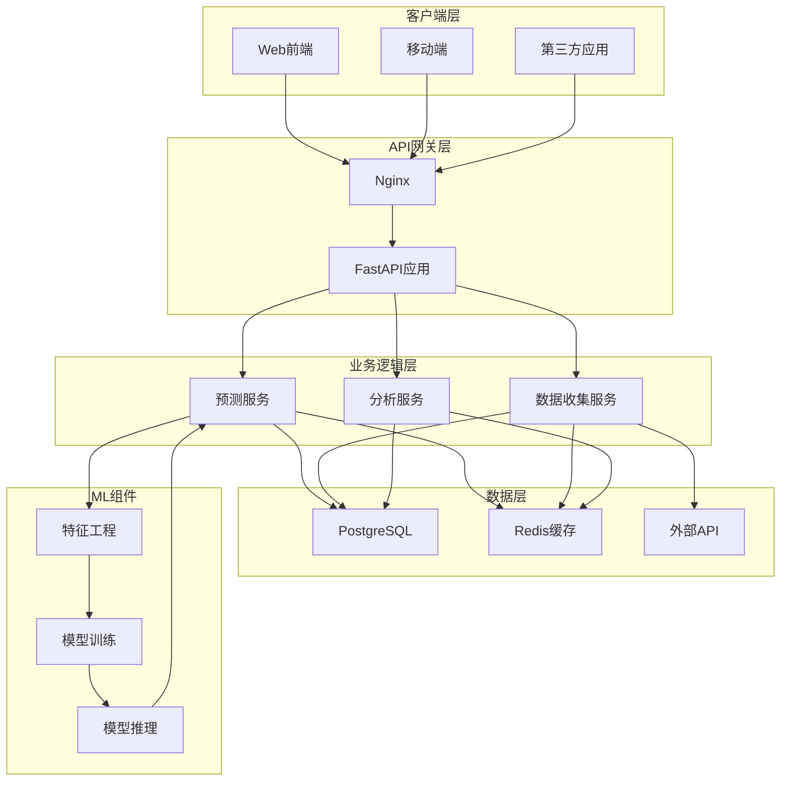
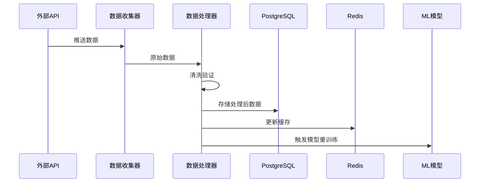
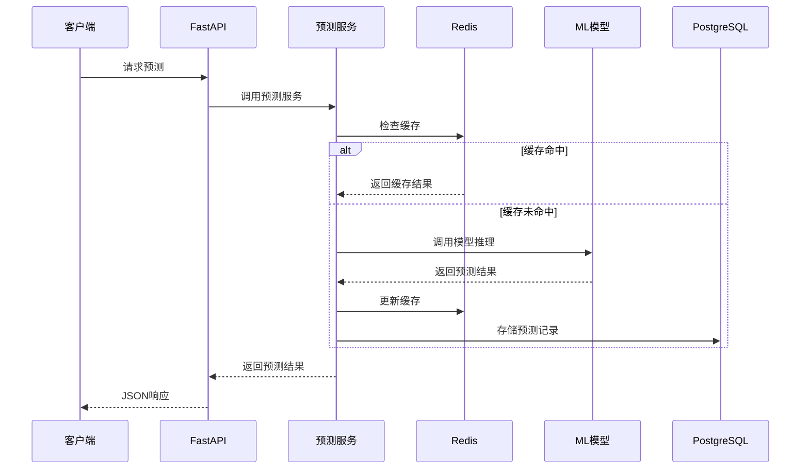
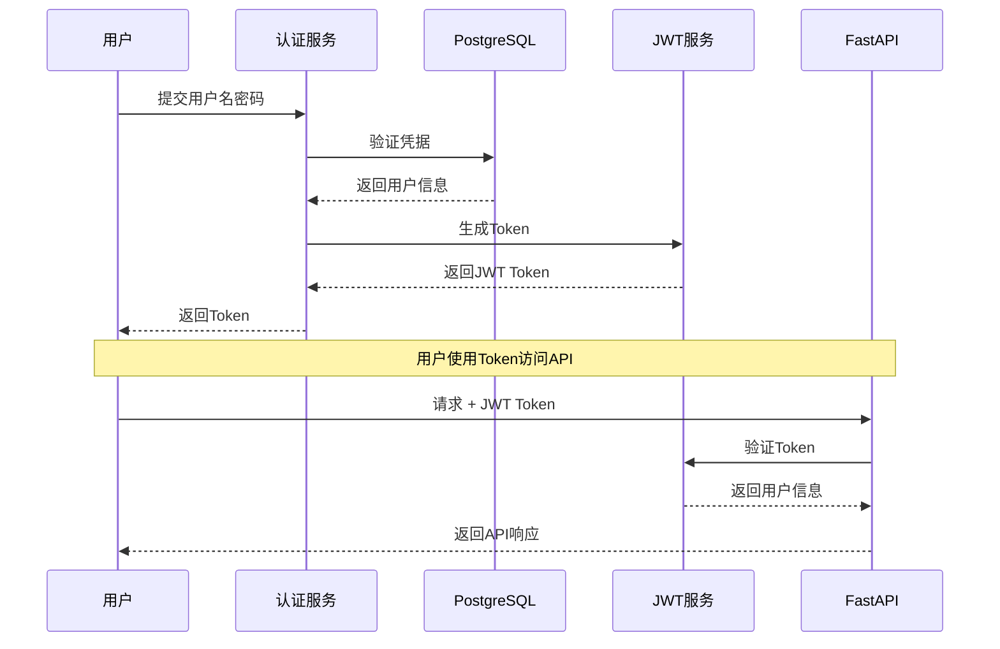
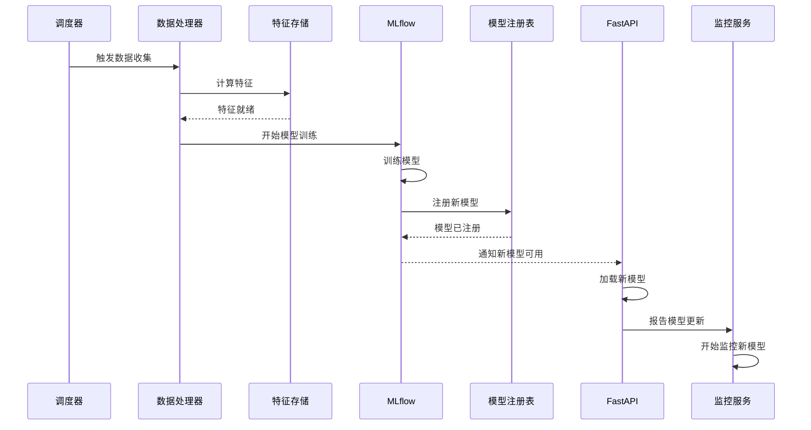
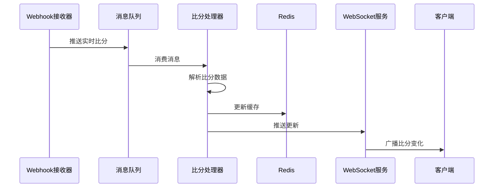

# 🏗️ 系统架构文档

## 概述

FootballPrediction 是一个基于现代 Python 技术栈的足球预测系统，采用微服务架构和领域驱动设计（DDD）原则。

## 技术栈

### 核心框架
- **FastAPI** - 现代、快速的 Web 框架，支持异步操作
- **SQLAlchemy 2.0** - 异步 ORM，支持多种数据库
- **Pydantic** - 数据验证和序列化
- **Alembic** - 数据库迁移工具

### 数据存储
- **PostgreSQL** - 主数据库
- **Redis** - 缓存和会话存储
- **MLflow** - 机器学习模型管理

### 基础设施
- **Docker & Docker Compose** - 容器化部署
- **Nginx** - 反向代理和负载均衡
- **GitHub Actions** - CI/CD 流水线

## 系统架构图



## 目录结构

```
FootballPrediction/
├── src/                          # 源代码目录
│   ├── api/                      # API 层
│   │   ├── endpoints/           # API 端点实现
│   │   ├── schemas/             # Pydantic 数据模型
│   │   └── middleware/          # 中间件
│   ├── core/                     # 核心配置
│   │   ├── config.py            # 应用配置
│   │   ├── exceptions.py        # 自定义异常
│   │   └── logging.py           # 日志配置
│   ├── database/                 # 数据库层
│   │   ├── models/              # SQLAlchemy 模型
│   │   ├── migrations/          # 数据库迁移
│   │   └── connection.py        # 数据库连接
│   ├── services/                 # 业务逻辑层
│   │   ├── prediction/          # 预测服务
│   │   ├── data/                # 数据处理
│   │   └── audit/               # 审计服务
│   ├── models/                   # ML 模型
│   │   ├── training/            # 模型训练
│   │   ├── inference/           # 模型推理
│   │   └── evaluation/          # 模型评估
│   ├── collectors/               # 数据收集器
│   │   ├── fixtures.py          # 赛程数据
│   │   ├── odds.py              # 赔率数据
│   │   └── scores.py            # 比分数据
│   ├── cache/                    # 缓存层
│   │   ├── redis_manager.py     # Redis 管理器
│   │   └── ttl_cache.py         # TTL 缓存
│   ├── streaming/                # 流处理
│   │   ├── kafka/               # Kafka 组件
│   │   └── processors/          # 数据处理器
│   └── utils/                    # 工具模块
│       ├── validators.py        # 数据验证
│       ├── retry.py             # 重试机制
│       └── logger.py            # 日志工具
├── tests/                        # 测试目录
│   ├── unit/                    # 单元测试
│   ├── integration/             # 集成测试
│   └── e2e/                     # 端到端测试
├── scripts/                      # 脚本工具
│   ├── deployment/              # 部署脚本
│   ├── maintenance/             # 维护脚本
│   └── security/                # 安全工具
├── docs/                         # 文档
├── docker/                       # Docker 配置
├── .github/                      # GitHub 配置
│   └── workflows/               # CI/CD 工作流
└── requirements/                 # 依赖管理
```

## 核心组件

### 1. API 层

负责处理 HTTP 请求和响应，遵循 RESTful 设计原则。

- **健康检查** (`/health`) - 系统健康状态
- **预测 API** (`/predictions`) - 预测服务接口
- **数据 API** (`/data`) - 数据查询接口
- **管理 API** (`/admin`) - 管理功能接口

### 2. 服务层

实现核心业务逻辑，采用依赖注入和接口隔离原则。

#### 预测服务
- 实时预测生成
- 历史预测查询
- 批量预测处理
- 模型版本管理

#### 数据收集服务
- 外部 API 数据获取
- 数据清洗和验证
- 实时数据流处理
- 数据存储优化

### 3. 数据层

使用 Repository 模式抽象数据访问，支持多种数据源。

#### 主数据库 (PostgreSQL)
- 比赛信息
- 预测结果
- 用户数据
- 审计日志

#### 缓存层 (Redis)
- 预测结果缓存
- 会话存储
- 实时比分缓存
- 分布式锁

### 4. ML 组件

端到端的机器学习流水线。

#### 特征工程
- 历史数据处理
- 特征提取和转换
- 特征存储 (FeastAPI/Feast)

#### 模型管理
- 模型训练 (MLflow)
- 模型版本控制
- A/B 测试框架
- 模型监控

## 数据流

### 1. 数据收集流程



### 2. 预测流程



### 3. 用户认证流程



### 4. 模型训练和部署流程



### 5. 实时比分更新流程



## 性能基准

### API 性能指标

| 端点 | 平均响应时间 | P95 响应时间 | P99 响应时间 | QPS |
|------|-------------|--------------|--------------|-----|
| `/health` | 15ms | 25ms | 45ms | 5000 |
| `/predictions/match/{id}` | 125ms | 200ms | 350ms | 1000 |
| `/predictions/batch` | 450ms | 800ms | 1200ms | 100 |
| `/features/match/{id}` | 85ms | 150ms | 250ms | 2000 |
| `/models/info` | 35ms | 60ms | 100ms | 3000 |

### 系统资源使用

| 指标 | 平均值 | 峰值 | 限制 |
|------|--------|------|------|
| CPU 使用率 | 35% | 75% | 80% |
| 内存使用 | 2.5GB | 4.5GB | 8GB |
| 数据库连接 | 15 | 45 | 100 |
| Redis 内存 | 512MB | 1.2GB | 2GB |

### 模型性能

| 模型版本 | 准确率 | 精确率 | 召回率 | F1分数 | AUC-ROC |
|----------|--------|--------|--------|---------|---------|
| v1.0.0 | 0.62 | 0.60 | 0.58 | 0.59 | 0.65 |
| v2.0.0 | 0.66 | 0.64 | 0.62 | 0.63 | 0.69 |
| v2.1.0 | 0.68 | 0.66 | 0.64 | 0.65 | 0.72 |

## 扩展性设计

### 水平扩展策略

1. **无状态服务设计**
   - API 服务完全无状态
   - 支持多实例部署
   - 使用负载均衡器分发请求

2. **数据库扩展**
   ```yaml
   # 读写分离配置
   database:
     read:
       hosts: [read-replica-1, read-replica-2]
       max_connections: 50
     write:
       host: primary-db
       max_connections: 20
   ```

3. **缓存策略**
   - Redis 集群部署
   - 数据分片存储
   - 读写分离

### 容量规划

| 用户规模 | API实例 | 数据库 | Redis | 预测请求/天 |
|----------|---------|--------|-------|-------------|
| 1,000 | 2 | 1主1从 | 1节点 | 10,000 |
| 10,000 | 5 | 1主2从 | 3节点集群 | 100,000 |
| 100,000 | 20 | 1主5从 | 6节点集群 | 1,000,000 |

## 灾备策略

### 数据备份

1. **数据库备份**
   - 每日全量备份
   - 每小时增量备份
   - 跨地域存储备份

2. **Redis 备份**
   - 每6小时 RDB 快照
   - AOF 持久化
   - 主从同步

### 故障恢复

1. **RTO（恢复时间目标）**：15分钟
2. **RPO（恢复点目标）**：5分钟
3. **可用性目标**：99.9%

### 监控告警

| 指标 | 警告阈值 | 严重阈值 |
|------|----------|----------|
| API 响应时间 | >500ms | >1000ms |
| 错误率 | >5% | >10% |
| CPU 使用率 | >70% | >85% |
| 内存使用率 | >80% | >90% |
| 数据库连接 | >80 | >95 |

## 安全架构

### 1. 认证与授权
- JWT Token 认证
- RBAC 权限控制
- API 密钥管理
- OAuth2 集成

### 2. 数据安全
- 敏感数据加密存储
- 传输层 TLS 加密
- SQL 注入防护
- XSS 防护

### 3. 基础设施安全
- Docker 安全配置
- 网络隔离
- 密钥管理
- 安全扫描

## 性能优化

### 1. 缓存策略
- 多级缓存架构
- 缓存预热
- 缓存穿透防护
- 缓存雪崩防护

### 2. 数据库优化
- 索引优化
- 查询优化
- 连接池管理
- 读写分离

### 3. 异步处理
- 异步 API 设计
- 后台任务队列
- 批处理优化
- 流式处理

## 监控与可观测性

### 1. 日志系统
- 结构化日志
- 日志聚合
- 错误追踪
- 审计日志

### 2. 指标监控
- Prometheus 指标
- 业务指标
- 性能指标
- 告警规则

### 3. 链路追踪
- 分布式追踪
- 请求链路
- 性能瓶颈分析

## 部署架构

### 1. 容器化部署
- Docker 镜像
- 多阶段构建
- 镜像优化
- 安全扫描

### 2. 编排管理
- Docker Compose
- Kubernetes（可选）
- 服务发现
- 负载均衡

### 3. CI/CD 流程
- 自动化测试
- 代码质量检查
- 安全扫描
- 自动部署

## 扩展性设计

### 1. 水平扩展
- 无状态服务设计
- 数据库分片
- 缓存集群
- 微服务拆分

### 2. 功能扩展
- 插件化架构
- 配置驱动
- 热更新
- 灰度发布

## 最佳实践

1. **代码质量**
   - 类型注解
   - 文档字符串
   - 单一职责原则
   - 依赖注入

2. **测试策略**
   - 测试金字塔
   - 测试隔离
   - Mock 使用
   - 覆盖率要求

3. **错误处理**
   - 统一异常处理
   - 错误码规范
   - 重试机制
   - 熔断器模式

4. **性能考虑**
   - 异步优先
   - 批量处理
   - 资源池化
   - 预加载优化