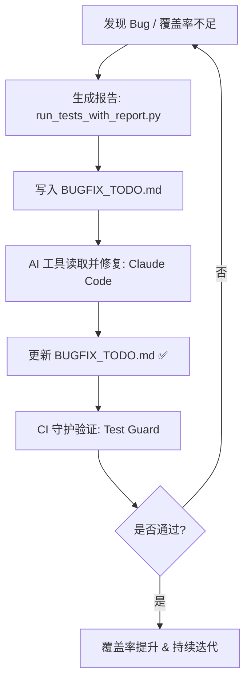

# Bug 自动修复闭环流程图

本文档描述了项目内置的自动化 Bug 修复闭环机制。机制包含 **发现问题 → 生成报告 → 修复问题 → 验证问题 → 持续迭代**。目标是通过自动化和 AI 协作，不断提升测试覆盖率和系统稳定性。

```mermaid
flowchart TD
    A[发现 Bug / 覆盖率不足] --> B[生成报告: run_tests_with_report.py]
    B --> C[写入 BUGFIX_TODO.md]
    C --> D[AI 工具读取并修复: Claude Code]
    D --> E[更新 BUGFIX_TODO.md ✅]
    E --> F[CI 守护验证: Test Guard]
    F --> G{是否通过?}
    G -- 否 --> A
    G -- 是 --> H[覆盖率提升 & 持续迭代]
```

> 该闭环机制确保了项目在测试与修复的持续循环中不断演进，最终实现高覆盖率与高可靠性的目标。