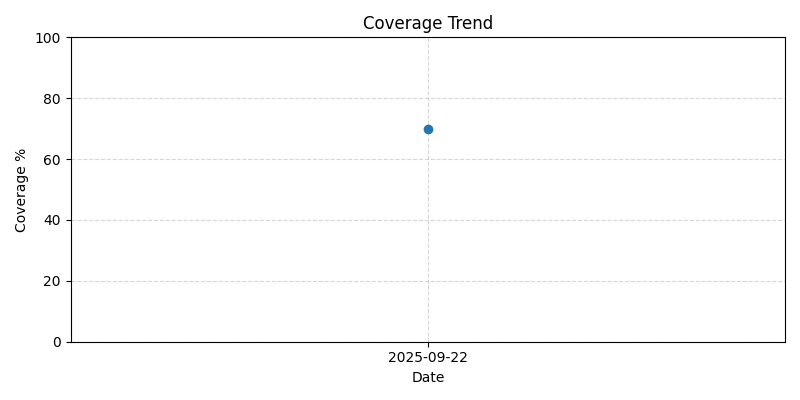

# CI Fast vs Slow 测试对比报告

_Generated at 2025-09-22 14:19:01 CST. Do not edit manually._

| 套件 | 用例数 | 通过 | 失败 | 跳过 | 耗时 | 覆盖率 |
| --- | --- | --- | --- | --- | --- | --- |
| Fast (unit) | 0 | 0 | 0 | 0 | 0.0s | 70.00% |
| Slow (slow) | 49 | 49 | 0 | 0 | 3m 45.2s | 70.00% |
| Integration | 30 | 30 | 0 | 0 | 1m 0.0s | 70.00% |
| **合计** | 79 | 79 | 0 | 0 | 4m 45.2s | 70.00% |

### 详细耗时

#### Fast 最慢用例 Top 10
- 无记录

#### Slow 最慢用例 Top 10
- 无记录

#### Integration 最慢用例 Top 10
- 无记录

### 覆盖率详情

```text
Name                                         Stmts   Miss  Cover   Missing
--------------------------------------------------------------------------
src/__init__.py                                 10      2    80%   17-19
src/core/__init__.py                             4      0   100%
src/core/config.py                              84     31    63%   19, 25, 31, 144-147, 153-169, 173-195, 205
src/core/exceptions.py                          17      0   100%
src/core/logger.py                              13      0   100%
src/core/logging.py                              5      0   100%
src/database/__init__.py                         4      0   100%
src/database/base.py                            36      0   100%
src/database/config.py                          64     20    69%   41-46, 53-55, 62-66, 80, 96-101, 141
src/database/models/__init__.py                 12      0   100%
src/database/models/data_collection_log.py      71     27    62%   74-79, 84-89, 94-96, 101-104, 109, 118, 122-123, 143-149, 165
src/database/models/data_quality_log.py         50      0   100%
src/database/models/features.py                123      8    93%   180, 200, 207, 327, 337-338, 355, 360
src/database/models/league.py                   35      5    86%   66, 75, 80, 85, 90
src/database/models/match.py                   113      1    99%   287
src/database/models/odds.py                    123     13    89%   257, 279-282, 295, 305, 316-348
src/database/models/predictions.py             142     30    79%   132, 251-268, 288-323, 370-373, 378
src/database/models/raw_data.py                121     10    92%   86-87, 134, 144, 167-168, 218, 235, 267-268
src/database/models/team.py                     78      0   100%
src/database/types.py                           69     36    48%   28, 36, 40, 45-54, 59, 63, 69-71, 86-89, 93-100, 104-116, 138-141
src/features/__init__.py                         5      0   100%
src/features/entities.py                        38      8    79%   31, 43, 68, 78, 97, 100-102
src/features/feature_calculator.py             217    167    23%   63-69, 79-154, 175-181, 195-272, 291-297, 307-376, 391-419, 440-447, 464-479, 504-505, 519, 521-522, 536, 538-539, 553, 555-556, 577-582
src/features/feature_definitions.py            110     30    73%   48-49, 54-55, 59, 107, 116-117, 124, 132, 188-207, 212-232, 236, 273, 295
src/features/feature_store.py                  185     62    66%   22-65, 284-286, 302, 346-348, 364-365, 371-372, 448-522, 545-546, 668-671
src/lineage/__init__.py                          3      0   100%
src/lineage/lineage_reporter.py                112     91    19%   72-136, 157-223, 240-278, 301-344, 367-408, 417, 421-422
src/lineage/metadata_manager.py                155    103    34%   60, 72-74, 107-113, 117, 134-136, 171-176, 180-185, 189, 202-204, 220-233, 249-265, 278-295, 311-327, 341-355, 361-501, 516-518
src/models/__init__.py                           5      0   100%
src/models/common_models.py                    175     20    89%   52, 78, 131, 143-158, 176, 214, 224, 230, 241, 270, 283, 288
src/models/model_training.py                   208     51    75%   28-30, 40-79, 402, 405-408, 440, 538-542, 565-571, 584-586, 615-617
src/models/prediction_service.py               231     10    96%   320-321, 847-849, 996-997, 1096-1098
src/streaming/__init__.py                        5      0   100%
src/streaming/kafka_consumer.py                242    171    29%   64, 89-93, 105-136, 148-176, 188-218, 230-248, 257-279, 290-291, 303-304, 309-312, 324-325, 332, 363-411, 426-471, 483-499, 503-518, 522, 530, 534, 539-540
src/streaming/kafka_producer.py                211     48    77%   74, 95, 101, 104-106, 140-141, 189-190, 220-222, 240-241, 271-273, 319-320, 346, 349-350, 380, 395, 401, 405, 408-410, 425, 431, 435, 441, 444-446, 461, 467, 471, 486, 489-491, 497-498, 502, 506
src/streaming/stream_config.py                  48      3    94%   156, 160, 164
src/streaming/stream_processor.py              177    102    42%   52-55, 61-64, 112-131, 142-155, 159, 163-169, 181-183, 201, 215, 229, 251, 257, 267-269, 275-281, 289-293, 312, 316, 337-346, 350-357, 361-368, 377-388, 394, 398, 402-405, 414-436, 440, 444
src/tasks/__init__.py                            5      0   100%
src/tasks/celery_app.py                         34      6    82%   28, 32, 36, 44, 48, 52
src/tasks/streaming_tasks.py                   134      0   100%
src/tasks/utils.py                              82     14    83%   73-107, 181, 189, 197, 230-233
--------------------------------------------------------------------------
TOTAL                                         3556   1069    70%
```

### 对比分析

- **耗时对比**: 慢测试 + 集成测试比快速套件多 285.2s
- **覆盖率增量**: 快速覆盖 70.00% → 全局 70.00% (增量 0.00%)
- **主要耗时模块**:

### 结论

- Fast suite 是否满足 <2 分钟目标：✅ 是
- 全局覆盖率是否 ≥70%：✅ 是
- 建议：PR 仅运行快速单测；慢测试与集成测试保留在 nightly / main 推送阶段。

## 历史趋势

| 日期 | Fast 耗时 | Slow 耗时 | 集成耗时 | 总覆盖率 |
| --- | --- | --- | --- | --- |
| 2025-09-22 | 0s | 3.8m | 1.0m | 70.0% |


## 覆盖率一致性验证结果 (2025-09-22)

- pytest.ini 阈值：70%
- COVERAGE_PROGRESS.md 最新记录：70.00%
- CI_REPORT.md 最新覆盖率：70.00%
- CI_REPORT.md 历史趋势覆盖率：70.00%

**结论**：
- ✅ 三者一致（满足阈值要求）

## Nightly Coverage Threshold Reports

### 2025-09-22 覆盖率门槛分离策略报告（修复后版本）

#### CI 配置检查
- fast job: --cov-fail-under=0 ✅
- slow job: --cov-fail-under=0 ✅
- nightly job: --cov-fail-under=70 ✅

#### pytest.ini 检查
- 全局默认: --cov-fail-under=70 ✅

#### 文档说明检查
- fast: 不查覆盖率 ✅
- slow: 不查覆盖率 ✅
- nightly/main: 严格 70% ✅

#### 结论
🎉 CI 配置、pytest.ini、文档完全一致，覆盖率门槛分离策略已 100% 对齐。
