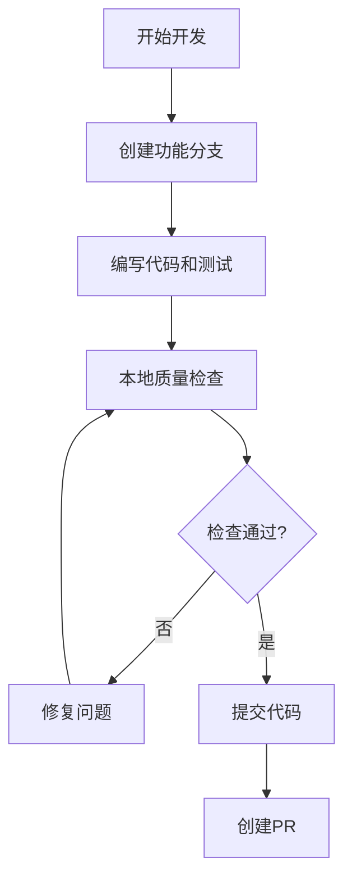
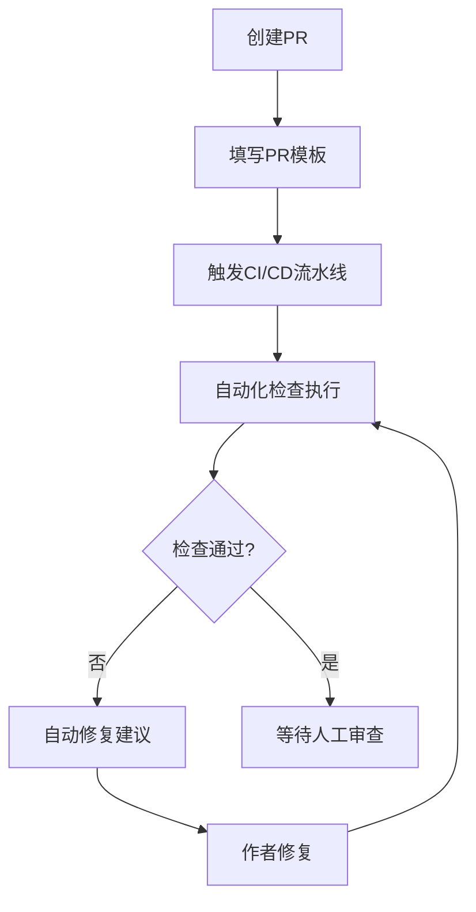
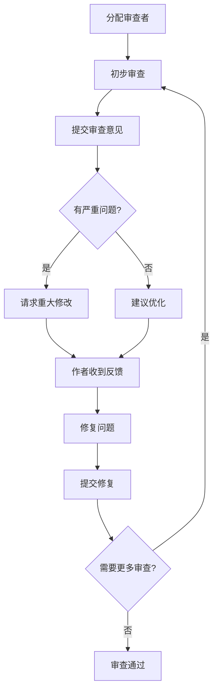
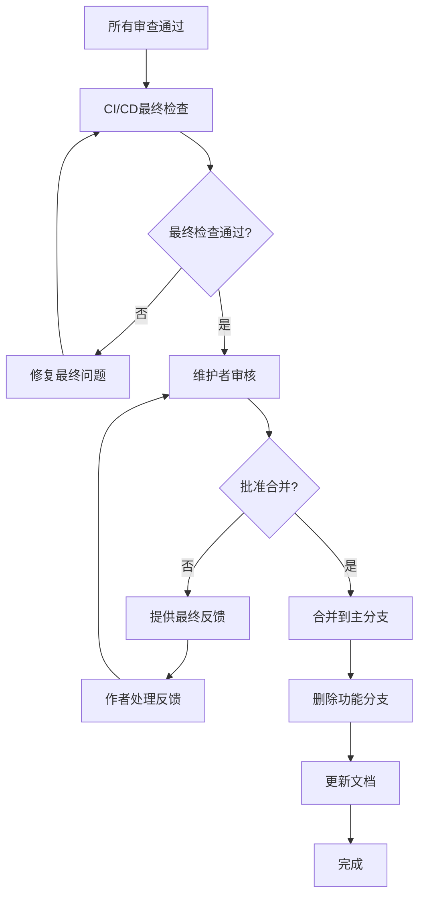
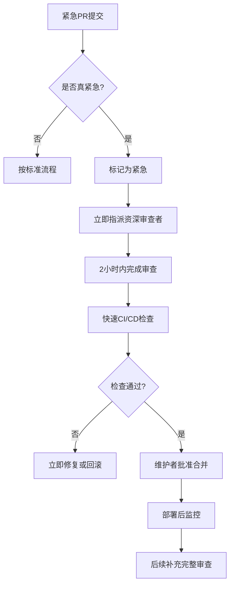

# 🔄 代码审查工作流程

## 📋 概述
本文档定义了足球预测系统的代码审查工作流程，确保所有代码变更都经过严格的质量审查流程。

## 🎯 审查目标

### 主要目标
- **质量保证**: 确保代码符合项目高质量标准
- **知识分享**: 通过审查过程促进团队成员学习
- **风险控制**: 识别和降低潜在的技术风险
- **标准统一**: 维护编码规范的一致性

### 具体指标
- PR平均审查时间: < 24小时
- 代码审查覆盖率: 100% (所有PR必须经过审查)
- 问题发现率: > 70%的问题在审查阶段发现
- 修复响应时间: < 48小时

## 👥 角色和职责

### 👤 PR作者 (Author)
- **创建前**: 确保代码通过所有自动化检查
- **提交时**: 提供清晰的PR描述和变更说明
- **审查中**: 积极响应审查意见，及时修复问题
- **完成后**: 根据反馈进行代码优化

### 👀 审查者 (Reviewer)
- **及时审查**: 在24小时内完成初步审查
- **全面检查**: 按照审查清单进行全面检查
- **建设性反馈**: 提供具体、可操作的改进建议
- **跟踪跟进**: 确认问题得到妥善解决

### 👑 维护者 (Maintainer)
- **最终审核**: 确认所有审查要求都已满足
- **合并决策**: 基于质量和风险评估做出合并决定
- **流程监督**: 确保审查流程得到正确执行
- **争议解决**: 处理审查过程中的争议和问题

## 🔄 完整审查流程

### 阶段1: 开发和准备


#### 开发阶段检查清单
```bash
# 1. 代码质量检查
ruff check src/ tests/          # 代码规范检查
ruff format src/ tests/         # 代码格式化
mypy src/                       # 类型检查
bandit -r src/                  # 安全检查

# 2. 测试验证
make test.unit                  # 单元测试
make test.int                   # 集成测试
make coverage                   # 覆盖率检查

# 3. 性能评估 (如适用)
python3 scripts/performance/system_performance_optimizer.py

# 4. 智能修复工具
python3 scripts/smart_quality_fixer.py
```

### 阶段2: PR创建和自动化检查


#### PR创建要求
- **标题格式**: `[TYPE] 简短描述`
  - `[BUG]` - Bug修复
  - `[FEATURE]` - 新功能
  - `[REFACTOR]` - 代码重构
  - `[PERF]` - 性能优化
  - `[DOCS]` - 文档更新

- **描述要求**:
  - 清晰的变更原因和目标
  - 详细的实现说明
  - 测试方法和结果
  - 相关Issue链接

- **变更标签**: 自动或手动添加适当标签
  - `bug` - Bug修复
  - `enhancement` - 功能增强
  - `documentation` - 文档变更
  - `performance` - 性能相关
  - `breaking-change` - 破坏性变更

### 阶段3: 人工审查


#### 审查者优先级分配
1. **主要审查者**: 相关领域专家
2. **次要审查者**: 系统架构师或资深开发者
3. **可选审查者**: 其他相关团队成员

#### 审查重点关注领域
- **API变更**: 后端开发者 + 前端开发者
- **数据库变更**: 后端开发者 + DBA
- **安全相关变更**: 安全专家 + 后端开发者
- **性能优化变更**: 性能专家 + 相关开发者
- **架构变更**: 架构师 + 相关模块开发者

### 阶段4: 审查完成和合并


## 📊 审查标准矩阵

### 变更类型 vs 审查重点

| 变更类型 | 代码质量 | 测试覆盖 | 性能影响 | 安全检查 | 文档更新 |
|---------|---------|---------|---------|---------|---------|
| Bug修复 | 🔴 高 | 🔴 高 | 🟡 中 | 🟡 中 | 🟢 低 |
| 新功能 | 🔴 高 | 🔴 高 | 🟡 中 | 🔴 高 | 🔴 高 |
| 重构 | 🔴 高 | 🟡 中 | 🟡 中 | 🟢 低 | 🟡 中 |
| 性能优化 | 🟡 中 | 🟡 中 | 🔴 高 | 🟢 低 | 🟡 中 |
| 文档更新 | 🟢 低 | 🟢 低 | 🟢 低 | 🟢 低 | 🔴 高 |
| 配置变更 | 🟡 中 | 🟢 低 | 🟡 中 | 🟡 中 | 🔴 高 |

### 风险等级评估

#### 🔴 高风险 (必须严格审查)
- 破坏性变更
- 安全相关变更
- 数据库结构变更
- 核心业务逻辑变更
- 第三方依赖重大变更

#### 🟡 中风险 (标准审查流程)
- 新功能添加
- API接口变更
- 性能优化
- 重构现有代码
- 配置文件变更

#### 🟢 低风险 (简化审查流程)
- 文档更新
- 代码格式化
- 注释和文档字符串
- 测试用例添加
- 工具脚本优化

## 🔍 具体审查流程

### 1. 自动化审查 (0-2小时)
```yaml
# .github/workflows/code-review.yml
name: Code Review Automation

on:
  pull_request:
    types: [opened, synchronize, reopened]

jobs:
  automated-review:
    runs-on: ubuntu-latest
    steps:
      - name: 代码质量检查
        run: |
          ruff check src/ tests/
          ruff format --check src/ tests/

      - name: 类型检查
        run: mypy src/

      - name: 安全检查
        run: bandit -r src/

      - name: 测试执行
        run: make test

      - name: 覆盖率检查
        run: make coverage-check
```

### 2. 初步人工审查 (2-8小时)
```python
# 审查检查脚本 scripts/review_helper.py
import subprocess
import sys
from pathlib import Path

def run_review_checks():
    """运行审查前检查"""
    checks = {
        "代码规范": "ruff check src/ tests/",
        "格式检查": "ruff format --check src/ tests/",
        "类型检查": "mypy src/",
        "安全检查": "bandit -r src/",
        "测试运行": "make test.unit",
        "覆盖率": "make coverage"
    }

    results = {}
    for name, cmd in checks.items():
        try:
            result = subprocess.run(cmd, shell=True, capture_output=True, text=True)
            results[name] = "✅ 通过" if result.returncode == 0 else f"❌ 失败: {result.stderr[:200]}"
        except Exception as e:
            results[name] = f"⚠️ 错误: {e}"

    return results

if __name__ == "__main__":
    print("🔍 运行代码审查检查...")
    results = run_review_checks()

    for check, status in results.items():
        print(f"{check}: {status}")

    failed = any("❌" in status or "⚠️" in status for status in results.values())
    sys.exit(1 if failed else 0)
```

### 3. 详细审查 (8-24小时)

#### 审查者检查清单
```markdown
## 🔍 代码审查清单

### 📝 基础检查
- [ ] PR描述清晰完整
- [ ] 变更范围合理
- [ ] 提交信息规范
- [ ] 分支策略正确

### 🏗️ 代码质量
- [ ] 命名规范遵循
- [ ] 代码结构清晰
- [ ] 注释和文档完整
- [ ] 错误处理完善

### 🧪 测试验证
- [ ] 测试覆盖充分
- [ ] 测试用例合理
- [ ] 边界条件测试
- [ ] 集成测试验证

### 🔒 安全检查
- [ ] 输入验证完整
- [ ] 敏感数据处理
- [ ] 权限检查正确
- [ ] SQL注入防护

### ⚡ 性能影响
- [ ] 数据库查询优化
- [ ] 缓存策略合理
- [ ] 内存使用控制
- [ ] 并发处理安全

### 🔄 兼容性
- [ ] API向后兼容
- [ ] 数据库变更处理
- [ ] 配置文件更新
- [ ] 依赖版本管理
```

### 4. 审查反馈和修复

#### 反馈分类模板
```markdown
## 🔍 审查反馈

### ✅ 通过项目
- 代码结构清晰合理
- 测试覆盖充分
- 文档更新完整

### 🔧 建议修改
#### 1. 代码质量改进
**文件**: `src/services/prediction.py:45`
**问题**: 函数过长，建议拆分
**建议**: 提取数据验证逻辑到独立函数

#### 2. 性能优化
**文件**: `src/api/routes/predictions.py:78`
**问题**: N+1查询问题
**建议**: 使用joinedload预加载关联数据

### ❌ 必须修复
#### 1. 安全问题
**文件**: `src/services/user.py:23`
**问题**: SQL注入风险
**要求**: 使用参数化查询

#### 2. 测试缺失
**文件**: `src/domain/strategies/ml_strategy.py`
**问题**: 核心逻辑缺少测试覆盖
**要求**: 添加单元测试覆盖所有分支

### 📋 审查结论
- [ ] 需要重大修改
- [ ] 需要小幅修改
- [ ] 可以合并 (建议优化后)
- [ ] 直接合并
```

## 📈 审查质量监控

### 关键指标
```python
# scripts/review_metrics.py
import json
from datetime import datetime, timedelta
from collections import defaultdict

class ReviewMetrics:
    """代码审查质量指标监控"""

    def __init__(self):
        self.metrics = defaultdict(list)

    def record_pr_review(self, pr_data):
        """记录PR审查数据"""
        self.metrics['review_time'].append(pr_data['review_duration_hours'])
        self.metrics['changes_requested'].append(pr_data['changes_requested_count'])
        self.metrics['approvals'].append(pr_data['approval_count'])
        self.metrics['test_coverage'].append(pr_data['test_coverage'])

    def generate_report(self):
        """生成审查质量报告"""
        avg_review_time = sum(self.metrics['review_time']) / len(self.metrics['review_time'])
        avg_changes = sum(self.metrics['changes_requested']) / len(self.metrics['changes_requested'])

        return {
            'average_review_time_hours': avg_review_time,
            'average_changes_requested': avg_changes,
            'total_prs_reviewed': len(self.metrics['review_time']),
            'review_efficiency': self._calculate_efficiency()
        }

    def _calculate_efficiency(self):
        """计算审查效率"""
        on_time_reviews = sum(1 for t in self.metrics['review_time'] if t <= 24)
        return (on_time_reviews / len(self.metrics['review_time'])) * 100
```

### 定期报告
```bash
# 每周审查质量报告
python3 scripts/review_metrics.py --period week --format json > reports/weekly_review_quality.json

# 每月审查趋势分析
python3 scripts/review_metrics.py --period month --trend-analysis > reports/monthly_review_trends.md
```

## 🚀 持续改进

### 团队培训和分享
```markdown
## 📚 审查技能培训计划

### 新成员培训 (第1周)
- [ ] 代码审查流程培训
- [ ] 审查工具使用指导
- [ ] 项目编码规范学习
- [ ] 实践审查练习

### 进阶培训 (每月)
- [ ] 高级审查技巧分享
- [ ] 性能优化审查方法
- [ ] 安全审查最佳实践
- [ ] 架构设计审查要点

### 专题讨论 (每季度)
- [ ] 审查质量案例分析
- [ ] 工具和流程改进建议
- [ ] 跨团队审查经验分享
- [ ] 新技术审查挑战讨论
```

### 流程优化机制
```python
# scripts/review_process_optimizer.py
class ReviewProcessOptimizer:
    """审查流程优化器"""

    def analyze_bottlenecks(self):
        """分析审查瓶颈"""
        bottlenecks = {
            'slow_reviews': self._find_slow_reviews(),
            'frequent_changes': self._find_frequent_changes(),
            'quality_issues': self._find_quality_issues()
        }
        return bottlenecks

    def suggest_improvements(self, bottlenecks):
        """基于瓶颈分析提出改进建议"""
        suggestions = []

        if bottlenecks['slow_reviews']:
            suggestions.append({
                'issue': '审查时间过长',
                'suggestion': '设置审查时间提醒，优化审查者分配',
                'priority': 'high'
            })

        if bottlenecks['frequent_changes']:
            suggestions.append({
                'issue': 'PR频繁修改',
                'suggestion': '加强开发前质量检查，完善PR模板',
                'priority': 'medium'
            })

        return suggestions
```

## 📋 应急处理流程

### 紧急PR处理


### 审查争议处理
```markdown
## ⚖️ 审查争议解决流程

### 1. 技术争议
- **步骤1**: 双方审查者讨论
- **步骤2**: 邀请第三方专家意见
- **步骤3**: 架构师最终决定
- **原则**: 技术正确性优先，团队学习次之

### 2. 流程争议
- **步骤1**: 查阅流程文档
- **步骤2**: 团队lead协调
- **步骤3**: 流程优化讨论
- **原则**: 流程为质量服务，持续改进

### 3. 质量标准争议
- **步骤1**: 参考项目质量标准
- **步骤2**: 团队讨论统一标准
- **步骤3**: 更新标准文档
- **原则**: 标准统一，严格执行
```

## 📚 参考资料

### 内部文档
- [代码审查清单](../.github/CODE_REVIEW_CHECKLIST.md)
- [编码规范](CODING_STANDARDS.md)
- [贡献指南](../CONTRIBUTING.md)
- [测试指南](TESTING_GUIDE.md)

### 外部资源
- [Google Code Review Guidelines](https://google.github.io/eng-practices/review/)
- [GitHub Code Review Best Practices](https://docs.github.com/en/pull-requests/collaborating-with-pull-requests/reviewing-changes-in-pull-requests)
- [Atlassian Code Review Guide](https://www.atlassian.com/agile/software-development/code-review)

---

💡 **记住**: 代码审查不仅是为了保证质量，更是团队学习和成长的机会。保持开放、尊重和建设性的态度！