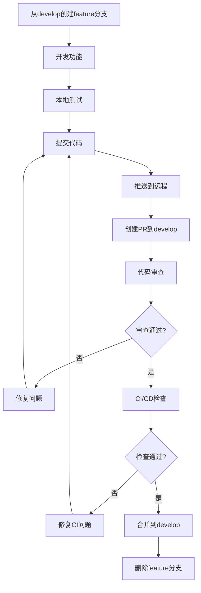
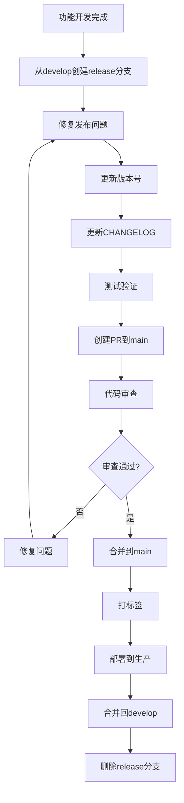
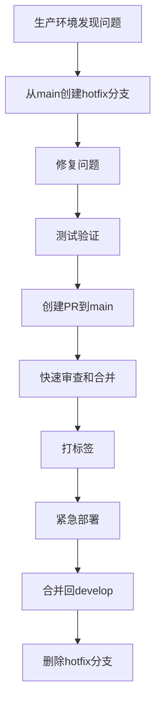

# 🌊 Git Flow 工作流程

## 📋 概述
本文档定义了足球预测系统的Git Flow工作流程，确保团队协作的规范性和代码管理的有序性。

## 🎯 Git Flow 模型

### 分支策略
我们采用改进的Git Flow模型，包含以下主要分支：

```
main (生产分支)
├── develop (开发分支)
│   ├── feature/user-authentication (功能分支)
│   ├── feature/prediction-engine (功能分支)
│   └── feature/api-endpoints (功能分支)
├── release/v1.2.0 (发布分支)
├── hotfix/critical-bug-fix (热修复分支)
└── support/v1.1.x (维护分支)
```

### 分支说明

#### 🔵 main分支
- **用途**: 生产环境代码，稳定可发布版本
- **保护规则**:
  - 禁止直接推送
  - 必须通过PR合并
  - 需要所有CI/CD检查通过
  - 至少2个代码审查批准

#### 🔵 develop分支
- **用途**: 开发集成分支，最新功能代码
- **保护规则**:
  - 禁止直接推送
  - 必须通过PR合并
  - 需要CI/CD检查通过
  - 至少1个代码审查批准

#### 🔵 feature分支
- **命名规范**: `feature/<功能名称>` 或 `feature/ISSUE-<编号>-<描述>`
- **来源**: 从develop分支创建
- **合并**: 合并回develop分支
- **生命周期**: 功能开发期间存在

#### 🔵 release分支
- **命名规范**: `release/<版本号>`
- **来源**: 从develop分支创建
- **合并**: 合并到main和develop分支
- **生命周期**: 发布准备期间存在

#### 🔵 hotfix分支
- **命名规范**: `hotfix/<问题描述>` 或 `hotfix/ISSUE-<编号>-<描述>`
- **来源**: 从main分支创建
- **合并**: 合并到main和develop分支
- **生命周期**: 紧急修复期间存在

#### 🔵 support分支
- **命名规范**: `support/<版本号>`
- **来源**: 从main分支创建
- **用途**: 维护旧版本
- **生命周期**: 维护期间存在

## 🔄 详细工作流程

### 功能开发流程


#### 步骤详解

1. **创建功能分支**
```bash
# 切换到develop分支并获取最新代码
git checkout develop
git pull origin develop

# 创建功能分支
git checkout -b feature/user-authentication
# 或使用Issue编号
git checkout -b feature/ISSUE-123-user-authentication
```

2. **开发功能**
```bash
# 进行开发工作...
# 定期提交代码
git add .
git commit -m "feat: 添加用户认证基础功能"
```

3. **保持分支更新**
```bash
# 定期同步develop分支的变更
git fetch origin
git rebase origin/develop
```

4. **推送和创建PR**
```bash
# 推送分支到远程
git push origin feature/user-authentication

# 在GitHub/GitLab上创建PR
# 目标分支: develop
# 源分支: feature/user-authentication
```

### 发布流程


#### 发布步骤

1. **创建发布分支**
```bash
# 从develop创建发布分支
git checkout develop
git pull origin develop
git checkout -b release/v1.2.0

# 更新版本号
echo "1.2.0" > VERSION
git commit -am "chore: 更新版本号到v1.2.0"
```

2. **发布准备**
```bash
# 修复发现的问题
# 更新CHANGELOG.md
git commit -am "docs: 更新CHANGELOG for v1.2.0"
```

3. **创建发布PR**
```bash
# 推送发布分支
git push origin release/v1.2.0

# 创建PR到main分支
# 同时创建PR到develop分支（用于同步修复）
```

4. **发布和打标签**
```bash
# 合并到main后
git checkout main
git pull origin main
git tag v1.2.0
git push origin v1.2.0
```

### 热修复流程


#### 热修复步骤

1. **创建热修复分支**
```bash
# 从main创建热修复分支
git checkout main
git pull origin main
git checkout -b hotfix/critical-security-fix
```

2. **修复和测试**
```bash
# 快速修复问题
git commit -am "fix: 修复关键安全漏洞"

# 本地测试
make test
```

3. **紧急发布**
```bash
# 推送并创建PR（优先级最高）
git push origin hotfix/critical-security-fix

# 快速审查和合并到main
git checkout main
git merge hotfix/critical-security-fix
git tag v1.1.1
git push origin main v1.1.1

# 合并回develop
git checkout develop
git merge hotfix/critical-security-fix
git push origin develop
```

## 📝 提交规范

### 提交消息格式
我们采用[Conventional Commits](https://www.conventionalcommits.org/)规范：

```
<类型>[可选的作用域]: <描述>

[可选的正文]

[可选的脚注]
```

#### 提交类型
- `feat`: 新功能
- `fix`: Bug修复
- `docs`: 文档更新
- `style`: 代码格式化（不影响功能）
- `refactor`: 代码重构
- `perf`: 性能优化
- `test`: 测试相关
- `chore`: 构建过程或辅助工具的变动
- `ci`: CI/CD相关
- `build`: 构建系统或依赖变更

#### 提交示例
```bash
# 新功能
git commit -m "feat(auth): 添加JWT认证功能"

# Bug修复
git commit -m "fix(api): 修复用户列表查询的分页问题"

# 文档更新
git commit -m "docs: 更新API文档和部署指南"

# 破坏性变更
git commit -m "feat!: 重构预测引擎接口，移除废弃方法"
```

### 作用域规范
常用作用域：
- `auth`: 认证授权
- `api`: API接口
- `db`: 数据库
- `ui`: 用户界面
- `perf`: 性能
- `test`: 测试
- `docs`: 文档
- `config`: 配置

## 🔧 分支保护规则

### main分支保护
```yaml
# .github/branch-protection/main.yml
required_status_checks:
  strict: true
  contexts:
    - "ci/travis-ci"
    - "code-review/bot-check"
    - "security/scan"

enforce_admins: true
required_pull_request_reviews:
  required_approving_review_count: 2
  dismiss_stale_reviews: true
  require_code_owner_reviews: true
  dismissal_restrictions:
    users: []
    teams: ["core-team"]

restrictions:
  users: []
  teams: ["core-team", "devops"]
```

### develop分支保护
```yaml
# .github/branch-protection/develop.yml
required_status_checks:
  strict: false
  contexts:
    - "ci/travis-ci"
    - "code-review/bot-check"

enforce_admins: false
required_pull_request_reviews:
  required_approving_review_count: 1
  dismiss_stale_reviews: true
  require_code_owner_reviews: false

restrictions:
  users: []
  teams: ["core-team"]
```

## 🚀 自动化工具

### Git Flow 脚本
创建 `scripts/git-flow-automation.py` 自动化脚本：

```python
#!/usr/bin/env python3
"""
Git Flow 自动化工具
简化Git Flow工作流程的常用操作
"""

import subprocess
import sys
import argparse
from typing import List, Optional

class GitFlowAutomation:
    """Git Flow自动化工具"""

    def __init__(self):
        self.git_commands = {
            'feature-start': self.start_feature,
            'feature-finish': self.finish_feature,
            'release-start': self.start_release,
            'release-finish': self.finish_release,
            'hotfix-start': self.start_hotfix,
            'hotfix-finish': self.finish_hotfix,
        }

    def run_git_command(self, command: List[str]) -> bool:
        """执行Git命令"""
        try:
            result = subprocess.run(command, check=True, capture_output=True, text=True)
            print(f"✅ {' '.join(command)}")
            if result.stdout:
                print(result.stdout)
            return True
        except subprocess.CalledProcessError as e:
            print(f"❌ {' '.join(command)}")
            print(f"错误: {e.stderr}")
            return False

    def start_feature(self, name: str) -> bool:
        """开始功能开发"""
        print(f"🚀 开始功能开发: {name}")

        commands = [
            ['git', 'checkout', 'develop'],
            ['git', 'pull', 'origin', 'develop'],
            ['git', 'checkout', '-b', f'feature/{name}']
        ]

        return all(self.run_git_command(cmd) for cmd in commands)

    def finish_feature(self, name: str) -> bool:
        """完成功能开发"""
        print(f"✅ 完成功能开发: {name}")

        # 这里应该包含PR创建等复杂逻辑
        # 简化版本只切换回develop分支
        return self.run_git_command(['git', 'checkout', 'develop'])

    def start_release(self, version: str) -> bool:
        """开始发布准备"""
        print(f"🚀 开始发布准备: {version}")

        commands = [
            ['git', 'checkout', 'develop'],
            ['git', 'pull', 'origin', 'develop'],
            ['git', 'checkout', '-b', f'release/{version}']
        ]

        return all(self.run_git_command(cmd) for cmd in commands)

    def finish_release(self, version: str) -> bool:
        """完成发布"""
        print(f"✅ 完成发布: {version}")

        # 简化版本
        return self.run_git_command(['git', 'checkout', 'main'])

    def start_hotfix(self, name: str) -> bool:
        """开始热修复"""
        print(f"🚀 开始热修复: {name}")

        commands = [
            ['git', 'checkout', 'main'],
            ['git', 'pull', 'origin', 'main'],
            ['git', 'checkout', '-b', f'hotfix/{name}']
        ]

        return all(self.run_git_command(cmd) for cmd in commands)

    def finish_hotfix(self, name: str) -> bool:
        """完成热修复"""
        print(f"✅ 完成热修复: {name}")

        return self.run_git_command(['git', 'checkout', 'main'])

def main():
    """主函数"""
    parser = argparse.ArgumentParser(description='Git Flow 自动化工具')
    parser.add_argument('command', choices=[
        'feature-start', 'feature-finish',
        'release-start', 'release-finish',
        'hotfix-start', 'hotfix-finish'
    ])
    parser.add_argument('name', help='功能/发布/修复名称')

    args = parser.parse_args()

    automation = GitFlowAutomation()

    if args.command in automation.git_commands:
        success = automation.git_commands[args.command](args.name)
        sys.exit(0 if success else 1)
    else:
        print(f"未知命令: {args.command}")
        sys.exit(1)

if __name__ == "__main__":
    main()
```

## 📋 最佳实践

### 分支管理
1. **定期清理**: 及时删除已合并的分支
2. **命名规范**: 严格遵循分支命名规范
3. **描述明确**: 分支名称要能清楚表达用途
4. **及时同步**: 定期同步上游分支变更

### 提交管理
1. **原子提交**: 每个提交只做一件事
2. **清晰描述**: 提交消息要清楚说明变更内容
3. **及时提交**: 完成一个功能点就提交
4. **审查友好**: 提交要便于代码审查

### 协作规范
1. **先拉后推**: 推送前先拉取远程变更
2. **小步快跑**: PR不要包含太多变更
3. **及时响应**: 及时处理审查意见
4. **测试先行**: 推送前确保本地测试通过

## 🔍 故障排除

### 常见问题

#### 1. 合并冲突
```bash
# 解决合并冲突
git checkout feature/my-feature
git fetch origin
git rebase origin/develop

# 手动解决冲突后
git add .
git rebase --continue
git push origin feature/my-feature --force-with-lease
```

#### 2. 误提交到main分支
```bash
# 如果误提交到main，创建新分支转移提交
git checkout main
git pull origin main
git checkout -b temp-branch
git reset --hard origin/main  # 回退到远程状态
git checkout feature/my-feature
git cherry-pick <commit-hash>  # 转移提交
```

#### 3. 分支命名错误
```bash
# 重命名本地分支
git branch -m old-name new-name

# 重命名远程分支
git push origin :old-name
git push origin new-name
```

### 恢复流程

#### 撤销提交
```bash
# 撤销最后一次提交（保留修改）
git reset --soft HEAD~1

# 撤销最后一次提交（丢弃修改）
git reset --hard HEAD~1

# 撤销已推送的提交
git revert HEAD
git push origin main
```

## 📚 参考资料

- [Git Flow 介绍](https://www.atlassian.com/git/tutorials/comparing-workflows/gitflow-workflow)
- [Conventional Commits](https://www.conventionalcommits.org/)
- [GitHub 分支保护](https://docs.github.com/en/repositories/configuring-branches-and-merges-in-your-repository/defining-the-mergeability-of-pull-requests/about-protected-branches)
- [Git 命令参考](https://git-scm.com/docs)

---

💡 **记住**: Git Flow是一个工具，不是僵化的规则。根据团队实际情况灵活调整，确保团队协作的高效性！