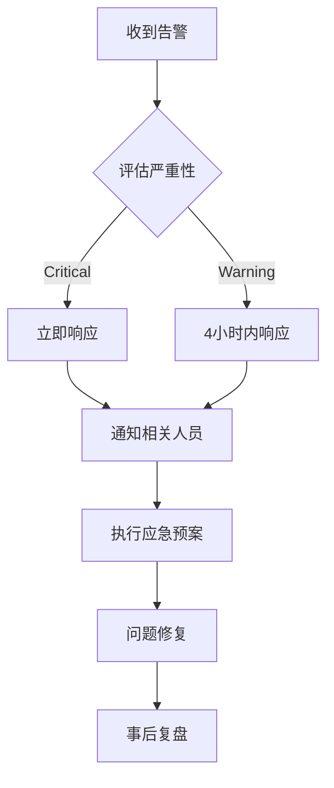

# FootballPrediction 系统运维手册

## 目录

1. [系统概述](#系统概述)
2. [日常运维](#日常运维)
3. [监控告警](#监控告警)
4. [备份恢复](#备份恢复)
5. [性能调优](#性能调优)
6. [故障处理](#故障处理)
7. [安全管理](#安全管理)
8. [应急响应](#应急响应)
9. [维护任务](#维护任务)
10. [升级流程](#升级流程)

## 系统概述

### 架构组件

```
┌─────────────────┐    ┌─────────────────┐    ┌─────────────────┐
│   Load Balancer │    │      Nginx      │    │   API Gateway   │
│   (HAProxy)     │────│   (SSL Termination)│────│   (FastAPI)     │
└─────────────────┘    └─────────────────┘    └─────────────────┘
                                                        │
                       ┌─────────────────┐             │
                       │   Redis Cache   │◄────────────┤
                       │   (Session/Cache)│             │
                       └─────────────────┘             │
                                                        ▼
┌─────────────────┐    ┌─────────────────┐    ┌─────────────────┐
│   Prometheus    │    │   PostgreSQL    │    │   Background    │
│   (Metrics)     │────│   (Primary DB)  │────│   Workers       │
└─────────────────┘    └─────────────────┘    │   (Celery)      │
                                              └─────────────────┘
```

### 服务端口

| 服务 | 端口 | 协议 | 说明 |
|------|------|------|------|
| API服务 | 8000 | HTTP | 主应用服务 |
| API服务(HTTPS) | 8443 | HTTPS | 安全API服务 |
| PostgreSQL | 5432 | TCP | 主数据库 |
| Redis | 6379 | TCP | 缓存/会话存储 |
| Prometheus | 9090 | HTTP | 指标收集 |
| Grafana | 3000 | HTTP | 监控仪表板 |
| Nginx | 80/443 | HTTP/HTTPS | 反向代理 |

## 日常运维

### 每日检查任务

```bash
#!/bin/bash
# daily_check.sh - 每日系统检查脚本

echo "===== $(date) 开始每日检查 ====="

# 1. 检查服务状态
echo "1. 检查服务状态..."
systemctl is-active football-prediction
systemctl is-active postgresql
systemctl is-active redis-server
systemctl is-active nginx

# 2. 检查磁盘空间
echo "2. 检查磁盘空间..."
df -h | grep -E "(/$|/var|/tmp)" | awk '{print $5}' | sed 's/%//' | while read usage; do
    if [ $usage -gt 80 ]; then
        echo "警告: 磁盘使用率 ${usage}% 超过80%"
    fi
done

# 3. 检查内存使用
echo "3. 检查内存使用..."
free | grep Mem | awk '{printf("内存使用率: %.2f%%\n", $3/$2 * 100.0)}'

# 4. 检查API健康状态
echo "4. 检查API健康状态..."
curl -s -f http://localhost:8000/api/v1/health || echo "ERROR: API健康检查失败"

# 5. 检查数据库连接
echo "5. 检查数据库连接..."
pg_isready -h localhost -p 5432 || echo "ERROR: 数据库连接失败"

# 6. 检查Redis连接
echo "6. 检查Redis连接..."
redis-cli ping || echo "ERROR: Redis连接失败"

# 7. 检查错误日志
echo "7. 检查最近错误日志..."
tail -n 100 /var/log/football-prediction/error.log | grep -i "error\|exception" | wc -l

# 8. 检查SSL证书有效期
echo "8. 检查SSL证书..."
if [ -f /etc/ssl/certs/api.footballprediction.com.crt ]; then
    openssl x509 -enddate -noout -in /etc/ssl/certs/api.footballprediction.com.crt
fi

echo "===== 每日检查完成 ====="
```

### 每周维护任务

```bash
#!/bin/bash
# weekly_maintenance.sh - 每周维护脚本

echo "===== $(date) 开始每周维护 ====="

# 1. 清理旧日志
echo "1. 清理旧日志..."
find /var/log/football-prediction -name "*.log.*" -mtime +7 -delete
find /var/log/nginx -name "access.log.*" -mtime +30 -delete

# 2. 数据库维护
echo "2. 数据库维护..."
psql -h localhost -U fp_user -d football_prediction -c "VACUUM ANALYZE;"
psql -h localhost -U fp_user -d football_prediction -c "REINDEX DATABASE football_prediction;"

# 3. Redis内存优化
echo "3. Redis优化..."
redis-cli --eval scripts/redis_cleanup.lua

# 4. 更新系统补丁
echo "4. 检查系统更新..."
apt list --upgradable 2>/dev/null | grep -v "WARNING" | wc -l

# 5. 备份配置文件
echo "5. 备份配置..."
tar -czf /backup/config_$(date +%Y%m%d).tar.gz \
    /etc/nginx/sites-enabled/ \
    /etc/postgresql/14/main/postgresql.conf \
    /etc/redis/redis.conf \
    /home/football-prediction/.env

# 6. 性能报告
echo "6. 生成性能报告..."
python scripts/generate_performance_report.py

echo "===== 每周维护完成 ====="
```

### 每月任务

```bash
#!/bin/bash
# monthly_tasks.sh - 每月任务

echo "===== $(date) 开始每月任务 ====="

# 1. 全面安全扫描
echo "1. 安全扫描..."
bandit -r src/ -f json -o /tmp/security_scan.json
safety check --json --output /tmp/safety_check.json

# 2. 数据归档
echo "2. 数据归档..."
psql -h localhost -U fp_user -d football_prediction -c "
    CREATE TABLE IF NOT EXISTS matches_archive_$(date +%Y%m)
    AS SELECT * FROM matches
    WHERE date < NOW() - INTERVAL '1 year';
    DELETE FROM matches WHERE date < NOW() - INTERVAL '1 year';
"

# 3. 更新依赖
echo "3. 检查依赖更新..."
pip list --outdated > /tmp/outdated_packages.txt

# 4. 容量规划
echo "4. 容量分析..."
df -h > /tmp/disk_usage_$(date +%Y%m%d).txt
ps aux --sort=-%cpu | head -20 > /tmp/top_cpu_$(date +%Y%m%d).txt
ps aux --sort=-%mem | head -20 > /tmp/top_mem_$(date +%Y%m%d).txt

# 5. 生成月度报告
echo "5. 生成月度报告..."
python scripts/generate_monthly_report.py

echo "===== 每月任务完成 ====="
```

## 监控告警

### Prometheus监控指标

```yaml
# monitoring/prometheus/rules.yml
groups:
  - name: football-prediction
    rules:
      # API可用性
      - alert: APIDown
        expr: up{job="football-prediction"} == 0
        for: 1m
        labels:
          severity: critical
        annotations:
          summary: "FootballPrediction API服务不可用"

      # 高错误率
      - alert: HighErrorRate
        expr: rate(http_requests_total{status=~"5.."}[5m]) > 0.1
        for: 5m
        labels:
          severity: warning
        annotations:
          summary: "API错误率过高"

      # 高响应时间
      - alert: HighResponseTime
        expr: histogram_quantile(0.95, rate(http_request_duration_seconds_bucket[5m])) > 1
        for: 5m
        labels:
          severity: warning
        annotations:
          summary: "API响应时间过高"

      # 数据库连接
      - alert: DatabaseConnectionFailure
        expr: up{job="postgres"} == 0
        for: 1m
        labels:
          severity: critical
        annotations:
          summary: "数据库连接失败"

      # 内存使用
      - alert: HighMemoryUsage
        expr: (node_memory_MemTotal_bytes - node_memory_MemAvailable_bytes) / node_memory_MemTotal_bytes > 0.9
        for: 5m
        labels:
          severity: warning
        annotations:
          summary: "内存使用率超过90%"

      # 磁盘空间
      - alert: LowDiskSpace
        expr: (node_filesystem_avail_bytes / node_filesystem_size_bytes) * 100 < 10
        for: 5m
        labels:
          severity: critical
        annotations:
          summary: "磁盘空间不足10%"
```

### Grafana仪表板

```json
{
  "dashboard": {
    "title": "FootballPrediction 系统监控",
    "panels": [
      {
        "title": "API请求率",
        "type": "graph",
        "targets": [
          {
            "expr": "rate(http_requests_total[5m])",
            "legendFormat": "{{method}} {{endpoint}}"
          }
        ]
      },
      {
        "title": "响应时间分布",
        "type": "heatmap",
        "targets": [
          {
            "expr": "rate(http_request_duration_seconds_bucket[5m])",
            "legendFormat": "{{le}}"
          }
        ]
      },
      {
        "title": "数据库连接数",
        "type": "stat",
        "targets": [
          {
            "expr": "pg_stat_database_numbackends",
            "legendFormat": "活跃连接"
          }
        ]
      },
      {
        "title": "Redis内存使用",
        "type": "graph",
        "targets": [
          {
            "expr": "redis_memory_used_bytes",
            "legendFormat": "已用内存"
          }
        ]
      }
    ]
  }
}
```

### 告警配置

```yaml
# monitoring/alertmanager.yml
global:
  smtp_smarthost: 'smtp.example.com:587'
  smtp_from: 'alerts@footballprediction.com'

route:
  group_by: ['alertname']
  group_wait: 10s
  group_interval: 10s
  repeat_interval: 12h
  receiver: 'web.hook'
  routes:
    - match:
        severity: critical
      receiver: 'critical-alerts'
    - match:
        severity: warning
      receiver: 'warning-alerts'

receivers:
  - name: 'critical-alerts'
    email_configs:
      - to: 'oncall@example.com'
        subject: '[CRITICAL] FootballPrediction Alert'
    slack_configs:
      - api_url: 'https://hooks.slack.com/services/...'
        channel: '#alerts-critical'

  - name: 'warning-alerts'
    email_configs:
      - to: 'ops@example.com'
        subject: '[WARNING] FootballPrediction Alert'
```

## 备份恢复

### 自动备份脚本

```bash
#!/bin/bash
# scripts/backup_system.sh - 系统备份脚本

BACKUP_DIR="/backup/$(date +%Y%m%d)"
mkdir -p $BACKUP_DIR

echo "开始系统备份..."

# 1. 数据库备份
echo "1. 备份数据库..."
pg_dump -h localhost -U fp_user -d football_prediction | \
gzip > $BACKUP_DIR/database.sql.gz

# 2. Redis备份
echo "2. 备份Redis..."
redis-cli --rdb $BACKUP_DIR/redis.rdb

# 3. 应用代码备份
echo "3. 备份应用代码..."
tar -czf $BACKUP_DIR/app_code.tar.gz \
    --exclude=.git \
    --exclude=venv \
    --exclude=node_modules \
    --exclude=__pycache__ \
    .

# 4. 配置文件备份
echo "4. 备份配置..."
tar -czf $BACKUP_DIR/config.tar.gz \
    /etc/nginx/sites-enabled/ \
    /etc/postgresql/14/main/ \
    /etc/redis/ \
    .env

# 5. 日志备份
echo "5. 备份日志..."
tar -czf $BACKUP_DIR/logs.tar.gz \
    /var/log/football-prediction/ \
    /var/log/nginx/ \
    /var/log/postgresql/

# 6. 上传到云存储（可选）
if [ -n "$AWS_S3_BUCKET" ]; then
    echo "6. 上传到S3..."
    aws s3 sync $BACKUP_DIR s3://$AWS_S3_BUCKET/backups/$(date +%Y%m%d)/
fi

# 7. 清理旧备份
echo "7. 清理旧备份..."
find /backup -type d -mtime +30 -exec rm -rf {} \;

echo "备份完成: $BACKUP_DIR"
```

### 恢复流程

```bash
#!/bin/bash
# scripts/restore_system.sh - 系统恢复脚本

BACKUP_DIR=$1
if [ -z "$BACKUP_DIR" ]; then
    echo "用法: $0 <backup_directory>"
    exit 1
fi

echo "开始系统恢复..."

# 1. 停止服务
echo "1. 停止服务..."
systemctl stop football-prediction nginx

# 2. 恢复数据库
echo "2. 恢复数据库..."
dropdb -h localhost -U fp_user football_prediction
createdb -h localhost -U fp_user football_prediction
gunzip -c $BACKUP_DIR/database.sql.gz | \
psql -h localhost -U fp_user football_prediction

# 3. 恢复Redis
echo "3. 恢复Redis..."
systemctl stop redis-server
cp $BACKUP_DIR/redis.rdb /var/lib/redis/
chown redis:redis /var/lib/redis/redis.rdb
systemctl start redis-server

# 4. 恢复配置
echo "4. 恢复配置..."
tar -xzf $BACKUP_DIR/config.tar.gz -C /

# 5. 重启服务
echo "5. 重启服务..."
systemctl start postgresql
systemctl start football-prediction
systemctl start nginx

# 6. 验证恢复
echo "6. 验证恢复..."
sleep 10
curl -f http://localhost:8000/api/v1/health

if [ $? -eq 0 ]; then
    echo "恢复成功！"
else
    echo "恢复失败，请检查日志"
    exit 1
fi
```

## 性能调优

### 数据库优化

```sql
-- performance_tuning.sql

-- 1. 创建索引
CREATE INDEX CONCURRENTLY idx_matches_competition_date
ON matches(competition_id, date DESC);

CREATE INDEX CONCURRENTLY idx_predictions_user_created
ON predictions(user_id, created_at DESC);

CREATE INDEX CONCURRENTLY idx_odds_match_source
ON odds(match_id, source);

-- 2. 分区表（大数据量）
CREATE TABLE matches_partitioned (
    LIKE matches INCLUDING ALL
) PARTITION BY RANGE (date);

CREATE TABLE matches_2024 PARTITION OF matches_partitioned
FOR VALUES FROM ('2024-01-01') TO ('2025-01-01');

-- 3. 查询优化
EXPLAIN (ANALYZE, BUFFERS)
SELECT m.*, p.home_score, p.away_score
FROM matches m
LEFT JOIN predictions p ON m.id = p.match_id
WHERE m.date > NOW() - INTERVAL '7 days'
ORDER BY m.date DESC;

-- 4. 统计信息更新
ANALYZE matches;
ANALYZE predictions;

-- 5. 配置优化
ALTER SYSTEM SET shared_buffers = '256MB';
ALTER SYSTEM SET effective_cache_size = '1GB';
ALTER SYSTEM SET work_mem = '4MB';
ALTER SYSTEM SET maintenance_work_mem = '64MB';
SELECT pg_reload_conf();
```

### Redis优化

```bash
# redis_optimization.conf

# 内存优化
maxmemory 512mb
maxmemory-policy allkeys-lru

# 持久化优化
save 900 1
save 300 10
save 60 10000

# 网络优化
tcp-keepalive 300
timeout 0

# 慢日志
slowlog-log-slower-than 10000
slowlog-max-len 128
```

### 应用优化

```python
# performance_config.py

# 数据库连接池
SQLALCHEMY_ENGINE_OPTIONS = {
    "pool_size": 20,
    "max_overflow": 30,
    "pool_timeout": 30,
    "pool_recycle": 3600,
    "pool_pre_ping": True,
}

# 缓存配置
CACHE_CONFIG = {
    "default": {
        "BACKEND": "django_redis.cache.RedisCache",
        "LOCATION": "redis://127.0.0.1:6379/1",
        "TIMEOUT": 300,
        "OPTIONS": {
            "CLIENT_CLASS": "django_redis.client.DefaultClient",
            "MAX_CONNECTIONS": 100,
        }
    }
}

# 异步任务配置
CELERY_CONFIG = {
    "worker_concurrency": 4,
    "worker_prefetch_multiplier": 1,
    "task_acks_late": True,
    "task_reject_on_worker_lost": True,
}
```

## 故障处理

### 常见故障及解决方案

#### 1. API响应慢

```bash
# 诊断步骤
# 1. 检查系统负载
top
htop

# 2. 检查数据库查询
psql -c "SELECT * FROM pg_stat_activity WHERE state = 'active';"

# 3. 检查慢查询
psql -c "SELECT query, mean_time, calls FROM pg_stat_statements ORDER BY mean_time DESC LIMIT 10;"

# 4. 检查网络
ping api.footballprediction.com
traceroute api.footballprediction.com

# 5. 重启服务
systemctl restart football-prediction
```

#### 2. 数据库连接满

```bash
# 1. 查看连接数
psql -c "SELECT count(*) FROM pg_stat_activity;"

# 2. 终止空闲连接
psql -c "SELECT pg_terminate_backend(pid) FROM pg_stat_activity WHERE state = 'idle' AND query_start < now() - interval '5 minutes';"

# 3. 增加连接池大小
# 编辑 application.conf
```

#### 3. Redis内存不足

```bash
# 1. 检查内存使用
redis-cli info memory

# 2. 清理过期键
redis-cli --scan --pattern "*:expired:*" | xargs redis-cli del

# 3. 手动清理
redis-cli FLUSHEXPIRED  # 如果支持

# 4. 增加maxmemory
redis-cli CONFIG SET maxmemory 1gb
```

#### 4. SSL证书过期

```bash
# 1. 检查证书有效期
openssl x509 -enddate -noout -in /etc/ssl/certs/api.footballprediction.com.crt

# 2. 手动续期
certbot renew --force-renewal

# 3. 重启Nginx
systemctl restart nginx
```

### 故障排查工具

```bash
#!/bin/bash
# scripts/troubleshoot.sh - 故障排查工具

echo "===== FootballPrediction 故障排查 ====="

# 函数：检查服务
check_service() {
    if systemctl is-active --quiet $1; then
        echo "✓ $1 运行正常"
    else
        echo "✗ $1 服务异常"
        echo "  最近日志:"
        journalctl -u $1 --no-pager -n 5
    fi
}

# 函数：检查端口
check_port() {
    if nc -z localhost $1; then
        echo "✓ 端口 $1 开放"
    else
        echo "✗ 端口 $1 无法连接"
    fi
}

# 函数：检查资源
check_resource() {
    local usage=$1
    local threshold=$2
    local resource=$3

    if (( $(echo "$usage > $threshold" | bc -l) )); then
        echo "⚠ $resource 使用率: ${usage}% 超过阈值 ${threshold}%"
    else
        echo "✓ $resource 使用率: ${usage}%"
    fi
}

echo "1. 服务状态检查"
check_service football-prediction
check_service postgresql
check_service redis-server
check_service nginx

echo -e "\n2. 端口检查"
check_port 8000
check_port 5432
check_port 6379

echo -e "\n3. 资源使用检查"
cpu_usage=$(top -bn1 | grep "Cpu(s)" | awk '{print $2}' | cut -d'%' -f1)
mem_usage=$(free | grep Mem | awk '{printf "%.1f", $3/$2 * 100.0}')
disk_usage=$(df / | tail -1 | awk '{print $5}' | cut -d'%' -f1)

check_resource $cpu_usage 80 "CPU"
check_resource $mem_usage 90 "内存"
check_resource $disk_usage 85 "磁盘"

echo -e "\n4. API健康检查"
if curl -s -f http://localhost:8000/api/v1/health > /dev/null; then
    echo "✓ API健康检查通过"
else
    echo "✗ API健康检查失败"
fi

echo -e "\n5. 数据库连接检查"
if pg_isready -h localhost -p 5432 > /dev/null; then
    echo "✓ 数据库连接正常"
else
    echo "✗ 数据库连接失败"
fi

echo -e "\n6. 最近错误日志"
echo "应用错误日志:"
tail -n 5 /var/log/football-prediction/error.log 2>/dev/null || echo "无日志文件"

echo -e "\nNginx错误日志:"
tail -n 5 /var/log/nginx/error.log 2>/dev/null || echo "无日志文件"

echo -e "\n===== 排查完成 ====="
```

## 安全管理

### 安全检查清单

```bash
#!/bin/bash
# scripts/security_check.sh - 安全检查脚本

echo "===== 安全检查开始 ====="

# 1. 检查系统更新
echo "1. 检查系统更新..."
apt list --upgradable 2>/dev/null | grep -v "WARNING" | head -10

# 2. 检查开放端口
echo -e "\n2. 检查开放端口..."
netstat -tuln | grep LISTEN

# 3. 检查SSH配置
echo -e "\n3. SSH安全配置..."
grep -E "PermitRootLogin|PasswordAuthentication|Port" /etc/ssh/sshd_config

# 4. 检查用户权限
echo -e "\n4. 检查sudo用户..."
grep -E "^sudo|^admin" /etc/group

# 5. 检查文件权限
echo -e "\n5. 检查敏感文件权限..."
ls -la /etc/passwd /etc/shadow /etc/sudoers 2>/dev/null

# 6. 检查防火墙
echo -e "\n6. 防火墙状态..."
ufw status verbose 2>/dev/null || iptables -L -n | head -20

# 7. 检查SSL证书
echo -e "\n7. SSL证书检查..."
if [ -f /etc/ssl/certs/api.footballprediction.com.crt ]; then
    openssl x509 -noout -dates -in /etc/ssl/certs/api.footballprediction.com.crt
fi

# 8. 检查应用安全
echo -e "\n8. 应用安全扫描..."
bandit -r src/ -f json -o /tmp/bandit_report.json 2>/dev/null
if [ $? -eq 0 ]; then
    echo "✓ Bandit安全扫描通过"
else
    echo "⚠ Bandit发现安全问题，查看 /tmp/bandit_report.json"
fi

# 9. 检查依赖漏洞
echo -e "\n9. 检查依赖漏洞..."
safety check --json --output /tmp/safety_report.json 2>/dev/null
if [ $? -eq 0 ]; then
    echo "✓ 依赖安全检查通过"
else
    echo "⚠ 发现依赖漏洞，查看 /tmp/safety_report.json"
fi

echo -e "\n===== 安全检查完成 ====="
```

### 安全加固

```bash
#!/bin/bash
# scripts/security_hardening.sh - 安全加固脚本

echo "===== 开始安全加固 ====="

# 1. 更新系统
echo "1. 更新系统包..."
apt update && apt upgrade -y

# 2. 配置防火墙
echo "2. 配置防火墙..."
ufw default deny incoming
ufw default allow outgoing
ufw allow ssh
ufw allow 80/tcp
ufw allow 443/tcp
ufw --force enable

# 3. SSH安全配置
echo "3. SSH安全加固..."
cp /etc/ssh/sshd_config /etc/ssh/sshd_config.bak
sed -i 's/#PermitRootLogin yes/PermitRootLogin no/' /etc/ssh/sshd_config
sed -i 's/#PasswordAuthentication yes/PasswordAuthentication no/' /etc/ssh/sshd_config
sed -i 's/#Port 22/Port 2222/' /etc/ssh/sshd_config
systemctl restart sshd

# 4. 禁用不必要的服务
echo "4. 禁用不必要服务..."
systemctl disable telnet
systemctl disable ftp
systemctl disable rsh

# 5. 设置文件权限
echo "5. 设置文件权限..."
chmod 600 /etc/ssh/sshd_config
chmod 600 /etc/ssh/ssh_host_*
chmod 644 /etc/passwd
chmod 640 /etc/group
chmod 600 /etc/shadow
chmod 440 /etc/sudoers

# 6. 安装fail2ban
echo "6. 安装fail2ban..."
apt install -y fail2ban
cp /etc/fail2ban/jail.conf /etc/fail2ban/jail.local
systemctl enable fail2ban
systemctl start fail2ban

# 7. 配置日志轮转
echo "7. 配置日志轮转..."
cat > /etc/logrotate.d/football-prediction << EOF
/var/log/football-prediction/*.log {
    daily
    missingok
    rotate 30
    compress
    delaycompress
    notifempty
    create 644 football-prediction football-prediction
}
EOF

# 8. 设置自动安全更新
echo "8. 配置自动安全更新..."
apt install -y unattended-upgrades
dpkg-reconfigure -plow unattended-upgrades

echo "===== 安全加固完成 ====="
echo "请务必："
echo "1. 备份SSH密钥"
echo "2. 测试新的SSH端口（2222）"
echo "3. 确认可正常登录后再关闭当前会话"
```

## 应急响应

### 应急响应流程



### 应急联系人

```yaml
# emergency_contacts.yml
contacts:
  primary:
    - name: "运维负责人"
      role: "DevOps Lead"
      phone: "+86-138-xxxx-xxxx"
      email: "ops@example.com"

  secondary:
    - name: "技术负责人"
      role: "Tech Lead"
      phone: "+86-139-xxxx-xxxx"
      email: "tech@example.com"

  management:
    - name: "产品负责人"
      role: "Product Manager"
      phone: "+86-136-xxxx-xxxx"
      email: "pm@example.com"

escalation:
  level1: ["primary"]
  level2: ["primary", "secondary"]
  level3: ["primary", "secondary", "management"]
```

### 应急脚本

```bash
#!/bin/bash
# scripts/emergency_response.sh - 应急响应脚本

INCIDENT_TYPE=$1
SEVERITY=$2

echo "===== 应急响应启动 ====="
echo "事件类型: $INCIDENT_TYPE"
echo "严重级别: $SEVERITY"
echo "时间: $(date)"

# 1. 通知相关人员
send_alert() {
    message=$1
    # 发送邮件
    echo "$message" | mail -s "【紧急】FootballPrediction系统告警" ops@example.com
    # 发送Slack通知
    curl -X POST -H 'Content-type: application/json' \
        --data "{\"text\":\"$message\"}" \
        $SLACK_WEBHOOK_URL
}

# 2. 创建事件记录
create_incident() {
    incident_id="INC-$(date +%Y%m%d%H%M%S)"
    mkdir -p /var/incidents/$incident_id
    echo "$incident_id" > /var/incidents/current
    echo "事件ID: $incident_id"
}

# 3. 收集系统状态
collect_system_info() {
    incident_id=$(cat /var/incidents/current)
    output_dir="/var/incidents/$incident_id"

    # 系统信息
    uname -a > $output_dir/system_info.txt
    free -h >> $output_dir/system_info.txt
    df -h >> $output_dir/system_info.txt

    # 进程信息
    ps aux > $output_dir/processes.txt

    # 网络连接
    netstat -tuln > $output_dir/network.txt

    # 最近的日志
    tail -n 1000 /var/log/football-prediction/error.log > $output_dir/app_error.log
    tail -n 1000 /var/log/nginx/error.log > $output_dir/nginx_error.log

    # 系统日志
    journalctl --since "1 hour ago" > $output_dir/systemd.log
}

# 4. 执行应急措施
execute_emergency_actions() {
    case $INCIDENT_TYPE in
        "api_down")
            echo "执行API服务恢复措施..."
            systemctl restart football-prediction
            sleep 10
            curl -f http://localhost:8000/api/v1/health || echo "API恢复失败"
            ;;
        "database_down")
            echo "执行数据库恢复措施..."
            systemctl restart postgresql
            pg_isready || echo "数据库恢复失败"
            ;;
        "high_cpu")
            echo "执行CPU优化措施..."
            # 找到高CPU进程
            top -b -n1 | head -20 > /tmp/high_cpu.txt
            # 可选：重启服务
            systemctl restart football-prediction
            ;;
        "disk_full")
            echo "执行磁盘清理措施..."
            # 清理日志
            find /var/log -name "*.log.*" -mtime +7 -delete
            # 清理临时文件
            find /tmp -mtime +1 -delete
            # 清理Docker
            docker system prune -f
            ;;
        "security_breach")
            echo "执行安全应急措施..."
            # 切换到紧急模式
            iptables -A INPUT -j DROP
            iptables -A INPUT -s 127.0.0.1 -j ACCEPT
            # 备份关键数据
            /scripts/backup_system.sh
            ;;
    esac
}

# 5. 主执行流程
create_incident
send_alert "【$SEVERITY】$INCIDENT_TYPE 事件发生，正在处理..."
collect_system_info
execute_emergency_actions

# 6. 验证恢复
sleep 30
if curl -s -f http://localhost:8000/api/v1/health > /dev/null; then
    send_alert "【恢复】$INCIDENT_TYPE 事件已处理，系统恢复正常"
else
    send_alert "【严重】$INCIDENT_TYPE 事件处理失败，需要人工介入"
fi

echo "===== 应急响应完成 ====="
```

## 维护任务

### 自动化维护

```python
# scripts/maintenance_scheduler.py
"""
维护任务调度器
"""

import schedule
import time
import logging
from datetime import datetime

logger = logging.getLogger(__name__)

class MaintenanceScheduler:
    def __init__(self):
        self.setup_jobs()

    def setup_jobs(self):
        # 每日任务
        schedule.every().day.at("02:00").do(self.daily_health_check)
        schedule.every().day.at("03:00").do(self.daily_backup)
        schedule.every().day.at("04:00").do(self.cleanup_logs)

        # 每周任务
        schedule.every().sunday.at("05:00").do(self.weekly_maintenance)
        schedule.every().monday.at("09:00").do(self.generate_weekly_report)

        # 每月任务
        schedule.every().month.do(self.monthly_tasks)

        # 实时监控
        schedule.every(5).minutes.do(self.check_system_health)
        schedule.every(15).minutes.do(self.check_disk_space)
        schedule.every(30).minutes.do(self.check_api_health)

    def daily_health_check(self):
        """每日健康检查"""
        logger.info("执行每日健康检查")
        # 实现健康检查逻辑

    def daily_backup(self):
        """每日备份"""
        logger.info("执行每日备份")
        # 实现备份逻辑

    def weekly_maintenance(self):
        """每周维护"""
        logger.info("执行每周维护")
        # 实现维护逻辑

    def run(self):
        """运行调度器"""
        logger.info("维护调度器启动")
        while True:
            schedule.run_pending()
            time.sleep(60)

if __name__ == "__main__":
    scheduler = MaintenanceScheduler()
    scheduler.run()
```

## 升级流程

### 蓝绿升级

```bash
#!/bin/bash
# scripts/blue_green_upgrade.sh - 蓝绿升级脚本

NEW_VERSION=$1
CURRENT_ENV=$2

if [ -z "$NEW_VERSION" ]; then
    echo "用法: $0 <version> [environment]"
    exit 1
fi

echo "===== 蓝绿升级开始 ====="
echo "新版本: $NEW_VERSION"
echo "环境: $CURRENT_ENV"

# 1. 准备新环境
echo "1. 准备新环境..."
docker-compose -f docker-compose.green.yml pull
docker-compose -f docker-compose.green.yml up -d

# 2. 健康检查
echo "2. 新环境健康检查..."
sleep 30
for i in {1..30}; do
    if curl -f http://localhost:8001/api/v1/health > /dev/null; then
        echo "✓ 新环境健康检查通过"
        break
    fi
    if [ $i -eq 30 ]; then
        echo "✗ 新环境健康检查失败，回滚"
        docker-compose -f docker-compose.green.yml down
        exit 1
    fi
    sleep 10
done

# 3. 切换流量
echo "3. 切换流量..."
# 更新负载均衡器配置
sed -i 's/server api-blue:8000/server api-green:8000/' /etc/nginx/upstream.conf
nginx -s reload

# 4. 验证切换
echo "4. 验证流量切换..."
sleep 10
if curl -f https://api.footballprediction.com/api/v1/health > /dev/null; then
    echo "✓ 流量切换成功"
else
    echo "✗ 流量切换失败，回滚"
    sed -i 's/server api-green:8000/server api-blue:8000/' /etc/nginx/upstream.conf
    nginx -s reload
    docker-compose -f docker-compose.green.yml down
    exit 1
fi

# 5. 停止旧环境
echo "5. 停止旧环境..."
docker-compose -f docker-compose.blue.yml down

# 6. 更新版本标记
echo "6. 更新版本标记..."
echo $NEW_VERSION > /etc/football-prediction.version

echo "===== 蓝绿升级完成 ====="
```

### 回滚流程

```bash
#!/bin/bash
# scripts/rollback.sh - 回滚脚本

PREVIOUS_VERSION=$1

if [ -z "$PREVIOUS_VERSION" ]; then
    echo "用法: $0 <previous_version>"
    echo "可用版本:"
    git tag | tail -10
    exit 1
fi

echo "===== 开始回滚到 $PREVIOUS_VERSION ====="

# 1. 停止当前服务
echo "1. 停止当前服务..."
docker-compose down

# 2. 切换到上一版本
echo "2. 切换代码版本..."
git checkout $PREVIOUS_VERSION

# 3. 恢复数据库（如需要）
echo "3. 检查是否需要数据库回滚..."
read -p "是否需要回滚数据库？(y/n): " need_db_rollback
if [ "$need_db_rollback" = "y" ]; then
    echo "选择数据库备份:"
    ls -la /backup/database/ | tail -10
    read -p "输入备份文件名: " backup_file
    gunzip -c /backup/database/$backup_file | psql -h localhost -U fp_user football_prediction
fi

# 4. 启动服务
echo "4. 启动服务..."
docker-compose up -d

# 5. 验证服务
echo "5. 验证服务..."
sleep 30
if curl -f http://localhost:8000/api/v1/health > /dev/null; then
    echo "✓ 回滚成功"
else
    echo "✗ 回滚失败，需要人工介入"
    exit 1
fi

# 6. 通知相关人员
echo "6. 发送通知..."
curl -X POST "$SLACK_WEBHOOK_URL" \
    -H 'Content-type: application/json' \
    --data "{\"text\":\"系统已回滚到版本 $PREVIOUS_VERSION\"}"

echo "===== 回滚完成 ====="
```

## 运维最佳实践

### 1. 监控策略

- **基础监控**: CPU、内存、磁盘、网络
- **应用监控**: 响应时间、错误率、吞吐量
- **业务监控**: 预测准确率、用户活跃度
- **日志监控**: 错误日志、审计日志

### 2. 告警策略

- **Critical**: 立即响应（5分钟内）
- **Warning**: 工作时间响应（4小时内）
- **Info**: 每日汇总报告

### 3. 备份策略

- **数据库**: 每日全量，每小时增量
- **文件**: 每日增量，每周全量
- **配置**: 每次变更后立即备份
- **保留**: 本地30天，云端90天

### 4. 安全策略

- **访问控制**: 最小权限原则
- **密码策略**: 定期更换，复杂度要求
- **审计日志**: 所有操作留痕
- **漏洞扫描**: 每周自动扫描

---

更新时间: 2025-01-14
版本: v1.0.0
维护人员: 运维团队
