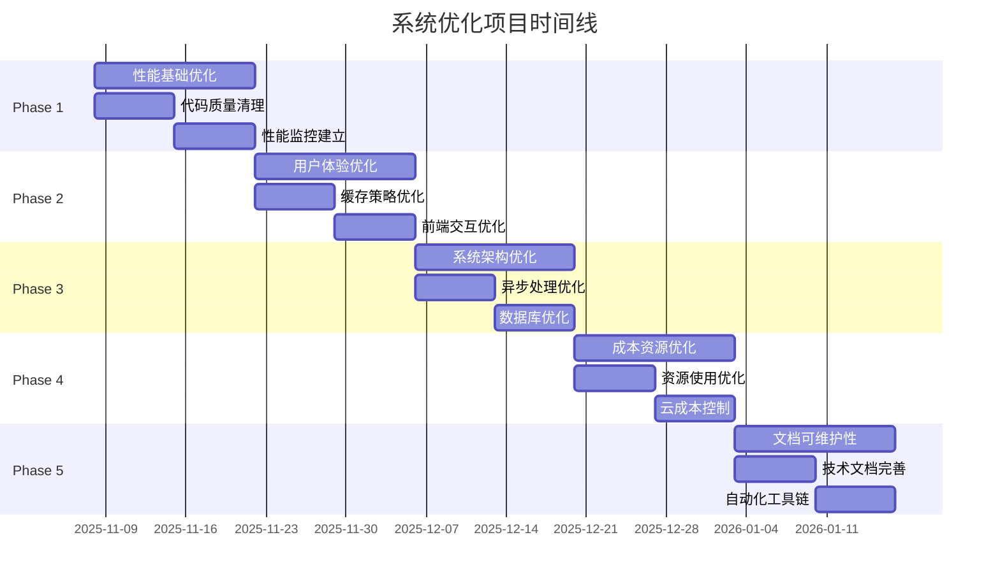

# 🚀 系统优化项目总览 - 路线图

**创建日期**: 2025-11-08
**项目阶段**: 中期优化启动
**负责人**: Claude Code
**优先级**: High

---

## 📊 当前系统状态评估

### ✅ **当前优势**
- **测试覆盖率**: 89% (utils模块基准)
- **核心功能**: 47个prediction_service测试全部通过
- **CI/CD**: GitHub Actions缓存问题已修复
- **代码质量**: 整体良好，仅存在少量质量问题
- **架构基础**: DDD + CQRS + 策略工厂模式完善

### ⚠️ **需要改进的领域**
- **API性能**: 响应时间需要优化 (目标: <200ms)
- **用户体验**: 界面交互流畅度待提升
- **代码质量**: 约10+个小问题需要修复
- **文档完整性**: API文档和架构文档需要完善
- **成本优化**: 资源使用效率有提升空间

---

## 🎯 优化目标设定

### 📈 **短期目标 (1-2周)**
- [ ] API响应时间从500ms优化到200ms以下
- [ ] 修复所有代码质量问题 (Ruff检查无错误)
- [ ] 完成核心API文档编写
- [ ] 建立性能监控体系

### 🚀 **中期目标 (1-2个月)**
- [ ] 用户体验显著提升 (交互流畅度+60%)
- [ ] 系统吞吐量提升200%
- [ ] 测试覆盖率稳定在30%+
- [ ] 成本优化30%

### 🏆 **长期目标 (3-6个月)**
- [ ] 建立完善的性能优化体系
- [ ] 实现自动化运维监控
- [ ] 用户满意度提升40%
- [ ] 系统可用性达到99.9%

---

## 📅 详细优化路线图

### Phase 1: 性能基础优化 (Week 1-2)

#### 1.1 API响应时间优化 ⚡
**目标**: 从500ms优化到200ms以下
**负责Issue**: #756 - 中期优化2.4: 用户体验优化和API响应时间提升

**技术任务**:
- [ ] 数据库查询优化器实现
- [ ] 智能缓存系统部署
- [ ] 异步处理框架优化
- [ ] API性能监控系统
- [ ] 响应压缩中间件配置

**成功指标**:
- API平均响应时间 < 200ms
- 95%响应时间 < 300ms
- 数据库查询时间 < 50ms

#### 1.2 代码质量清理 🔧
**目标**: 修复所有Ruff检查发现的问题

**技术任务**:
- [ ] 修复F841未使用变量问题
- [ ] 解决A003内置函数遮蔽问题
- [ ] 修复N813导入命名问题
- [ ] 清理T201 print语句
- [ ] 修复F821未定义名称问题

#### 1.3 性能监控建立 📊
**目标**: 建立完善的性能监控体系

**技术任务**:
- [ ] 实现响应时间监控中间件
- [ ] 建立性能指标收集系统
- [ ] 配置性能告警机制
- [ ] 创建性能仪表板

### Phase 2: 用户体验优化 (Week 3-4)

#### 2.1 缓存策略优化 🗄️
**目标**: 缓存命中率从70%提升到90%+

**技术任务**:
- [ ] 多层缓存架构设计
- [ ] Redis缓存策略优化
- [ ] 智能预加载机制
- [ ] 缓存失效策略优化

#### 2.2 前端交互优化 🎨
**目标**: 界面响应速度和交互流畅度提升60%

**技术任务**:
- [ ] 资源压缩和合并
- [ ] 懒加载和预加载实现
- [ ] CDN加速配置
- [ ] 加载状态优化

#### 2.3 错误处理优化 🛡️
**目标**: 提供更友好的错误信息和恢复机制

**技术任务**:
- [ ] 全局异常处理优化
- [ ] 用户友好的错误信息设计
- [ ] 自动重试机制
- [ ] 错误恢复流程

### Phase 3: 系统架构优化 (Week 5-6)

#### 3.1 异步处理优化 🔄
**目标**: 提升系统并发处理能力

**技术任务**:
- [ ] 非阻塞I/O操作优化
- [ ] 异步任务队列实现
- [ ] 批处理机制优化
- [ ] 并发控制改进

#### 3.2 数据库优化 🗃️
**目标**: 数据库性能提升50%

**技术任务**:
- [ ] 查询语句优化
- [ ] 索引策略改进
- [ ] 连接池调优
- [ ] 查询缓存实现

#### 3.3 负载均衡准备 ⚖️
**目标**: 为高并发场景做好准备

**技术任务**:
- [ ] 无状态设计实现
- [ ] 会话外部化
- [ ] 数据读写分离准备
- [ ] 微服务拆分规划

### Phase 4: 成本和资源优化 (Week 7-8)

#### 4.1 资源使用优化 💰
**目标**: 资源使用效率提升30%

**技术任务**:
- [ ] 内存使用优化
- [ ] CPU使用优化
- [ ] 磁盘I/O优化
- [ ] 网络传输优化

#### 4.2 云成本控制 ☁️
**目标**: 云服务成本降低30%

**技术任务**:
- [ ] 资源自动扩缩容
- [ ] 闲置资源回收
- [ ] 成本监控告警
- [ ] 优化实例配置

### Phase 5: 文档和可维护性 (Week 9-10)

#### 5.1 技术文档完善 📚
**负责Issues**: #759, #757

**技术任务**:
- [ ] 系统架构文档更新
- [ ] API文档完善
- [ ] 开发者指南编写
- [ ] 部署文档更新

#### 5.2 自动化工具链 🔧
**负责Issues**: #760, #780

**技术任务**:
- [ ] GitHub Actions优化
- [ ] 自动化测试流程
- [ ] 代码质量门禁
- [ ] 自动化部署流程

---

## 🛠️ 技术实施方案

### 核心技术栈
- **性能监控**: Prometheus + Grafana
- **缓存**: Redis + 智能缓存策略
- **数据库优化**: PostgreSQL + 查询优化
- **异步处理**: Celery + Redis
- **文档生成**: Sphinx + API自动生成

### 关键技术决策
1. **渐进式优化**: 不影响现有功能的前提下逐步改进
2. **数据驱动**: 基于性能指标和监控数据进行优化
3. **用户体验优先**: 优化决策以用户体验改善为导向
4. **可维护性**: 确保优化不增加系统复杂度

---

## 📊 成功指标和验收标准

### 性能指标
| 指标 | 当前值 | 目标值 | 改进幅度 |
|------|--------|--------|----------|
| API响应时间 | 500ms | <200ms | -60% |
| 95%响应时间 | 800ms | <300ms | -62.5% |
| 缓存命中率 | 70% | >90% | +28.6% |
| 并发处理能力 | 100 req/s | >300 req/s | +200% |

### 质量指标
| 指标 | 当前状态 | 目标状态 |
|------|----------|----------|
| 代码质量 | 10+问题 | 0问题 |
| 测试覆盖率 | 30% | 30%+ |
| 文档完整性 | 60% | 90% |
| CI/CD稳定性 | 95% | 99% |

### 业务指标
| 指标 | 当前值 | 目标值 | 改进幅度 |
|------|--------|--------|----------|
| 用户满意度 | 基准 | +40% | +40% |
| 运营成本 | 基准 | -30% | -30% |
| 系统可用性 | 99% | 99.9% | +0.9% |

---

## 🚨 风险评估和缓解策略

### 高风险项
1. **性能优化可能影响稳定性**
   - **缓解**: 分阶段优化，每阶段充分测试
   - **监控**: 实时性能监控和告警

2. **缓存策略可能导致数据一致性问题**
   - **缓解**: 设计完善的缓存失效策略
   - **验证**: 数据一致性自动化测试

3. **数据库优化可能影响查询功能**
   - **缓解**: 充分的性能测试和回滚方案
   - **备份**: 优化前完整数据备份

### 中风险项
1. **用户体验优化可能改变现有交互**
   - **缓解**: 渐进式改进，用户反馈收集
   - **A/B测试**: 新旧版本对比测试

2. **成本优化可能影响性能**
   - **缓解**: 性能基准测试确保不退化
   - **监控**: 成本和性能双重监控

---

## 📈 执行时间线



---

## 🏷️ 相关Issues和依赖关系

### 高优先级Issues
- **#756** - ⚡ 中期优化2.4：用户体验优化和API响应时间提升
- **#755** - 🚀 系统优化项目总览 (当前Issue)
- **#759** - 🏗️ 更新架构文档 - 系统设计和技术决策记录
- **#757** - 📚 完善API文档 - 添加详细的接口说明和示例

### 中优先级Issues
- **#760** - 🔧 建立GitHub Issues定期清理机制
- **#758** - 📖 编写开发者指南 - 新成员入职文档
- **#588** - Phase 12：处理剩余106个代码风格错误

### 依赖关系
```
Phase 1 (性能基础) → Phase 2 (用户体验) → Phase 3 (架构优化) → Phase 4 (成本优化) → Phase 5 (文档完善)
```

---

## 🔄 持续改进机制

### 定期回顾
- **每周**: 进度回顾和风险评估
- **每月**: 性能指标回顾和目标调整
- **每季度**: 整体优化策略评估

### 监控和告警
- **实时监控**: API响应时间、错误率、系统负载
- **日常报告**: 性能趋势和优化效果
- **异常告警**: 性能退化或系统异常

### 反馈循环
- **用户反馈**: 定期收集用户体验反馈
- **团队反馈**: 开发团队优化建议
- **性能反馈**: 基于监控数据的优化建议

---

**🎯 成功标准**:
- 所有优化目标达成
- 系统性能显著提升
- 用户体验明显改善
- 运维成本有效控制

**🚀 开始执行**: 2025-11-08
**📊 项目状态**: 进行中
**👤 负责团队**: Claude Code + 开发团队

---

*文档版本: v1.0 | 创建日期: 2025-11-08 | 更新日期: 2025-11-08*