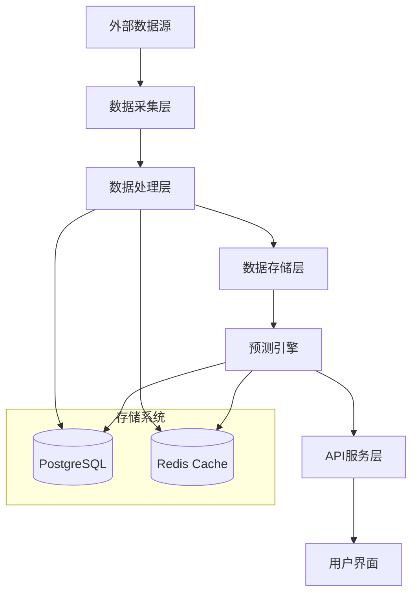

# 足球比赛结果预测系统 - 软件需求规格说明书 (SRS)

## 📋 文档信息

| 项目 | 足球比赛结果预测系统 |
|------|----------------------|
| 版本 | v1.0 |
| 创建日期 | 2025-11-06 |
| 最后更新 | 2025-11-06 |
| 作者 | Claude Code |
| 状态 | Phase 4: 文档完善 |

---

## 📖 目录

1. [引言](#1-引言)
   - 1.1 目的
   - 1.2 项目范围
   - 1.3 定义、缩写和缩略语
   - 1.4 参考文献
   - 1.5 文档概述

2. [总体描述](#2-总体描述)
   - 2.1 产品前景
   - 2.2 产品功能
   - 2.3 用户特征
   - 2.4 运行环境
   - 2.5 设计和实现约束
   - 2.6 用户文档

3. [具体需求](#3-具体需求)
   - 3.1 功能需求
   - 3.2 性能需求
   - 3.3 质量属性
   - 3.4 接口需求
   - 3.5 约束条件

4. [系统架构](#4-系统架构)
   - 4.1 架构概览
   - 4.2 技术栈
   - 4.3 数据流
   - 4.4 安全架构

5. [数据需求](#5-数据需求)
   - 5.1 数据模型
   - 5.2 数据质量
   - 5.3 数据安全

6. [非功能性需求](#6-非功能性需求)
   - 6.1 性能需求
   - 6.2 可靠性需求
   - 6.3 可用性需求
   - 6.4 安全性需求
   - 6.5 可维护性需求

7. [附录](#7-附录)

---

## 1. 引言

### 1.1 目的

本文档旨在详细描述足球比赛结果预测系统的软件需求规格，为开发团队、测试团队和项目管理人员提供明确的技术规范和实施指南。

### 1.2 项目范围

足球比赛结果预测系统是一个基于机器学习的Web应用，旨在：

- 收集和整合足球相关数据（比赛结果、赔率、球队信息等）
- 构建预测模型分析比赛结果
- 提供用户友好的Web界面进行预测查询和结果展示
- 支持实时数据更新和批量数据处理

**包含的功能**：
- 数据采集和处理管道
- 机器学习预测模型
- Web API服务
- 用户界面
- 数据可视化

**不包含的功能**：
- 在线博彩功能
- 用户账户管理系统（简化版本）
- 实时聊天功能
- 移动应用

### 1.3 定义、缩写和缩略语

| 术语 | 定义 |
|------|------|
| API | Application Programming Interface（应用程序编程接口） |
| CRUD | Create, Read, Update, Delete（创建、读取、更新、删除） |
| DDD | Domain Driven Design（领域驱动设计） |
| CQRS | Command Query Responsibility Segregation（命令查询责任分离） |
| ML | Machine Learning（机器学习） |
| ETL | Extract, Transform, Load（提取、转换、加载） |
| REST | Representational State Transfer（表述性状态转移） |
| SLA | Service Level Agreement（服务等级协议） |
| TPS | Transactions Per Second（每秒事务数） |
| UI | User Interface（用户界面） |
| UX | User Experience（用户体验） |

### 1.4 参考文献

1. FastAPI官方文档: https://fastapi.tiangolo.com/
2. SQLAlchemy文档: https://docs.sqlalchemy.org/
3. PostgreSQL文档: https://www.postgresql.org/docs/
4. Redis文档: https://redis.io/documentation

### 1.5 文档概述

本文档采用标准化的软件需求规格格式，包含功能需求、非功能需求、系统架构和数据需求等章节，为项目的开发和维护提供全面指导。

---

## 2. 总体描述

### 2.1 产品前景

足球比赛结果预测系统是一个现代化的Web应用，采用微服务架构设计，支持水平扩展。系统将为足球爱好者、数据分析师和体育博彩从业者提供准确的数据分析和预测服务。

### 2.2 产品功能

#### 核心功能
1. **数据采集系统**
   - 足球比赛数据采集（比分、赛程、球队信息）
   - 赔率数据收集和更新
   - 实时比分数据同步
   - 数据清洗和质量控制

2. **预测引擎**
   - 机器学习模型训练和更新
   - 比赛结果预测计算
   - 预测准确度评估
   - 模型性能监控

3. **API服务**
   - RESTful API提供数据访问
   - 预测结果查询接口
   - 数据统计分析接口
   - 实时数据推送服务

4. **用户界面**
   - 比赛数据展示
   - 预测结果可视化
   - 统计报表和图表
   - 响应式设计支持移动端

#### 扩展功能
1. **数据导出** - 支持CSV、JSON、Excel格式
2. **历史数据查询** - 按时间、球队、联赛筛选
3. **自定义分析** - 用户定义的分析指标
4. **通知系统** - 预测结果和重要事件通知

### 2.3 用户特征

#### 主要用户群体
1. **数据分析师**
   - 需要详细的统计数据
   - 要求高性能的数据查询
   - 需要数据导出功能

2. **足球爱好者**
   - 简单易用的界面
   - 直观的数据可视化
   - 移动端友好

3. **系统集成者**
   - 稳定的API接口
   - 完整的文档说明
   - 良好的错误处理

#### 用户使用场景
1. **实时查询** - 用户查询正在进行或即将进行的比赛
2. **历史分析** - 分析历史比赛数据和趋势
3. **预测查询** - 获取基于模型的预测结果
4. **数据导出** - 下载分析数据进行外部处理

### 2.4 运行环境

#### 开发环境
- **操作系统**: Linux (Ubuntu 20.04+)
- **Python版本**: 3.11+
- **数据库**: PostgreSQL 13+
- **缓存**: Redis 6+
- **容器**: Docker & Docker Compose

#### 生产环境
- **云平台**: AWS/Azure/GCP
- **负载均衡**: Nginx
- **容器编排**: Kubernetes (可选)
- **监控**: Prometheus + Grafana
- **日志**: ELK Stack (可选)

### 2.5 设计和实现约束

#### 技术约束
1. **后端框架**: FastAPI
2. **数据库**: PostgreSQL
3. **缓存**: Redis
4. **架构模式**: DDD + CQRS
5. **异步处理**: asyncio
6. **测试覆盖率**: 最低30%

#### 业务约束
1. **数据源合规**: 必须遵守数据提供商的使用条款
2. **预测准确度**: 预测准确率不应低于基线水平
3. **响应时间**: API响应时间应在合理范围内
4. **数据隐私**: 遵守相关数据保护法规

### 2.6 用户文档

#### 需要提供的文档
1. **API文档** - OpenAPI/Swagger规范
2. **用户手册** - 功能使用说明
3. **部署指南** - 系统部署和配置
4. **故障排除** - 常见问题解决方案
5. **开发者指南** - 二次开发指导

---

## 3. 具体需求

### 3.1 功能需求

#### 3.1.1 数据采集模块 (F-001)

**F-001.1 足球数据采集**
- **描述**: 采集足球比赛的基本信息、比分、赛程等数据
- **输入**: 外部API接口、数据文件
- **处理**: 数据清洗、格式转换、去重
- **输出**: 结构化的比赛数据
- **优先级**: 高

**F-001.2 赔率数据采集**
- **描述**: 收集各博彩公司的赔率数据
- **输入**: 赔率API接口
- **处理**: 数据标准化、时间对齐
- **输出**: 统一格式的赔率数据
- **优先级**: 中

**F-001.3 实时数据同步**
- **描述**: 同步实时比分和比赛状态更新
- **输入**: WebSocket或轮询接口
- **处理**: 数据更新、状态变更通知
- **输出**: 实时更新的比赛数据
- **优先级**: 高

#### 3.1.2 数据处理模块 (F-002)

**F-002.1 数据清洗**
- **描述**: 清洗和验证采集的原始数据
- **输入**: 原始数据集
- **处理**: 缺失值处理、异常值检测、数据标准化
- **输出**: 清洗后的高质量数据
- **优先级**: 高

**F-002.2 特征工程**
- **描述**: 从原始数据中提取和构造预测特征
- **输入**: 清洗后的数据
- **处理**: 特征提取、特征选择、特征转换
- **输出**: 特征向量数据集
- **优先级**: 高

**F-002.3 数据存储**
- **描述**: 将处理后的数据存储到数据库
- **输入**: 处理后的数据
- **处理**: 数据库操作、索引优化
- **输出**: 持久化的数据记录
- **优先级**: 高

#### 3.1.3 预测引擎模块 (F-003)

**F-003.1 模型训练**
- **描述**: 使用历史数据训练机器学习模型
- **输入**: 历史比赛数据和特征
- **处理**: 模型选择、参数调优、交叉验证
- **输出**: 训练好的预测模型
- **优先级**: 高

**F-003.2 预测计算**
- **描述**: 对新比赛进行预测计算
- **输入**: 比赛数据和预测模型
- **处理**: 特征提取、模型预测、结果格式化
- **输出**: 预测结果和置信度
- **优先级**: 高

**F-003.3 模型评估**
- **描述**: 评估模型性能和准确度
- **输入**: 预测结果和实际结果
- **处理**: 准确度计算、性能指标分析
- **输出**: 模型性能报告
- **优先级**: 中

#### 3.1.4 API服务模块 (F-004)

**F-004.1 RESTful API**
- **描述**: 提供标准的HTTP API接口
- **输入**: HTTP请求
- **处理**: 请求解析、业务逻辑处理、响应生成
- **输出**: JSON格式的API响应
- **优先级**: 高

**F-004.2 数据查询接口**
- **描述**: 提供比赛数据查询功能
- **输入**: 查询参数（时间、球队、联赛等）
- **处理**: 数据检索、过滤、分页
- **输出**: 查询结果集
- **优先级**: 高

**F-004.3 预测接口**
- **描述**: 提供预测结果查询接口
- **输入**: 比赛ID或查询条件
- **处理**: 预测计算、结果获取
- **输出**: 预测结果数据
- **优先级**: 高

#### 3.1.5 用户界面模块 (F-005)

**F-005.1 数据展示页面**
- **描述**: 展示比赛数据和统计信息
- **输入**: API数据
- **处理**: 数据渲染、图表生成
- **输出**: Web页面
- **优先级**: 高

**F-005.2 预测结果页面**
- **描述**: 展示预测结果和分析
- **输入**: 预测数据
- **处理**: 结果可视化、统计分析
- **输出**: 预测展示页面
- **优先级**: 高

**F-005.3 响应式设计**
- **描述**: 支持移动端和桌面端
- **输入**: 不同设备屏幕
- **处理**: 布局适配、交互优化
- **输出**: 适配的界面
- **优先级**: 中

### 3.2 性能需求

#### 3.2.1 响应时间需求
- **API响应时间**: 95%的请求在500ms内完成
- **页面加载时间**: 首屏加载时间小于2秒
- **数据处理时间**: 单场比赛数据处理小于100ms
- **预测计算时间**: 单个预测计算小于50ms

#### 3.2.2 吞吐量需求
- **并发用户**: 支持1000个并发用户
- **API调用**: 支持10,000 QPS的API调用
- **数据处理**: 每分钟处理10,000条比赛数据
- **预测服务**: 每秒完成100个预测请求

#### 3.2.3 容量需求
- **数据存储**: 支持10年历史数据存储
- **用户规模**: 支持10万注册用户
- **数据增长**: 每月新增数据量不超过10GB
- **预测历史**: 保存所有预测结果记录

### 3.3 质量属性

#### 3.3.1 可靠性
- **可用性**: 99.9%的系统可用性
- **故障恢复**: 系统故障后5分钟内恢复
- **数据备份**: 每日自动备份，7天内可恢复
- **监控告警**: 关键指标异常时自动告警

#### 3.3.2 可维护性
- **代码质量**: 遵循PEP 8编码规范
- **测试覆盖率**: 代码测试覆盖率不低于30%
- **文档完整性**: 所有公共接口有完整文档
- **模块化设计**: 低耦合、高内聚的模块设计

#### 3.3.3 可扩展性
- **水平扩展**: 支持多实例部署
- **存储扩展**: 支持数据库分片和读写分离
- **功能扩展**: 模块化设计便于功能扩展
- **技术升级**: 支持技术栈的平滑升级

### 3.4 接口需求

#### 3.4.1 外部接口
- **足球数据API**: 第三方足球数据提供商接口
- **赔率数据API**: 赔率数据提供商接口
- **支付接口**: 如需要付费功能
- **通知接口**: 邮件、短信通知服务

#### 3.4.2 内部接口
- **数据库接口**: PostgreSQL数据库连接
- **缓存接口**: Redis缓存服务
- **消息队列**: 异步任务处理
- **监控系统**: 性能和健康监控

#### 3.4.3 用户接口
- **Web界面**: 响应式Web应用
- **API文档**: Swagger/OpenAPI规范
- **开发者文档**: 接口使用说明
- **帮助文档**: 用户使用指南

### 3.5 约束条件

#### 3.5.1 技术约束
- **编程语言**: Python 3.11+
- **Web框架**: FastAPI
- **数据库**: PostgreSQL 13+
- **缓存**: Redis 6+
- **容器化**: Docker支持
- **部署**: 支持云平台部署

#### 3.5.2 业务约束
- **数据合规**: 遵守数据提供商使用条款
- **预测准确度**: 预测结果需要有统计意义
- **服务等级**: 满足SLA服务等级协议
- **数据隐私**: 保护用户数据和隐私

#### 3.5.3 安全约束
- **数据加密**: 敏感数据加密存储
- **访问控制**: 实施适当的访问控制机制
- **安全审计**: 定期进行安全漏洞扫描
- **合规要求**: 遵循相关法律法规要求

---

## 4. 系统架构

### 4.1 架构概览

系统采用现代化的微服务架构，基于DDD（领域驱动设计）和CQRS（命令查询责任分离）模式设计。

#### 核心架构组件
1. **表现层**: FastAPI Web服务和用户界面
2. **应用层**: 业务逻辑和用例协调
3. **领域层**: 核心业务逻辑和领域模型
4. **基础设施层**: 数据存储和外部服务集成

### 4.2 技术栈

#### 后端技术
- **Web框架**: FastAPI
- **数据库ORM**: SQLAlchemy 2.0 (异步)
- **数据库**: PostgreSQL 13+
- **缓存**: Redis 6+
- **任务队列**: 自研FIFO队列系统
- **机器学习**: scikit-learn, pandas, numpy

#### 前端技术
- **基础**: HTML5, CSS3, JavaScript
- **框架**: 可选集成React/Vue.js
- **图表**: Chart.js, D3.js
- **UI组件**: Bootstrap, Tailwind CSS

#### 基础设施
- **容器**: Docker & Docker Compose
- **反向代理**: Nginx
- **监控**: Prometheus + Grafana
- **日志**: Python logging + 可选ELK Stack

### 4.3 数据流

### 4.4 安全架构

#### 安全层次
1. **网络层**: HTTPS/TLS加密
2. **应用层**: 输入验证、输出编码
3. **数据层**: 数据加密、访问控制
4. **基础设施层**: 防火墙、入侵检测

#### 安全措施
- **身份认证**: JWT令牌认证
- **授权控制**: 基于角色的访问控制
- **数据保护**: 敏感数据加密存储
- **安全审计**: 操作日志和审计跟踪

---

## 5. 数据需求

### 5.1 数据模型

#### 核心数据实体
1. **比赛数据** (Matches)
   - 比赛ID、主客队、比分、时间、联赛等
   - 关系: 赔率数据、球队数据、联赛数据

2. **球队数据** (Teams)
   - 球队ID、名称、联赛、统计信息等
   - 关系: 比赛数据、球员数据

3. **赔率数据** (Odds)
   - 赔率ID、公司、赔率值、时间等
   - 关系: 比赛数据、博彩公司数据

4. **预测数据** (Predictions)
   - 预测ID、比赛ID、预测结果、置信度等
   - 关系: 比赛数据、模型数据

### 5.2 数据质量

#### 数据质量指标
- **完整性**: 关键字段缺失率小于5%
- **准确性**: 数据准确率大于99%
- **一致性**: 数据格式和类型一致
- **及时性**: 数据更新延迟小于5分钟

#### 数据质量控制
- **输入验证**: 数据格式和范围验证
- **异常检测**: 自动识别异常数据
- **数据清洗**: 自动化数据清洗流程
- **质量监控**: 持续的数据质量监控

### 5.3 数据安全

#### 数据分类
- **公开数据**: 比赛基本信息、统计数据
- **敏感数据**: 用户信息、系统配置
- **机密数据**: API密钥、数据库凭证

#### 安全措施
- **数据加密**: 传输和存储加密
- **访问控制**: 基于角色的数据访问
- **审计日志**: 数据访问和修改日志
- **备份策略**: 定期数据备份和恢复测试

---

## 6. 非功能性需求

### 6.1 性能需求

#### 响应时间
- **API响应**: 95%请求<500ms
- **页面加载**: 首屏<2秒
- **数据处理**: 单条记录<100ms
- **批量处理**: 1000条记录<5秒

#### 吞吐量
- **并发用户**: 1000个并发用户
- **API调用**: 10,000 QPS
- **数据处理**: 10,000条/分钟
- **预测请求**: 100个/秒

#### 资源使用
- **CPU使用**: 正常负载<70%
- **内存使用**: <8GB
- **磁盘I/O**: <80%
- **网络带宽**: <80%

### 6.2 可靠性需求

#### 可用性
- **系统可用性**: 99.9%
- **故障恢复时间**: <5分钟
- **数据备份**: 每日自动备份
- **恢复时间**: <1小时

#### 容错性
- **服务降级**: 部分功能失败时核心功能可用
- **重试机制**: 自动重试失败的请求
- **熔断保护**: 防止级联故障
- **健康检查**: 自动健康状态检查

### 6.3 可用性需求

#### 易用性
- **学习成本**: 新用户10分钟内掌握基本功能
- **操作效率**: 常用操作3次点击完成
- **错误处理**: 清晰的错误提示和恢复指导
- **帮助系统**: 完整的在线帮助文档

#### 可访问性
- **响应式设计**: 支持桌面和移动设备
- **浏览器兼容**: 支持主流浏览器
- **无障碍访问**: 遵循WCAG 2.0标准
- **国际化**: 支持多语言

### 6.4 安全性需求

#### 身份认证
- **用户认证**: JWT令牌认证
- **密码策略**: 强密码要求
- **会话管理**: 自动会话超时
- **多因素认证**: 可选支持

#### 数据保护
- **传输加密**: HTTPS/TLS 1.3
- **存储加密**: 敏感数据加密存储
- **数据脱敏**: 测试环境数据脱敏
- **数据备份**: 加密备份存储

#### 访问控制
- **角色管理**: 基于角色的访问控制
- **权限管理**: 细粒度权限控制
- **API限制**: API调用频率限制
- **审计日志**: 完整的操作审计

### 6.5 可维护性需求

#### 代码质量
- **编码规范**: 遵循PEP 8和项目规范
- **代码注释**: 关键逻辑完整注释
- **代码审查**: 强制代码审查流程
- **自动化测试**: CI/CD自动化测试

#### 文档要求
- **API文档**: 完整的API文档
- **技术文档**: 架构和设计文档
- **用户文档**: 用户使用手册
- **运维文档**: 部署和维护文档

#### 监控和维护
- **性能监控**: 实时性能监控
- **错误监控**: 自动错误监控和告警
- **日志管理**: 结构化日志管理
- **版本管理**: 完整的版本发布流程

---

## 7. 附录

### 7.1 术语表

| 术语 | 定义 |
|------|------|
| API | Application Programming Interface |
| CRUD | Create, Read, Update, Delete |
| DDD | Domain Driven Design |
| CQRS | Command Query Responsibility Segregation |
| ML | Machine Learning |
| REST | Representational State Transfer |
| SLA | Service Level Agreement |
| UI | User Interface |
| UX | User Experience |

### 7.2 参考文档

1. [系统架构文档](docs/architecture/architecture.md)
2. [API文档](docs/reference/)
3. [部署指南](docs/ops/)
4. [测试文档](docs/testing/)

### 7.3 修订历史

| 版本 | 日期 | 修订内容 | 修订人 |
|------|------|----------|--------|
| 1.0 | 2025-11-06 | 初始版本创建 | Claude Code |

### 7.4 批准记录

| 角色 | 姓名 | 签名 | 日期 |
|------|------|------|------|
| 项目经理 |  |  |  |
| 技术负责人 |  |  |  |
| 产品负责人 |  |  |  |

---

**文档版本**: v1.0
**最后更新**: 2025-11-06
**状态**: Phase 4: 文档完善
