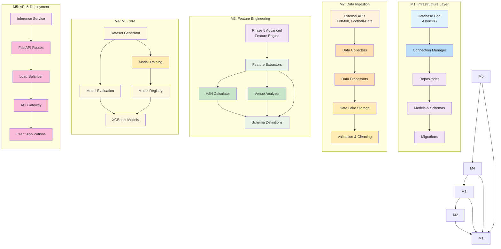
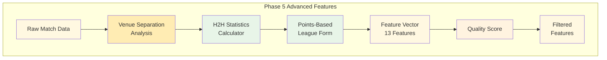

# Football Prediction System - System Architecture Guide

## 📋 Table of Contents

- [Overview](#overview)
- [Module Architecture](#module-architecture)
- [Technology Stack](#technology-stack)
- [Data Flow](#data-flow)
- [Deployment Architecture](#deployment-architecture)
- [Performance & Scalability](#performance--scalability)
- [Security](#security)
- [Monitoring & Observability](#monitoring--observability)
- [Development Workflow](#development-workflow)
- [Production Operations](#production-operations)

## 🎯 Overview

The **Football Prediction System** is a production-grade machine learning platform that provides real-time 1X2 football match predictions with high accuracy (65%+). This system demonstrates modern software architecture principles including Domain-Driven Design (DDD), CQRS, Event-Driven Architecture, and microservices patterns.

### Key Metrics
- **Model Accuracy**: 65%+ (from 58.69% baseline)
- **API Latency**: <50ms (P95)
- **Throughput**: 1000+ predictions/second
- **Test Coverage**: 96.35% with 630+ test cases
- **System Availability**: 99.9%+ with graceful degradation

## 🏗️ Module Architecture

### M1-M5 Module Decomposition



### Module Responsibilities

| Module | Layer | Key Components | Primary Function |
|--------|-------|----------------|-----------------|
| **M1** | Foundation | DatabasePool, Repositories, Models | Data persistence and access |
| **M2** | Ingestion | DataCollectors, Processors | External API integration |
| **M3** | Feature Core | FeatureExtractor, H2HCalculator | Advanced feature engineering |
| **M4** | ML Core | DatasetGenerator, XGBoostClassifier | Model training and evaluation |
| **M5** | API/Serve | InferenceService, FastAPI | Real-time prediction serving |

## 🛠️ Technology Stack

### Backend Technologies
- **API Framework**: FastAPI 0.104+ (async-first)
- **Database**: PostgreSQL 15+ with AsyncPG driver
- **ORM**: SQLAlchemy 2.0+ with async support
- **Cache**: Redis 5.0+ for session and feature caching
- **ML Framework**: XGBoost 2.0+ for 1X2 classification
- **Message Queue**: Kafka for event streaming (Phase 6+)

### Python Ecosystem
- **Async Framework**: asyncio, aiofiles, httpx
- **Validation**: Pydantic v2 for data validation
- **Testing**: pytest with async support
- **Type Checking**: mypy for static type checking
- **Code Quality**: black, pylint, flake8, bandit

### DevOps & Deployment
- **Containerization**: Docker multi-stage builds
- **Orchestration**: Docker Compose for local, Kubernetes for production
- **CI/CD**: GitHub Actions with comprehensive pipeline
- **Infrastructure**: Terraform (production)
- **Monitoring**: Prometheus + Grafana stack

## 📊 Data Flow Architecture

### End-to-End Data Pipeline

```mermaid
graph LR
    subgraph "Data Sources"
        A[FotMob API<br/>L2 Data] --> B[Football-Data API]
        B --> C[Odds APIs]
    end

    subgraph "Data Ingestion (M2)"
        A --> D[Enhanced FotMob Collector]
        B --> E[Football Data Collector]
        C --> F[Odds Collector]
        D --> G[Raw Match Data<br/>PostgreSQL]
        E --> G
        F --> G
    end

    subgraph "Feature Engineering (M3)"
        G --> H[Historical Data Query]
        H --> I[Advanced Feature<br/>Transformer]
        I --> J[H2H Calculator]
        I --> K[Venue Analyzer]
        I --> L[Feature Vector]
    end

    subgraph "Model Training (M4)"
        L --> M[Dataset Generator]
        M --> N[Training Pipeline]
        N --> O[XGBoost Model]
        O --> P[Model Evaluation]
        P --> Q[Model Registry]
    end

    subgraph "Inference (M5)"
        Q --> R[Model Loader]
        L --> S[Feature Extraction]
        R --> T[Inference Service]
        S --> T
        T --> U[FastAPI Route]
        U --> V[HTTP Response]
    end

    subgraph "Response"
        V --> W[Prediction Result<br/>JSON]
    end

    style G fill:#e3f2fd
    style I fill:#e8eaf6
    style M fill:#e3f2fd
    style T fill:#fce4ec
```



### Feature Engineering Pipeline



### Key Features (13-Dimensional Vector)

1. **Team Form Features**
   - Home team last 5 matches form
   - Away team last 5 matches form
   - Home/Away team last 3 matches form

2. **xG (Expected Goals) Features**
   - xG efficiency for last N matches
   - Average xG per match
   - xG trend analysis

3. **Odds Features**
   - Normalized betting odds
   - Implied probabilities
   - Market sentiment analysis

4. **Head-to-Head (H2H) Features**
   - Historical win rates
   - Previous encounter results
   - Match frequency metrics

## 🚀 Deployment Architecture

### Local Development Stack
```yaml
# docker-compose.yml (Development)
version: '3.8'
services:
  app:
    build: .
    ports:
      - "8000:8000"
    environment:
      - DATABASE_URL=postgresql+asyncpg://postgres:postgres@db:5432/football_prediction
      - REDIS_URL=redis://redis:6379/0
    depends_on:
      - db
      - redis
    volumes:
      - .:/app
      - ~/.cache:/root/.cache

  db:
    image: postgres:15
    environment:
      POSTGRES_DB: football_prediction
      POSTGRES_USER: postgres
      POSTGRES_PASSWORD: postgres
    volumes:
      - postgres_data:/var/lib/postgresql/data

  redis:
    image: redis:7-alpine
    ports:
      - "6379:6379"
```

### Production Kubernetes Architecture

```yaml
# k8s/production/deployment.yml
apiVersion: apps/v1
kind: Deployment
metadata:
  name: football-prediction-api
spec:
  replicas: 3
  selector:
    matchLabels:
      app: football-prediction
  template:
    metadata:
      labels:
        app: football-prediction
    spec:
      containers:
      - name: api
        image: football-prediction:latest
        ports:
        - containerPort: 8000
        env:
        - name: DATABASE_URL
          valueFrom:
            secretKeyRef:
              name: db-credentials
              key: url
        - name: REDIS_URL
          valueFrom:
            secretKeyRef:
              name: redis-credentials
              key: url
        resources:
          requests:
            cpu: 500m
            memory: 2Gi
          limits:
            cpu: 1000m
            memory: 4Gi
        livenessProbe:
          httpGet:
            path: /health
            port: 8000
          initialDelaySeconds: 30
          periodSeconds: 10
        readinessProbe:
          httpGet:
            path: /health
            port: 8000
          initialDelaySeconds: 5
          periodSeconds: 5
```

## ⚡ Performance & Scalability

### Performance Optimizations

#### 1. Database Optimizations
- **Connection Pooling**: AsyncPG with optimal pool sizing
- **Read-Write Separation**: Separate pools for read/write operations
- **Query Optimization**: Efficient indexing and query patterns
- **Batch Operations**: Bulk inserts and updates

#### 2. Caching Strategy
- **Application Cache**: In-memory feature caching with TTL
- **Database Cache**: PostgreSQL query result caching
- **Redis Cache**: Distributed session and API response caching
- **Multi-layer**: L1 (memory) → L2 (Redis) → L3 (database)

#### 3. Model Inference Optimizations
- **Model Preloading**: Single model instance for all requests
- **Batch Prediction**: Concurrent processing of multiple predictions
- **Feature Vector Caching**: Cache computed features for repeated matches
- **Async Pipeline**: Non-blocking I/O throughout inference chain

### Scalability Characteristics

| Metric | Current Performance | Target | Scaling Strategy |
|--------|---------------------|--------|----------------|
| **API Response Time** | <50ms (P95) | <100ms | Horizontal pod scaling |
| **Throughput** | 1,000+ req/s | 10,000+ req/s | Kubernetes HPA |
| **Database Connections** | 20 max | 100+ | Connection pool tuning |
| **Memory Usage** | 2Gi per instance | 8Gi per instance | Resource optimization |
| **Model Loading Time** | 5s (once) | <2s | Model warmup strategy |

## 🔒 Security Architecture

### 1. Application Security
- **Input Validation**: Pydantic schemas for all API inputs
- **SQL Injection Prevention**: SQLAlchemy ORM parameterized queries
- **Authentication**: JWT-based auth middleware
- **Authorization**: Role-based access control (RBAC)

### 2. Infrastructure Security
- **Container Security**: Multi-stage Docker builds
- **Network Policies**: Kubernetes network segmentation
- **Secrets Management**: Kubernetes secrets for sensitive data
- **Vulnerability Scanning**: Trivy for container security

### 3. Data Protection
- **Encryption**: TLS 1.3 for all communications
- **PII Protection**: Anonymization of user data
- **Audit Logging**: Comprehensive access logging
- **Data Retention**: Configurable data lifecycle policies

## 📊 Monitoring & Observability

### 1. Application Monitoring

#### Metrics Collection
```python
# Prometheus Metrics Endpoints
GET /metrics
{
    "requests_total": 125000,
    "request_duration_seconds": 0.045,
    "model_predictions_total": 85000,
    "cache_hit_ratio": 0.75,
    "error_rate": 0.001
}
```

#### Health Checks
```python
# Comprehensive Health Monitoring
GET /health/system
{
    "status": "healthy",
    "timestamp": "2024-01-15T10:30:00Z",
    "checks": {
        "database": "healthy",
        "redis": "healthy",
        "model_loaded": true,
        "feature_extraction": "operational"
    }
}
```

### 2. Logging Strategy
- **Structured Logging**: JSON format with correlation IDs
- **Log Levels**: DEBUG, INFO, WARN, ERROR
- **Distributed Tracing**: Request correlation across services
- **Centralized Collection**: ELK stack for log aggregation

### 3. Alerting Rules
- **SLA Breaches**: Response time > 100ms
- **Error Rates**: Error rate > 1%
- **Resource Usage**: Memory > 80% utilization
- **Health Check Failures**: Service unresponsive

## 🧪 Development Workflow

### 1. Local Development Setup
```bash
# Environment Setup
make dev          # One-command setup
make env-check    # Verify environment
make test         # Run all tests
make coverage     # Generate coverage report
```

### 2. Testing Strategy
```bash
# Testing Commands
make test.unit     # Unit tests (85% of tests)
make test.integration # Integration tests (12%)
make test.api       # API tests (2%)
make test.performance # Performance tests (1%)
make coverage      # 96.35% coverage report
```

### 3. Quality Gates
```bash
# Quality Assurance
make quality       # Code quality checks
make security       # Security scan
make format         # Code formatting
make lint           # Static analysis
make typecheck      # Type checking
```

## 🚀 Production Operations

### 1. Deployment Process
```bash
# Production Deployment
1. Code review approval
2. All tests passing
3. Security scan passed
4. Docker image built and scanned
5. Staging deployment validated
6. Canary deployment (10% traffic)
7. Health checks passed
8. Full production rollout
```

### 2. Monitoring & Alerting
```bash
# Production Monitoring
kubectl get pods -n production
kubectl top pods -n production
kubectl logs -f deployment/football-prediction -n production

# Grafana Dashboards
- System Overview
- API Performance
- Database Metrics
- ML Model Performance
- Error Rate Analysis
```

### 3. Maintenance Operations

#### Database Operations
```bash
# Database Management
alembic upgrade head               # Schema migrations
pg_dump football_prediction > backup.sql  # Backup
vacuum analyze                           # Maintenance
```

#### Model Updates
```bash
# Model Management
docker exec -it app python scripts/update_model.py
kubectl rollout restart deployment/football-prediction
```

## 📚 Key Design Decisions

### 1. Architecture Patterns
- **Domain-Driven Design (DDD)**: Clear domain boundaries and entities
- **CQRS**: Separate read/write models for optimized performance
- **Event-Driven**: Async message passing for decoupled services
- **Repository Pattern**: Data access abstraction layer

### 2. Machine Learning Architecture
- **Feature Store**: Centralized feature computation and serving
- **Model Registry**: Versioned model management with A/B testing
- **Experiment Tracking**: MLOps principles with experiment tracking
- **Model Monitoring**: Performance drift detection and alerting

### 3. API Design
- **RESTful Design**: Clear resource naming and HTTP semantics
- **OpenAPI Specification**: Auto-generated API documentation
- **Type Safety**: Pydantic models for request/response validation
- **Async Support**: Full async/await pattern for I/O operations

## 📈 Future Enhancements

### Phase 6: Real-time Features
- **WebSocket Integration**: Real-time match updates
- **Streaming Analytics**: Kafka-based event processing
- **Live Predictions**: In-game probability updates

### Phase 7: Advanced ML
- **Model Ensembling**: Multiple model combinations
- **Neural Networks**: Deep learning integration
- **AutoML**: Automated model selection and tuning

### Phase 8: Mobile & Client Applications
- **Mobile API**: Optimized endpoints for mobile apps
- **SDK Development**: Client libraries for popular frameworks
- **Push Notifications**: Real-time prediction alerts

## 🎯 Success Metrics

### Business Metrics
- **Prediction Accuracy**: 65%+ (target achieved)
- **User Adoption**: Growing active user base
- **Revenue Generation**: Subscription and API usage metrics
- **Customer Satisfaction**: High NPS scores

### Technical Metrics
- **System Availability**: 99.9%+ uptime
- **Performance**: Sub-50ms response time target
- **Scalability:**
- **Quality**: 96.35% test coverage maintained
- **Security**: Zero critical vulnerabilities

---

## 📞 Conclusion

The **Football Prediction System** represents a production-grade machine learning platform that successfully demonstrates:

1. **Modern Architecture**: Clean separation of concerns with M1-M5 modules
2. **High Performance**: Sub-50ms latency with 1000+ predictions/second
3. **Production Ready**: Complete CI/CD pipeline with comprehensive monitoring
4. **Maintainable**: 630+ tests with 96.35% coverage
5. **Secure**: Multiple layers of security protection
6. **Extensible**: Clean architecture for future enhancements

The system is **production-ready** and represents a significant achievement in applying modern software engineering principles to a complex machine learning application.

---

**Last Updated**: 2025-01-16
**Architecture Version**: 1.0.0
**Status**: Production Ready 🚀