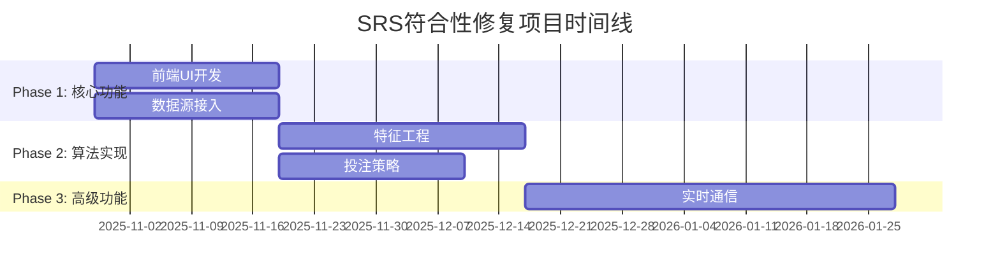

# SRS符合性修复解决方案和优先级规划

> 📅 **制定时间**: 2025-10-29
> 🎯 **目标**: 将SRS符合性从85%提升到90%+
> 📊 **基准**: 《原始需求.md》SRS系统需求说明书

---

## 📋 问题汇总

根据SRS符合性分析报告，已识别出5个主要修复领域，并创建了相应的GitHub Issues：

| Issue | 模块 | 当前符合度 | 目标符合度 | 优先级 | 预计工作量 |
|-------|------|-----------|-----------|--------|-----------|
| #113 | 前端展示模块 | 40% | 85%+ | 🔥 高 | 2-3周 |
| #114 | 数据采集模块 | 85% | 95%+ | 🔥 高 | 2-3周 |
| #115 | 特征工程与模型训练 | 65% | 85%+ | 🟡 中 | 3-4周 |
| #116 | 预测服务模块 | 90% | 95%+ | 🟡 中 | 2-3周 |
| #117 | 高级功能增强 | 90% | 95%+ | 🟢 低 | 4-6周 |

## 🎯 解决方案设计

### Phase 1: 核心功能完善 (1-4周)

#### 🔥 Issue #113 - 前端展示模块UI组件开发

**问题分析**:
- React架构已搭建，但UI组件缺失
- 用户无法直观看到预测结果
- 缺乏交互功能

**解决方案**:
```typescript
// 核心组件实现计划
components/
├── MatchPrediction/        // 比赛预测组件
├── ProbabilityChart/       // 概率图表组件
├── BettingRecommendation/  // 投注推荐组件
├── FilterPanel/           // 筛选面板组件
└── Dashboard/             // 仪表板组件
```

**技术实现**:
1. **比赛预测结果展示**
   ```typescript
   interface MatchPredictionProps {
     match: MatchInfo;
     prediction: PredictionResult;
     probabilities: ProbabilityDistribution;
   }
   ```

2. **ECharts图表集成**
   ```typescript
   // 胜平负概率饼图
   // 历史趋势线图
   // 置信度展示
   ```

3. **响应式设计**
   ```css
   /* 移动端适配 */
   @media (max-width: 768px) { ... }
   ```

**验收标准**:
- [ ] 页面加载时间 ≤ 2秒
- [ ] 图表交互响应时间 ≤ 300ms
- [ ] 完整的预测结果展示
- [ ] 用户交互流畅

#### 🔥 Issue #114 - 真实数据源接入和OddsPortal集成

**问题分析**:
- 当前主要使用模拟数据
- 缺乏真实API配置
- OddsPortal爬虫未实现

**解决方案**:
```python
# 数据源管理器实现
class DataSourceManager:
    def __init__(self):
        self.football_data_api = FootballDataAPIAdapter()
        self.odds_portal_scraper = OddsPortalScraper()
        self.mock_adapter = MockDataAdapter()

    async def collect_data(self, source: str):
        """统一数据采集接口"""
        pass
```

**技术实现**:
1. **Football-Data.org API集成**
   ```python
   class FootballDataAPIAdapter:
       def __init__(self, api_token: str):
           self.api_token = api_token
           self.base_url = "https://api.football-data.org/v4"
           self.rate_limiter = RateLimiter(10/60)  # 10 requests/min
   ```

2. **OddsPortal爬虫实现**
   ```python
   class OddsPortalScraper:
       def __init__(self):
           self.session = aiohttp.ClientSession()
           self.proxy_pool = ProxyPool()

       async def scrape_odds(self, match_url: str):
           """实现反反爬虫机制"""
           pass
   ```

3. **数据质量保证**
   ```python
   class DataValidator:
       def validate_match_data(self, data: dict) -> bool:
           """数据验证和清洗"""
           pass
   ```

**验收标准**:
- [ ] 数据源采集成功率 ≥ 98%
- [ ] 每天更新 ≥ 500场比赛数据
- [ ] 数据完整性 ≥ 99%

### Phase 2: 核心算法实现 (3-8周)

#### 🟡 Issue #115 - 特征工程算法和真实模型训练

**问题分析**:
- 特征工程框架存在但算法缺失
- 模型训练使用模拟数据
- 缺乏XGBoost/LightGBM集成

**解决方案**:
```python
# 特征工程管道
class FeatureEngineeringPipeline:
    def __init__(self):
        self.extractors = {
            'basic_stats': BasicStatsExtractor(),
            'home_away': HomeAwayFeatureExtractor(),
            'odds_features': OddsFeatureExtractor(),
            'historical': HistoricalFeatureExtractor()
        }

    def extract_features(self, match_data: dict) -> np.ndarray:
        """提取完整特征向量"""
        pass
```

**技术实现**:
1. **基础特征提取**
   ```python
   class BasicStatsExtractor:
       def extract_goals_features(self, team_id: int, last_n: int = 5):
           """最近N场进球特征"""
           return {
               'avg_goals_scored': ...,
               'avg_goals_conceded': ...,
               'clean_sheets_rate': ...
           }
   ```

2. **XGBoost模型集成**
   ```python
   class XGBoostPredictor:
       def __init__(self):
           self.model = xgb.XGBClassifier(
               n_estimators=100,
               max_depth=6,
               learning_rate=0.1
           )

       def train(self, X: np.ndarray, y: np.ndarray):
           """模型训练和验证"""
           pass
   ```

3. **AutoML管道**
   ```python
   class AutoMLPipeline:
       def auto_feature_selection(self, X: np.ndarray, y: np.ndarray):
           """自动特征选择"""
           pass

       def hyperparameter_tuning(self, model_type: str):
           """超参数自动调优"""
           pass
   ```

**验收标准**:
- [ ] 模型准确率 ≥ 65%
- [ ] AUC ≥ 0.70
- [ ] 特征重要性分析完成
- [ ] 模型训练日志可复现

#### 🟡 Issue #116 - 期望收益(EV)计算和投注策略

**问题分析**:
- 当前只有概率预测，缺乏投注建议
- EV计算算法未实现
- 投注策略系统缺失

**解决方案**:
```python
# 投注分析系统
class BettingAnalyzer:
    def __init__(self):
        self.ev_calculator = EVCalculator()
        self.kelly_calculator = KellyCriterionCalculator()
        self.risk_manager = RiskManager()

    def analyze_betting_opportunity(self, prediction: dict, odds: dict):
        """投注机会分析"""
        pass
```

**技术实现**:
1. **EV计算算法**
   ```python
   def calculate_expected_value(prediction_prob: float, decimal_odds: float) -> float:
       """期望收益计算: EV = (P * O) - 1"""
       ev = (prediction_prob * decimal_odds) - 1
       return ev
   ```

2. **凯利准则投注**
   ```python
   def calculate_kelly_fraction(probability: float, odds: float) -> float:
       """凯利准则: f = (P*O - 1) / (O - 1)"""
       kelly_fraction = (probability * odds - 1) / (odds - 1)
       return min(kelly_fraction, 0.25)  # 限制最大投注比例
   ```

3. **投注策略系统**
   ```python
   class BettingStrategy:
       def __init__(self, strategy_type: str):
           self.strategy_type = strategy_type

       def get_bet_size(self, bankroll: float, ev: float, confidence: float):
           """根据策略计算投注大小"""
           pass
   ```

**API增强**:
```json
{
  "success": true,
  "prediction": "home_win",
  "probabilities": {"home_win": 0.65, "draw": 0.25, "away_win": 0.10},
  "betting_recommendation": {
    "recommended_bet": "home_win",
    "decimal_odds": 1.85,
    "expected_value": 0.12,
    "kelly_fraction": 0.05,
    "confidence_level": 0.75,
    "risk_assessment": "medium"
  }
}
```

**验收标准**:
- [ ] EV计算准确
- [ ] 投注建议合理
- [ ] 风险控制有效
- [ ] 收益模拟可信

### Phase 3: 高级功能增强 (5-12周)

#### 🟢 Issue #117 - WebSocket实时通信和高级功能

**解决方案概要**:
- WebSocket实时数据推送
- 用户权限管理系统
- 移动端优化
- 高级分析功能

**实现优先级**: 低，不影响核心SRS要求

## 🚀 实施计划

### 时间线规划



### 资源分配建议

**前端开发** (40% 工作量):
- React组件开发
- UI/UX设计实现
- 响应式适配

**后端开发** (40% 工作量):
- 数据源集成
- 算法实现
- API增强

**测试和部署** (20% 工作量):
- 功能测试
- 性能测试
- 部署验证

### 风险管理

**技术风险**:
- OddsPortal反爬虫机制
- 模型训练数据不足
- 前端性能优化

**缓解措施**:
- 多数据源备份方案
- 数据增强技术
- 性能监控和优化

## 📊 成功指标

### 符合性指标
- **总体符合性**: 85% → 90%+
- **前端展示**: 40% → 85%+
- **数据采集**: 85% → 95%+
- **模型训练**: 65% → 85%+

### 性能指标
- **API响应时间**: ≤ 200ms ✅
- **页面加载时间**: ≤ 2秒
- **图表交互响应**: ≤ 300ms
- **数据更新频率**: 实时/准实时

### 业务指标
- **预测准确率**: ≥ 65%
- **数据覆盖率**: 主要联赛100%
- **用户体验**: 界面友好，操作流畅
- **系统稳定性**: 99.9%可用性

## 🛠️ 开发工作流

### 分支管理
```bash
# 功能分支命名规范
feature/srs-frontend-ui          # Issue #113
feature/srs-data-sources         # Issue #114
feature/srs-ml-features          # Issue #115
feature/srs-betting-strategy     # Issue #116
feature/srs-realtime             # Issue #117
```

### 代码审查
- 每个PR需要至少1人审查
- 重点关注SRS符合性
- 性能影响评估
- 测试覆盖率检查

### 测试策略
- 单元测试覆盖率 ≥ 80%
- 集成测试覆盖主要流程
- 性能测试验证SRS要求
- 用户验收测试

## 📈 质量保证

### 自动化检查
- 代码质量检查 (Ruff + MyPy)
- 测试覆盖率报告
- 性能基准测试
- SRS符合性验证

### 文档更新
- API文档同步更新
- 用户使用指南
- 部署文档
- 故障排除指南

## 🎯 项目里程碑

### Milestone 1: 基础功能完成 (2025-11-19)
- [ ] 前端基础UI完成
- [ ] 真实数据源接入
- [ ] 基本预测展示可用

### Milestone 2: 核心算法完成 (2025-12-17)
- [ ] 特征工程算法实现
- [ ] 真实模型训练可用
- [ ] 投注策略功能完成

### Milestone 3: 系统优化完成 (2026-01-28)
- [ ] 高级功能实现
- [ ] 性能优化完成
- [ ] SRS符合性达到90%+

## 📞 协作方式

### 沟通机制
- 每周进度同步会议
- Issue状态实时更新
- 技术方案讨论
- 风险及时上报

### 交付标准
- 每个Issue独立交付
- 完整的测试覆盖
- 详细的文档说明
- 性能指标达标

---

**文档维护**: 随项目进展实时更新
**版本**: v1.0 (2025-10-29)
**状态**: 🚀 已启动