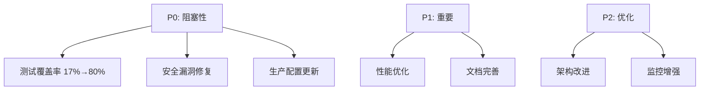

# 🤖 AI助手使用指南

本指南说明如何使用AI助手来管理和维护生产就绪任务看板。

## 📋 快速开始

### 1. 查看当前任务状态

```bash
# 查看完整任务看板
cat docs/_tasks/PRODUCTION_READINESS_BOARD.md

# 查看特定阶段任务
grep -A 20 "Phase 0:" docs/_tasks/PRODUCTION_READINESS_BOARD.md

# 查看所有未完成任务
grep -E "\[ \]" docs/_tasks/PRODUCTION_READINESS_BOARD.md
```

### 2. 更新任务状态

#### 手动更新
```bash
# 编辑看板文件
vim docs/_tasks/PRODUCTION_READINESS_BOARD.md

# 任务状态说明：
# [ ]  - 待开始
# [⏳] - 进行中
# [x]  - 已完成
```

#### AI自动更新
```bash
# 运行AI助手脚本
python scripts/ai_maintenance/update_task_board.py

# 更新特定任务状态
python -c "
from scripts.ai_maintenance.update_task_board import TaskBoardUpdater
updater = TaskBoardUpdater()
updater.update_task_status('API-001', 'completed')
"
```

### 3. 获取AI建议

```bash
# 运行AI助手获取智能建议
python scripts/ai_maintenance/update_task_board.py

# AI会基于当前状态生成建议，例如：
# - 📈 进度建议: 当前完成度较低，建议增加每日任务量
# - 🔴 优先级最高: 专注于核心API端点测试
# - 🔒 安全提醒: 仍有未完成的安全任务
```

## 🔄 持续集成流程

### 自动检查触发
- **代码推送**: 自动运行测试并更新覆盖率
- **每日定时**: 早上9点自动生成进度报告
- **手动触发**: 可在GitHub Actions页面手动运行

### 检查项目
1. **测试覆盖率** (目标≥80%)
2. **安全漏洞扫描** (目标0漏洞)
3. **代码质量检查** (Ruff 0错误)
4. **任务进度跟踪**

### 自动更新内容
- 任务看板中的测试覆盖率
- 任务完成状态统计
- 周进度报告
- 状态徽章

## 📊 任务管理最佳实践

### 任务优先级


### 每日工作流
1. **查看任务**: 确认今日目标
2. **开发测试**: 编写代码和测试
3. **提交代码**: 触发自动检查
4. **查看反馈**: 根据CI结果调整
5. **更新状态**: 标记完成任务

### 周进度回顾
```bash
# 查看本周周报
ls docs/_reports/weekly/
cat docs/_reports/weekly/WEEKLY_PROGRESS_$(date +%Y-%m-%d).md

# 查看整体进度
grep -E "(完成率|覆盖率)" docs/_tasks/PRODUCTION_READINESS_BOARD.md
```

## 🎯 AI助手功能详解

### 1. 智能任务推荐
```python
# AI会分析当前状态并推荐下一个任务
# 例如：当覆盖率<40%时，推荐优先做API端点测试
```

### 2. 自动进度计算
```python
# 自动计算各阶段完成率
# 统计已完成/进行中/待开始任务数
# 更新进度图表
```

### 3. 风险预警
```python
# 检测潜在风险
# - 覆盖率增长缓慢
# - 安全任务积压
# - 进度落后于计划
```

### 4. 优化建议
```python
# 基于历史数据提供优化建议
# - 测试策略调整
# - 资源分配建议
# - 技术方案优化
```

## 🔧 自定义配置

### 修改检查阈值
```python
# scripts/ai_maintenance/update_task_board.py
COVERAGE_THRESHOLD = 80  # 修改覆盖率阈值
SECURITY_VULNS_THRESHOLD = 0  # 修改安全漏洞阈值
```

### 添加自定义检查
```yaml
# .github/workflows/production-readiness-check.yml
# 添加新的检查作业
- name: Custom Check
  run: |
    # 自定义检查脚本
```

### 自定义报告模板
```python
# scripts/ai_maintenance/update_task_board.py
def generate_custom_report(self):
    # 自定义报告生成逻辑
    pass
```

## 📈 监控和告警

### 进度监控
- 实时覆盖率跟踪
- 任务完成趋势
- 里程碑进度

### 自动告警
- 覆盖率下降告警
- 新安全漏洞告警
- 进度滞后告警

### 报告订阅
```yaml
# 可配置邮件/Slack通知
notifications:
  email:
    - team@example.com
  slack:
    channel: "#production-readiness"
```

## 🤝 协作指南

### 团队成员职责
- **开发者**: 完成 assigned 任务，更新状态
- **QA工程师**: 验证测试质量，提供反馈
- **DevOps**: 维护CI/CD流程，监控部署
- **项目经理**: 跟踪整体进度，协调资源

### 代码提交规范
```bash
# 提交信息格式
git commit -m "feat(test): add API-001 health endpoint tests"
git commit -m "fix(security): upgrade FastAPI to 0.109.1"
git commit -m "chore: update task board status"

# 自动触发任务更新
# 提交信息包含任务ID会自动更新状态
```

### 问题反馈
```bash
# 在GitHub Issue中报告问题
# 标签: production-readiness
# 模板: 包含任务ID、问题描述、期望结果
```

## 📚 相关文档

- [任务看板](PRODUCTION_READINESS_BOARD.md) - 完整任务列表
- [上线报告](../_reports/PRODUCTION_READINESS_REPORT.md) - 详细分析报告
- [CI配置](../../.github/workflows/production-readiness-check.yml) - 自动化流程
- [测试指南](../../docs/testing/) - 测试最佳实践

---

## 💡 提示

1. **定期查看**: 每天开始工作前查看任务看板
2. **及时更新**: 完成任务立即更新状态
3. **关注AI建议**: AI会基于数据分析提供有价值的建议
4. **团队协作**: 保持沟通，避免重复工作
5. **持续改进**: 根据反馈优化流程和工具

> 🤖 **AI助手承诺**: 全程陪伴，智能辅助，确保生产就绪目标达成！