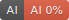
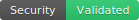
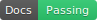
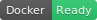
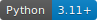
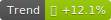

# 🏅 质量徽章索引

本项目支持自动生成的质量状态徽章，用于在README、文档和GitHub中展示项目质量状态。

## 📋 可用徽章

| 徽章 | 文件名 | 描述 | 数据来源 |
|------|--------|------|----------|
|  | coverage.svg | 测试覆盖率 | 质量快照 |
|  | quality.svg | 质量分数 | 质量快照 |
|  | tests.svg | 测试状态 | 质量快照 |
|  | ai.svg | AI驱动指标 | 质量快照 |
|  | security.svg | 安全状态 | 质量快照 |
|  | docs.svg | 文档状态 | 质量快照 |
|  | docker.svg | Docker就绪状态 | 质量快照 |
|  | python.svg | Python版本 | 质量快照 |
|  | trend.svg | 质量趋势 | 质量快照 |


## 📝 使用方法

### 在Markdown中使用
```markdown


```

### 在HTML中使用
```html


```

### 在GitHub README中使用
```markdown
[](docs/_reports/TEST_COVERAGE_KANBAN.md)
[](docs/_reports/TEST_COVERAGE_KANBAN.md)
[](docs/_reports/TEST_COVERAGE_KANBAN.md)
```

## 🔄 自动更新

徽章通过以下方式自动更新：
- **CI/CD**: 在GitHub Actions中自动生成和更新
- **本地命令**: 运行 `make generate-badges`
- **质量检查**: 运行 `make quality-dashboard` 时自动生成

## 🎨 自定义徽章

如需自定义徽章样式或添加新徽章类型，请编辑 `scripts/generate_badges.py`。

### 添加新徽章类型
1. 在 `BadgeGenerator` 类中添加新的生成方法
2. 在 `generate_all_quality_badges` 中调用新方法
3. 更新本索引文件

---

*最后更新: 2025-09-28 07:59:48
*自动生成 by: scripts/generate_badges.py*
