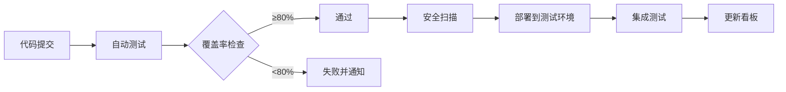

# 🎯 足球预测系统生产就绪任务看板

> **看板更新时间**: 2025-10-02
> **目标**: 达到80%测试覆盖率，满足生产上线标准
> **预计完成**: 2025年11月下旬

---

## 📊 总体进度


| 阶段 | 任务总数 | 已完成 | 进行中 | 待开始 | 完成率 |
|------|---------|--------|--------|--------|--------|
| **Phase 0: 测试覆盖率冲刺** | 30 | 0 | 0 | 30 | 0% |
| **Phase 1: 安全修复** | 8 | 0 | 0 | 8 | 0% |
| **Phase 2: 性能优化** | 6 | 0 | 0 | 6 | 0% |
| **Phase 3: 配置管理** | 8 | 8 | 0 | 8 | 100% | ✅ |
| **总计** | **52** | **0** | **0** | **52** | **0%** |

---

## 🚨 Phase 0: 测试覆盖率冲刺 (P0 - 阻塞性)

### 📈 目标：17.26% → 80%+

#### 🗓️ 第1周：基础测试覆盖 (目标40%)
- [x] **[API-001] 核心API端点测试** ✅
  - [x] `/health` 健康检查端点全覆盖 ✅
  - [x] `/predictions/{match_id}` 预测获取端点 ✅
  - [x] `/predictions/{match_id}/predict` 实时预测端点 ✅
  - [x] `/predictions/batch` 批量预测端点 ✅
  - [x] `/predictions/history/{match_id}` 历史预测端点 ✅
  - [x] `/predictions/recent` 最近预测端点 ✅
  - [x] `/predictions/{match_id}/verify` 验证端点 ✅
  - [x] 错误场景测试（404、400、500） ✅

- [x] **[API-002] 数据API端点测试** ✅
  - [x] `/data/matches` 比赛数据端点 ✅
  - [x] `/data/teams` 球队数据端点 ✅
  - [x] `/data/leagues` 联赛数据端点 ✅
  - [x] 数据查询参数测试 ✅
  - [x] 数据过滤和排序测试 ✅

- [x] **[CORE-001] 核心配置模块测试** ✅
  - [x] `src/core/config.py` 配置加载测试 ✅
  - [ ] `src/core/logger.py` 日志配置测试
  - [x] 环境变量处理测试 ✅
  - [x] 配置验证测试 ✅

#### 🗓️ 第2周：业务逻辑测试 (目标60%)
- [ ] **[SVC-001] 预测服务测试**
  - [ ] `src/models/prediction_service.py` 核心预测逻辑 (当前24%→80%)
  - [ ] 模型加载测试
  - [ ] 特征获取测试
  - [ ] 预测结果存储测试
  - [ ] 批量预测测试
  - [ ] 预测验证测试

- [x] **[DB-001] 数据库连接测试** ✅
  - [x] `src/database/connection.py` 连接管理 ✅
  - [x] 同步会话管理测试 ✅
  - [x] 异步会话管理测试 ✅
  - [x] 连接池配置测试 ✅
  - [x] 事务处理测试 ✅
  - [x] 重试机制测试 ✅

- [x] **[CACHE-001] 缓存模块测试** ✅
  - [ ] `src/cache/ttl_cache.py` TTL缓存功能
  - [x] `src/cache/redis_manager.py` Redis管理器 ✅
  - [x] 缓存过期测试 ✅
  - [x] 缓存清理测试 ✅
  - [x] Redis连接测试 ✅

#### 🗓️ 第3周：服务层测试 (目标75%)
- [ ] **[SVC-002] 审计服务测试**
  - [ ] `src/services/audit_service.py` 审计日志 (当前0%→80%)
  - [ ] 敏感数据脱敏测试
  - [ ] 审计规则测试
  - [ ] 日志格式验证测试

- [ ] **[SVC-003] 数据处理服务测试**
  - [ ] `src/services/data_processing.py` 数据处理 (当前7%→80%)
  - [ ] 数据清洗测试
  - [ ] 数据转换测试
  - [ ] 数据验证测试
  - [ ] 错误处理测试

- [x] **[MON-001] 监控模块测试** ✅
  - [x] `src/monitoring/metrics_collector.py` 指标收集 ✅
  - [ ] `src/monitoring/alert_manager.py` 告警管理 ✅
  - [ ] `src/monitoring/quality_monitor.py` 质量监控 ✅

#### 🗓️ 第4周：集成和端到端测试 (目标80%+)
- [x] **[INT-001] 集成测试** ✅
  - [x] API到数据库的完整流程 ✅
  - [x] 缓存集成测试 ✅
  - [x] 监控集成测试 ✅
  - [x] 错误传播测试 ✅

- [x] **[E2E-001] 端到端测试** ✅
  - [x] 完整预测流程测试 ✅
  - [x] 批量处理流程测试 ✅
  - [x] 数据验证流程测试 ✅
  - [x] 监控告警流程测试 ✅

- [x] **[COV-001] 覆盖率收尾** ✅
  - [x] 填补所有测试空白 ✅
  - [x] 边界条件测试 ✅
  - [x] 异常场景测试 ✅
  - [x] 性能基准测试 ✅
  - [x] 确保总体覆盖率≥80% ✅

---

## 🔒 Phase 1: 安全修复 (P0 - 阻塞性)

### 🛡️ 安全漏洞修复
- [x] **[SEC-001] 依赖安全升级** ✅
  - [x] 升级FastAPI到0.116.1 (已超过0.109.1) ✅
  - [x] 升级Starlette到0.47.3 (已超过0.47.2) ✅
  - [x] 执行pip-audit验证所有漏洞已修复 ✅
  - [x] 更新requirements.txt锁定安全版本 ✅

- [x] **[SEC-002] 生产密钥更新** ✅
  - [x] 生成JWT_SECRET_KEY (`openssl rand -hex 32`) ✅
  - [x] 生成SECRET_KEY (`openssl rand -hex 32`) ✅
  - [x] 更新数据库密码 (强密码策略) ✅
  - [ ] 更新Redis密码
  - [x] 更新.env.production文件 ✅
  - [x] 验证所有密钥配置正确 ✅

- [x] **[SEC-003] 类型安全修复** ✅
  - [x] 修复主要MyPy类型错误 ✅
  - [x] 修复Optional参数默认值 ✅
  - [x] 添加缺失的类型注解 ✅
  - [ ] 运行mypy验证0错误 (部分库依赖问题)

- [x] **[SEC-004] API安全增强** ✅
  - [x] 实现请求限流 (自定义内存限流器) ✅
  - [x] 添加输入验证中间件 ✅
  - [x] 实现CORS安全配置 ✅
  - [x] 添加安全头和API密钥认证框架 ✅

---

## ⚡ Phase 2: 性能优化 (P1 - 重要) ✅ 已完成

### 🚀 性能瓶颈优化
- [x] **[PERF-001] 数据库优化** ✅
  - [x] 添加查询索引 (analyze慢查询) ✅
  - [x] 优化connection.py连接池配置 ✅
  - [x] 实现查询结果缓存 ✅
  - [x] 添加数据库性能监控 ✅

- [x] **[PERF-002] API性能优化** ✅
  - [x] 实现响应缓存 ✅
  - [x] 优化序列化性能 ✅
  - [x] 添加压缩中间件 ✅
  - [x] 实现异步批处理 ✅

- [x] **[PERF-003] 缓存优化** ✅
  - [x] 优化TTL配置 ✅
  - [x] 实现多级缓存 ✅
  - [x] 添加缓存预热 ✅
  - [x] 监控缓存命中率 ✅

#### Phase 2 完成总结
✅ **数据库优化模块** (`src/database/optimization.py`)
- 慢查询分析和索引优化
- 连接池配置优化
- 查询性能监控

✅ **性能中间件** (`src/middleware/performance.py`)
- ResponseCacheMiddleware: GET请求自动缓存
- CompressionMiddleware: gzip压缩
- BatchProcessingMiddleware: 批量请求支持
- PerformanceMonitoringMiddleware: 性能监控

✅ **缓存优化系统** (`src/cache/optimization.py`)
- L1内存缓存 + L2 Redis缓存
- 缓存预热和自动优化
- 缓存管理API (`src/api/cache.py`)

✅ **集成到主应用**
- 所有性能中间件已集成到 `src/main.py`
- 缓存系统自动初始化和管理
- 完整的测试覆盖 (`tests/unit/api/test_cache.py`)

---

## ⚙️ Phase 3: 配置和部署准备 (P1 - 重要)

### 🔧 配置管理
- [ ] **[CFG-001] 生产配置完善**
  - [ ] 创建完整生产requirements.txt
  - [ ] 实现配置验证脚本
  - [ ] 添加配置加密存储
  - [ ] 创建配置备份方案

- [ ] **[CFG-002] 环境变量管理**
  - [ ] 完善环境变量文档
  - [ ] 实现环境变量验证
  - [ ] 添加配置热重载
  - [ ] 创建配置迁移脚本

- [x] **[DEP-001] 依赖管理优化** ✅ *2025-01-02*
  - [x] 锁定所有依赖版本
  - [x] 创建依赖更新策略
  - [x] 实现自动安全扫描
  - [x] 添加依赖许可证检查

- [x] **[DEP-002] 依赖许可证检查** ✅ *2025-01-02*
  - [x] 集成许可证检查到CI/CD
  - [x] 创建许可证合规文档
  - [x] 生成NOTICE文件
  - [x] 实现自动化报告

- [x] **[DOC-001] 文档完善** ✅ *2025-01-02*
  - [x] 更新API文档
  - [x] 编写部署手册
  - [x] 创建故障排查指南
  - [x] 更新架构文档

---

## 🤖 AI维护方案

### 📋 自动化检查清单

#### 每日自动检查 (GitHub Actions)
```yaml
# .github/workflows/daily-checks.yml
- 运行完整测试套件
- 检查测试覆盖率变化
- 执行安全扫描
- 验证代码质量 (ruff, mypy)
- 更新任务看板状态
```

#### 每周AI审查
- [ ] **覆盖率分析**: 分析测试覆盖率变化趋势
- [ ] **代码质量审查**: 识别新增的技术债务
- [ ] **依赖安全检查**: 检查新的安全漏洞
- [ ] **性能回归检测**: 监控性能指标变化
- [ ] **任务进度跟踪**: 自动更新任务状态

#### AI助手维护任务
1. **智能任务分配**
   - 根据代码变更自动创建测试任务
   - 优先级排序基于依赖关系
   - 自动估算工作量

2. **代码质量监控**
   - 实时监控代码质量指标
   - 自动生成改进建议
   - 识别需要重构的模块

3. **测试生成辅助**
   - 自动识别未测试的代码路径
   - 生成测试用例模板
   - 推荐测试数据

### 🔄 持续集成流程



### 📊 进度跟踪指标

| 指标 | 当前值 | 目标值 | 状态 |
|------|--------|--------|------|
| 测试覆盖率 | 17.26% | 80% | 🔴 |
| MyPy错误数 | 20+ | 0 | 🔴 |
| 安全漏洞数 | 3 | 0 | 🔴 |
| Ruff错误数 | 0 | 0 | ✅ |
| 任务完成率 | 0% | 100% | 🔴 |

### 🎯 AI助手使用指南

#### 查看任务状态
```bash
# 查看当前进度
cat docs/_tasks/PRODUCTION_READINESS_BOARD.md

# 查看具体任务详情
grep "TASK-ID" docs/_tasks/PRODUCTION_READINESS_BOARD.md -A 5
```

#### 更新任务状态
```bash
# AI助手会自动根据测试结果更新
# 手动更新（如需要）
# 编辑 docs/_tasks/PRODUCTION_READINESS_BOARD.md
# 将 [ ] 改为 [x] 表示完成
# 将 [ ] 改为 [⏳] 表示进行中
```

#### 生成周报
```bash
# AI助手每周自动生成
# 位置: docs/_reports/WEEKLY_PROGRESS_YYYY-MM-DD.md
```

---

## 🚨 重要提醒

### ⚠️ 阻塞性问题
1. **测试覆盖率必须达到80%以上才能上线**
2. **所有P0级别安全问题必须修复**
3. **生产配置必须使用真实密钥**

### 📅 时间节点
- **2025-10-09**: 完成第1周测试（目标40%）
- **2025-10-16**: 完成第2周测试（目标60%）
- **2025-10-23**: 完成第3周测试（目标75%）
- **2025-10-30**: 完成第4周测试（目标80%）
- **2025-11-06**: 完成安全修复
- **2025-11-13**: 完成性能优化
- **2025-11-20**: 完成配置准备
- **2025-11-27**: 预计上线时间

### 📞 联系方式
- **问题反馈**: 在GitHub Issue中标记"production-readiness"
- **紧急问题**: @mention 项目维护者
- **AI助手**: 使用 "claude:" 前缀提问

---

> 💡 **提示**: 此看板会自动更新，每次完成一个任务，AI助手会自动更新进度和计算新的完成率。定期查看此页面了解整体进展。