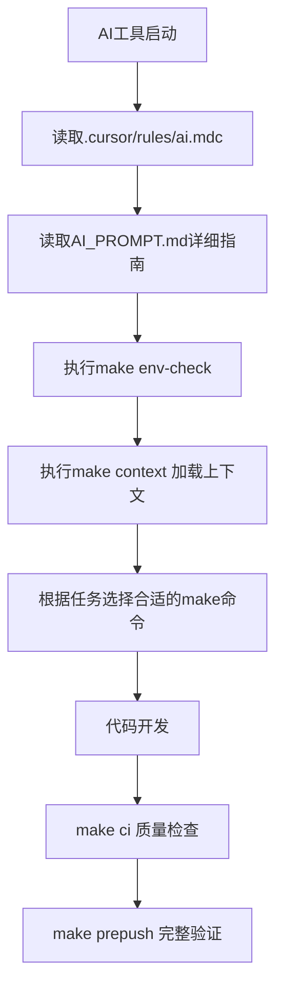

# 🤖 AI工作指南

## 📋 **优化后的AI提示词系统**

你的项目现在采用**工具优先模式**的AI协作体系，由以下文件组成：

### 🔧 **提示词文件结构**
```
📁 FootballPrediction/
├── 📄 AI_PROMPT.md              # 详细的AI开发手册（238行）
├── 📄 .cursor/rules/ai.mdc      # Cursor编辑器核心规则（13行）
└── 📄 AI_WORK_GUIDE.md          # 本文件 - AI使用指南
```

## 🚀 **AI编程工具正确使用方法**

### 1️⃣ **工作启动序列（必须按顺序执行）**
```bash
# 第1步：环境检查
make env-check

# 第2步：加载项目上下文（⭐ 最重要）
make context

# 第3步：开始你的AI编程任务
# （AI工具会自动读取规则和文档）
```

### 2️⃣ **AI工具理解的开发流程**


### 3️⃣ **关键原则**
- 🚫 **工具优先**：禁止绕过Makefile直接运行脚本
- 📋 **上下文优先**：AI必须先运行`make context`
- ✅ **质量优先**：所有变更必须通过`make ci`
- 🔄 **流程优先**：使用`make prepush`完整验证

## 📊 **提示词设计优化要点**

### ✅ **优化成果**
1. **统一化**：规则集中在`.cursor/rules/ai.mdc`
2. **工具化**：突出Makefile工具链重要性
3. **流程化**：明确AI工作启动序列
4. **简洁化**：核心规则只有8条，易于AI理解

### 🔄 **AI工具适配**
- **Cursor**：自动读取`.cursor/rules/ai.mdc`
- **其他AI工具**：引导阅读`AI_PROMPT.md`
- **通用性**：所有AI工具都理解Makefile命令

## 🎯 **使用建议**

### 对用户：
1. 向AI工具明确说明："请使用我们的工具优先模式开发"
2. 提醒AI运行`make context`获取项目上下文
3. 强调任何操作都要通过`make`命令执行

### 对AI工具：
- 你的项目已经完美配置了AI工作环境
- 遵循`.cursor/rules/ai.mdc`的规则即可
- `make context`命令会为你加载完整项目上下文

---

🎉 **你的AI提示词系统现在已经完全优化，可以高效指导任何AI编程工具正确理解和使用你的开发流程！**
