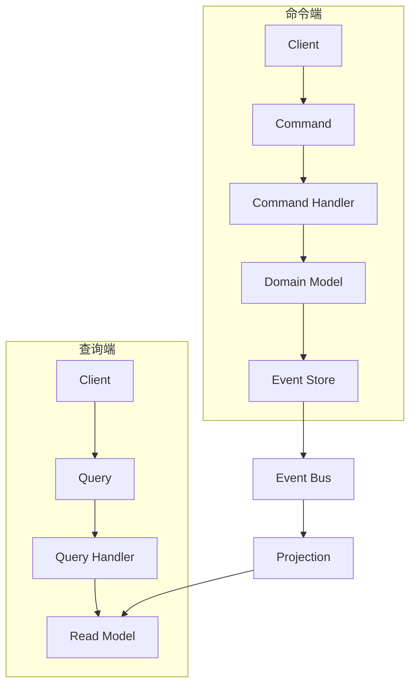

# CQRS模式详细指南

## 📋 文档概述

本文档详细描述了足球预测系统中命令查询责任分离（CQRS）模式的设计、实现和使用方法。

**更新时间**: 2025-11-08
**版本**: v1.0
**适用范围**: 架构师、后端开发人员、系统集成工程师

---

## 🎯 1. CQRS模式概述

### 核心理念
CQRS（Command Query Responsibility Segregation）是一种架构模式，将系统的操作分为两个主要部分：

- **命令（Commands）**: 改变系统状态的操作（创建、更新、删除）
- **查询（Queries）**: 读取系统状态的操作，不改变状态

### CQRS架构优势


### 适用场景
- **高并发读写系统**: 读写操作差异很大
- **复杂业务逻辑**: 命令端需要复杂的验证和业务规则
- **性能优化**: 查询端需要针对特定查询场景优化
- **可扩展性**: 需要独立扩展读写两端

---

## 🏗️ 2. CQRS核心组件架构

### 2.1 基础命令和查询类
**位置**: `src/cqrs/base.py`

```python
from abc import ABC, abstractmethod
from datetime import datetime
from typing import Any, Dict, List, Optional
from dataclasses import dataclass
import uuid

class ValidatableCommand(ABC):
    """可验证命令基类"""

    def __init__(self):
        self._validation_errors: List[str] = []
        self.command_id = str(uuid.uuid4())
        self.created_at = datetime.utcnow()

    @abstractmethod
    async def validate(self) -> 'ValidationResult':
        """验证命令"""
        pass

    def add_error(self, error: str) -> None:
        """添加验证错误"""
        self._validation_errors.append(error)

    def has_errors(self) -> bool:
        """是否有错误"""
        return len(self._validation_errors) > 0

    def get_errors(self) -> List[str]:
        """获取所有错误"""
        return self._validation_errors.copy()

class ValidatableQuery(ABC):
    """可验证查询基类"""

    def __init__(self):
        self._validation_errors: List[str] = []
        self.query_id = str(uuid.uuid4())
        self.created_at = datetime.utcnow()

    @abstractmethod
    async def validate(self) -> 'ValidationResult':
        """验证查询"""
        pass

    def add_error(self, error: str) -> None:
        """添加验证错误"""
        self._validation_errors.append(error)

    def has_errors(self) -> bool:
        """是否有错误"""
        return len(self._validation_errors) > 0

    def get_errors(self) -> List[str]:
        """获取所有错误"""
        return self._validation_errors.copy()

@dataclass
class ValidationResult:
    """验证结果"""
    is_valid: bool
    errors: List[str]

    @classmethod
    def success(cls) -> 'ValidationResult':
        return ValidationResult(is_valid=True, errors=[])

    @classmethod
    def failure(cls, errors: List[str]) -> 'ValidationResult':
        return ValidationResult(is_valid=False, errors=errors)

@dataclass
class CommandResult:
    """命令执行结果"""
    success: bool
    data: Optional[Dict[str, Any]] = None
    errors: List[str] = None

    @classmethod
    def success_result(cls, data: Dict[str, Any] = None) -> 'CommandResult':
        return CommandResult(success=True, data=data, errors=[])

    @classmethod
    def failure_result(cls, errors: List[str]) -> 'CommandResult':
        return CommandResult(success=False, data=None, errors=errors)

@dataclass
class QueryResult:
    """查询执行结果"""
    success: bool
    data: Optional[Any] = None
    errors: List[str] = None
    total_count: Optional[int] = None

    @classmethod
    def success_result(cls, data: Any, total_count: int = None) -> 'QueryResult':
        return QueryResult(success=True, data=data, errors=[], total_count=total_count)

    @classmethod
    def failure_result(cls, errors: List[str]) -> 'QueryResult':
        return QueryResult(success=False, data=None, errors=errors)
```

### 2.2 中间件系统
```python
class CQRSMiddleware(ABC):
    """CQRS中间件基类"""

    @abstractmethod
    async def on_command(self, command: ValidatableCommand) -> CommandResult:
        """命令中间件处理"""
        pass

    @abstractmethod
    async def on_query(self, query: ValidatableQuery) -> QueryResult:
        """查询中间件处理"""
        pass

class ValidationMiddleware(CQRSMiddleware):
    """验证中间件"""

    async def on_command(self, command: ValidatableCommand) -> CommandResult:
        """命令验证"""
        validation_result = await command.validate()
        if not validation_result.is_valid:
            return CommandResult.failure_result(validation_result.errors)
        return None  # 继续执行

    async def on_query(self, query: ValidatableQuery) -> QueryResult:
        """查询验证"""
        validation_result = await query.validate()
        if not validation_result.is_valid:
            return QueryResult.failure_result(validation_result.errors)
        return None  # 继续执行

class LoggingMiddleware(CQRSMiddleware):
    """日志中间件"""

    def __init__(self, logger):
        self.logger = logger

    async def on_command(self, command: ValidatableCommand) -> CommandResult:
        """命令日志"""
        start_time = datetime.utcnow()

        try:
            # 继续执行
            result = None
            return result
        finally:
            end_time = datetime.utcnow()
            duration = (end_time - start_time).total_seconds() * 1000
            self.logger.info(
                f"Command: {command.__class__.__name__} "
                f"ID: {command.command_id} "
                f"Duration: {duration:.2f}ms"
            )

    async def on_query(self, query: ValidatableQuery) -> QueryResult:
        """查询日志"""
        start_time = datetime.utcnow()

        try:
            # 继续执行
            result = None
            return result
        finally:
            end_time = datetime.utcnow()
            duration = (end_time - start_time).total_seconds() * 1000
            self.logger.info(
                f"Query: {query.__class__.__name__} "
                f"ID: {query.query_id} "
                f"Duration: {duration:.2f}ms"
            )

class SecurityMiddleware(CQRSMiddleware):
    """安全中间件"""

    def __init__(self, user_context):
        self.user_context = user_context

    async def on_command(self, command: ValidatableCommand) -> CommandResult:
        """命令安全检查"""
        if not self._is_authorized(command):
            return CommandResult.failure_result(["权限不足"])
        return None

    async def on_query(self, query: ValidatableQuery) -> QueryResult:
        """查询安全检查"""
        if not self._is_authorized(query):
            return QueryResult.failure_result(["权限不足"])
        return None

    def _is_authorized(self, command_or_query) -> bool:
        """权限检查逻辑"""
        # 实现具体的权限检查逻辑
        return True
```

---

## 🎮 3. 命令端实现

### 3.1 预测相关命令
**位置**: `src/cqrs/commands/prediction_commands.py`

```python
from src.cqrs.base import ValidatableCommand, CommandResult
from src.domain.models.prediction import PredictionStatus

class CreatePredictionCommand(ValidatableCommand):
    """创建预测命令"""

    def __init__(
        self,
        user_id: int,
        match_id: int,
        predicted_home: int,
        predicted_away: int,
        confidence: float | None = None,
        notes: str | None = None
    ):
        super().__init__()
        self.user_id = user_id
        self.match_id = match_id
        self.predicted_home = predicted_home
        self.predicted_away = predicted_away
        self.confidence = confidence
        self.notes = notes

    async def validate(self) -> ValidationResult:
        """验证创建预测命令"""
        # 用户ID验证
        if self.user_id <= 0:
            self.add_error("用户ID必须大于0")

        # 比赛ID验证
        if self.match_id <= 0:
            self.add_error("比赛ID必须大于0")

        # 预测比分验证
        if self.predicted_home < 0:
            self.add_error("主队预测得分不能为负数")

        if self.predicted_away < 0:
            self.add_error("客队预测得分不能为负数")

        # 置信度验证
        if self.confidence is not None:
            if not 0.0 <= self.confidence <= 1.0:
                self.add_error("置信度必须在0-1之间")

        return ValidationResult.success() if not self.has_errors() else ValidationResult.failure(self.get_errors())

class UpdatePredictionCommand(ValidatableCommand):
    """更新预测命令"""

    def __init__(
        self,
        prediction_id: int,
        user_id: int,
        predicted_home: int | None = None,
        predicted_away: int | None = None,
        confidence: float | None = None
    ):
        super().__init__()
        self.prediction_id = prediction_id
        self.user_id = user_id
        self.predicted_home = predicted_home
        self.predicted_away = predicted_away
        self.confidence = confidence

    async def validate(self) -> ValidationResult:
        """验证更新预测命令"""
        if self.prediction_id <= 0:
            self.add_error("预测ID必须大于0")

        if self.user_id <= 0:
            self.add_error("用户ID必须大于0")

        # 至少有一个更新字段
        if (self.predicted_home is None and
            self.predicted_away is None and
            self.confidence is None):
            self.add_error("至少需要提供一个更新字段")

        # 验证更新字段
        if self.predicted_home is not None and self.predicted_home < 0:
            self.add_error("主队预测得分不能为负数")

        if self.predicted_away is not None and self.predicted_away < 0:
            self.add_error("客队预测得分不能为负数")

        if self.confidence is not None and not 0.0 <= self.confidence <= 1.0:
            self.add_error("置信度必须在0-1之间")

        return ValidationResult.success() if not self.has_errors() else ValidationResult.failure(self.get_errors())

class CancelPredictionCommand(ValidatableCommand):
    """取消预测命令"""

    def __init__(
        self,
        prediction_id: int,
        user_id: int,
        reason: str | None = None
    ):
        super().__init__()
        self.prediction_id = prediction_id
        self.user_id = user_id
        self.reason = reason

    async def validate(self) -> ValidationResult:
        """验证取消预测命令"""
        if self.prediction_id <= 0:
            self.add_error("预测ID必须大于0")

        if self.user_id <= 0:
            self.add_error("用户ID必须大于0")

        return ValidationResult.success() if not self.has_errors() else ValidationResult.failure(self.get_errors())

class EvaluatePredictionCommand(ValidatableCommand):
    """评估预测命令"""

    def __init__(
        self,
        prediction_id: int,
        actual_home: int,
        actual_away: int,
        scoring_rules: Dict[str, Any] | None = None
    ):
        super().__init__()
        self.prediction_id = prediction_id
        self.actual_home = actual_home
        self.actual_away = actual_away
        self.scoring_rules = scoring_rules

    async def validate(self) -> ValidationResult:
        """验证评估预测命令"""
        if self.prediction_id <= 0:
            self.add_error("预测ID必须大于0")

        if self.actual_home < 0:
            self.add_error("实际主队得分不能为负数")

        if self.actual_away < 0:
            self.add_error("实际客队得分不能为负数")

        return ValidationResult.success() if not self.has_errors() else ValidationResult.failure(self.get_errors())
```

### 3.2 命令处理器实现
**位置**: `src/cqrs/handlers/prediction_handlers.py`

```python
from src.cqrs.base import CQRSMiddleware, CommandResult
from src.cqrs.commands.prediction_commands import (
    CreatePredictionCommand,
    UpdatePredictionCommand,
    CancelPredictionCommand,
    EvaluatePredictionCommand
)
from src.domain.services.prediction_service import PredictionDomainService
from src.domain.models.match import Match, MatchStatus
from src.domain.models.prediction import Prediction
from src.database.repositories.prediction_repository import PredictionRepository

class PredictionCommandHandler:
    """预测命令处理器"""

    def __init__(
        self,
        prediction_service: PredictionDomainService,
        prediction_repository: PredictionRepository,
        match_repository: MatchRepository
    ):
        self.prediction_service = prediction_service
        self.prediction_repository = prediction_repository
        self.match_repository = match_repository
        self._middleware: List[CQRSMiddleware] = []

    def add_middleware(self, middleware: CQRSMiddleware) -> None:
        """添加中间件"""
        self._middleware.append(middleware)

    async def handle_command(self, command: ValidatableCommand) -> CommandResult:
        """处理命令"""
        # 执行中间件
        for middleware in self._middleware:
            result = await middleware.on_command(command)
            if result is not None:
                return result

        try:
            # 根据命令类型分发处理
            if isinstance(command, CreatePredictionCommand):
                return await self._handle_create_prediction(command)
            elif isinstance(command, UpdatePredictionCommand):
                return await self._handle_update_prediction(command)
            elif isinstance(command, CancelPredictionCommand):
                return await self._handle_cancel_prediction(command)
            elif isinstance(command, EvaluatePredictionCommand):
                return await self._handle_evaluate_prediction(command)
            else:
                return CommandResult.failure_result([f"未知命令类型: {command.__class__.__name__}"])

        except Exception as e:
            logger.error(f"命令处理失败: {e}")
            return CommandResult.failure_result([f"命令处理失败: {str(e)}"])

    async def _handle_create_prediction(self, command: CreatePredictionCommand) -> CommandResult:
        """处理创建预测命令"""
        try:
            # 获取比赛信息
            match = await self.match_repository.get_by_id(command.match_id)
            if not match:
                return CommandResult.failure_result([f"比赛不存在: {command.match_id}"])

            # 验证比赛状态
            if match.status != MatchStatus.SCHEDULED:
                return CommandResult.failure_result(["只能对未开始的比赛进行预测"])

            if datetime.utcnow() >= match.match_date:
                return CommandResult.failure_result(["预测必须在比赛开始前提交"])

            # 创建预测
            prediction = await self.prediction_service.create_prediction(
                user_id=command.user_id,
                match=match,
                predicted_home=command.predicted_home,
                predicted_away=command.predicted_away,
                confidence=command.confidence
            )

            # 保存到数据库
            saved_prediction = await self.prediction_repository.save(prediction)

            return CommandResult.success_result({
                "prediction_id": saved_prediction.id,
                "user_id": saved_prediction.user_id,
                "match_id": saved_prediction.match_id,
                "status": saved_prediction.status.value
            })

        except Exception as e:
            return CommandResult.failure_result([f"创建预测失败: {str(e)}"])

    async def _handle_update_prediction(self, command: UpdatePredictionCommand) -> CommandResult:
        """处理更新预测命令"""
        try:
            # 获取现有预测
            prediction = await self.prediction_repository.get_by_id(command.prediction_id)
            if not prediction:
                return CommandResult.failure_result([f"预测不存在: {command.prediction_id}"])

            # 验证权限
            if prediction.user_id != command.user_id:
                return CommandResult.failure_result(["只能更新自己的预测"])

            # 验证状态
            if prediction.status != PredictionStatus.PENDING:
                return CommandResult.failure_result(["只能更新待处理的预测"])

            # 获取比赛信息
            match = await self.match_repository.get_by_id(prediction.match_id)
            if match.status != MatchStatus.SCHEDULED:
                return CommandResult.failure_result(["比赛已开始，无法更新预测"])

            # 更新预测
            await self.prediction_service.update_prediction(
                prediction=prediction,
                new_predicted_home=command.predicted_home,
                new_predicted_away=command.predicted_away,
                confidence=command.confidence
            )

            # 保存更新
            updated_prediction = await self.prediction_repository.save(prediction)

            return CommandResult.success_result({
                "prediction_id": updated_prediction.id,
                "status": updated_prediction.status.value
            })

        except Exception as e:
            return CommandResult.failure_result([f"更新预测失败: {str(e)}"])

    async def _handle_cancel_prediction(self, command: CancelPredictionCommand) -> CommandResult:
        """处理取消预测命令"""
        try:
            # 获取现有预测
            prediction = await self.prediction_repository.get_by_id(command.prediction_id)
            if not prediction:
                return CommandResult.failure_result([f"预测不存在: {command.prediction_id}"])

            # 验证权限
            if prediction.user_id != command.user_id:
                return CommandResult.failure_result(["只能取消自己的预测"])

            # 验证状态
            if prediction.status not in [PredictionStatus.PENDING]:
                return CommandResult.failure_result(["只能取消待处理的预测"])

            # 取消预测
            cancelled_prediction = await self.prediction_service.cancel_prediction(
                prediction=prediction,
                reason=command.reason
            )

            # 保存取消状态
            await self.prediction_repository.save(cancelled_prediction)

            return CommandResult.success_result({
                "prediction_id": cancelled_prediction.id,
                "status": cancelled_prediction.status.value,
                "reason": cancelled_prediction.cancellation_reason
            })

        except Exception as e:
            return CommandResult.failure_result([f"取消预测失败: {str(e)}"])

    async def _handle_evaluate_prediction(self, command: EvaluatePredictionCommand) -> CommandResult:
        """处理评估预测命令"""
        try:
            # 获取预测
            prediction = await self.prediction_repository.get_by_id(command.prediction_id)
            if not prediction:
                return CommandResult.failure_result([f"预测不存在: {command.prediction_id}"])

            # 验证状态
            if prediction.status != PredictionStatus.PENDING:
                return CommandResult.failure_result(["只能评估待处理的预测"])

            # 评估预测
            evaluated_prediction = await self.prediction_service.evaluate_prediction(
                prediction=prediction,
                actual_home=command.actual_home,
                actual_away=command.actual_away,
                scoring_rules=command.scoring_rules
            )

            # 保存评估结果
            await self.prediction_repository.save(evaluated_prediction)

            return CommandResult.success_result({
                "prediction_id": evaluated_prediction.id,
                "status": evaluated_prediction.status.value,
                "points": float(evaluated_prediction.points.total) if evaluated_prediction.points else 0,
                "is_correct": evaluated_prediction.score.is_correct_score if evaluated_prediction.score else False,
                "accuracy_score": evaluated_prediction.accuracy_score
            })

        except Exception as e:
            return CommandResult.failure_result([f"评估预测失败: {str(e)}"])
```

---

## 🔍 4. 查询端实现

### 4.1 预测相关查询
**位置**: `src/cqrs/queries/prediction_queries.py`

```python
from src.cqrs.base import ValidatableQuery, QueryResult
from typing import List, Optional
from datetime import datetime

class GetPredictionByIdQuery(ValidatableQuery):
    """根据ID获取预测查询"""

    def __init__(self, prediction_id: int):
        super().__init__()
        self.prediction_id = prediction_id

    async def validate(self) -> ValidationResult:
        """验证查询"""
        if self.prediction_id <= 0:
            self.add_error("预测ID必须大于0")

        return ValidationResult.success() if not self.has_errors() else ValidationResult.failure(self.get_errors())

class GetPredictionsByUserQuery(ValidatableQuery):
    """根据用户ID获取预测查询"""

    def __init__(
        self,
        user_id: int,
        limit: int = 50,
        offset: int = 0,
        status: Optional[str] = None,
        start_date: Optional[datetime] = None,
        end_date: Optional[datetime] = None
    ):
        super().__init__()
        self.user_id = user_id
        self.limit = limit
        self.offset = offset
        self.status = status
        self.start_date = start_date
        self.end_date = end_date

    async def validate(self) -> ValidationResult:
        """验证查询"""
        if self.user_id <= 0:
            self.add_error("用户ID必须大于0")

        if self.limit is not None and self.limit <= 0:
            self.add_error("限制数量必须大于0")

        if self.offset is not None and self.offset < 0:
            self.add_error("偏移量不能为负数")

        if self.start_date and self.end_date and self.start_date > self.end_date:
            self.add_error("开始日期不能大于结束日期")

        return ValidationResult.success() if not self.has_errors() else ValidationResult.failure(self.get_errors())

class GetPredictionsByMatchQuery(ValidatableQuery):
    """根据比赛ID获取预测查询"""

    def __init__(
        self,
        match_id: int,
        limit: int = 100,
        offset: int = 0,
        status: Optional[str] = None
    ):
        super().__init__()
        self.match_id = match_id
        self.limit = limit
        self.offset = offset
        self.status = status

    async def validate(self) -> ValidationResult:
        """验证查询"""
        if self.match_id <= 0:
            self.add_error("比赛ID必须大于0")

        if self.limit is not None and self.limit <= 0:
            self.add_error("限制数量必须大于0")

        if self.offset is not None and self.offset < 0:
            self.add_error("偏移量不能为负数")

        return ValidationResult.success() if not self.has_errors() else ValidationResult.failure(self.get_errors())

class GetPredictionStatisticsQuery(ValidatableQuery):
    """获取预测统计查询"""

    def __init__(
        self,
        user_id: Optional[int] = None,
        match_id: Optional[int] = None,
        start_date: Optional[datetime] = None,
        end_date: Optional[datetime] = None
    ):
        super().__init__()
        self.user_id = user_id
        self.match_id = match_id
        self.start_date = start_date
        self.end_date = end_date

    async def validate(self) -> ValidationResult:
        """验证查询"""
        if self.user_id is not None and self.user_id <= 0:
            self.add_error("用户ID必须大于0")

        if self.match_id is not None and self.match_id <= 0:
            self.add_error("比赛ID必须大于0")

        if self.start_date and self.end_date and self.start_date > self.end_date:
            self.add_error("开始日期不能大于结束日期")

        return ValidationResult.success() if not self.has_errors() else ValidationResult.failure(self.get_errors())
```

### 4.2 查询处理器实现
**位置**: `src/cqrs/handlers/prediction_handlers.py`

```python
class PredictionQueryHandler:
    """预测查询处理器"""

    def __init__(
        self,
        prediction_repository: PredictionRepository,
        user_repository: UserRepository
    ):
        self.prediction_repository = prediction_repository
        self.user_repository = user_repository
        self._middleware: List[CQRSMiddleware] = []

    def add_middleware(self, middleware: CQRSMiddleware) -> None:
        """添加中间件"""
        self._middleware.append(middleware)

    async def handle_query(self, query: ValidatableQuery) -> QueryResult:
        """处理查询"""
        # 执行中间件
        for middleware in self._middleware:
            result = await middleware.on_query(query)
            if result is not None:
                return result

        try:
            # 根据查询类型分发处理
            if isinstance(query, GetPredictionByIdQuery):
                return await self._handle_get_prediction_by_id(query)
            elif isinstance(query, GetPredictionsByUserQuery):
                return await self._handle_get_predictions_by_user(query)
            elif isinstance(query, GetPredictionsByMatchQuery):
                return await self._handle_get_predictions_by_match(query)
            elif isinstance(query, GetPredictionStatisticsQuery):
                return await self._handle_get_prediction_statistics(query)
            else:
                return QueryResult.failure_result([f"未知查询类型: {query.__class__.__name__}"])

        except Exception as e:
            logger.error(f"查询处理失败: {e}")
            return QueryResult.failure_result([f"查询处理失败: {str(e)}"])

    async def _handle_get_prediction_by_id(self, query: GetPredictionByIdQuery) -> QueryResult:
        """处理根据ID获取预测查询"""
        try:
            prediction = await self.prediction_repository.get_by_id(query.prediction_id)

            if not prediction:
                return QueryResult.failure_result([f"预测不存在: {query.prediction_id}"])

            return QueryResult.success_result(
                data=prediction.to_dict()
            )

        except Exception as e:
            return QueryResult.failure_result([f"获取预测失败: {str(e)}"])

    async def _handle_get_predictions_by_user(self, query: GetPredictionsByUserQuery) -> QueryResult:
        """处理根据用户ID获取预测查询"""
        try:
            # 构建查询条件
            filters = {
                "user_id": query.user_id,
                "limit": query.limit,
                "offset": query.offset
            }

            if query.status:
                filters["status"] = query.status

            if query.start_date:
                filters["start_date"] = query.start_date

            if query.end_date:
                filters["end_date"] = query.end_date

            # 执行查询
            predictions, total_count = await self.prediction_repository.get_by_user_id(filters)

            # 转换为字典格式
            predictions_data = [pred.to_dict() for pred in predictions]

            return QueryResult.success_result(
                data=predictions_data,
                total_count=total_count
            )

        except Exception as e:
            return QueryResult.failure_result([f"获取用户预测失败: {str(e)}"])

    async def _handle_get_predictions_by_match(self, query: GetPredictionsByMatchQuery) -> QueryResult:
        """处理根据比赛ID获取预测查询"""
        try:
            # 构建查询条件
            filters = {
                "match_id": query.match_id,
                "limit": query.limit,
                "offset": query.offset
            }

            if query.status:
                filters["status"] = query.status

            # 执行查询
            predictions, total_count = await self.prediction_repository.get_by_match_id(filters)

            # 转换为字典格式
            predictions_data = [pred.to_dict() for pred in predictions]

            return QueryResult.success_result(
                data=predictions_data,
                total_count=total_count
            )

        except Exception as e:
            return QueryResult.failure_result([f"获取比赛预测失败: {str(e)}"])

    async def _handle_get_prediction_statistics(self, query: GetPredictionStatisticsQuery) -> QueryResult:
        """处理获取预测统计查询"""
        try:
            # 构建查询条件
            filters = {}
            if query.user_id:
                filters["user_id"] = query.user_id
            if query.match_id:
                filters["match_id"] = query.match_id
            if query.start_date:
                filters["start_date"] = query.start_date
            if query.end_date:
                filters["end_date"] = query.end_date

            # 获取统计数据
            stats = await self.prediction_repository.get_statistics(filters)

            return QueryResult.success_result(
                data=stats
            )

        except Exception as e:
            return QueryResult.failure_result([f"获取预测统计失败: {str(e)}"])
```

---

## 🔧 5. CQRS服务实现

### 5.1 统一的CQRS服务
**位置**: `src/cqrs/services/prediction_cqrs_service.py`

```python
class PredictionCQRSService:
    """预测CQRS服务 - 统一的命令查询处理入口"""

    def __init__(
        self,
        command_handler: PredictionCommandHandler,
        query_handler: PredictionQueryHandler
    ):
        self.command_handler = command_handler
        self.query_handler = query_handler
        self._command_middleware: List[CQRSMiddleware] = []
        self._query_middleware: List[CQRSMiddleware] = []

    def add_command_middleware(self, middleware: CQRSMiddleware) -> None:
        """添加命令中间件"""
        self._command_middleware.append(middleware)
        self.command_handler.add_middleware(middleware)

    def add_query_middleware(self, middleware: CQRSMiddleware) -> None:
        """添加查询中间件"""
        self._query_middleware.append(middleware)
        self.query_handler.add_middleware(middleware)

    # ========================================
    # 命令方法
    # ========================================

    async def create_prediction(
        self,
        user_id: int,
        match_id: int,
        predicted_home: int,
        predicted_away: int,
        confidence: float | None = None
    ) -> CommandResult:
        """创建预测命令"""
        command = CreatePredictionCommand(
            user_id=user_id,
            match_id=match_id,
            predicted_home=predicted_home,
            predicted_away=predicted_away,
            confidence=confidence
        )

        return await self.command_handler.handle_command(command)

    async def update_prediction(
        self,
        prediction_id: int,
        user_id: int,
        predicted_home: int | None = None,
        predicted_away: int | None = None,
        confidence: float | None = None
    ) -> CommandResult:
        """更新预测命令"""
        command = UpdatePredictionCommand(
            prediction_id=prediction_id,
            user_id=user_id,
            predicted_home=predicted_home,
            predicted_away=predicted_away,
            confidence=confidence
        )

        return await self.command_handler.handle_command(command)

    async def cancel_prediction(
        self,
        prediction_id: int,
        user_id: int,
        reason: str | None = None
    ) -> CommandResult:
        """取消预测命令"""
        command = CancelPredictionCommand(
            prediction_id=prediction_id,
            user_id=user_id,
            reason=reason
        )

        return await self.command_handler.handle_command(command)

    async def evaluate_prediction(
        self,
        prediction_id: int,
        actual_home: int,
        actual_away: int,
        scoring_rules: Dict[str, Any] | None = None
    ) -> CommandResult:
        """评估预测命令"""
        command = EvaluatePredictionCommand(
            prediction_id=prediction_id,
            actual_home=actual_home,
            actual_away=actual_away,
            scoring_rules=scoring_rules
        )

        return await self.command_handler.handle_command(command)

    # ========================================
    # 查询方法
    # ========================================

    async def get_prediction_by_id(self, prediction_id: int) -> QueryResult:
        """根据ID获取预测查询"""
        query = GetPredictionByIdQuery(prediction_id=prediction_id)
        return await self.query_handler.handle_query(query)

    async def get_predictions_by_user(
        self,
        user_id: int,
        limit: int = 50,
        offset: int = 0,
        status: str | None = None,
        start_date: datetime | None = None,
        end_date: datetime | None = None
    ) -> QueryResult:
        """根据用户ID获取预测查询"""
        query = GetPredictionsByUserQuery(
            user_id=user_id,
            limit=limit,
            offset=offset,
            status=status,
            start_date=start_date,
            end_date=end_date
        )
        return await self.query_handler.handle_query(query)

    async def get_predictions_by_match(
        self,
        match_id: int,
        limit: int = 100,
        offset: int = 0,
        status: str | None = None
    ) -> QueryResult:
        """根据比赛ID获取预测查询"""
        query = GetPredictionsByMatchQuery(
            match_id=match_id,
            limit=limit,
            offset=offset,
            status=status
        )
        return await self.query_handler.handle_query(query)

    async def get_prediction_statistics(
        self,
        user_id: int | None = None,
        match_id: int | None = None,
        start_date: datetime | None = None,
        end_date: datetime | None = None
    ) -> QueryResult:
        """获取预测统计查询"""
        query = GetPredictionStatisticsQuery(
            user_id=user_id,
            match_id=match_id,
            start_date=start_date,
            end_date=end_date
        )
        return await self.query_handler.handle_query(query)
```

### 5.2 CQRS服务工厂
```python
class CQRSServiceFactory:
    """CQRS服务工厂"""

    def __init__(self, container):
        self.container = container

    def create_prediction_cqrs_service(self) -> PredictionCQRSService:
        """创建预测CQRS服务"""
        # 解析依赖
        prediction_service = self.container.resolve(PredictionDomainService)
        prediction_repository = self.container.resolve(PredictionRepository)
        match_repository = self.container.resolve(MatchRepository)

        # 创建处理器
        command_handler = PredictionCommandHandler(
            prediction_service=prediction_service,
            prediction_repository=prediction_repository,
            match_repository=match_repository
        )
        query_handler = PredictionQueryHandler(
            prediction_repository=prediction_repository,
            user_repository=self.container.resolve(UserRepository)
        )

        # 添加中间件
        validation_middleware = ValidationMiddleware()
        logging_middleware = LoggingMiddleware(logger)
        security_middleware = SecurityMiddleware(self.container.resolve(UserContext))

        command_handler.add_middleware(validation_middleware)
        command_handler.add_middleware(logging_middleware)
        command_handler.add_middleware(security_middleware)

        query_handler.add_middleware(validation_middleware)
        query_handler.add_middleware(logging_middleware)
        query_handler.add_middleware(security_middleware)

        return PredictionCQRSService(
            command_handler=command_handler,
            query_handler=query_handler
        )

    def create_match_cqrs_service(self) -> MatchCQRSService:
        """创建比赛CQRS服务"""
        match_repository = self.container.resolve(MatchRepository)
        match_service = self.container.resolve(MatchDomainService)

        command_handler = MatchCommandHandler(
            match_service=match_service,
            match_repository=match_repository
        )
        query_handler = MatchQueryHandler(
            match_repository=match_repository
        )

        # 添加中间件
        validation_middleware = ValidationMiddleware()
        logging_middleware = LoggingMiddleware(logger)

        command_handler.add_middleware(validation_middleware)
        command_handler.add_middleware(logging_middleware)

        query_handler.add_middleware(validation_middleware)
        query_handler.add_middleware(logging_middleware)

        return MatchCQRSService(
            command_handler=command_handler,
            query_handler=query_handler
        )

    def create_user_cqrs_service(self) -> UserCQRSService:
        """创建用户CQRS服务"""
        user_repository = self.container.resolve(UserRepository)
        user_service = self.container.resolve(UserDomainService)

        command_handler = UserCommandHandler(
            user_service=user_service,
            user_repository=user_repository
        )
        query_handler = UserQueryHandler(
            user_repository=user_repository
        )

        # 添加中间件
        validation_middleware = ValidationMiddleware()
        logging_middleware = LoggingMiddleware(logger)

        command_handler.add_middleware(validation_middleware)
        command_handler.add_middleware(logging_middleware)

        query_handler.add_middleware(validation_middleware)
        query_handler.add_middleware(logging_middleware)

        return UserCQRSService(
            command_handler=command_handler,
            query_handler=query_handler
        )
```

---

## 🔧 6. 使用指南

### 6.1 在FastAPI中集成CQRS
```python
from fastapi import FastAPI, Depends, HTTPException
from src.cqrs.services.prediction_cqrs_service import PredictionCQRSService
from src.core.di import get_container

app = FastAPI(title="足球预测系统 - CQRS API")

# 依赖注入CQRS服务
def get_prediction_cqrs_service() -> PredictionCQRSService:
    """获取预测CQRS服务"""
    container = get_container()
    factory = CQRSServiceFactory(container)
    return factory.create_prediction_cqrs_service()

# API端点实现
@app.post("/predictions", response_model=dict)
async def create_prediction(
    request: CreatePredictionRequest,
    cqrs_service: PredictionCQRSService = Depends(get_prediction_cqrs_service)
):
    """创建预测API"""
    result = await cqrs_service.create_prediction(
        user_id=request.user_id,
        match_id=request.match_id,
        predicted_home=request.predicted_home,
        predicted_away=request.predicted_away,
        confidence=request.confidence
    )

    if not result.success:
        raise HTTPException(status_code=400, detail=result.errors)

    return result.data

@app.get("/predictions/{prediction_id}", response_model=dict)
async def get_prediction(
    prediction_id: int,
    cqrs_service: PredictionCQRSService = Depends(get_prediction_cqrs_service)
):
    """获取预测API"""
    result = await cqrs_service.get_prediction_by_id(prediction_id)

    if not result.success:
        raise HTTPException(status_code=404, detail=result.errors)

    return result.data

@app.get("/predictions/user/{user_id}")
async def get_user_predictions(
    user_id: int,
    limit: int = 50,
    offset: int = 0,
    status: str | None = None,
    cqrs_service: PredictionCQRSService = Depends(get_prediction_cqrs_service)
):
    """获取用户预测API"""
    result = await cqrs_service.get_predictions_by_user(
        user_id=user_id,
        limit=limit,
        offset=offset,
        status=status
    )

    if not result.success:
        raise HTTPException(status_code=400, detail=result.errors)

    return {
        "predictions": result.data,
        "total_count": result.total_count,
        "limit": limit,
        "offset": offset
    }

@app.post("/predictions/{prediction_id}/evaluate")
async def evaluate_prediction(
    prediction_id: int,
    request: EvaluatePredictionRequest,
    cqrs_service: PredictionCQRSService = Depends(get_prediction_cqrs_service)
):
    """评估预测API"""
    result = await cqrs_service.evaluate_prediction(
        prediction_id=prediction_id,
        actual_home=request.actual_home,
        actual_away=request.actual_away,
        scoring_rules=request.scoring_rules
    )

    if not result.success:
        raise HTTPException(status_code=400, detail=result.errors)

    return result.data

# 批量命令API
@app.post("/predictions/batch", response_model=dict)
async def batch_create_predictions(
    requests: List[CreatePredictionRequest],
    cqrs_service: PredictionCQRSService = Depends(get_prediction_cqrs_service)
):
    """批量创建预测API"""
    results = []
    errors = []

    for i, request in enumerate(requests):
        try:
            result = await cqrs_service.create_prediction(
                user_id=request.user_id,
                match_id=request.match_id,
                predicted_home=request.predicted_home,
                predicted_away=request.predicted_away,
                confidence=request.confidence
            )

            if result.success:
                results.append(result.data)
            else:
                errors.append({
                    "index": i,
                    "errors": result.errors
                })
        except Exception as e:
            errors.append({
                "index": i,
                "errors": [str(e)]
            })

    return {
        "successful": results,
        "failed": errors,
        "total_requested": len(requests),
        "total_successful": len(results),
        "total_failed": len(errors)
    }
```

### 6.2 事务支持
```python
class TransactionalCQRSService:
    """支持事务的CQRS服务"""

    def __init__(self, cqrs_service: PredictionCQRSService, db_session):
        self.cqrs_service = cqrs_service
        self.db_session = db_session

    async def execute_transaction(self, commands: List[ValidatableCommand]) -> List[CommandResult]:
        """在事务中执行多个命令"""
        results = []

        try:
            # 开始事务
            await self.db_session.begin()

            # 执行所有命令
            for command in commands:
                result = await self.cqrs_service.command_handler.handle_command(command)
                results.append(result)

                # 如果命令失败，回滚事务
                if not result.success:
                    await self.db_session.rollback()
                    return results

            # 提交事务
            await self.db_session.commit()

        except Exception as e:
            # 回滚事务
            try:
                await self.db_session.rollback()
            except Exception:
                pass  # 回滚失败忽略

            # 添加错误结果
            for i in range(len(commands) - len(results)):
                results.append(CommandResult.failure_result([f"事务执行失败: {str(e)}"]))

        return results

# 使用事务服务
@app.post("/predictions/transactional")
async def create_predictions_transactional(
    requests: List[CreatePredictionRequest],
    transactional_cqrs: TransactionalCQRSService = Depends(get_transactional_cqrs_service)
):
    """事务性创建预测"""
    # 创建命令列表
    commands = [
        CreatePredictionCommand(
            user_id=req.user_id,
            match_id=req.match_id,
            predicted_home=req.predicted_home,
            predicted_away=req.predicted_away,
            confidence=req.confidence
        )
        for req in requests
    ]

    # 执行事务
    results = await transactional_cqrs.execute_transaction(commands)

    successful_count = sum(1 for r in results if r.success)
    failed_count = len(results) - successful_count

    return {
        "results": results,
        "summary": {
            "total": len(results),
            "successful": successful_count,
            "failed": failed_count,
            "success_rate": successful_count / len(results) if results else 0
        }
    }
```

---

## 🧪 7. 测试支持

### 7.1 命令测试
```python
import pytest
from unittest.mock import Mock, AsyncMock

from src.cqrs.services.prediction_cqrs_service import PredictionCQRSService
from src.cqrs.commands.prediction_commands import CreatePredictionCommand

class TestPredictionCQRSService:
    def setup_method(self):
        """测试设置"""
        self.mock_prediction_service = Mock(spec=PredictionDomainService)
        self.mock_prediction_repository = Mock(spec=PredictionRepository)
        self.mock_match_repository = Mock(spec=MatchRepository)

        self.command_handler = PredictionCommandHandler(
            prediction_service=self.mock_prediction_service,
            prediction_repository=self.mock_prediction_repository,
            match_repository=self.mock_match_repository
        )

        self.query_handler = Mock(spec=PredictionQueryHandler)

        self.cqrs_service = PredictionCQRSService(
            command_handler=self.command_handler,
            query_handler=self.query_handler
        )

    @pytest.mark.asyncio
    async def test_create_prediction_success(self):
        """测试成功创建预测"""
        # 设置模拟数据
        self.mock_match_repository.get_by_id.return_value = Mock(
            id=1,
            status=MatchStatus.SCHEDULED,
            match_date=datetime.now() + timedelta(days=1)
        )

        self.mock_prediction_service.create_prediction.return_value = Mock(
            id=1,
            user_id=123,
            match_id=1
        )

        self.mock_prediction_repository.save.return_value = Mock(
            id=1,
            user_id=123,
            match_id=1
        )

        # 执行命令
        result = await self.cqrs_service.create_prediction(
            user_id=123,
            match_id=1,
            predicted_home=2,
            predicted_away=1,
            confidence=0.8
        )

        # 验证结果
        assert result.success
        assert result.data["prediction_id"] == 1
        assert result.data["user_id"] == 123
        assert result.data["match_id"] == 1

        # 验证方法调用
        self.mock_match_repository.get_by_id.assert_called_once_with(1)
        self.mock_prediction_service.create_prediction.assert_called_once()
        self.mock_prediction_repository.save.assert_called_once()

    @pytest.mark.asyncio
    async def test_create_prediction_validation_error(self):
        """测试创建预测验证错误"""
        # 执行无效命令
        result = await self.cqrs_service.create_prediction(
            user_id=-1,  # 无效的用户ID
            match_id=1,
            predicted_home=2,
            predicted_away=1,
            confidence=0.8
        )

        # 验证结果
        assert not result.success
        assert "用户ID必须大于0" in result.errors

    @pytest.mark.asyncio
    async def test_create_prediction_business_error(self):
        """测试创建预测业务错误"""
        # 设置比赛已结束
        self.mock_match_repository.get_by_id.return_value = Mock(
            id=1,
            status=MatchStatus.FINISHED,
            match_date=datetime.now() - timedelta(days=1)
        )

        # 执行命令
        result = await self.cqrs_service.create_prediction(
            user_id=123,
            match_id=1,
            predicted_home=2,
            predicted_away=1,
            confidence=0.8
        )

        # 验证结果
        assert not result.success
        assert "只能对未开始的比赛进行预测" in result.errors
```

### 7.2 查询测试
```python
class TestPredictionCQRSQueries:
    def setup_method(self):
        """测试设置"""
        self.mock_prediction_repository = Mock(spec=PredictionRepository)
        self.mock_user_repository = Mock(spec=UserRepository)

        self.query_handler = PredictionQueryHandler(
            prediction_repository=self.mock_prediction_repository,
            user_repository=self.mock_user_repository
        )

        self.cqrs_service = PredictionCQRSService(
            command_handler=Mock(),
            query_handler=self.query_handler
        )

    @pytest.mark.asyncio
    async def test_get_prediction_by_id_success(self):
        """测试成功获取预测"""
        # 设置模拟数据
        mock_prediction = Mock()
        mock_prediction.to_dict.return_value = {"id": 1, "user_id": 123}

        self.mock_prediction_repository.get_by_id.return_value = mock_prediction

        # 执行查询
        result = await self.cqrs_service.get_prediction_by_id(prediction_id=1)

        # 验证结果
        assert result.success
        assert result.data["id"] == 1
        assert result.data["user_id"] == 123

    @pytest.mark.asyncio
    async def test_get_prediction_by_id_not_found(self):
        """测试获取不存在的预测"""
        # 设置模拟数据
        self.mock_prediction_repository.get_by_id.return_value = None

        # 执行查询
        result = await self.cqrs_service.get_prediction_by_id(prediction_id=999)

        # 验证结果
        assert not result.success
        assert "预测不存在: 999" in result.errors

    @pytest.mark.asyncio
    async def test_get_predictions_by_user_success(self):
        """测试成功获取用户预测"""
        # 设置模拟数据
        mock_predictions = [
            Mock(id=1, user_id=123, status="pending"),
            Mock(id=2, user_id=123, status="evaluated")
        ]

        for pred in mock_predictions:
            pred.to_dict.return_value = {
                "id": pred.id,
                "user_id": pred.user_id,
                "status": pred.status
            }

        self.mock_prediction_repository.get_by_user_id.return_value = (
            mock_predictions, 2
        )

        # 执行查询
        result = await self.cqrs_service.get_predictions_by_user(
            user_id=123,
            limit=50,
            offset=0
        )

        # 验证结果
        assert result.success
        assert len(result.data) == 2
        assert result.total_count == 2
        assert result.data[0]["user_id"] == 123
        assert result.data[1]["user_id"] == 123
```

### 7.3 集成测试
```python
@pytest.mark.asyncio
class TestCQRSIntegration:
    async def test_full_prediction_workflow(self):
        """测试完整的预测工作流程"""
        # 设置依赖
        container = DIContainer()

        # 注册模拟服务
        prediction_service = Mock(spec=PredictionDomainService)
        prediction_repository = Mock(spec=PredictionRepository)
        match_repository = Mock(spec=MatchRepository)
        user_repository = Mock(spec=UserRepository)

        container.register_instance(PredictionDomainService, prediction_service)
        container.register_instance(PredictionRepository, prediction_repository)
        container.register_instance(MatchRepository, match_repository)
        container.register_instance(UserRepository, user_repository)

        # 创建CQRS服务
        factory = CQRSServiceFactory(container)
        cqrs_service = factory.create_prediction_cqrs_service()

        # 设置比赛数据
        match = Mock(
            id=1,
            status=MatchStatus.SCHEDULED,
            match_date=datetime.now() + timedelta(days=1)
        )
        match_repository.get_by_id.return_value = match

        # 设置预测创建
        prediction_service.create_prediction.return_value = Mock(
            id=1,
            user_id=123,
            match_id=1
        )
        prediction_repository.save.return_value = Mock(
            id=1,
            user_id=123,
            match_id=1
        )

        # 设置预测评估
        prediction_service.evaluate_prediction.return_value = Mock(
            status=PredictionStatus.EVALUATED,
            points=Mock(total=30.0)
        )
        prediction_repository.save.return_value = Mock(
            id=1,
            status=PredictionStatus.EVALUATED,
            points=Mock(total=30.0)
        )

        # 1. 创建预测
        create_result = await cqrs_service.create_prediction(
            user_id=123,
            match_id=1,
            predicted_home=2,
            predicted_away=1,
            confidence=0.8
        )
        assert create_result.success
        prediction_id = create_result.data["prediction_id"]

        # 2. 获取预测
        get_result = await cqrs_service.get_prediction_by_id(prediction_id)
        assert get_result.success
        assert get_result.data["status"] == "pending"

        # 3. 评估预测
        evaluate_result = await cqrs_service.evaluate_prediction(
            prediction_id=prediction_id,
            actual_home=2,
            actual_away=1
        )
        assert evaluate_result.success
        assert evaluate_result.data["status"] == "evaluated"
        assert evaluate_result.data["points"] == 30.0

        # 4. 验证最终状态
        final_result = await cqrs_service.get_prediction_by_id(prediction_id)
        assert final_result.success
        assert final_result.data["status"] == "evaluated"

        # 验证服务调用
        prediction_service.create_prediction.assert_called_once()
        prediction_service.evaluate_prediction.assert_called_once()
        prediction_repository.save.assert_called_twice()
```

---

## 📊 8. 性能优化

### 8.1 查询优化
```python
class OptimizedPredictionQueryHandler:
    """优化的预测查询处理器"""

    def __init__(
        self,
        prediction_repository: PredictionRepository,
        cache_service: CacheService
    ):
        self.prediction_repository = prediction_repository
        self.cache_service = cache_service
        self._cache_ttl = 300  # 5分钟缓存

    async def _handle_get_prediction_by_id(self, query: GetPredictionByIdQuery) -> QueryResult:
        """处理根据ID获取预测查询（带缓存）"""
        try:
            # 尝试从缓存获取
            cache_key = f"prediction:{query.prediction_id}"
            cached_prediction = await self.cache_service.get(cache_key)

            if cached_prediction:
                return QueryResult.success_result(
                    data=cached_prediction
                )

            # 缓存未命中，从数据库获取
            prediction = await self.prediction_repository.get_by_id(query.prediction_id)

            if not prediction:
                return QueryResult.failure_result([f"预测不存在: {query.prediction_id}"])

            prediction_data = prediction.to_dict()

            # 存入缓存
            await self.cache_service.set(cache_key, prediction_data, ttl=self._cache_ttl)

            return QueryResult.success_result(data=prediction_data)

        except Exception as e:
            return QueryResult.failure_result([f"获取预测失败: {str(e)}"])

    async def _handle_get_predictions_by_user(self, query: GetPredictionsByUserQuery) -> QueryResult:
        """处理用户预测查询（批量缓存）"""
        try:
            # 构建缓存键
            cache_key = f"predictions:user:{query.user_id}:{query.limit}:{query.offset}:{query.status}:{hash(str(query.start_date))}:{hash(str(query.end_date))}"

            # 尝试从缓存获取
            cached_result = await self.cache_service.get(cache_key)

            if cached_result:
                return QueryResult.success_result(
                    data=cached_result["data"],
                    total_count=cached_result["total_count"]
                )

            # 缓存未命中，从数据库查询
            filters = {
                "user_id": query.user_id,
                "limit": query.limit,
                "offset": query.offset,
            }

            if query.status:
                filters["status"] = query.status

            if query.start_date:
                filters["start_date"] = query.start_date

            if query.end_date:
                filters["end_date"] = query.end_date

            predictions, total_count = await self.prediction_repository.get_by_user_id(filters)
            predictions_data = [pred.to_dict() for pred in predictions]

            # 存入缓存
            cache_data = {
                "data": predictions_data,
                "total_count": total_count
            }
            await self.cache_service.set(cache_key, cache_data, ttl=self._cache_ttl)

            return QueryResult.success_result(
                data=predictions_data,
                total_count=total_count
            )

        except Exception as e:
            return QueryResult.failure_result([f"获取用户预测失败: {str(e)}"])
```

### 8.2 读写分离数据库设计
```python
class ReadWriteSeparationRepository:
    """读写分离仓库基类"""

    def __init__(self, read_db, write_db):
        self.read_db = read_db    # 只读数据库连接池
        self.write_db = write_db  # 写入数据库连接池

class ReadPredictionRepository(ReadWriteSeparationRepository):
    """只读预测仓库"""

    def __init__(self, read_db, write_db):
        super().__init__(read_db, write_db)

    async def get_by_id(self, prediction_id: int) -> Optional[Prediction]:
        """从只读库获取预测"""
        # 使用只读数据库连接
        async with self.read_db.acquire() as conn:
            return await conn.execute(
                "SELECT * FROM predictions WHERE id = ?",
                (prediction_id,)
            )

    async def get_by_user_id(self, filters: Dict[str, Any]) -> Tuple[List[Prediction], int]:
        """从只读库获取用户预测"""
        query = "SELECT * FROM predictions WHERE user_id = :user_id"
        params = {"user_id": filters["user_id"]}

        if "limit" in filters:
            query += " LIMIT :limit OFFSET :offset"
            params["limit"] = filters["limit"]
            params["offset"] = filters["offset"]

        async with self.read_db.acquire() as conn:
            cursor = await conn.execute(query, params)
            rows = await cursor.fetchall()

            predictions = [self._row_to_prediction(row) for row in rows]
            total_count = len(predictions)

        return predictions, total_count

class WritePredictionRepository(ReadWriteSeparationRepository):
    """读写预测仓库"""

    def __init__(self, read_db, write_db):
        super().__init__(read_db, write_db)

    async def save(self, prediction: Prediction) -> Prediction:
        """保存预测到写入库"""
        async with self.write_db.acquire() as conn:
            if prediction.id is None:
                # 创建新记录
                result = await conn.execute(
                    """INSERT INTO predictions (user_id, match_id, predicted_home, predicted_away, confidence, status, created_at)
                     VALUES (?, ?, ?, ?, ?, ?, ?, ?)""",
                    (prediction.user_id, prediction.match_id, prediction.score.predicted_home,
                     prediction.score.predicted_away, prediction.confidence.value if prediction.confidence else None,
                     prediction.status.value, prediction.created_at)
                )
                prediction.id = result.lastrowid
            else:
                # 更新现有记录
                await conn.execute(
                    """UPDATE predictions
                     SET match_id = ?, predicted_home = ?, predicted_away = ?, confidence = ?,
                         status = ?, updated_at = ?
                     WHERE id = ?""",
                    (prediction.match_id, prediction.score.predicted_home, prediction.score.predicted_away,
                     prediction.confidence.value if prediction.confidence else None, prediction.status.value,
                     datetime.utcnow(), prediction.id)
                )

        return prediction

    async def batch_save(self, predictions: List[Prediction]) -> List[Prediction]:
        """批量保存预测到写入库"""
        async with self.write_db.acquire() as conn:
            # 使用批量插入
            for prediction in predictions:
                if prediction.id is None:
                    result = await conn.execute(
                        """INSERT INTO predictions (user_id, match_id, predicted_home, predicted_away, confidence, status, created_at)
                         VALUES (?, ?, ?, ?, ?, ?, ?, ?)""",
                        (prediction.user_id, prediction.match_id, prediction.score.predicted_home,
                         prediction.score.predicted_away, prediction.confidence.value if prediction.confidence else None,
                         prediction.status.value, prediction.created_at)
                    )
                    prediction.id = result.lastrowid
                else:
                    await conn.execute(
                        """UPDATE predictions
                         SET match_id = ?, predicted_home = ?, predicted_away = ?, confidence = ?,
                              status = ?, updated_at = ?
                         WHERE id = ?""",
                        (prediction.match_id, prediction.score.predicted_home, prediction.score.predicted_away,
                         prediction.confidence.value if prediction.confidence else None, prediction.status.value,
                         datetime.utcnow(), prediction.id)
                    )

        return predictions
```

---

## ⚠️ 9. 最佳实践和注意事项

### 9.1 CQRS设计原则
1. **命令职责单一**: 每个命令只负责一个业务操作
2. **查询优化**: 查询端应该针对具体场景优化
3. **数据一致性**: 通过事件保证读写数据的一致性
4. **错误处理**: 详细的错误处理和日志记录

### 9.2 中间件使用指南
```python
# ✅ 推荐的中间件顺序
class RecommendedMiddlewareOrder:
    def __init__(self):
        self.middlewares = [
            ValidationMiddleware(),    # 1. 验证输入
            SecurityMiddleware(),      # 2. 安全检查
            LoggingMiddleware(),       # 3. 日志记录
            MetricsMiddleware(),      # 4. 指标收集
            TransactionMiddleware()   # 5. 事务管理
        ]

# ❌ 避免的中间件顺序
class AvoidMiddlewareOrder:
    def __init__(self):
        self.middlewares = [
            LoggingMiddleware(),       # 1. 先记录日志
            ValidationMiddleware(),    # 2. 后验证（可能无效）
        ]
```

### 9.3 错误处理策略
```python
class ResilientCommandHandler:
    """弹性命令处理器"""

    async def handle_command_with_retry(self, command: ValidatableCommand, max_retries: int = 3) -> CommandResult:
        """带重试的命令处理"""
        last_error = None

        for attempt in range(max_retries):
            try:
                result = await self.handle_command(command)
                if result.success:
                    return result
                else:
                    last_error = result.errors
            except Exception as e:
                last_error = [str(e)]

            if attempt < max_retries - 1:
                # 等待重试
                await asyncio.sleep(2 ** attempt)  # 指数退避

        # 所有重试都失败
        return CommandResult.failure_result(
            last_error or ["命令执行失败"]
        )
```

---

## 🔮 10. 扩展和演进

### 10.1 事件溯源
```python
class EventSourcingPredictionService:
    """支持事件溯源的预测服务"""

    def __init__(self, event_store: EventStore):
        self.event_store = event_store

    async def create_prediction(
        self,
        user_id: int,
        match_id: int,
        predicted_home: int,
        predicted_away: int,
        confidence: float | None = None
    ) -> CommandResult:
        """创建预测并保存事件"""
        # 创建预测
        prediction = Prediction(...)

        # 创建事件
        event = PredictionCreatedEvent(
            prediction_id=prediction.id,
            user_id=user_id,
            match_id=match_id,
            predicted_home=predicted_home,
            predicted_away=predicted_away,
            confidence=confidence
        )

        # 保存事件
        await self.event_store.save_event(event)

        # 应用事件到聚合根
        aggregate = PredictionAggregate()
        aggregate.apply_event(event)

        # 保存聚合根状态
        await self._save_aggregate_state(aggregate)

        return CommandResult.success_result({
            "prediction_id": aggregate.id,
            "version": aggregate.version
        })

    async def replay_events(self, prediction_id: int) -> Prediction:
        """重放事件重建预测状态"""
        events = await self.event_store.get_events(prediction_id)

        aggregate = PredictionAggregate()
        for event in events:
            aggregate.apply_event(event)

        return aggregate.get_current_state()
```

### 10.2 多数据源CQRS
```python
class MultiDataSourceCQRSService:
    """多数据源CQRS服务"""

    def __init__(
        self,
        primary_command_handler: PredictionCommandHandler,
        secondary_query_handler: PredictionQueryHandler,
        cache_service: CacheService
    ):
        self.primary_command_handler = primary_command_handler
        self.secondary_query_handler = secondary_query_handler
        self.cache_service = cache_service

    async def create_prediction(self, **kwargs) -> CommandResult:
        """创建预测（使用主数据源）"""
        return await self.primary_command_handler.handle_command(
            CreatePredictionCommand(**kwargs)
        )

    async def get_prediction_by_id(self, prediction_id: int) -> QueryResult:
        """获取预测（查询优先：缓存 -> 从库）"""
        # 1. 先查缓存
        cache_key = f"prediction:{prediction_id}"
        cached_prediction = await self.cache_service.get(cache_key)
        if cached_prediction:
            return QueryResult.success_result(cached_prediction)

        # 2. 查询从库
        result = await self.secondary_query_handler.handle_query(
            GetPredictionByIdQuery(prediction_id)
        )

        # 3. 缓存结果
        if result.success:
            await self.cache_service.set(cache_key, result.data, ttl=300)

        return result

    async def invalidate_cache(self, prediction_id: int):
        """使缓存失效"""
        cache_key = f"prediction:{prediction_id}"
        await self.cache_service.delete(cache_key)
```

---

*本文档提供了足球预测系统CQRS模式的完整实现指南。如有问题或需要更新，请联系开发团队。*