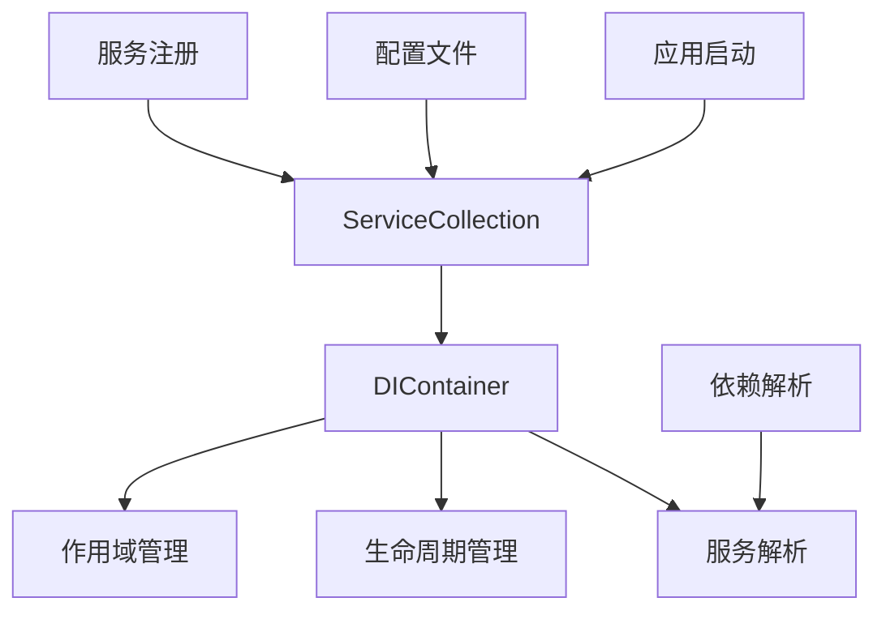

# 依赖注入系统详细指南

## 📋 文档概述

本文档详细描述了足球预测系统中轻量级依赖注入容器的设计、实现和使用方法。

**更新时间**: 2025-11-08
**版本**: v1.0
**适用范围**: 架构师、后端开发人员、系统集成工程师

---

## 🎯 1. 依赖注入概述

### 核心理念
依赖注入（Dependency Injection, DI）是一种设计模式，通过外部注入依赖项来实现控制反转（IoC）。在足球预测系统中，DI实现了：

- **松耦合**: 组件间不直接创建依赖对象
- **可测试性**: 易于注入模拟对象进行单元测试
- **配置驱动**: 通过配置管理组件创建和生命周期
- **扩展性**: 支持动态替换组件实现

### DI容器架构


---

## 🏗️ 2. 核心组件架构

### 2.1 服务生命周期管理
**位置**: `src/core/di.py`

```python
from enum import Enum
from dataclasses import dataclass
from typing import Any, Callable, Optional, Type

class ServiceLifetime(Enum):
    """服务生命周期"""
    SINGLETON = "singleton"    # 单例 - 整个应用程序生命周期内唯一实例
    SCOPED = "scoped"          # 作用域 - 在指定作用域内唯一实例
    TRANSIENT = "transient"    # 瞬时 - 每次请求都创建新实例

@dataclass
class ServiceDescriptor:
    """服务描述符"""
    service_type: Type
    implementation_type: Type
    lifetime: ServiceLifetime
    factory: Optional[Callable] = None
    instance: Optional[Any] = None
    dependencies: Optional[list[Type]] = None

    def __post_init__(self):
        if self.dependencies is None:
            self.dependencies = []
```

### 2.2 轻量级DI容器实现
```python
class DIContainer:
    """轻量级依赖注入容器"""

    def __init__(self):
        self._services: Dict[Type, ServiceDescriptor] = {}
        self._singletons: Dict[Type, Any] = {}
        self._scopes: List[DIScope] = []
        self._current_scope: Optional[DIScope] = None
        self._resolving_stack: List[Type] = []
        self._interceptors: List[DIInterceptor] = []

    def register_singleton(
        self,
        service_type: Type,
        implementation_type: Optional[Type] = None,
        factory: Optional[Callable] = None,
        instance: Optional[Any] = None
    ) -> None:
        """注册单例服务"""
        descriptor = ServiceDescriptor(
            service_type=service_type,
            implementation_type=implementation_type or service_type,
            lifetime=ServiceLifetime.SINGLETON,
            factory=factory,
            instance=instance,
            dependencies=self._extract_dependencies(implementation_type or service_type)
        )
        self._services[service_type] = descriptor
        self._apply_interceptors(descriptor)

    def register_scoped(self, service_type: Type, implementation_type: Optional[Type] = None) -> None:
        """注册作用域服务"""
        descriptor = ServiceDescriptor(
            service_type=service_type,
            implementation_type=implementation_type or service_type,
            lifetime=ServiceLifetime.SCOPED,
            dependencies=self._extract_dependencies(implementation_type or service_type)
        )
        self._services[service_type] = descriptor
        self._apply_interceptors(descriptor)

    def register_transient(self, service_type: Type, implementation_type: Optional[Type] = None) -> None:
        """注册瞬时服务"""
        descriptor = ServiceDescriptor(
            service_type=service_type,
            implementation_type=implementation_type or service_type,
            lifetime=ServiceLifetime.TRANSIENT,
            dependencies=self._extract_dependencies(implementation_type or service_type)
        )
        self._services[service_type] = descriptor
        self._apply_interceptors(descriptor)

    def resolve(self, service_type: Type) -> Any:
        """解析服务"""
        return self._resolve_with_context(service_type, ResolutionContext())

    def _resolve_with_context(self, service_type: Type, context: ResolutionContext) -> Any:
        """带上下文的服务解析"""
        # 检查循环依赖
        if service_type in self._resolving_stack:
            cycle_path = " -> ".join([t.__name__ for t in self._resolving_stack] + [service_type.__name__])
            raise DependencyInjectionError(f"检测到循环依赖: {cycle_path}")

        try:
            self._resolving_stack.append(service_type)

            # 检查是否已存在实例
            if service_type in self._singletons:
                return self._singletons[service_type]

            # 获取服务描述符
            descriptor = self._services.get(service_type)
            if not descriptor:
                raise DependencyInjectionError(f"服务未注册: {service_type}")

            # 根据生命周期创建实例
            if descriptor.lifetime == ServiceLifetime.SINGLETON:
                instance = self._create_instance(descriptor, context)
                self._singletons[service_type] = instance
                return instance
            elif descriptor.lifetime == ServiceLifetime.SCOPED:
                return self._resolve_in_scope(descriptor, context)
            else:  # TRANSIENT
                return self._create_instance(descriptor, context)

        finally:
            self._resolving_stack.pop()

    def _create_instance(self, descriptor: ServiceDescriptor, context: ResolutionContext) -> Any:
        """创建服务实例"""
        # 如果有预创建的实例，直接返回
        if descriptor.instance is not None:
            return descriptor.instance

        # 如果有工厂方法，使用工厂创建
        if descriptor.factory is not None:
            return descriptor.factory()

        # 解析依赖并创建实例
        dependencies = []
        for dep_type in descriptor.dependencies:
            dep_instance = self._resolve_with_context(dep_type, context)
            dependencies.append(dep_instance)

        # 创建实例
        implementation_type = descriptor.implementation_type
        instance = implementation_type(*dependencies)

        return instance

    def _resolve_in_scope(self, descriptor: ServiceDescriptor, context: ResolutionContext) -> Any:
        """在作用域中解析服务"""
        if not self._current_scope:
            raise DependencyInjectionError("当前没有活动的作用域")

        return self._current_scope.resolve(descriptor, context)

    def _extract_dependencies(self, implementation_type: Type) -> List[Type]:
        """从类型签名提取依赖"""
        if not hasattr(implementation_type, '__init__'):
            return []

        import inspect
        init_signature = inspect.signature(implementation_type.__init__)
        parameters = list(init_signature.parameters.values())

        # 跳过self参数
        if parameters and parameters[0].name == 'self':
            parameters = parameters[1:]

        dependencies = []
        for param in parameters:
            if param.annotation != inspect.Parameter.empty:
                dependencies.append(param.annotation)

        return dependencies

    def create_scope(self, scope_name: str) -> 'DIScope':
        """创建作用域"""
        scope = DIScope(self, scope_name)
        self._scopes.append(scope)
        return scope

    def _apply_interceptors(self, descriptor: ServiceDescriptor) -> None:
        """应用拦截器"""
        for interceptor in self._interceptors:
            interceptor.intercept(descriptor)

    def add_interceptor(self, interceptor: 'DIInterceptor') -> None:
        """添加拦截器"""
        self._interceptors.append(interceptor)

    def get_registered_services(self) -> Dict[Type, ServiceDescriptor]:
        """获取已注册的服务"""
        return self._services.copy()

    def clear(self) -> None:
        """清空容器"""
        self._services.clear()
        self._singletons.clear()
        self._scopes.clear()
        self._current_scope = None
```

### 2.3 作用域管理
```python
@dataclass
class ResolutionContext:
    """解析上下文"""
    resolved_instances: Dict[Type, Any] = None

    def __post_init__(self):
        if self.resolved_instances is None:
            self.resolved_instances = {}

class DIScope:
    """依赖注入作用域"""

    def __init__(self, container: DIContainer, scope_name: str):
        self.container = container
        self.scope_name = scope_name
        self._scoped_instances: Dict[Type, Any] = {}
        self._disposed = False

    def resolve(self, descriptor: ServiceDescriptor, context: ResolutionContext) -> Any:
        """在作用域中解析服务"""
        if self._disposed:
            raise DependencyInjectionError(f"作用域已释放: {self.scope_name}")

        service_type = descriptor.service_type

        # 检查是否已在作用域中存在
        if service_type in self._scoped_instances:
            return self._scoped_instances[service_type]

        # 检查是否在解析上下文中存在
        if service_type in context.resolved_instances:
            return context.resolved_instances[service_type]

        # 创建新实例
        instance = self.container._create_instance(descriptor, context)

        # 缓存到作用域
        self._scoped_instances[service_type] = instance
        context.resolved_instances[service_type] = instance

        return instance

    def __enter__(self):
        """进入作用域"""
        self.container._current_scope = self
        return self

    def __exit__(self, exc_type, exc_val, exc_tb):
        """退出作用域"""
        self._disposed = True
        self._scoped_instances.clear()
        if self.container._current_scope is self:
            self.container._current_scope = None

    def dispose(self):
        """释放作用域资源"""
        if not self._disposed:
            self._disposed = True

            # 释放作用域中的资源
            for instance in self._scoped_instances.values():
                if hasattr(instance, 'dispose'):
                    try:
                        instance.dispose()
                    except Exception as e:
                        logger.warning(f"释放作用域资源失败: {e}")

            self._scoped_instances.clear()
```

---

## 🛠️ 3. 便捷API实现

### 3.1 服务集合
**位置**: `src/core/di.py`

```python
class ServiceCollection:
    """服务注册集合 - 提供链式API"""

    def __init__(self):
        self._services: List[ServiceDescriptor] = []

    def add_singleton(self, service_type: Type, implementation_type: Optional[Type] = None) -> 'ServiceCollection':
        """添加单例服务"""
        descriptor = ServiceDescriptor(
            service_type=service_type,
            implementation_type=implementation_type or service_type,
            lifetime=ServiceLifetime.SINGLETON
        )
        self._services.append(descriptor)
        return self

    def add_scoped(self, service_type: Type, implementation_type: Optional[Type] = None) -> 'ServiceCollection':
        """添加作用域服务"""
        descriptor = ServiceDescriptor(
            service_type=service_type,
            implementation_type=implementation_type or service_type,
            lifetime=ServiceLifetime.SCOPED
        )
        self._services.append(descriptor)
        return self

    def add_transient(self, service_type: Type, implementation_type: Optional[Type] = None) -> 'ServiceCollection':
        """添加瞬时服务"""
        descriptor = ServiceDescriptor(
            service_type=service_type,
            implementation_type=implementation_type or service_type,
            lifetime=ServiceLifetime.TRANSIENT
        )
        self._services.append(descriptor)
        return self

    def add_singleton_factory(self, service_type: Type, factory: Callable) -> 'ServiceCollection':
        """添加单例工厂服务"""
        descriptor = ServiceDescriptor(
            service_type=service_type,
            implementation_type=service_type,
            lifetime=ServiceLifetime.SINGLETON,
            factory=factory
        )
        self._services.append(descriptor)
        return self

    def add_scoped_factory(self, service_type: Type, factory: Callable) -> 'ServiceCollection':
        """添加作用域工厂服务"""
        descriptor = ServiceDescriptor(
            service_type=service_type,
            implementation_type=service_type,
            lifetime=ServiceLifetime.SCOPED,
            factory=factory
        )
        self._services.append(descriptor)
        return self

    def add_instance(self, service_type: Type, instance: Any) -> 'ServiceCollection':
        """添加实例"""
        descriptor = ServiceDescriptor(
            service_type=service_type,
            implementation_type=type(instance),
            lifetime=ServiceLifetime.SINGLETON,
            instance=instance
        )
        self._services.append(descriptor)
        return self

    def build_container(self) -> DIContainer:
        """构建DI容器"""
        container = DIContainer()

        for service in self._services:
            if service.lifetime == ServiceLifetime.SINGLETON:
                container.register_singleton(
                    service.service_type,
                    service.implementation_type,
                    service.factory,
                    service.instance
                )
            elif service.lifetime == ServiceLifetime.SCOPED:
                container.register_scoped(
                    service.service_type,
                    service.implementation_type
                )
            else:  # TRANSIENT
                container.register_transient(
                    service.service_type,
                    service.implementation_type
                )

        return container
```

### 3.2 全局容器管理
```python
# 全局容器实例
_global_container: Optional[DIContainer] = None

def get_container() -> DIContainer:
    """获取全局DI容器"""
    global _global_container
    if _global_container is None:
        _global_container = DIContainer()
    return _global_container

def configure_container(services: ServiceCollection) -> DIContainer:
    """配置全局容器"""
    global _global_container
    _global_container = services.build_container()
    return _global_container

def resolve(service_type: Type) -> Any:
    """便捷的服务解析函数"""
    return get_container().resolve(service_type)

def create_scope(scope_name: str = "default") -> DIScope:
    """创建作用域"""
    return get_container().create_scope(scope_name)
```

---

## 📋 4. 配置驱动的依赖注入

### 4.1 配置系统
**位置**: `src/core/config_di.py`

```python
import importlib
import json
import yaml
from pathlib import Path
from typing import Any, Dict, List
from dataclasses import dataclass, field

@dataclass
class ServiceConfig:
    """服务配置"""
    name: str
    implementation: Optional[str] = None
    lifetime: str = "transient"  # singleton, scoped, transient
    factory: Optional[str] = None
    instance: Optional[str] = None
    dependencies: List[str] = field(default_factory=list)
    parameters: Dict[str, Any] = field(default_factory=dict)
    enabled: bool = True
    condition: Optional[str] = None

@dataclass
class DIConfiguration:
    """DI配置"""
    services: Dict[str, ServiceConfig] = field(default_factory=dict)
    auto_scan: List[str] = field(default_factory=list)
    conventions: List[str] = field(default_factory=list)
    profiles: List[str] = field(default_factory=list)
    imports: List[str] = field(default_factory=list)
```

### 4.2 配置绑定器
```python
class ConfigurationBinder:
    """配置绑定器"""

    def __init__(self, container: DIContainer):
        self.container = container
        self.auto_binder = AutoBinder(container)
        self.config: Optional[DIConfiguration] = None
        self._active_profile: Optional[str] = None

    def load_from_file(self, config_path: str | Path) -> None:
        """从文件加载配置"""
        config_path = Path(config_path)

        if not config_path.exists():
            raise DependencyInjectionError(f"配置文件不存在: {config_path}")

        try:
            with open(config_path, encoding="utf-8") as f:
                if config_path.suffix.lower() in [".yml", ".yaml"]:
                    data = yaml.safe_load(f)
                elif config_path.suffix.lower() == ".json":
                    data = json.load(f)
                else:
                    raise DependencyInjectionError(
                        f"不支持的配置文件格式: {config_path.suffix}"
                    )

            if data is None:
                data = {}

            self.config = self._parse_config(data)
            logger.info(f"加载配置文件: {config_path}")

        except (ValueError, TypeError, AttributeError, KeyError, RuntimeError) as e:
            raise DependencyInjectionError(f"加载配置文件失败: {e}") from e

    def load_from_dict(self, config_data: Dict[str, Any]) -> None:
        """从字典加载配置"""
        self.config = self._parse_config(config_data)
        logger.info("从字典加载配置")

    def apply_configuration(self) -> None:
        """应用配置"""
        if not self.config:
            raise DependencyInjectionError("未加载配置")

        logger.info("应用依赖注入配置")

        # 处理导入
        for import_path in self.config.imports:
            self._import_configuration(import_path)

        # 自动扫描
        for module_path in self.config.auto_scan:
            self.auto_binder.bind_from_assembly(module_path)

        # 应用约定
        for convention in self.config.conventions:
            self.auto_binder.bind_by_convention(convention)

        # 注册服务
        for service_name, service_config in self.config.services.items():
            if not service_config.enabled:
                logger.debug(f"跳过禁用的服务: {service_name}")
                continue

            # 检查配置文件条件
            if service_config.condition:
                if not self._evaluate_condition(service_config.condition):
                    logger.debug(f"服务条件不满足: {service_name}")
                    continue

            self._register_service(service_name, service_config)

        logger.info("配置应用完成")

    def _register_service(self, service_name: str, config: ServiceConfig) -> None:
        """注册服务"""
        try:
            if config.implementation:
                # 指定了实现类
                service_type = self._get_type(config.implementation)

                lifetime = self._parse_lifetime(config.lifetime)

                if lifetime == ServiceLifetime.SINGLETON:
                    self.container.register_singleton(service_type)
                elif lifetime == ServiceLifetime.SCOPED:
                    self.container.register_scoped(service_type)
                else:
                    self.container.register_transient(service_type)

                logger.debug(f"注册服务: {service_name} -> {config.implementation}")

            elif config.factory:
                # 使用工厂方法
                factory_func = self._get_factory(config.factory)
                lifetime = self._parse_lifetime(config.lifetime)

                if lifetime == ServiceLifetime.SINGLETON:
                    self.container.register_singleton(
                        service_type=object,  # 使用object作为默认类型
                        factory=factory_func
                    )
                elif lifetime == ServiceLifetime.SCOPED:
                    self.container.register_scoped(
                        service_type=object,
                        factory=factory_func
                    )
                else:
                    self.container.register_transient(
                        service_type=object,
                        factory=factory_func
                    )

                logger.debug(f"注册工厂服务: {service_name}")

            else:
                # 尝试按服务名自动绑定
                try:
                    service_type = self._get_type(service_name)
                    self.auto_binder.bind_interface_to_implementations(service_type)
                except DependencyInjectionError:
                    logger.debug(f"无法确定服务类型: {service_name}")
                    return

        except (ValueError, TypeError, AttributeError, KeyError, RuntimeError) as e:
            logger.error(f"注册服务失败 {service_name}: {e}")

    def _get_type(self, type_name: str) -> Type:
        """获取类型"""
        try:
            # 尝试导入类型
            module_path, class_name = type_name.rsplit(".", 1)
            module = importlib.import_module(module_path)
            return getattr(module, class_name)
        except ValueError as e:
            # 如果不是完整的模块路径，则在当前模块中查找
            if "." not in type_name:
                # 为测试创建一个简单的类
                class DynamicType:
                    def __init__(self):
                        self.name = type_name

                return DynamicType
            else:
                raise DependencyInjectionError(f"无效的类型名称: {type_name}") from e

    def _get_factory(self, factory_path: str) -> Callable:
        """获取工厂函数"""
        try:
            module_path, func_name = factory_path.rsplit(".", 1)
            module = importlib.import_module(module_path)
            return getattr(module, func_name)
        except ValueError as e:
            raise DependencyInjectionError(f"无效的工厂路径: {factory_path}") from e

    def _parse_lifetime(self, lifetime_str: str) -> ServiceLifetime:
        """解析生命周期"""
        lifetime_map = {
            "singleton": ServiceLifetime.SINGLETON,
            "scoped": ServiceLifetime.SCOPED,
            "transient": ServiceLifetime.TRANSIENT,
        }

        lifetime = lifetime_map.get(lifetime_str.lower())
        if not lifetime:
            raise DependencyInjectionError(f"未知的生命周期: {lifetime_str}")

        return lifetime

    def _evaluate_condition(self, condition: str) -> bool:
        """评估条件"""
        import os

        # 简单的条件评估
        if condition.startswith("profile =="):
            profile_name = condition.split("'")[1]
            return self._active_profile == profile_name
        elif condition.startswith("environment =="):
            env_name = condition.split("'")[1]
            current_env = os.environ.get("ENVIRONMENT", os.environ.get("ENV", "development"))
            return current_env == env_name

        return True
```

### 4.3 自动绑定器
```python
class AutoBinder:
    """自动绑定器"""

    def __init__(self, container: DIContainer):
        self.container = container

    def bind_from_assembly(self, module_path: str) -> None:
        """从程序集自动绑定"""
        try:
            module = importlib.import_module(module_path)

            for attr_name in dir(module):
                attr = getattr(module, attr_name)
                if isinstance(attr, type) and not attr.__name__.startswith('_'):
                    self._bind_if_service(attr)

        except ImportError as e:
            logger.error(f"无法导入模块 {module_path}: {e}")

    def bind_by_convention(self, convention: str) -> None:
        """按约定绑定"""
        if convention == "repository":
            self._bind_repositories()
        elif convention == "service":
            self._bind_services()
        elif convention == "default":
            self._bind_default_conventions()

    def bind_interface_to_implementations(self, interface_type: Type) -> None:
        """绑定接口到实现"""
        implementations = self._find_implementations(interface_type)
        for impl in implementations:
            self.container.register_scoped(interface_type, impl)

    def _bind_if_service(self, service_type: Type) -> None:
        """如果符合服务类型则绑定"""
        if hasattr(service_type, '__annotations__'):
            self.container.register_scoped(service_type)

    def _find_implementations(self, interface_type: Type) -> List[Type]:
        """查找接口的实现"""
        implementations = []

        # 这里可以实现更复杂的类型查找逻辑
        # 例如扫描所有已注册的模块

        return implementations
```

### 4.4 示例配置文件
**config/services.yaml**
```yaml
# 依赖注入配置示例
services:
  # 数据库服务
  database_service:
    implementation: src.services.database.DatabaseService
    lifetime: singleton

  # 仓储服务
  user_repository:
    implementation: src.database.repositories.UserRepository
    lifetime: scoped

  match_repository:
    implementation: src.database.repositories.MatchRepository
    lifetime: scoped

  prediction_repository:
    implementation: src.database.repositories.PredictionRepository
    lifetime: scoped

  # 业务服务
  prediction_service:
    implementation: src.services.prediction.PredictionService
    lifetime: scoped
    dependencies:
      - match_repository
      - user_repository
      - prediction_repository
    parameters:
      max_predictions_per_day: 10
      confidence_threshold: 0.5

  # 使用工厂
  cache_service:
    factory: src.factories.create_cache_service
    lifetime: singleton
    condition: "profile == 'production'"

  # 实例注入
  logger:
    instance: src.logging.default_logger
    lifetime: singleton

# 自动扫描的模块
auto_scan:
  - src.services
  - src.repositories
  - src.domain.services

# 绑定约定
conventions:
  - repository
  - service
  - default

# 配置文件
profiles:
  - development
  - production
  - testing

# 导入其他配置文件
imports:
  - configs/di-services.yaml
  - configs/di-repositories.yaml
```

---

## 🔧 5. 使用指南

### 5.1 基础使用
```python
from src.core.di import DIContainer, ServiceCollection

# 方式1: 使用ServiceCollection
services = ServiceCollection()
services.add_singleton(DatabaseManager)
services.add_scoped(UserRepository)
services.add_transient(PredictionService)

container = services.build_container()

# 方式2: 直接使用容器
container = DIContainer()
container.register_singleton(DatabaseManager)
container.register_scoped(UserRepository)
container.register_transient(PredictionService)

# 解析服务
db_manager = container.resolve(DatabaseManager)
user_repo = container.resolve(UserRepository)
prediction_service = container.resolve(PredictionService)
```

### 5.2 工厂方法注册
```python
# 定义工厂函数
def create_cache_service() -> CacheService:
    redis_client = RedisClient()
    return CacheService(redis_client, ttl=3600)

# 注册工厂
services.add_singleton_factory(CacheService, create_cache_service)

# 解析服务
cache_service = container.resolve(CacheService)
```

### 5.3 作用域使用
```python
# 创建作用域
with container.create_scope("request_scope") as scope:
    # 在作用域内解析服务
    user_service = container.resolve(UserService)  # 作用域服务
    request_context = container.resolve(RequestContext)  # 作用域服务

    # 这些服务在作用域内是单例的
    user_service_2 = container.resolve(UserService)
    assert user_service is user_service_2  # True

# 作用域结束，所有作用域服务被释放
```

### 5.4 配置驱动使用
```python
# 使用配置文件
from src.core.config_di import ConfigurationBinder

# 创建配置绑定器
binder = ConfigurationBinder(container)

# 从YAML文件加载配置
binder.load_from_file("config/services.yaml")

# 应用配置
binder.apply_configuration()

# 现在可以解析配置中定义的服务
prediction_service = container.resolve(PredictionService)
```

### 5.5 在FastAPI中集成
```python
from fastapi import FastAPI, Depends
from src.core.di import configure_container, resolve

# 创建FastAPI应用
app = FastAPI(title="足球预测系统")

# 配置依赖注入
services = ServiceCollection()
services.add_singleton(DatabaseManager)
services.add_scoped(UserRepository)
services.add_scoped(PredictionService)

container = configure_container(services)

# 依赖注入函数
def get_user_repository() -> UserRepository = Depends(lambda: resolve(UserRepository))
def get_prediction_service(user_repo: UserRepository = Depends(get_user_repository)) -> PredictionService:
    return PredictionService(user_repository=user_repo)

# API端点
@app.post("/predictions")
async def create_prediction(
    request: CreatePredictionRequest,
    prediction_service: PredictionService = Depends(get_prediction_service)
):
    result = await prediction_service.create_prediction(request.dict())
    return result

# 作用域中间件
@app.middleware("http")
async def di_scope_middleware(request: Request, call_next):
    with container.create_scope("request") as scope:
        response = await call_next(request)
    return response
```

---

## 🧪 6. 测试支持

### 6.1 单元测试中的依赖注入
```python
import pytest
from unittest.mock import Mock

from src.core.di import DIContainer
from src.services.prediction import PredictionService
from src.database.repositories import UserRepository

class TestPredictionService:
    def setup_method(self):
        """测试设置"""
        self.container = DIContainer()

        # 注册模拟对象
        mock_user_repo = Mock(spec=UserRepository)
        self.container.register_instance(UserRepository, mock_user_repo)

        # 注册服务
        self.container.register_scoped(PredictionService)

    def test_create_prediction(self):
        """测试创建预测"""
        # 解析服务
        service = self.container.resolve(PredictionService)

        # 获取模拟的依赖
        mock_user_repo = self.container.resolve(UserRepository)

        # 调用方法
        result = service.create_prediction({
            "user_id": 1,
            "match_id": 2,
            "predicted_home": 2,
            "predicted_away": 1
        })

        # 验证结果
        assert result is not None

        # 验证依赖调用
        mock_user_repo.get_user.assert_called_once_with(1)

    def test_dependency_injection(self):
        """测试依赖注入"""
        service = self.container.resolve(PredictionService)
        user_repo = self.container.resolve(UserRepository)

        # 验证依赖已正确注入
        assert hasattr(service, 'user_repository')
        assert service.user_repository is user_repo
```

### 6.2 测试工厂
```python
def test_service_factory():
    """测试服务工厂"""
    container = DIContainer()

    # 注册工厂
    def create_test_service() -> TestService:
        return TestService("test_value")

    container.register_singleton_factory(TestService, create_test_service)

    # 解析服务
    service = container.resolve(TestService)

    # 验证工厂正确调用
    assert service is not None
    assert service.value == "test_value"

    # 验证单例行为
    service2 = container.resolve(TestService)
    assert service is service2
```

### 6.3 配置测试
```python
def test_configuration_driven_di():
    """测试配置驱动的DI"""
    config_data = {
        "services": {
            "test_service": {
                "implementation": "tests.test_di.TestService",
                "lifetime": "singleton"
            }
        }
    }

    container = DIContainer()
    binder = ConfigurationBinder(container)
    binder.load_from_dict(config_data)
    binder.apply_configuration()

    # 解析配置中定义的服务
    service = container.resolve(TestService)
    assert service is not None
```

---

## 📊 7. 性能优化

### 7.1 性能监控
```python
class PerformanceMonitor:
    def __init__(self):
        self.resolution_times: Dict[Type, List[float]] = {}
        self.resolution_counts: Dict[Type, int] = {}

    def monitor_resolution(self, service_type: Type, resolution_time: float):
        """监控服务解析性能"""
        if service_type not in self.resolution_times:
            self.resolution_times[service_type] = []
            self.resolution_counts[service_type] = 0

        self.resolution_times[service_type].append(resolution_time)
        self.resolution_counts[service_type] += 1

    def get_performance_stats(self) -> Dict[str, Any]:
        """获取性能统计"""
        stats = {}
        for service_type, times in self.resolution_times.items():
            if times:
                stats[service_type.__name__] = {
                    "count": len(times),
                    "total_time": sum(times),
                    "avg_time": sum(times) / len(times),
                    "min_time": min(times),
                    "max_time": max(times),
                    "p95_time": sorted(times)[int(len(times) * 0.95)]
                }

        return stats

# 性能拦截器
class PerformanceInterceptor(DIInterceptor):
    def __init__(self):
        self.monitor = PerformanceMonitor()

    def intercept(self, descriptor: ServiceDescriptor) -> None:
        descriptor.performance_monitor = self.monitor

# 增强的DI容器
class EnhancedDIContainer(DIContainer):
    def _create_instance(self, descriptor: ServiceDescriptor, context: ResolutionContext) -> Any:
        start_time = time.time()

        try:
            instance = super()._create_instance(descriptor, context)
            return instance
        finally:
            resolution_time = time.time() - start_time

            if hasattr(descriptor, 'performance_monitor'):
                descriptor.performance_monitor.monitor_resolution(
                    descriptor.service_type, resolution_time
                )
```

### 7.2 内存优化
```python
class MemoryOptimizedDIContainer(DIContainer):
    """内存优化的DI容器"""

    def __init__(self, max_cache_size: int = 1000):
        super().__init__()
        self.max_cache_size = max_cache_size
        self._cache_cleanup_threshold = 0.8

    def _check_memory_usage(self) -> None:
        """检查内存使用情况"""
        total_cached = len(self._singletons)

        if total_cached > self.max_cache_size * self._cache_cleanup_threshold:
            self._cleanup_cache()

    def _cleanup_cache(self) -> None:
        """清理缓存"""
        # 清理最旧的单例（基于LRU）
        items_to_remove = len(self._singletons) - self.max_cache_size

        if items_to_remove > 0:
            # 这里可以实现更智能的清理策略
            logger.warning(f"清理DI缓存，移除 {items_to_remove} 个单例实例")

# 弱引用缓存
import weakref
from typing import WeakValueDictionary

class WeakReferenceContainer:
    """使用弱引用的容器"""

    def __init__(self):
        self._instances: WeakValueDictionary = WeakValueDictionary()

    def store(self, key: Type, instance: Any) -> None:
        """存储实例（弱引用）"""
        self._instances[key] = instance

    def get(self, key: Type) -> Any:
        """获取实例"""
        return self._instances.get(key)

    def remove(self, key: Type) -> None:
        """移除实例"""
        if key in self._instances:
            del self._instances[key]
```

---

## ⚠️ 8. 最佳实践和注意事项

### 8.1 服务设计原则
1. **接口优先**: 依赖抽象接口而不是具体实现
2. **单一职责**: 每个服务应该只负责一个业务功能
3. **无状态**: 服务应该尽量设计为无状态
4. **可测试**: 服务的依赖应该易于模拟

### 8.2 生命周期选择指南
- **SINGLETON**: 全局唯一实例，如数据库连接池、配置服务
- **SCOPED**: 请求级别的作用域，如用户会话、请求上下文
- **TRANSIENT**: 每次都创建新实例，如计算服务、验证器

### 8.3 避免常见问题
```python
# ❌ 避免循环依赖
class ServiceA:
    def __init__(self, service_b: ServiceB):
        self.service_b = service_b

class ServiceB:
    def __init__(self, service_a: ServiceA):
        self.service_a = service_a

# ✅ 使用接口或事件解耦
class ServiceA:
    def __init__(self, service_b_interface: ServiceBInterface):
        self.service_b_interface = service_b_interface

class ServiceB:
    def __init__(self, event_bus: EventBus):
        self.event_bus = event_bus

# ❌ 避免在构造函数中进行复杂操作
class ExpensiveService:
    def __init__(self):
        # ❌ 不要在这里进行数据库连接、文件IO等操作
        self.db_connection = self._create_database_connection()

# ✅ 延迟初始化
class ExpensiveService:
    def __init__(self):
        self._db_connection = None

    @property
    def db_connection(self):
        if self._db_connection is None:
            self._db_connection = self._create_database_connection()
        return self._db_connection
```

### 8.4 配置管理最佳实践
```python
# ✅ 使用环境变量覆盖配置
class DatabaseConfig:
    def __init__(self):
        self.host = os.getenv("DB_HOST", "localhost")
        self.port = int(os.getenv("DB_PORT", 5432))
        self.database = os.getenv("DB_NAME", "football_prediction")

# ✅ 分层配置管理
class AppConfig:
    def __init__(self):
        self.database = DatabaseConfig()
        self.cache = CacheConfig()
        self.logging = LoggingConfig()

# ✅ 配置验证
def validate_config(config: AppConfig) -> None:
    if config.database.port < 1 or config.database.port > 65535:
        raise ValueError("无效的数据库端口")
```

---

## 🔮 9. 扩展和演进

### 9.1 插件化扩展
```python
class DIPlugin:
    """DI插件基类"""

    def __init__(self):
        self.name = self.__class__.__name__

    def configure_services(self, services: ServiceCollection) -> None:
        """配置服务"""
        pass

    def configure_container(self, container: DIContainer) -> None:
        """配置容器"""
        pass

class CachePlugin(DIPlugin):
    """缓存插件"""

    def configure_services(self, services: ServiceCollection) -> None:
        services.add_singleton(CacheService)
        services.add_scoped(CacheRepository)

# 插件管理器
class DIPluginManager:
    def __init__(self):
        self.plugins: List[DIPlugin] = []

    def register_plugin(self, plugin: DIPlugin) -> None:
        self.plugins.append(plugin)

    def configure_all(self, services: ServiceCollection, container: DIContainer) -> None:
        for plugin in self.plugins:
            plugin.configure_services(services)
            plugin.configure_container(container)
```

### 9.2 热重载服务
```python
class HotReloadContainer(DIContainer):
    """支持热重载的容器"""

    def __init__(self):
        super().__init__()
        self._file_watchers: Dict[str, Any] = {}

    def watch_module(self, module_path: str, reload_callback: Callable) -> None:
        """监控模块文件变化"""
        import os
        from watchdog.observers import Observer
        from watchdog.events import FileSystemEventHandler

        class ModuleHandler(FileSystemEventHandler):
            def __init__(self, callback):
                self.callback = callback

            def on_modified(self, event):
                if event.src_path.endswith('.py'):
                    self.callback(event.src_path)

        observer = Observer()
        handler = ModuleHandler(reload_callback)
        observer.schedule(handler, module_path, recursive=True)
        observer.start()

        self._file_watchers[module_path] = observer

    def reload_services(self, module_path: str) -> None:
        """重载服务"""
        # 清除相关服务的单例实例
        services_to_reload = []
        for service_type, descriptor in self._services.items():
            if descriptor.implementation_type.__module__.startswith(module_path):
                if service_type in self._singletons:
                    services_to_reload.append(service_type)

        for service_type in services_to_reload:
            del self._singletons[service_type]

        logger.info(f"重载模块 {module_path} 的服务")
```

---

## 📞 10. 故障排查

### 常见问题和解决方案

#### 1. 循环依赖错误
```python
# ❌ 循环依赖示例
class ServiceA:
    def __init__(self, service_b: ServiceB):
        self.service_b = service_b

class ServiceB:
    def __init__(self, service_a: ServiceA):
        self.service_a = service_a

# ✅ 解决方案1: 使用接口
class ServiceA:
    def __init__(self, service_b_interface: ServiceBInterface):
        self.service_b_interface = service_b_interface

class ServiceB:
    def __init__(self, service_a_interface: ServiceAInterface):
        self.service_a_interface = service_a_interface

# ✅ 解决方案2: 事件驱动
class ServiceA:
    def __init__(self, event_bus: EventBus):
        self.event_bus = event_bus

class ServiceB:
    def __init__(self, event_bus: EventBus):
        self.event_bus = event_bus
        event_bus.subscribe(ServiceACreatedEvent, self.handle_service_a_created)
```

#### 2. 服务未注册错误
```python
# 错误信息: DependencyInjectionError("服务未注册: UserService")

# 诊断工具
def diagnose_container(container: DIContainer):
    """诊断DI容器配置"""
    registered_services = list(container.get_registered_services().keys())

    print("已注册的服务:")
    for service in registered_services:
        print(f"  - {service.__name__}")

    # 检查常见缺失的服务
    common_services = [
        UserService, UserRepository, PredictionService,
        DatabaseManager, CacheService, Logger
    ]

    missing_services = []
    for service in common_services:
        if service not in registered_services:
            missing_services.append(service)

    if missing_services:
        print("\n可能缺失的服务:")
        for service in missing_services:
            print(f"  - {service.__name__}")

# 使用诊断工具
diagnose_container(container)
```

#### 3. 内存泄漏
```python
# 内存泄漏检测
class MemoryLeakDetector:
    def __init__(self, container: DIContainer):
        self.container = container
        self.initial_memory = self._get_memory_usage()

    def _get_memory_usage(self) -> int:
        import psutil
        process = psutil.Process()
        return process.memory_info().rss

    def detect_leak(self) -> Dict[str, Any]:
        current_memory = self._get_memory_usage()
        memory_increase = current_memory - self.initial_memory

        return {
            "initial_memory_mb": self.initial_memory / 1024 / 1024,
            "current_memory_mb": current_memory / 1024 / 1024,
            "increase_mb": memory_increase / 1024 / 1024,
            "singleton_count": len(self.container._singletons),
            "scope_count": len(self.container._scopes),
            "has_leak": memory_increase > 100 * 1024 * 1024  # 100MB阈值
        }

# 定期检测
def monitor_memory_usage(container: DIContainer):
    detector = MemoryLeakDetector(container)

    while True:
        leak_info = detector.detect_leak()
        if leak_info["has_leak"]:
            logger.warning(f"检测到可能的内存泄漏: {leak_info}")

        time.sleep(60)  # 每分钟检测一次
```

---

## 📚 11. 总结

依赖注入系统为足球预测系统提供了：
- **灵活的组件管理**: 支持多种生命周期和注册方式
- **配置驱动**: 通过YAML/JSON配置文件管理服务
- **测试友好**: 易于在单元测试中注入模拟对象
- **性能优化**: 支持缓存、批处理和内存优化
- **可扩展性**: 支持插件化扩展和热重载

通过合理使用DI系统，可以显著提高代码的可维护性、可测试性和灵活性。

*本文档基于实际代码实现编写，如有问题或需要更新，请联系开发团队。*