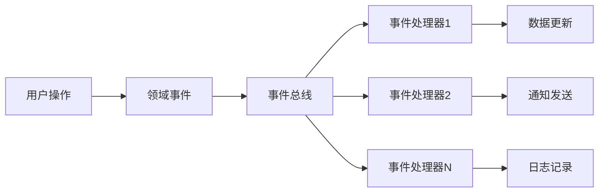

# 事件驱动架构详细指南

## 📋 文档概述

本文档详细描述了足球预测系统中事件驱动架构的设计、实现和使用方法。

**更新时间**: 2025-11-08
**版本**: v1.0
**适用范围**: 架构师、后端开发人员、系统集成工程师

---

## 🎯 1. 事件驱动架构概述

### 核心理念
事件驱动架构（Event-Driven Architecture, EDA）是一种系统架构模式，其中系统的各个组件通过事件进行通信和协作。在足球预测系统中，EDA实现了：

- **松耦合**: 组件间通过事件通信，减少直接依赖
- **可扩展性**: 支持动态添加新的事件处理器
- **异步处理**: 非阻塞的事件处理机制
- **实时响应**: 事件的实时发布和处理

### 架构优势


---

## 🏗️ 2. 核心组件架构

### 2.1 事件基类体系
**位置**: `src/events/base.py` + `src/domain/events/`

#### 基础事件类
```python
from abc import ABC, abstractmethod
from datetime import datetime
from typing import Any, Dict

class Event(ABC):
    """事件基类"""

    def __init__(self, event_id: str, aggregate_id: str, event_type: str, timestamp: datetime = None):
        self.event_id = event_id
        self.aggregate_id = aggregate_id
        self.event_type = event_type
        self.timestamp = timestamp or datetime.now()
        self.metadata: Dict[str, Any] = {}

    @abstractmethod
    def get_event_type(self) -> str:
        """获取事件类型"""
        pass

    def get_event_data(self) -> Dict[str, Any]:
        """获取事件数据"""
        return {
            "event_id": self.event_id,
            "aggregate_id": self.aggregate_id,
            "event_type": self.event_type,
            "timestamp": self.timestamp.isoformat(),
            "metadata": self.metadata
        }

    def to_dict(self) -> Dict[str, Any]:
        """转换为字典格式"""
        data = self.get_event_data()
        data.update(self.__dict__)
        return data
```

#### 事件处理器基类
```python
class EventHandler(ABC):
    """事件处理器基类"""

    def __init__(self, name: str = None):
        self.name = name or self.__class__.__name__
        self.is_running = False

    @abstractmethod
    async def handle(self, event: Event) -> None:
        """处理事件"""
        pass

    async def start(self) -> None:
        """启动处理器"""
        self.is_running = True
        await self.on_start()

    async def stop(self) -> None:
        """停止处理器"""
        self.is_running = False
        await self.on_stop()

    async def on_start(self) -> None:
        """启动钩子方法"""
        pass

    async def on_stop(self) -> None:
        """停止钩子方法"""
        pass
```

### 2.2 领域事件实现
**位置**: `src/domain/events/prediction_events.py`

#### 预测相关事件
```python
class PredictionCreatedEvent(DomainEvent):
    """预测创建事件"""

    def __init__(
        self,
        prediction_id: int,
        user_id: int,
        match_id: int,
        predicted_home: int,
        predicted_away: int,
        confidence: float | None = None,
        prediction=None,
        **kwargs,
    ):
        super().__init__(aggregate_id=prediction_id)
        self.prediction_id = prediction_id
        self.user_id = user_id
        self.match_id = match_id
        self.predicted_home = predicted_home
        self.predicted_away = predicted_away
        self.confidence = confidence
        self.prediction = prediction  # 支持测试访问

    def get_event_type(self) -> str:
        return "prediction.created"

    def _get_event_data(self) -> dict[str, Any]:
        return {
            "prediction_id": self.prediction_id,
            "user_id": self.user_id,
            "match_id": self.match_id,
            "predicted_home": self.predicted_home,
            "predicted_away": self.predicted_away,
            "confidence": self.confidence,
            "created_at": self.timestamp.isoformat(),
        }

class PredictionEvaluatedEvent(DomainEvent):
    """预测评估事件"""

    def __init__(
        self,
        prediction_id: int,
        actual_home: int,
        actual_away: int,
        is_correct: bool,
        points_earned: int | None = None,
        accuracy_score: float | None = None,
        **kwargs,
    ):
        super().__init__(aggregate_id=prediction_id)
        self.prediction_id = prediction_id
        self.actual_home = actual_home
        self.actual_away = actual_away
        self.is_correct = is_correct
        self.points_earned = points_earned
        self.accuracy_score = accuracy_score

    def get_event_type(self) -> str:
        return "prediction.evaluated"

    def _get_event_data(self) -> dict[str, Any]:
        return {
            "prediction_id": self.prediction_id,
            "actual_score": {"home": self.actual_home, "away": self.actual_away},
            "is_correct": self.is_correct,
            "points_earned": self.points_earned,
            "accuracy_score": self.accuracy_score,
            "evaluated_at": self.timestamp.isoformat(),
        }

class PredictionCancelledEvent(DomainEvent):
    """预测取消事件"""

    def __init__(
        self,
        prediction_id: int,
        reason: str,
        cancelled_by: int | None = None,
        **kwargs,
    ):
        super().__init__(aggregate_id=prediction_id)
        self.prediction_id = prediction_id
        self.reason = reason
        self.cancelled_by = cancelled_by

    def get_event_type(self) -> str:
        return "prediction.cancelled"

    def _get_event_data(self) -> dict[str, Any]:
        return {
            "prediction_id": self.prediction_id,
            "reason": self.reason,
            "cancelled_by": self.cancelled_by,
            "cancelled_at": self.timestamp.isoformat(),
        }
```

---

## 🚀 3. 事件总线实现

### 3.1 核心事件总线
**位置**: `src/core/event_application.py`

```python
import asyncio
from collections import defaultdict
from datetime import datetime
from typing import Any, Callable, Dict, List, Type
from asyncio import Queue, Task
from concurrent.futures import ThreadPoolExecutor
import logging

logger = logging.getLogger(__name__)

class EventBus:
    """异步事件总线实现"""

    def __init__(self, max_workers: int = 4):
        self._subscribers: Dict[Type[Event], List[EventHandler]] = defaultdict(list)
        self._queues: Dict[Type[Event], Queue] = {}
        self._tasks: List[Task] = []
        self._filters: List[Callable[[Event], bool]] = []
        self._interceptors: List[EventInterceptor] = []
        self._thread_pool = ThreadPoolExecutor(max_workers=max_workers)
        self._running = False
        self._event_counter = 0
        self._error_count = 0

    def subscribe(self, event_type: Type[Event], handler: EventHandler) -> None:
        """订阅事件类型"""
        self._subscribers[event_type].append(handler)
        logger.debug(f"事件处理器已订阅: {handler.name} -> {event_type.__name__}")

    def unsubscribe(self, event_type: Type[Event], handler: EventHandler) -> None:
        """取消订阅"""
        if event_type in self._subscribers:
            try:
                self._subscribers[event_type].remove(handler)
                logger.debug(f"事件处理器已取消订阅: {handler.name} -> {event_type.__name__}")
            except ValueError:
                logger.warning(f"事件处理器未找到: {handler.name}")

    def add_filter(self, filter_func: Callable[[Event], bool]) -> None:
        """添加事件过滤器"""
        self._filters.append(filter_func)

    def add_interceptor(self, interceptor: 'EventInterceptor') -> None:
        """添加事件拦截器"""
        self._interceptors.append(interceptor)

    async def start(self) -> None:
        """启动事件总线"""
        if self._running:
            return

        self._running = True

        # 为每种事件类型创建队列和处理任务
        for event_type, handlers in self._subscribers.items():
            if handlers:  # 只为有订阅者的事件类型创建队列
                queue = asyncio.Queue()
                self._queues[event_type] = queue

                # 为每个处理器创建独立的任务
                for handler in handlers:
                    task = asyncio.create_task(
                        self._run_handler(handler, event_type, queue)
                    )
                    self._tasks.append(task)

        logger.info(f"事件总线已启动，处理 {len(self._tasks)} 个事件处理器")

    async def stop(self) -> None:
        """停止事件总线"""
        if not self._running:
            return

        self._running = False

        # 停止所有任务
        for task in self._tasks:
            task.cancel()

        # 等待所有任务完成
        if self._tasks:
            await asyncio.gather(*self._tasks, return_exceptions=True)

        self._tasks.clear()
        self._thread_pool.shutdown(wait=True)
        logger.info("事件总线已停止")

    async def publish(self, event: Event) -> None:
        """发布事件"""
        if not self._running:
            logger.warning("事件总线未运行，事件被丢弃")
            return

        self._event_counter += 1
        event_id = f"event_{self._event_counter}_{datetime.now().strftime('%Y%m%d_%H%M%S')}"

        # 应用事件拦截器
        for interceptor in self._interceptors:
            await interceptor.intercept(event)

        # 应用事件过滤器
        for filter_func in self._filters:
            if not filter_func(event):
                logger.debug(f"事件被过滤器过滤: {event.get_event_type()}")
                return

        # 获取事件处理器和队列
        handlers = self._subscribers.get(type(event), [])
        queue = self._queues.get(type(event))

        if queue and handlers:
            try:
                await queue.put(event)
                logger.debug(f"事件已发布: {event.get_event_type()} -> {len(handlers)} 个处理器")
            except Exception as e:
                self._error_count += 1
                logger.error(f"事件发布失败: {e}")
        else:
            logger.warning(f"事件类型没有订阅者: {event.get_event_type()}")

    async def _run_handler(self, handler: EventHandler, event_type: Type[Event], queue: Queue) -> None:
        """在独立任务中运行事件处理器"""
        await handler.start()

        try:
            while self._running:
                try:
                    # 等待事件，设置超时避免无限等待
                    event = await asyncio.wait_for(queue.get(), timeout=1.0)

                    if not self._running:
                        break

                    # 验证事件类型
                    if type(event) == event_type:
                        try:
                            if asyncio.iscoroutinefunction(handler.handle):
                                await handler.handle(event)
                            else:
                                # 阻塞处理器在线程池中执行
                                loop = asyncio.get_event_loop()
                                await loop.run_in_executor(self._thread_pool, handler.handle, event)

                            logger.debug(f"事件处理完成: {handler.name} -> {event.get_event_type()}")
                        except Exception as e:
                            self._error_count += 1
                            logger.error(f"事件处理器错误 {handler.name}: {e}")

                    queue.task_done()

                except asyncio.TimeoutError:
                    # 超时继续，检查_running状态
                    continue
                except Exception as e:
                    self._error_count += 1
                    logger.error(f"事件处理循环错误 {handler.name}: {e}")
                    await asyncio.sleep(0.1)  # 避免错误循环

        except asyncio.CancelledError:
            logger.debug(f"事件处理器任务已取消: {handler.name}")
        finally:
            await handler.stop()

    def get_stats(self) -> Dict[str, Any]:
        """获取事件总线统计信息"""
        return {
            "running": self._running,
            "event_counter": self._event_counter,
            "error_count": self._error_count,
            "subscribers_count": sum(len(handlers) for handlers in self._subscribers.values()),
            "event_types_count": len(self._subscribers),
            "active_tasks_count": len(self._tasks),
            "queues_count": len(self._queues),
        }
```

### 3.2 事件拦截器
```python
class EventInterceptor:
    """事件拦截器基类"""

    async def intercept(self, event: Event) -> None:
        """拦截事件"""
        pass

class LoggingInterceptor(EventInterceptor):
    """日志拦截器"""

    async def intercept(self, event: Event) -> None:
        logger.info(f"事件拦截: {event.get_event_type()} (ID: {event.aggregate_id})")

class MetricsInterceptor(EventInterceptor):
    """指标拦截器"""

    def __init__(self):
        self.event_counts: Dict[str, int] = defaultdict(int)

    async def intercept(self, event: Event) -> None:
        event_type = event.get_event_type()
        self.event_counts[event_type] += 1

        # 每100个事件记录一次统计
        if self.event_counts[event_type] % 100 == 0:
            logger.info(f"事件统计: {event_type} -> {self.event_counts[event_type]}")
```

---

## 🎮 4. 应用程序生命周期管理

### 4.1 事件驱动应用
**位置**: `src/core/event_application.py`

```python
class EventDrivenApplication:
    """事件驱动应用程序管理器"""

    def __init__(self):
        self._event_bus = EventBus(max_workers=4)
        self._handlers: List[EventHandler] = []
        self._interceptors: List[EventInterceptor] = []
        self._running = False
        self._startup_time: datetime | None = None
        self._shutdown_time: datetime | None = None

    def register_handler(self, event_type: Type[Event], handler: EventHandler) -> None:
        """注册事件处理器"""
        self._event_bus.subscribe(event_type, handler)
        self._handlers.append(handler)

    def register_interceptor(self, interceptor: EventInterceptor) -> None:
        """注册事件拦截器"""
        self._event_bus.add_interceptor(interceptor)
        self._interceptors.append(interceptor)

    async def initialize(self) -> None:
        """初始化应用程序"""
        if self._running:
            return

        # 注册默认拦截器
        await self._register_default_interceptors()

        # 注册默认处理器
        await self._register_default_handlers()

        # 启动事件总线
        await self._event_bus.start()

        self._running = True
        self._startup_time = datetime.now()

        logger.info("事件驱动应用程序已初始化")

    async def shutdown(self) -> None:
        """关闭应用程序"""
        if not self._running:
            return

        self._running = False
        self._shutdown_time = datetime.now()

        # 停止事件总线
        await self._event_bus.stop()

        logger.info("事件驱动应用程序已关闭")

    async def _register_default_interceptors(self) -> None:
        """注册默认拦截器"""
        logging_interceptor = LoggingInterceptor()
        metrics_interceptor = MetricsInterceptor()

        self.register_interceptor(logging_interceptor)
        self.register_interceptor(metrics_interceptor)

    async def _register_default_handlers(self) -> None:
        """注册默认处理器"""
        # 这里可以注册一些默认的事件处理器
        pass

    async def health_check(self) -> Dict[str, Any]:
        """健康检查"""
        stats = self._event_bus.get_stats()

        return {
            "status": "healthy" if self._running else "unhealthy",
            "uptime_seconds": (datetime.now() - self._startup_time).total_seconds() if self._startup_time else 0,
            "handlers_count": len(self._handlers),
            "interceptors_count": len(self._interceptors),
            "event_bus_stats": stats,
            "startup_time": self._startup_time.isoformat() if self._startup_time else None,
        }

    def get_event_bus(self) -> EventBus:
        """获取事件总线实例"""
        return self._event_bus
```

---

## 📝 5. 事件处理器实现

### 5.1 预测事件处理器
**位置**: `src/handlers/prediction_handlers.py`

```python
from src.events.base import EventHandler
from src.domain.events.prediction_events import (
    PredictionCreatedEvent,
    PredictionEvaluatedEvent,
    PredictionCancelledEvent
)
from src.services.analytics_service import AnalyticsService
from src.services.notification_service import NotificationService
from src.services.logging_service import LoggingService

class PredictionEventHandler(EventHandler):
    """预测事件处理器"""

    def __init__(self,
                 analytics_service: AnalyticsService,
                 notification_service: NotificationService,
                 logging_service: LoggingService):
        super().__init__("PredictionEventHandler")
        self.analytics_service = analytics_service
        self.notification_service = notification_service
        self.logging_service = logging_service

    async def handle(self, event: Event) -> None:
        """处理预测事件"""
        if isinstance(event, PredictionCreatedEvent):
            await self._handle_prediction_created(event)
        elif isinstance(event, PredictionEvaluatedEvent):
            await self._handle_prediction_evaluated(event)
        elif isinstance(event, PredictionCancelledEvent):
            await self._handle_prediction_cancelled(event)

    async def _handle_prediction_created(self, event: PredictionCreatedEvent) -> None:
        """处理预测创建事件"""
        try:
            # 记录分析数据
            await self.analytics_service.record_prediction_created(
                prediction_id=event.prediction_id,
                user_id=event.user_id,
                match_id=event.match_id,
                confidence=event.confidence
            )

            # 发送通知（可选）
            if event.confidence and event.confidence > 0.8:
                await self.notification_service.send_high_confidence_notification(
                    user_id=event.user_id,
                    prediction_id=event.prediction_id,
                    confidence=event.confidence
                )

            # 记录日志
            await self.logging_service.log_prediction_created(event)

        except Exception as e:
            logger.error(f"处理预测创建事件失败: {e}")

    async def _handle_prediction_evaluated(self, event: PredictionEvaluatedEvent) -> None:
        """处理预测评估事件"""
        try:
            # 更新分析数据
            await self.analytics_service.record_prediction_evaluated(
                prediction_id=event.prediction_id,
                is_correct=event.is_correct,
                points_earned=event.points_earned,
                accuracy_score=event.accuracy_score
            )

            # 发送结果通知
            await self.notification_service.send_prediction_result_notification(
                prediction_id=event.prediction_id,
                is_correct=event.is_correct,
                points_earned=event.points_earned
            )

            # 记录日志
            await self.logging_service.log_prediction_evaluated(event)

        except Exception as e:
            logger.error(f"处理预测评估事件失败: {e}")

    async def _handle_prediction_cancelled(self, event: PredictionCancelledEvent) -> None:
        """处理预测取消事件"""
        try:
            # 更新分析数据
            await self.analytics_service.record_prediction_cancelled(
                prediction_id=event.prediction_id,
                reason=event.reason,
                cancelled_by=event.cancelled_by
            )

            # 记录日志
            await self.logging_service.log_prediction_cancelled(event)

        except Exception as e:
            logger.error(f"处理预测取消事件失败: {e}")
```

### 5.2 匹配事件处理器
```python
class MatchEventHandler(EventHandler):
    """比赛事件处理器"""

    def __init__(self,
                 prediction_service: PredictionDomainService,
                 notification_service: NotificationService):
        super().__init__("MatchEventHandler")
        self.prediction_service = prediction_service
        self.notification_service = notification_service

    async def handle(self, event: Event) -> None:
        """处理比赛事件"""
        if isinstance(event, MatchFinishedEvent):
            await self._handle_match_finished(event)
        elif isinstance(event, MatchPostponedEvent):
            await self._handle_match_postponed(event)

    async def _handle_match_finished(self, event: MatchFinishedEvent) -> None:
        """处理比赛结束事件"""
        try:
            # 获取所有相关预测
            predictions = await self.prediction_service.get_predictions_by_match(event.match_id)

            # 自动评估所有预测
            for prediction in predictions:
                await self.prediction_service.evaluate_prediction(
                    prediction=prediction,
                    actual_home=event.final_score["home"],
                    actual_away=event.final_score["away"]
                )

            # 发送比赛结果通知
            await self.notification_service.send_match_finished_notification(
                match_id=event.match_id,
                final_score=event.final_score
            )

        except Exception as e:
            logger.error(f"处理比赛结束事件失败: {e}")
```

---

## 🔧 6. 使用指南

### 6.1 应用程序初始化
```python
from src.core.event_application import EventDrivenApplication
from src.domain.events.prediction_events import PredictionCreatedEvent, PredictionEvaluatedEvent
from src.handlers.prediction_handlers import PredictionEventHandler
from src.services.analytics_service import AnalyticsService
from src.services.notification_service import NotificationService
from src.services.logging_service import LoggingService

async def main():
    # 创建事件驱动应用
    app = EventDrivenApplication()

    # 创建服务实例
    analytics_service = AnalyticsService()
    notification_service = NotificationService()
    logging_service = LoggingService()

    # 创建事件处理器
    prediction_handler = PredictionEventHandler(
        analytics_service=analytics_service,
        notification_service=notification_service,
        logging_service=logging_service
    )

    # 注册事件处理器
    app.register_handler(PredictionCreatedEvent, prediction_handler)
    app.register_handler(PredictionEvaluatedEvent, prediction_handler)

    # 初始化应用
    await app.initialize()

    try:
        # 应用主循环
        await run_application(app)
    finally:
        # 关闭应用
        await app.shutdown()

async def run_application(app: EventDrivenApplication):
    """应用主循环"""
    event_bus = app.get_event_bus()

    # 模拟事件发布
    for i in range(5):
        # 创建预测事件
        event = PredictionCreatedEvent(
            prediction_id=i + 1,
            user_id=123,
            match_id=456,
            predicted_home=2,
            predicted_away=1,
            confidence=0.8
        )
        await event_bus.publish(event)

        # 等待一段时间
        await asyncio.sleep(1)

        # 评估预测事件
        if i % 2 == 0:  # 每隔一个预测就评估一次
            eval_event = PredictionEvaluatedEvent(
                prediction_id=i + 1,
                actual_home=2,
                actual_away=1,
                is_correct=True,
                points_earned=30,
                accuracy_score=1.0
            )
            await event_bus.publish(eval_event)

        await asyncio.sleep(0.5)

if __name__ == "__main__":
    asyncio.run(main())
```

### 6.2 领域服务中集成事件发布
```python
class PredictionDomainService:
    def __init__(self, event_bus: EventBus = None):
        self._events: list[Any] = []
        self._event_bus = event_bus  # 注入事件总线

    async def create_prediction(self, user_id, match, predicted_home, predicted_away, confidence=None):
        """创建预测"""
        # 业务逻辑...
        prediction = Prediction(...)

        # 创建领域事件
        event = PredictionCreatedEvent(
            prediction_id=prediction.id,
            user_id=user_id,
            match_id=match.id,
            predicted_home=predicted_home,
            predicted_away=predicted_away,
            confidence=confidence,
            prediction=prediction
        )

        # 本地收集事件（用于测试）
        self._events.append(event)

        # 发布到全局事件总线（如果有）
        if self._event_bus:
            await self._event_bus.publish(event)

        return prediction

    async def evaluate_prediction(self, prediction, actual_home, actual_away, scoring_rules=None):
        """评估预测"""
        # 业务逻辑...
        prediction.evaluate(actual_home, actual_away, scoring_rules)

        # 创建评估事件
        event = PredictionEvaluatedEvent(
            prediction_id=prediction.id,
            actual_home=actual_home,
            actual_away=actual_away,
            is_correct=prediction.score.is_correct_result if prediction.score else False,
            points_earned=int(prediction.points.total) if prediction.points else None,
            accuracy_score=prediction.accuracy_score
        )

        # 本地收集事件
        self._events.append(event)

        # 发布到全局事件总线
        if self._event_bus:
            await self._event_bus.publish(event)

        return prediction
```

### 6.3 在FastAPI中集成事件系统
```python
from fastapi import FastAPI, Depends
from src.core.event_application import EventDrivenApplication

# 创建FastAPI应用
app = FastAPI(title="足球预测系统", version="1.0.0")

# 全局事件应用实例
event_app = EventDrivenApplication()

@app.on_event("startup")
async def startup_event():
    """应用启动时初始化事件系统"""
    await event_app.initialize()

@app.on_event("shutdown")
async def shutdown_event():
    """应用关闭时清理事件系统"""
    await event_app.shutdown()

# 依赖注入事件总线
def get_event_bus() -> EventBus:
    return event_app.get_event_bus()

# API端点示例
@app.post("/predictions")
async def create_prediction(
    request: CreatePredictionRequest,
    event_bus: EventBus = Depends(get_event_bus)
):
    """创建预测API"""
    # 业务逻辑...
    prediction = await create_prediction_logic(request)

    # 发布事件
    event = PredictionCreatedEvent(
        prediction_id=prediction.id,
        user_id=request.user_id,
        match_id=request.match_id,
        predicted_home=request.predicted_home,
        predicted_away=request.predicted_away,
        confidence=request.confidence
    )
    await event_bus.publish(event)

    return {"prediction_id": prediction.id}

# 健康检查端点
@app.get("/health/events")
async def events_health():
    """事件系统健康检查"""
    return await event_app.health_check()
```

---

## 📊 7. 监控和调试

### 7.1 事件总线监控
```python
class EventBusMonitor:
    """事件总线监控器"""

    def __init__(self, event_bus: EventBus):
        self.event_bus = event_bus
        self.start_time = datetime.now()

    def get_monitoring_data(self) -> Dict[str, Any]:
        """获取监控数据"""
        stats = self.event_bus.get_stats()

        return {
            "uptime_seconds": (datetime.now() - self.start_time).total_seconds(),
            "event_bus_stats": stats,
            "performance_metrics": self._calculate_performance_metrics(),
            "health_status": self._assess_health_status(stats)
        }

    def _calculate_performance_metrics(self) -> Dict[str, float]:
        """计算性能指标"""
        stats = self.event_bus.get_stats()

        if stats["event_counter"] == 0:
            return {"events_per_second": 0.0, "error_rate": 0.0}

        uptime = (datetime.now() - self.start_time).total_seconds()
        events_per_second = stats["event_counter"] / uptime
        error_rate = stats["error_count"] / stats["event_counter"]

        return {
            "events_per_second": events_per_second,
            "error_rate": error_rate,
            "success_rate": 1.0 - error_rate
        }

    def _assess_health_status(self, stats: Dict[str, Any]) -> str:
        """评估健康状态"""
        if not stats["running"]:
            return "unhealthy"

        if stats["error_count"] > stats["event_counter"] * 0.05:  # 错误率超过5%
            return "degraded"

        return "healthy"

# 使用监控器
async def monitor_event_system():
    """监控事件系统"""
    event_bus = get_event_bus()
    monitor = EventBusMonitor(event_bus)

    while True:
        monitoring_data = monitor.get_monitoring_data()

        print(f"事件系统状态: {monitoring_data['health_status']}")
        print(f"事件/秒: {monitoring_data['performance_metrics']['events_per_second']:.2f}")
        print(f"错误率: {monitoring_data['performance_metrics']['error_rate']:.2%}")

        await asyncio.sleep(30)  # 每30秒监控一次
```

### 7.2 事件追踪和调试
```python
class EventTracer:
    """事件追踪器"""

    def __init__(self):
        self.trace_events: List[Dict[str, Any]] = []
        self.enabled = False

    def enable(self):
        """启用追踪"""
        self.enabled = True
        logger.info("事件追踪已启用")

    def disable(self):
        """禁用追踪"""
        self.enabled = False
        logger.info("事件追踪已禁用")

    def trace_event(self, event: Event, handler_name: str = None, status: str = "received"):
        """追踪事件"""
        if not self.enabled:
            return

        trace_data = {
            "timestamp": datetime.now().isoformat(),
            "event_id": getattr(event, 'event_id', 'unknown'),
            "event_type": event.get_event_type(),
            "aggregate_id": event.aggregate_id,
            "handler_name": handler_name,
            "status": status,
            "event_data": event.get_event_data()
        }

        self.trace_events.append(trace_data)

        # 保持最近1000个追踪记录
        if len(self.trace_events) > 1000:
            self.trace_events = self.trace_events[-1000:]

    def get_trace_history(self, event_type: str = None, limit: int = 100) -> List[Dict[str, Any]]:
        """获取追踪历史"""
        traces = self.trace_events

        if event_type:
            traces = [t for t in traces if t["event_type"] == event_type]

        return traces[-limit:]

# 追踪拦截器
class TracingInterceptor(EventInterceptor):
    def __init__(self, tracer: EventTracer):
        super().__init__()
        self.tracer = tracer

    async def intercept(self, event: Event) -> None:
        self.tracer.trace_event(event, status="intercepted")
```

---

## ⚠️ 8. 最佳实践和注意事项

### 8.1 事件设计原则
1. **不可变性**: 事件对象一旦创建就不应该被修改
2. **单一职责**: 每个事件类型应该只包含一个业务概念
3. **序列化友好**: 事件数据应该易于序列化和反序列化
4. **包含上下文**: 事件应该包含足够的信息供处理器使用

### 8.2 事件处理器设计
1. **幂等性**: 处理器应该能够安全地处理重复事件
2. **错误隔离**: 单个处理器的错误不应该影响其他处理器
3. **异步友好**: 优先使用异步处理，避免阻塞
4. **超时控制**: 为长时间运行的处理操作设置超时

### 8.3 性能优化
```python
# 事件批处理
class BatchEventHandler(EventHandler):
    def __init__(self, batch_size: int = 100, flush_interval: float = 5.0):
        super().__init__()
        self.batch_size = batch_size
        self.flush_interval = flush_interval
        self.event_buffer: List[Event] = []
        self.last_flush = time.time()

    async def handle(self, event: Event) -> None:
        self.event_buffer.append(event)

        # 检查是否需要刷新
        should_flush = (
            len(self.event_buffer) >= self.batch_size or
            (time.time() - self.last_flush) >= self.flush_interval
        )

        if should_flush:
            await self._flush_buffer()

    async def _flush_buffer(self):
        if not self.event_buffer:
            return

        batch = self.event_buffer.copy()
        self.event_buffer.clear()
        self.last_flush = time.time()

        await self._process_batch(batch)

    async def _process_batch(self, events: List[Event]):
        """批量处理事件"""
        # 实现批量处理逻辑
        pass

# 事件优先级处理
class PriorityEventBus(EventBus):
    def __init__(self):
        super().__init__()
        self.priority_queues = {
            "high": asyncio.PriorityQueue(),
            "normal": asyncio.PriorityQueue(),
            "low": asyncio.PriorityQueue()
        }

    async def publish(self, event: Event, priority: str = "normal"):
        """发布带优先级的事件"""
        priority_queue = self.priority_queues.get(priority, self.priority_queues["normal"])

        # 使用时间戳作为优先级（时间戳越小优先级越高）
        priority_value = int(time.time() * 1000000)
        await priority_queue.put((priority_value, event))
```

### 8.4 测试策略
```python
# 事件测试工具
class EventBusTestHelper:
    def __init__(self):
        self.captured_events: List[Event] = []

    def capture_events(self, event_bus: EventBus):
        """捕获事件总线的所有事件"""
        def capture_filter(event: Event) -> bool:
            self.captured_events.append(event)
            return True  # 允许事件继续处理

        event_bus.add_filter(capture_filter)

    def clear_captured_events(self):
        """清空捕获的事件"""
        self.captured_events.clear()

    def get_events_by_type(self, event_type: Type[Event]) -> List[Event]:
        """按类型获取事件"""
        return [event for event in self.captured_events if isinstance(event, event_type)]

    def assert_event_published(self, event_type: Type[Event], count: int = 1):
        """断言指定类型的事件已发布"""
        events = self.get_events_by_type(event_type)
        assert len(events) == count, f"期望 {count} 个 {event_type.__name__} 事件，实际 {len(events)} 个"

# 测试示例
@pytest.mark.asyncio
async def test_prediction_service_publishes_events():
    # 设置
    test_helper = EventBusTestHelper()
    event_bus = EventBus()
    test_helper.capture_events(event_bus)

    # 创建带事件总线的预测服务
    prediction_service = PredictionDomainService(event_bus=event_bus)

    # 执行
    prediction = await prediction_service.create_prediction(
        user_id=123,
        match=mock_match,
        predicted_home=2,
        predicted_away=1,
        confidence=0.8
    )

    # 验证
    test_helper.assert_event_published(PredictionCreatedEvent, 1)

    created_events = test_helper.get_events_by_type(PredictionCreatedEvent)
    event = created_events[0]
    assert event.user_id == 123
    assert event.predicted_home == 2
    assert event.predicted_away == 1
    assert event.confidence == 0.8
```

---

## 🔮 9. 扩展和演进

### 9.1 事件存储（事件溯源）
```python
class EventStore:
    def __init__(self, db_session):
        self.db_session = db_session

    async def save_events(self, aggregate_id: str, events: List[Event]):
        """保存事件到数据库"""
        for event in events:
            event_record = EventRecord(
                event_id=event.event_id,
                aggregate_id=aggregate_id,
                event_type=event.get_event_type(),
                event_data=event.to_dict(),
                timestamp=event.timestamp
            )
            self.db_session.add(event_record)

        await self.db_session.commit()

    async def load_events(self, aggregate_id: str) -> List[Event]:
        """从数据库加载事件"""
        records = await self.db_session.query(EventRecord).filter(
            EventRecord.aggregate_id == aggregate_id
        ).order_by(EventRecord.timestamp).all()

        events = []
        for record in records:
            event = deserialize_event(record.event_data)
            events.append(event)

        return events

# 事件聚合根
class PredictionAggregate:
    def __init__(self):
        self._events: List[Event] = []
        self._version = 0

    def apply_event(self, event: Event):
        """应用事件"""
        self._events.append(event)
        self._version += 1

        # 更新聚合状态
        if isinstance(event, PredictionCreatedEvent):
            self._apply_prediction_created(event)
        elif isinstance(event, PredictionEvaluatedEvent):
            self._apply_prediction_evaluated(event)

    def get_uncommitted_events(self) -> List[Event]:
        """获取未提交的事件"""
        return self._events.copy()

    def mark_events_as_committed(self):
        """标记事件为已提交"""
        self._events.clear()
```

### 9.2 分布式事件系统
```python
class DistributedEventBus(EventBus):
    def __init__(self, message_broker):
        super().__init__()
        self.message_broker = message_broker

    async def publish(self, event: Event):
        """发布事件到消息代理"""
        # 发布到本地事件总线
        await super().publish(event)

        # 发布到外部消息系统
        message = {
            "event_id": event.event_id,
            "event_type": event.get_event_type(),
            "data": event.to_dict(),
            "timestamp": event.timestamp.isoformat()
        }

        topic = f"events.{event.get_event_type()}"
        await self.message_broker.publish(topic, message)

# Redis消息代理
class RedisMessageBroker:
    def __init__(self, redis_client):
        self.redis_client = redis_client

    async def publish(self, topic: str, message: Dict):
        """发布消息到Redis"""
        await self.redis_client.publish(topic, json.dumps(message))

    async def subscribe(self, topic: str, handler: Callable):
        """订阅Redis主题"""
        pubsub = self.redis_client.pubsub()
        await pubsub.subscribe(topic)

        async for message in pubsub.listen():
            if message['type'] == 'message':
                try:
                    data = json.loads(message['data'])
                    await handler(data)
                except Exception as e:
                    logger.error(f"处理Redis消息失败: {e}")
```

---

## 📞 10. 故障排查

### 常见问题和解决方案

#### 1. 事件处理器执行缓慢
**症状**: 事件发布后处理延迟很高
**原因**:
- 事件处理器中有同步阻塞操作
- 数据库查询没有优化
- 事件处理器数量过多

**解决方案**:
```python
# 使用异步数据库操作
class AsyncDatabaseEventHandler(EventHandler):
    async def handle(self, event: Event):
        # 使用异步数据库操作
        async with self.db_pool.acquire() as conn:
            await conn.execute("INSERT INTO event_logs VALUES ($1, $2)", event.to_dict())

# 使用线程池处理阻塞操作
class BlockingOperationHandler(EventHandler):
    def __init__(self):
        self.thread_pool = ThreadPoolExecutor(max_workers=4)

    async def handle(self, event: Event):
        loop = asyncio.get_event_loop()
        await loop.run_in_executor(self.thread_pool, self._blocking_operation, event)
```

#### 2. 事件丢失
**症状**: 某些事件没有被处理
**原因**:
- 事件处理器异常导致事件处理失败
- 事件队列满了导致事件被丢弃
- 事件过滤器错误过滤了事件

**解决方案**:
```python
# 增强错误处理
class RobustEventHandler(EventHandler):
    async def handle(self, event: Event):
        try:
            await self._process_event(event)
        except Exception as e:
            logger.error(f"事件处理失败: {e}")
            # 发送到死信队列
            await self._send_to_dead_letter_queue(event, e)

# 监控队列状态
class QueueMonitor:
    def __init__(self, event_bus: EventBus):
        self.event_bus = event_bus

    async def monitor_queues(self):
        for event_type, queue in self.event_bus._queues.items():
            queue_size = queue.qsize()
            if queue_size > 1000:
                logger.warning(f"事件队列过大: {event_type.__name__} -> {queue_size}")
```

#### 3. 内存泄漏
**症状**: 应用内存持续增长
**原因**:
- 事件对象没有被及时释放
- 事件处理器引用了外部大对象
- 事件缓存没有清理机制

**解决方案**:
```python
# 定期清理事件缓存
class EventCacheManager:
    def __init__(self, max_size: int = 10000):
        self.max_size = max_size
        self._cleanup_interval = 300  # 5分钟

    async def start_cleanup_scheduler(self):
        """启动清理调度器"""
        while True:
            await asyncio.sleep(self._cleanup_interval)
            await self._cleanup_old_events()

    async def _cleanup_old_events(self):
        """清理旧事件"""
        cutoff_time = datetime.now() - timedelta(hours=24)
        old_events_count = await self._delete_events_before(cutoff_time)
        logger.info(f"清理了 {old_events_count} 个旧事件")
```

---

*本文档提供了足球预测系统事件驱动架构的完整实现指南。如有问题或建议，请联系架构团队。*