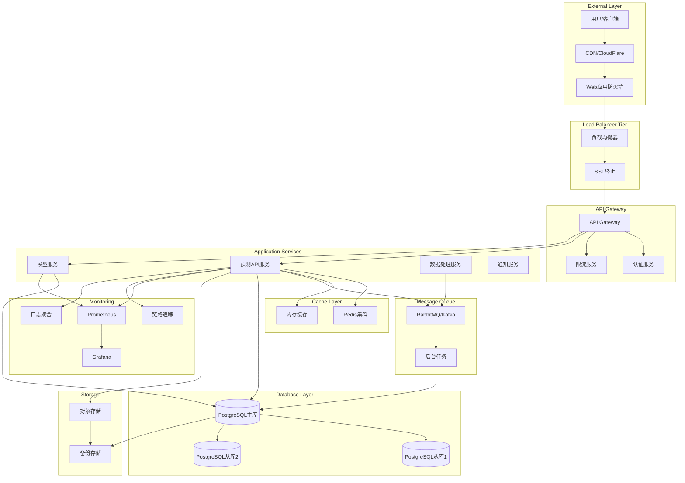
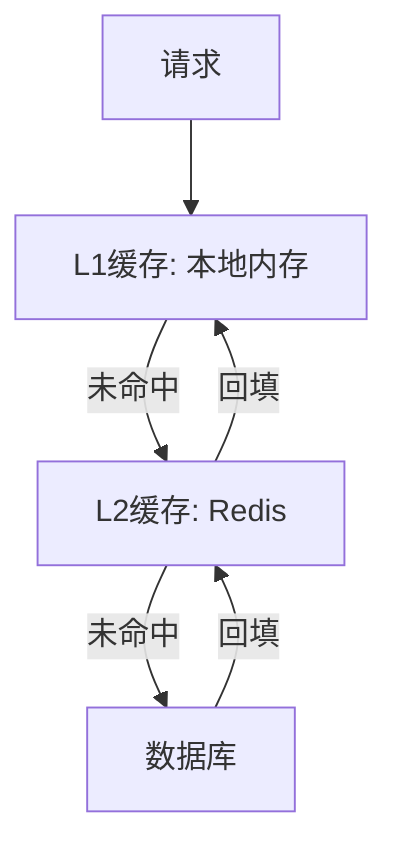
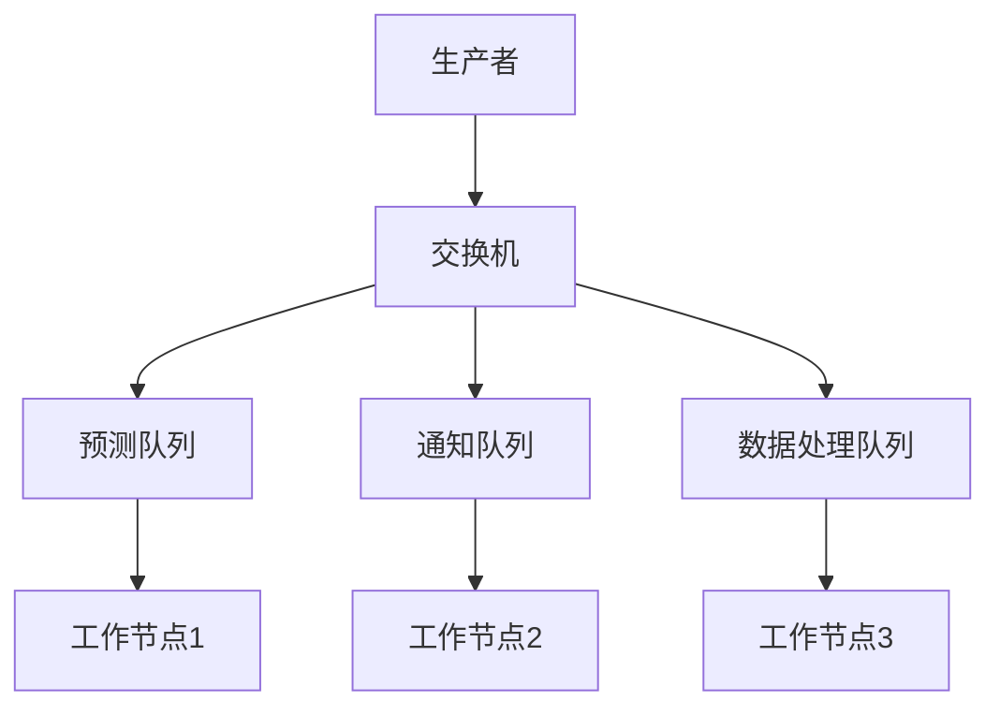
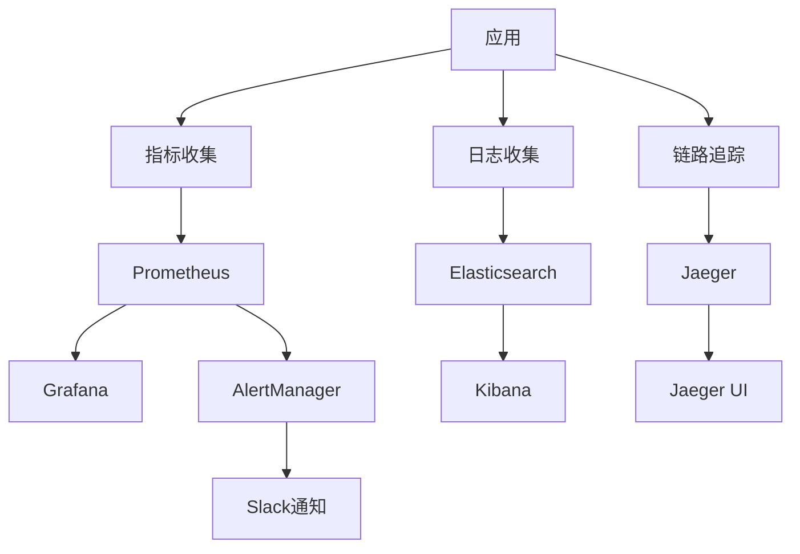
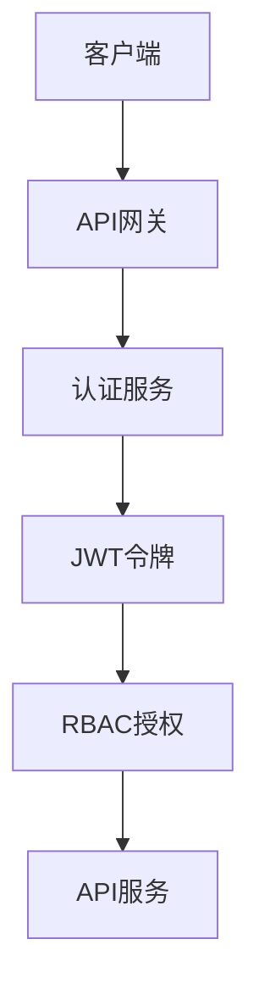
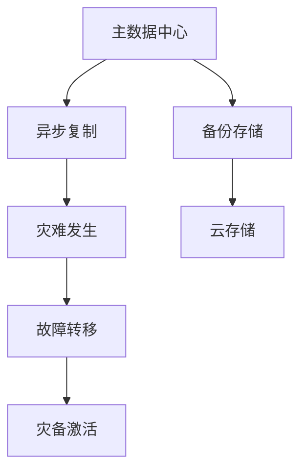
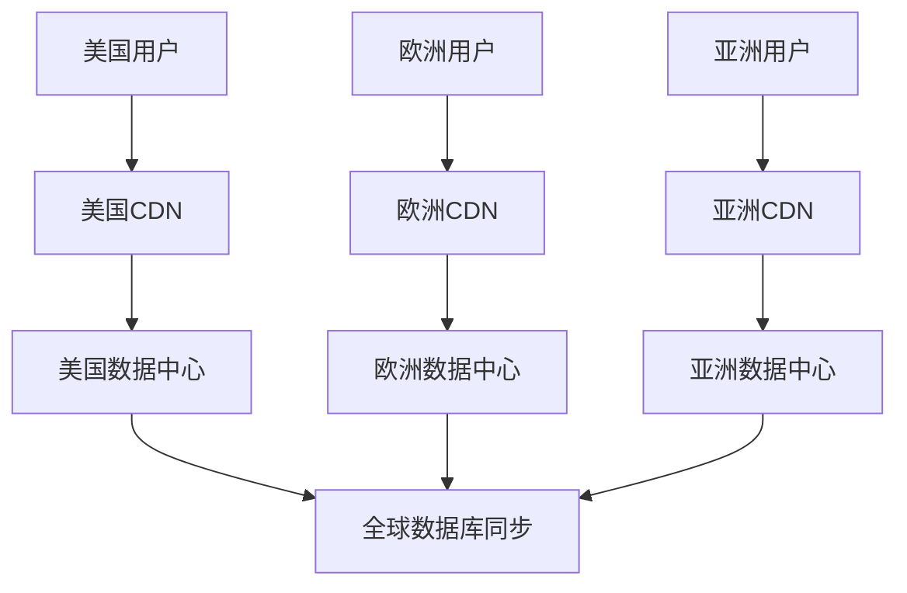

# Football Prediction System - 生产环境架构文档

## 概述

Football Prediction System是一个基于机器学习的足球比赛预测平台，采用微服务架构设计，支持高并发、高可用的生产环境部署。

## 系统架构图



## 核心组件

### 1. API网关层

**功能**:
- 请求路由和负载均衡
- SSL/TLS终止
- 认证和授权
- 限流和熔断
- 请求/响应转换

**技术栈**:
- Kong / Nginx + Lua
- Envoy Proxy
- AWS API Gateway

**配置示例**:
```yaml
# Kong配置
services:
  - name: prediction-api
    url: http://api-service:8000
    plugins:
      - name: rate-limiting
        config:
          minute: 1000
          hour: 10000
      - name: jwt
        config:
          key_claim_name: iss
```

### 2. 应用服务层

#### 2.1 预测API服务 (Prediction API)

**职责**:
- 处理预测请求
- 验证输入参数
- 调用模型服务
- 缓存结果
- 返回预测结果

**技术实现**:
- FastAPI 0.116.1
- Uvicorn + Gunicorn
- Python 3.11

**性能指标**:
- QPS: 1000+
- P95延迟: <100ms
- 可用性: 99.9%

#### 2.2 模型服务 (Model Service)

**职责**:
- 加载训练好的模型
- 特征工程处理
- 批量预测
- 模型版本管理
- A/B测试支持

**技术实现**:
- Scikit-learn 1.5.2
- MLflow模型注册
- Redis模型缓存

**模型版本管理**:
```python
# model_registry.py
class ModelManager:
    def __init__(self):
        self.current_model = self.load_model("v2.1.0")
        self.models = {
            "v2.1.0": self.current_model,
            "v2.0.0": self.load_model("v2.0.0")
        }

    def predict(self, features, model_version=None):
        model = self.models.get(model_version, self.current_model)
        return model.predict(features)
```

#### 2.3 数据处理服务 (Data Processing)

**职责**:
- 实时数据收集
- 数据清洗和转换
- 特征计算
- 数据质量监控

**数据流**:


### 3. 缓存层

#### 3.1 多级缓存架构



**缓存策略**:
- L1缓存: 1000个条目，LRU淘汰，5分钟TTL
- L2缓存: Redis集群，100万个条目，30分钟TTL
- 预测结果缓存: 24小时TTL

**缓存配置**:
```python
# cache_config.py
CACHE_CONFIG = {
    "local": {
        "type": "lru",
        "size": 1000,
        "ttl": 300
    },
    "redis": {
        "cluster_nodes": [
            "redis-node1:6379",
            "redis-node2:6379",
            "redis-node3:6379"
        ],
        "ttl": 1800
    }
}
```

### 4. 数据库层

#### 4.1 数据库架构

**主从复制配置**:
- 1主3从架构
- 异步复制
- 读写分离
- 自动故障转移

**分片策略**:
```sql
-- 按时间分片比赛数据
CREATE TABLE matches_2024_q1 PARTITION OF matches
FOR VALUES FROM ('2024-01-01') TO ('2024-04-01');

-- 按用户ID分片用户数据
CREATE TABLE users_0 PARTITION OF users
FOR VALUES WITH (MODULUS 4, REMAINDER 0);
```

**连接池配置**:
```python
DATABASE_POOL = {
    "pool_size": 20,
    "max_overflow": 30,
    "pool_timeout": 30,
    "pool_recycle": 3600,
    "pool_pre_ping": True
}
```

### 5. 消息队列

#### 5.1 任务队列架构



**队列配置**:
```python
# celery_config.py
CELERY_CONFIG = {
    "broker_url": "redis://redis-cluster:6379/1",
    "result_backend": "redis://redis-cluster:6379/2",
    "task_routes": {
        "tasks.predict_batch": {"queue": "prediction"},
        "tasks.send_notification": {"queue": "notification"},
        "tasks.process_data": {"queue": "data_processing"}
    },
    "worker_prefetch_multiplier": 4,
    "task_acks_late": True
}
```

### 6. 监控和可观测性

#### 6.1 监控架构



**关键指标**:
```yaml
# 业务指标
business_metrics:
  - name: prediction_requests_total
    type: counter
    help: Total number of prediction requests

  - name: prediction_accuracy
    type: gauge
    help: Prediction accuracy rate

# 技术指标
technical_metrics:
  - name: http_request_duration_seconds
    type: histogram
    help: HTTP request latency

  - name: database_connections_active
    type: gauge
    help: Active database connections
```

## 安全架构

### 1. 认证和授权



**安全措施**:
- JWT令牌认证
- RBAC权限控制
- API密钥管理
- OAuth 2.0支持

### 2. 网络安全

```yaml
# 网络分段
network_segments:
  dmz:
    - load_balancer
    - web_firewall

  application:
    - api_gateway
    - application_services

  data:
    - databases
    - redis_cluster
    - message_queue

# 防火墙规则
firewall_rules:
  - source: 0.0.0.0/0
    destination: dmz
    ports: [80, 443]
    action: allow

  - source: dmz
    destination: application
    ports: [8000, 9090]
    action: allow
```

### 3. 数据安全

- **传输加密**: TLS 1.3
- **存储加密**: AES-256
- **密钥管理**: HashiCorp Vault
- **数据脱敏**: 敏感字段加密

## 部署架构

### 1. 容器化部署

```yaml
# deployment.yaml
apiVersion: apps/v1
kind: Deployment
metadata:
  name: football-api
spec:
  replicas: 5
  strategy:
    type: RollingUpdate
    rollingUpdate:
      maxSurge: 1
      maxUnavailable: 0
  selector:
    matchLabels:
      app: football-api
  template:
    spec:
      containers:
      - name: api
        image: football-prediction:production
        resources:
          requests:
            memory: "1Gi"
            cpu: "500m"
          limits:
            memory: "2Gi"
            cpu: "1000m"
        livenessProbe:
          httpGet:
            path: /health
            port: 8000
          initialDelaySeconds: 40
          periodSeconds: 30
        readinessProbe:
          httpGet:
            path: /health
            port: 8000
          initialDelaySeconds: 20
          periodSeconds: 10
```

### 2. 高可用配置

```yaml
# 高可用策略
high_availability:
  load_balancer:
    type: HAProxy
    mode: active-passive
    health_check: /health

  application:
    replicas: 5
    anti_affinity: true
    grace_period: 30s

  database:
    master_slave: true
    auto_failover: true
    backup_interval: hourly
```

### 3. 灾难恢复



**RTO/RPO**:
- RTO (恢复时间目标): 15分钟
- RPO (恢复点目标): 5分钟
- 备份频率: 实时 + 每小时全量

## 性能优化

### 1. 应用层优化

```python
# 异步处理
async def predict_batch(match_ids: List[str]):
    tasks = [predict_single(match_id) for match_id in match_ids]
    results = await asyncio.gather(*tasks)
    return results

# 批量处理
def batch_predict(features_batch: np.ndarray):
    return model.predict(features_batch)
```

### 2. 数据库优化

```sql
-- 索引优化
CREATE INDEX CONCURRENTLY idx_matches_team_date
ON matches(home_team, away_team, date);

-- 分区表
CREATE TABLE matches (
    id SERIAL,
    date DATE,
    home_team TEXT,
    away_team TEXT,
    PRIMARY KEY (id, date)
) PARTITION BY RANGE (date);

-- 查询优化
EXPLAIN (ANALYZE, BUFFERS)
SELECT * FROM matches
WHERE date BETWEEN '2025-01-01' AND '2025-01-31';
```

### 3. 缓存优化

```python
# 缓存预热
async def warm_cache():
    upcoming_matches = await get_upcoming_matches()
    for match in upcoming_matches:
        prediction = await predict_match(match.id)
        await cache.set(f"prediction:{match.id}", prediction)

# 缓存更新策略
async def update_cache(key: str, value: Any):
    await cache.set(key, value)
    await cache.publish(f"cache_update:{key}", value)
```

## 扩展策略

### 1. 水平扩展

- **无状态设计**: 应用服务无状态
- **自动扩缩容**: 基于CPU/内存/请求率
- **分布式缓存**: Redis集群
- **数据库分片**: 按业务域分片

### 2. 垂直扩展

- **资源配额**: 动态调整CPU/内存
- **性能调优**: JVM/Python优化
- **硬件升级**: SSD/GPU加速

### 3. 地理扩展



## 技术债务和改进计划

### 1. 当前技术债务

| 项目 | 影响等级 | 改进计划 | 时间线 |
|------|---------|---------|--------|
| 单体模型服务 | 中 | 拆分为微服务 | Q2 2025 |
| 缓存一致性 | 低 | 实现分布式锁 | Q3 2025 |
| 监控覆盖度 | 中 | 增加业务监控 | Q1 2025 |
| 测试覆盖率 | 高 | 提升到90%+ | Q1 2025 |

### 2. 架构演进方向

1. **微服务化**: 逐步拆分大服务
2. **事件驱动**: 引入事件总线
3. **服务网格**: Istio服务管理
4. **云原生**: 迁移到Kubernetes
5. **AI平台**: MLOps平台建设

## 总结

Football Prediction System的生产架构设计考虑了：

- **可扩展性**: 支持业务增长
- **可靠性**: 99.9%可用性目标
- **安全性**: 多层安全防护
- **性能**: 1000+ QPS支持
- **可维护性**: 清晰的架构分层
- **可观测性**: 全链路监控

通过合理的架构设计和技术选型，系统能够稳定支持生产环境的业务需求，并为未来的扩展留下空间。

---

文档版本: 1.0.0
最后更新: 2025-01-02
作者: 架构团队