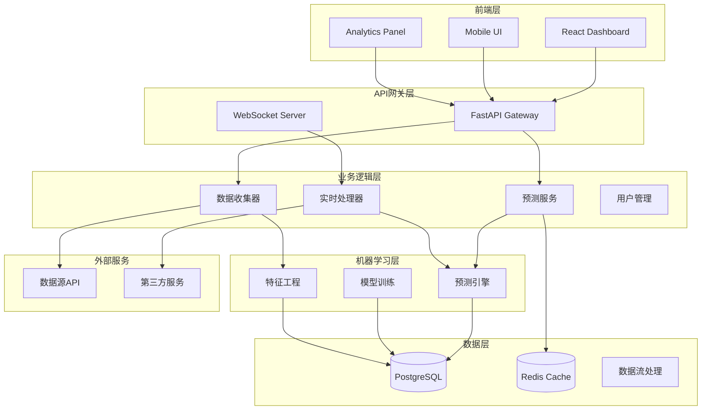
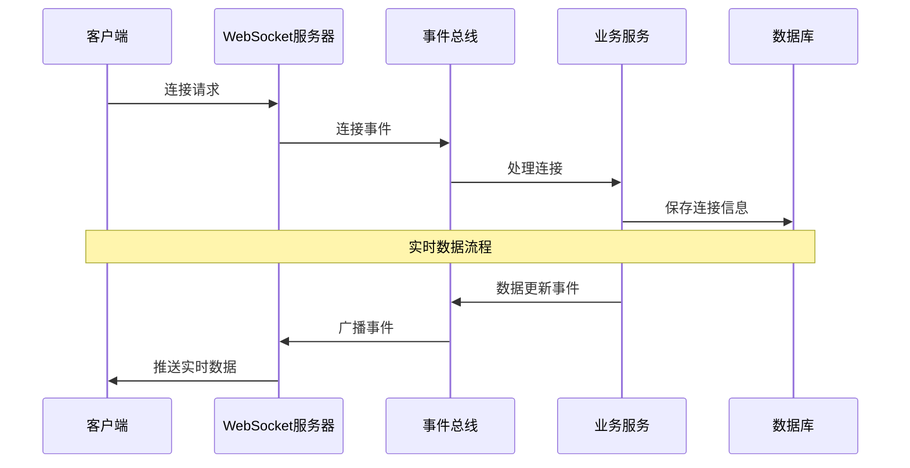
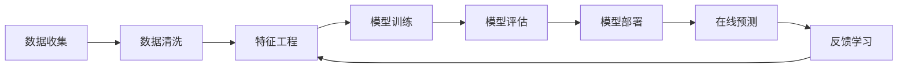

# 足球预测系统架构文档

## 📋 概述

足球预测系统是一个基于现代Python技术栈的企业级预测分析平台，采用微服务架构、实时通信和机器学习技术，为用户提供准确的足球比赛预测和投注建议。

## 🏗️ 整体架构

### 架构原则

- **微服务设计**: 模块化、可扩展的服务架构
- **事件驱动**: 基于WebSocket的实时事件系统
- **异步优先**: 全异步架构，支持高并发处理
- **容器化部署**: Docker + Docker Compose
- **云原生**: 支持Kubernetes部署
- **数据驱动**: 基于机器学习的智能预测

### 技术栈

#### 后端技术
- **框架**: FastAPI (Python 3.11+)
- **数据库**: PostgreSQL (主数据库)
- **缓存**: Redis (缓存和会话存储)
- **实时通信**: WebSocket
- **消息队列**: Celery + Redis
- **ORM**: SQLAlchemy 2.0 (异步)
- **API文档**: OpenAPI/Swagger

#### 前端技术
- **框架**: React 18 + TypeScript
- **UI库**: Ant Design
- **状态管理**: Redux Toolkit
- **图表**: ECharts + echarts-for-react
- **构建工具**: Create React App
- **样式**: CSS-in-JS + Responsive Design

#### 机器学习
- **框架**: scikit-learn, pandas, numpy
- **模型**: 集成学习算法
- **特征工程**: 自动化特征提取
- **模型评估**: 交叉验证和性能监控

#### DevOps
- **容器**: Docker + Docker Compose
- **CI/CD**: GitHub Actions
- **监控**: Prometheus + Grafana
- **日志**: Loki + ELK Stack
- **代码质量**: Ruff, MyPy, ESLint

## 🔄 系统架构图



## 🧩 核心组件架构

### 1. API层 (`src/api/`)

**职责**: HTTP请求处理、CQRS模式实现、数据验证

**核心组件**:
- **路由管理**: RESTful API端点定义
- **控制器**: 请求处理和响应格式化
- **中间件**: 认证、授权、日志、错误处理
- **数据验证**: Pydantic模型和序列化

**设计模式**:
- CQRS (命令查询职责分离)
- 依赖注入
- 装饰器模式

```python
# CQRS示例
class PredictionCommand:
    """预测命令"""
    match_id: int
    strategy: str

class PredictionQuery:
    """预测查询"""
    match_id: Optional[int] = None
    date_range: Optional[Tuple[datetime, datetime]] = None
```

### 2. 领域层 (`src/domain/`)

**职责**: 业务逻辑、领域模型、业务规则

**核心组件**:
- **实体模型**: 比赛、预测、用户等核心实体
- **业务规则**: 投注策略、风险评估
- **策略模式**: 可插拔的预测算法
- **事件系统**: 领域事件定义和处理

**设计模式**:
- 策略模式 (预测算法)
- 工厂模式 (策略创建)
- 观察者模式 (事件处理)

```python
# 策略模式示例
class PredictionStrategy(ABC):
    @abstractmethod
    def predict(self, match_data: MatchData) -> PredictionResult:
        pass

class MLStrategy(PredictionStrategy):
    def predict(self, match_data: MatchData) -> PredictionResult:
        # 机器学习预测逻辑
        pass
```

### 3. 基础设施层 (`src/database/`, `src/cache/`)

**职责**: 数据访问、缓存管理、连接池

**核心组件**:
- **数据库连接**: 异步SQLAlchemy连接池
- **仓储模式**: 数据访问抽象层
- **缓存服务**: Redis集成和缓存策略
- **事务管理**: 自动事务处理

**设计模式**:
- 仓储模式
- 单例模式 (连接池)
- 工厂模式 (仓储创建)

```python
# 仓储模式示例
class MatchRepository(ABC):
    @abstractmethod
    async def get_by_id(self, match_id: int) -> Optional[Match]:
        pass

    @abstractmethod
    async def save(self, match: Match) -> Match:
        pass
```

### 4. 服务层 (`src/services/`)

**职责**: 业务服务编排、数据处理、外部集成

**核心组件**:
- **数据服务**: 数据收集和处理
- **预测服务**: 预测逻辑协调
- **通知服务**: 实时通知和告警
- **审计服务**: 操作日志和审计

**设计模式**:
- 服务层模式
- 门面模式
- 适配器模式

### 5. 实时通信层 (`src/realtime/`)

**职责**: WebSocket连接管理、实时事件处理

**核心组件**:
- **连接管理器**: WebSocket生命周期管理
- **事件系统**: 13种实时事件类型
- **订阅管理**: 智能订阅和过滤
- **消息路由**: 事件分发和路由

**架构特性**:
- 生产级异步架构
- 自动重连机制
- 消息队列支持
- 负载均衡能力

```python
# 实时事件系统
class EventType(str, Enum):
    CONNECTION_STATUS = "connection_status"
    PREDICTION_CREATED = "prediction_created"
    MATCH_STARTED = "match_started"
    MATCH_SCORE_CHANGED = "match_score_changed"
    ODDS_UPDATED = "odds_updated"
    # ... 更多事件类型
```

## 📊 数据架构

### 数据库设计

#### 核心表结构

```sql
-- 比赛表
CREATE TABLE matches (
    id SERIAL PRIMARY KEY,
    home_team VARCHAR(100) NOT NULL,
    away_team VARCHAR(100) NOT NULL,
    league VARCHAR(50) NOT NULL,
    match_date TIMESTAMP NOT NULL,
    status VARCHAR(20) DEFAULT 'upcoming',
    home_score INTEGER DEFAULT NULL,
    away_score INTEGER DEFAULT NULL,
    created_at TIMESTAMP DEFAULT NOW(),
    updated_at TIMESTAMP DEFAULT NOW()
);

-- 预测表
CREATE TABLE predictions (
    id SERIAL PRIMARY KEY,
    match_id INTEGER REFERENCES matches(id),
    strategy VARCHAR(50) NOT NULL,
    home_win_prob DECIMAL(5,4) NOT NULL,
    draw_prob DECIMAL(5,4) NOT NULL,
    away_win_prob DECIMAL(5,4) NOT NULL,
    confidence DECIMAL(5,4) NOT NULL,
    prediction VARCHAR(20) NOT NULL,
    created_at TIMESTAMP DEFAULT NOW()
);
```

### 缓存策略

#### Redis缓存层次

1. **L1缓存**: 应用内存缓存 (TTL: 5分钟)
2. **L2缓存**: Redis分布式缓存 (TTL: 30分钟)
3. **L3缓存**: 数据库查询缓存 (TTL: 2小时)

#### 缓存模式

- **Cache-Aside**: 应用管理缓存
- **Write-Through**: 写入时同步更新缓存
- **Write-Behind**: 异步写入数据库

## 🔄 事件驱动架构

### 事件流程



### 事件类型

| 事件类型 | 描述 | 触发条件 |
|---------|------|----------|
| `connection_status` | 连接状态变化 | 客户端连接/断开 |
| `prediction_created` | 预测创建 | 新预测生成 |
| `match_started` | 比赛开始 | 比赛状态变更 |
| `match_score_changed` | 比分更新 | 比分变化 |
| `odds_updated` | 赔率更新 | 赔率数据变化 |
| `system_alert` | 系统告警 | 异常情况 |

## 🤖 机器学习架构

### 模型管道



### 特征工程

#### 核心特征

1. **历史交锋**:
   - 过去10场交锋结果
   - 主客场优势分析
   - 进球/失球统计

2. **近期状态**:
   - 最近5场比赛表现
   - 进攻/防守效率
   - 伤病情况影响

3. **联赛因素**:
   - 联赛竞争力
   - 主客场表现差异
   - 赛季进度影响

4. **外部因素**:
   - 天气条件
   - 裁判因素
   - 博彩公司赔率

### 模型策略

#### 集成学习

```python
class EnsemblePredictor:
    def __init__(self):
        self.models = [
            RandomForestStrategy(),
            XGBoostStrategy(),
            NeuralNetworkStrategy(),
            LogisticRegressionStrategy()
        ]
        self.weights = [0.3, 0.3, 0.25, 0.15]  # 模型权重

    def predict(self, match_data: MatchData) -> PredictionResult:
        predictions = []
        for model, weight in zip(self.models, self.weights):
            pred = model.predict(match_data)
            predictions.append(pred * weight)

        return self._aggregate_predictions(predictions)
```

## 🔧 安全架构

### 安全层次

1. **网络安全**:
   - HTTPS强制执行
   - CORS策略配置
   - 请求频率限制

2. **认证授权**:
   - JWT令牌认证
   - RBAC权限控制
   - API密钥管理

3. **数据安全**:
   - 敏感数据加密
   - SQL注入防护
   - XSS攻击防护

4. **审计日志**:
   - 操作记录
   - 访问日志
   - 异常监控

## 📈 性能优化

### 缓存策略

- **查询缓存**: 数据库查询结果缓存
- **计算缓存**: 复杂计算结果缓存
- **页面缓存**: 静态资源缓存
- **CDN加速**: 静态资源分发

### 数据库优化

- **索引优化**: 关键字段索引
- **查询优化**: SQL语句优化
- **连接池**: 数据库连接池管理
- **读写分离**: 主从数据库配置

### 异步处理

- **异步IO**: 全异步架构
- **任务队列**: Celery异步任务
- **流处理**: 实时数据流处理
- **批量处理**: 大数据批量操作

## 🚀 部署架构

### 容器化部署

```yaml
# docker-compose.yml
version: '3.8'
services:
  app:
    build: .
    ports:
      - "8000:8000"
    environment:
      - DATABASE_URL=postgresql://user:pass@db:5432/football
    depends_on:
      - db
      - redis

  db:
    image: postgres:15
    environment:
      POSTGRES_DB: football
      POSTGRES_USER: user
      POSTGRES_PASSWORD: pass
    volumes:
      - postgres_data:/var/lib/postgresql/data

  redis:
    image: redis:7-alpine
    ports:
      - "6379:6379"
```

### 生产环境

- **负载均衡**: Nginx反向代理
- **服务发现**: Consul服务注册
- **配置管理**: 环境变量配置
- **监控告警**: Prometheus + Grafana
- **日志收集**: ELK Stack

## 🔮 扩展性设计

### 水平扩展

- **无状态设计**: 服务无状态化
- **数据分片**: 数据库分片策略
- **微服务拆分**: 服务边界清晰
- **消息队列**: 异步解耦

### 垂直扩展

- **资源监控**: CPU/内存/磁盘监控
- **性能调优**: 系统参数优化
- **缓存策略**: 多级缓存优化
- **数据库优化**: 查询和索引优化

## 📋 监控和运维

### 监控指标

1. **业务指标**:
   - 预测准确率
   - 用户活跃度
   - 系统响应时间

2. **技术指标**:
   - CPU/内存使用率
   - 数据库连接数
   - 缓存命中率

3. **安全指标**:
   - 异常访问次数
   - 失败登录次数
   - API调用频率

### 日志管理

- **结构化日志**: JSON格式日志
- **日志级别**: DEBUG/INFO/WARN/ERROR
- **日志聚合**: 集中式日志收集
- **日志分析**: ELK Stack分析

## 🎯 最佳实践

### 代码质量

- **代码规范**: Ruff + MyPy检查
- **测试覆盖**: 单元测试 + 集成测试
- **代码审查**: Pull Request审查流程
- **文档完善**: 代码注释和API文档

### 开发流程

- **版本控制**: Git工作流
- **CI/CD**: 自动化构建部署
- **环境管理**: 开发/测试/生产环境分离
- **发布策略**: 蓝绿部署/金丝雀发布

### 安全实践

- **安全编码**: OWASP安全编码规范
- **依赖管理**: 定期更新依赖包
- **漏洞扫描**: 自动化安全扫描
- **权限控制**: 最小权限原则

---

## 📞 联系信息

如有架构相关问题，请联系开发团队或查看相关技术文档。

**文档版本**: v1.0
**最后更新**: 2025-10-29
**维护团队**: Football Prediction Development Team
