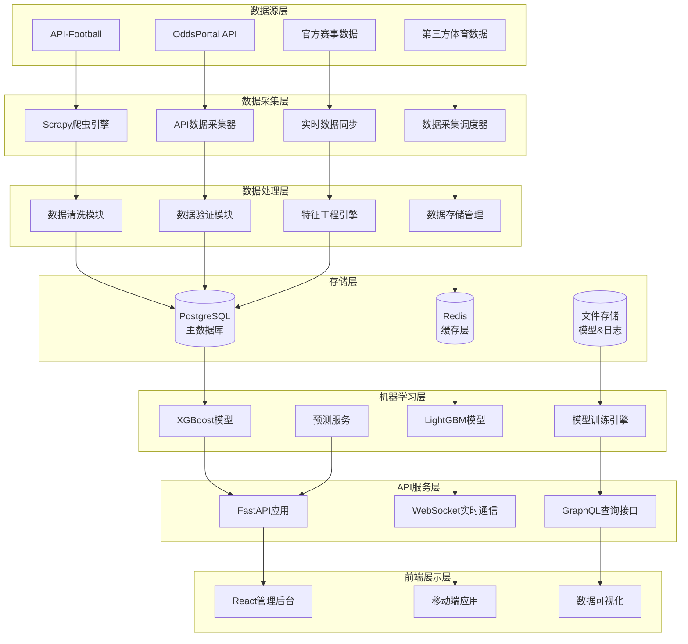

# 足球预测系统架构概览

## 📋 系统概述

Football Prediction 是一个基于机器学习的足球比赛结果预测系统，采用现代微服务架构和DDD设计模式。

### 🏗️ 架构层次

### 🔧 核心技术栈

- **后端框架**: FastAPI + Python 3.11+
- **数据库**: PostgreSQL 15 + Redis 7
- **机器学习**: XGBoost, LightGBM, TensorFlow
- **消息队列**: Redis Streams + Apache Kafka
- **容器化**: Docker + Docker Compose
- **监控**: Prometheus + Grafana + Loki

### 📊 系统特性

- **实时数据采集**: 支持多种数据源的实时同步
- **机器学习预测**: 基于历史数据的智能预测算法
- **高可用架构**: 微服务架构确保系统稳定性
- **缓存优化**: Redis多级缓存提升响应速度
- **监控告警**: 完整的监控和告警体系

## 🚀 快速开始

详细部署指南请参考：
- [部署指南](../deployment/README.md)
- [API文档](../api_reference.md)
- [开发指南](../reference/DEVELOPMENT_GUIDE.md)