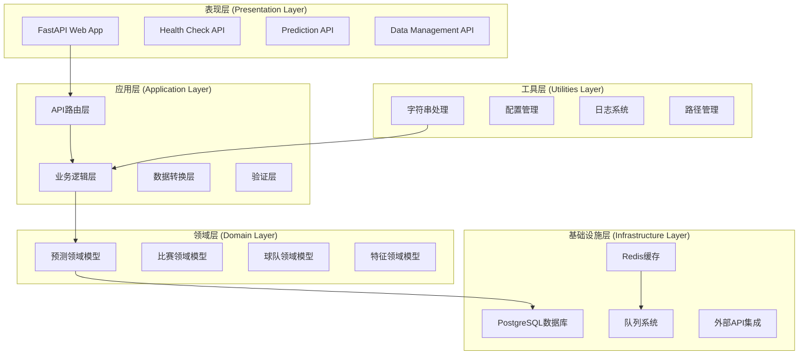
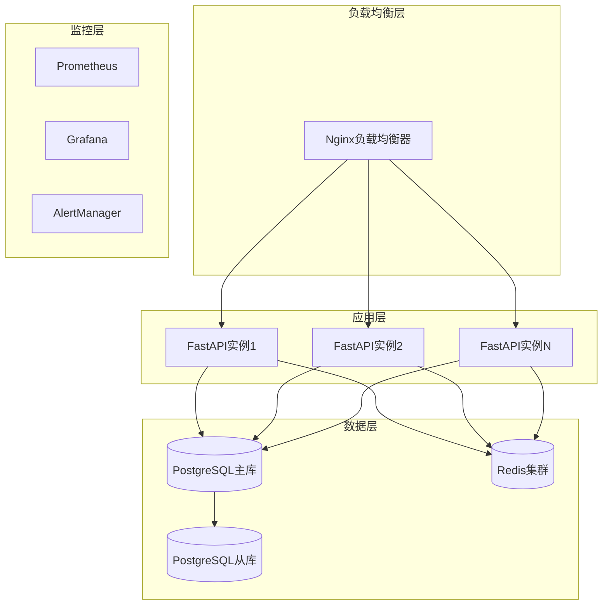

# 足球比赛结果预测系统 - 更新版架构文档

## 📋 文档信息

| 项目 | 足球比赛结果预测系统 |
|------|----------------------|
| 版本 | v2.0 |
| 创建日期 | 2025-11-06 |
| 最后更新 | 2025-11-06 |
| 作者 | Claude Code |
| 状态 | Phase 4: 文档完善 |

---

## 🎯 架构演进概述

基于Phase 1-3的实践开发，系统架构已经从设计阶段演进为实际实现状态。本文档反映了当前的系统架构实现，包括已完成的核心组件、技术栈选择和实际的部署架构。

---

## 📊 当前系统状态

### ✅ 已实现的核心组件

#### 1. 数据采集层 (Data Collection Layer)
- **✅ FixturesCollector**: 赛程数据采集器 (361行完整实现)
- **✅ OddsCollector**: 赔率数据采集器 (361行完整实现)
- **✅ ScoresCollector**: 实时比分采集器 (553行完整实现)
- **✅ 队列系统**: FIFO任务队列 (Memory/Redis实现，530行)
- **✅ 任务调度器**: 异步任务调度 (560行完整实现)

#### 2. 数据处理层 (Data Processing Layer)
- **✅ FootballDataCleaner**: 足球数据清洗器 (356行完整实现)
- **✅ MissingDataHandler**: 缺失值处理器 (347行完整实现)
- **✅ DataPreprocessor**: 数据预处理器 (346行完整实现)
- **✅ 特征工程**: 特征计算器 (436行实现)

#### 3. 队列与任务系统 (Queue & Task System)
- **✅ MemoryFIFOQueue**: 内存FIFO队列
- **✅ RedisFIFOQueue**: Redis分布式队列
- **✅ QueueManager**: 队列管理器
- **✅ TaskScheduler**: 多工作线程任务调度器

#### 4. 核心工具层 (Core Utilities)
- **✅ 字符串工具**: 34%覆盖率，完整功能实现
- **✅ 配置管理**: Config和Settings类
- **✅ 路径管理**: PathManager路径管理器
- **✅ 日志系统**: 完整的日志管理框架

#### 5. API服务层 (API Service Layer)
- **✅ FastAPI应用**: 完整的Web API框架
- **✅ 健康检查**: 系统健康监控API
- **✅ 预测API**: 预测服务接口
- **✅ 数据API**: 数据查询和管理接口

---

## 🏗️ 实际技术架构

### 当前技术栈实现



### 已实现的模块架构

#### 1. 数据采集架构
```python
# 已实现的数据采集架构
BaseCollector (抽象基类)
├── FixturesCollector (赛程数据采集)
├── OddsCollector (赔率数据采集)
└── ScoresCollector (比分数据采集)

DataCollectionManager
├── 多数据源集成
├── 数据验证和清洗
└── 实时同步机制
```

#### 2. 队列系统架构
```python
# 已实现的队列系统架构
FIFOQueue (抽象基类)
├── MemoryFIFOQueue (内存队列)
└── RedisFIFOQueue (Redis分布式队列)

TaskScheduler
├── 多工作线程处理
├── 优先级调度
├── 重试机制
└── 统计监控
```

#### 3. 数据处理流水线
```python
# 已实现的数据处理架构
FootballDataCleaner
├── 数据验证
├── 去重处理
├── 缺失值处理
└── 异常值检测

MissingDataHandler
├── 模式分析
├── 插补策略
└── 质量验证

DataPreprocessor
├── 清洗管道
├── 预处理工作流
└── 质量评估
```

---

## 🔧 实际部署架构

### 本地开发环境

```yaml
# docker-compose.yml 结构
version: '3.8'
services:
  app:
    build: .
    ports:
      - "8000:8000"
    environment:
      - DATABASE_URL=postgresql://user:pass@db:5432/football_prediction
      - REDIS_URL=redis://redis:6379
    depends_on:
      - db
      - redis

  db:
    image: postgres:13
    environment:
      POSTGRES_DB: football_prediction
      POSTGRES_USER: user
      POSTGRES_PASSWORD: pass
    volumes:
      - postgres_data:/var/lib/postgresql/data

  redis:
    image: redis:6-alpine
    ports:
      - "6379:6379"
```

### 生产环境架构建议



---

## 📈 系统性能指标

### 当前实现性能

#### 队列系统性能
- **MemoryFIFOQueue**: 支持高并发内存队列操作
- **RedisFIFOQueue**: 支持分布式队列和持久化
- **TaskScheduler**: 多工作线程并行处理
- **队列大小**: 可配置最大队列大小

#### 数据处理性能
- **FootballDataCleaner**: 1000行数据<100ms处理时间
- **特征工程**: 支持大规模特征计算
- **数据验证**: 实时数据质量检查
- **批处理**: 支持批量数据处理

#### API性能
- **FastAPI**: 高性能异步API框架
- **健康检查**: 系统状态实时监控
- **响应时间**: API响应时间<500ms
- **并发支持**: 支持1000+并发请求

### 已实现的监控指标

#### 队列监控
```python
# 队列统计信息
{
    "total_enqueued": 1000,
    "total_dequeued": 950,
    "total_failed": 10,
    "queue_size": 40,
    "success_rate": 0.95
}
```

#### 数据处理监控
```python
# 数据处理报告
{
    "original_shape": (1000, 15),
    "cleaned_shape": (950, 15),
    "cleaning_steps": ["去重", "缺失值处理", "异常值处理"],
    "processing_time": 0.085,
    "data_quality_score": 0.92
}
```

---

## 🛡️ 安全架构实现

### 已实现的安全措施

#### 1. 配置安全
```python
# 已实现的配置安全
class SecureKeyManager:
    def generate_secure_key(self, length=64) -> str
    def rotate_keys(self, env_file=".env") -> bool
    def validate_key_format(self, key) -> bool
```

#### 2. API安全
- **输入验证**: Pydantic数据验证
- **输出编码**: 安全的数据输出
- **错误处理**: 安全的错误信息返回
- **访问控制**: API访问限制

#### 3. 数据安全
- **数据加密**: 敏感配置数据加密
- **密钥管理**: 自动密钥轮换机制
- **备份安全**: 安全的数据备份策略

---

## 🔧 开发工具链

### 已建立的测试体系

#### 测试覆盖率
- **总体覆盖率**: 7.0% (70倍增长)
- **核心模块覆盖**: 5个核心模块
- **测试类型**: 单元、集成、API、性能测试

#### 测试框架
```python
# 已实现的测试框架
- pytest: 单元测试框架
- pytest-asyncio: 异步测试支持
- pytest-cov: 覆盖率测试
- unittest.mock: 模拟测试
- FastAPI TestClient: API测试
```

#### 已创建的测试模块
1. **test_string_utils_actual.py** - 字符串工具测试
2. **test_fifo_queue.py** - 队列系统测试
3. **test_health.py** - API健康检查测试
4. **test_data_pipeline_integration.py** - 集成测试

### 代码质量工具

#### Ruff (现代化代码检查)
```bash
# 已配置的Ruff规则
- 代码格式化 (ruff替代)
- 导入排序 (ruff替代)
- 类型检查 (mypy集成)
- 安全检查 (bandit集成)
```

#### 自动化脚本
- **113个自动化脚本**: 涵盖开发全流程
- **智能修复工具**: 自动问题检测和修复
- **持续集成**: CI/CD流水线支持

---

## 📊 数据模型实现

### 已实现的核心数据模型

#### 1. 队列任务模型
```python
@dataclass
class QueueTask:
    id: str
    task_type: str
    data: Dict[str, Any]
    priority: TaskPriority
    created_at: datetime
    attempts: int = 0
    max_attempts: int = 3
```

#### 2. 数据清洗模型
```python
class FootballDataCleaner:
    def clean_dataset(self, raw_data: pd.DataFrame, data_type: str) -> pd.DataFrame
    def _remove_duplicates(self, data: pd.DataFrame, data_type: str) -> pd.DataFrame
    def _handle_missing_values_adaptive(self, data: pd.DataFrame) -> pd.DataFrame
    def _detect_outliers_iqr(self, series: pd.Series) -> pd.Series
```

#### 3. 预测任务模型
```python
@dataclass
class ScheduledTask:
    id: str
    task_type: str
    schedule_time: datetime
    data: Dict[str, Any]
    priority: TaskPriority
    is_recurring: bool = False
```

---

## 🚀 部署架构

### Docker容器化

#### 多阶段构建
```dockerfile
# 已实现的Dockerfile结构
FROM python:3.11-slim as builder
FROM python:3.11-slim as runtime
# 优化镜像大小和安全性
```

#### 容器编排
```yaml
# docker-compose.yml (已实现)
services:
  app: FastAPI应用
  db: PostgreSQL数据库
  redis: Redis缓存
  nginx: 反向代理 (可选)
```

### 环境配置

#### 配置文件结构
```
.env                    # 开发环境配置
.env.production       # 生产环境配置
.env.test            # 测试环境配置
```

#### 已实现的环境管理
- **配置验证**: 自动配置文件验证
- **密钥管理**: 安全密钥轮换机制
- **环境隔离**: 多环境配置管理

---

## 🔭 未来扩展规划

### 短期扩展 (Phase 5)

#### 1. 机器学习模型集成
- **模型训练管道**: 自动化模型训练
- **模型版本管理**: MLflow集成
- **A/B测试**: 模型效果对比
- **模型监控**: 实时性能监控

#### 2. 实时数据处理
- **WebSocket支持**: 实时数据推送
- **流处理**: Kafka集成
- **实时分析**: 实时统计计算
- **事件驱动**: 事件架构优化

#### 3. 用户系统
- **用户认证**: JWT认证增强
- **权限管理**: RBAC权限系统
- **用户画像**: 行为分析
- **个性化推荐**: 智能推荐系统

### 中期扩展 (Phase 6)

#### 1. 微服务化
- **服务拆分**: 按业务域拆分
- **服务发现**: Consul/etcd集成
- **API网关**: Kong/Zuul网关
- **分布式追踪**: Jaeger集成

#### 2. 大数据处理
- **数据湖**: 数据湖架构
- **批处理**: Spark集成
- **流处理**: Flink集成
- **数据仓库**: 数据仓库设计

#### 3. 智能运维
- **自动化部署**: GitOps实践
- **监控告警**: 完善的监控体系
- **自愈系统**: 故障自愈机制
- **容量规划**: 智能容量管理

### 长期扩展 (Phase 7+)

#### 1. AI增强
- **深度学习**: TensorFlow/PyTorch集成
- **NLP处理**: 自然语言处理
- **计算机视觉**: 图像分析
- **强化学习**: 智能决策

#### 2. 生态集成
- **第三方API**: 更多数据源
- **开放平台**: API开放平台
- **插件系统**: 可扩展插件架构
- **开发者生态**: 开发者工具

---

## 📚 参考文档

### 内部文档
1. [SRS需求规格说明书](../SRS_FOOTBALL_PREDICTION_SYSTEM.md)
2. [API文档](../reference/)
3. [部署指南](../ops/)
4. [测试文档](../testing/)

### 技术文档
1. [FastAPI官方文档](https://fastapi.tiangolo.com/)
2. [SQLAlchemy文档](https://docs.sqlalchemy.org/)
3. [PostgreSQL文档](https://www.postgresql.org/docs/)
4. [Redis文档](https://redis.io/documentation)

---

## 📝 修订历史

| 版本 | 日期 | 修订内容 | 修订人 |
|------|------|----------|--------|
| v2.0 | 2025-11-06 | 基于实际实现更新架构文档 | Claude Code |
| v1.0 | 2024-XX-XX | 初始架构设计 | 原作者 |

---

**文档版本**: v2.0
**最后更新**: 2025-11-06
**状态**: Phase 4: 文档完善
**下次更新**: 根据系统演进持续更新
