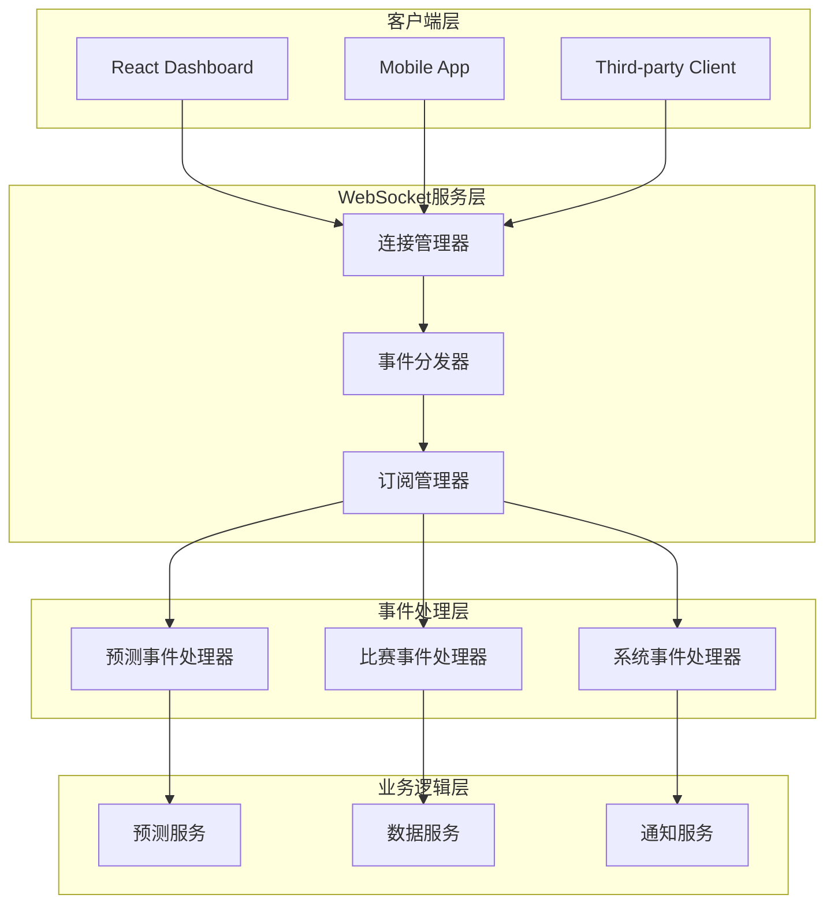
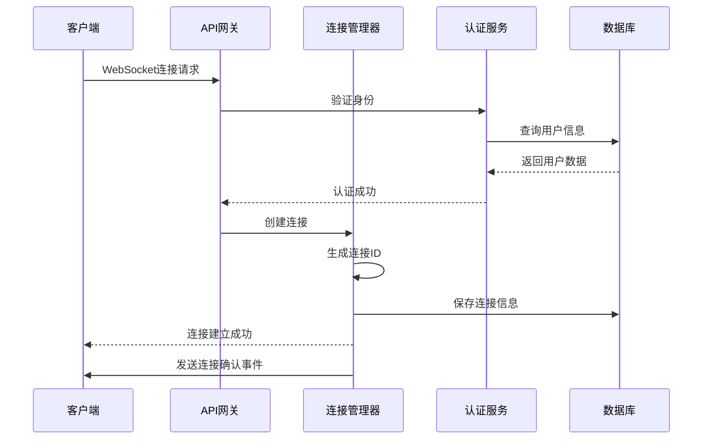
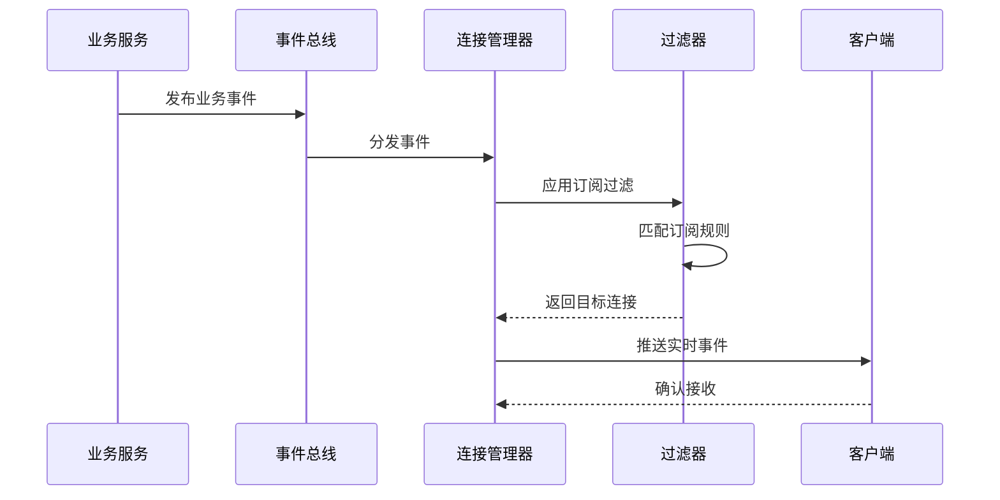

# WebSocket实时通信系统文档

## 📋 概述

WebSocket实时通信系统是足球预测系统的核心组件，提供双向实时数据流传输能力，支持实时预测推送、比赛状态更新、用户交互等功能。

## 🏗️ 架构设计

### 系统架构



### 核心组件

#### 1. WebSocket连接管理器 (`src/realtime/manager.py`)

**职责**: WebSocket连接生命周期管理、连接池维护、心跳检测

**核心功能**:
- 连接建立和断开管理
- 连接状态监控
- 心跳检测机制
- 自动重连处理
- 连接统计信息

**关键特性**:
```python
class WebSocketManager:
    def __init__(self):
        self.connections: Dict[str, WebSocketConnection] = {}
        self.user_connections: Dict[str, Set[str]] = {}
        self.rooms: Dict[str, Set[str]] = {}

    async def handle_connection(self, websocket: WebSocket) -> str:
        """处理新的WebSocket连接"""

    async def handle_disconnection(self, connection_id: str):
        """处理连接断开"""

    async def send_to_connection(self, connection_id: str, event: RealtimeEvent):
        """向特定连接发送事件"""
```

#### 2. 事件系统 (`src/realtime/events.py`)

**职责**: 事件定义、事件验证、事件序列化

**事件类型**:
```python
class EventType(str, Enum):
    # 连接相关
    CONNECTION_STATUS = "connection_status"

    # 预测相关
    PREDICTION_CREATED = "prediction_created"
    PREDICTION_UPDATED = "prediction_updated"
    PREDICTION_COMPLETED = "prediction_completed"

    # 比赛相关
    MATCH_STARTED = "match_started"
    MATCH_SCORE_CHANGED = "match_score_changed"
    MATCH_STATUS_CHANGED = "match_status_changed"
    MATCH_ENDED = "match_ended"

    # 赔率相关
    ODDS_UPDATED = "odds_updated"
    ODDS_SIGNIFICANT_CHANGE = "odds_significant_change"

    # 系统相关
    SYSTEM_ALERT = "system_alert"
    SYSTEM_STATUS = "system_status"
    USER_SUBSCRIPTION_CHANGED = "user_subscription_changed"
    DATA_REFRESH = "data_refresh"
    ANALYTICS_UPDATED = "analytics_updated"
```

**事件结构**:
```python
@dataclass
class RealtimeEvent:
    event_type: str
    data: Dict[str, Any]
    timestamp: str
    source: Optional[str] = None
    correlation_id: Optional[str] = None
```

#### 3. 订阅管理器 (`src/realtime/subscriptions.py`)

**职责**: 用户订阅管理、事件过滤、个性化推送

**订阅类型**:
```python
class SubscriptionType(str, Enum):
    PREDICTIONS = "predictions"
    MATCHES = "matches"
    ODDS = "odds"
    SYSTEM_ALERTS = "system_alerts"
    ANALYTICS = "analytics"
```

**订阅过滤器**:
```python
@dataclass
class SubscriptionFilter:
    match_ids: Optional[List[int]] = None
    leagues: Optional[List[str]] = None
    min_confidence: Optional[float] = None
    event_types: Optional[List[str]] = None
```

## 🔄 实时数据流程

### 连接建立流程



### 事件推送流程



## 📡 API端点

### WebSocket端点

#### 主WebSocket端点
```
ws://localhost:8000/realtime/ws
```

**查询参数**:
- `user_id`: 用户ID (可选)
- `session_id`: 会话ID (可选)
- `token`: 认证令牌 (可选)

**消息格式**:
```json
{
  "type": "subscribe|unsubscribe|heartbeat|get_stats",
  "data": {
    "subscription_type": "predictions|matches|odds",
    "filters": {
      "match_ids": [1, 2, 3],
      "leagues": ["英超", "西甲"],
      "min_confidence": 0.7
    }
  }
}
```

#### 专用预测端点
```
ws://localhost:8000/realtime/ws/predictions?match_ids=1,2,3&min_confidence=0.7
```

#### 专用比赛端点
```
ws://localhost:8000/realtime/ws/matches?match_ids=1,2,3&leagues=英超,西甲
```

### REST API端点

#### 系统状态
```http
GET /realtime/health
```

#### 统计信息
```http
GET /realtime/stats
```

#### 连接信息
```http
GET /realtime/connections/{connection_id}
```

#### 广播消息
```http
POST /realtime/broadcast
```

## 🎯 事件详细说明

### 1. 预测事件

#### PREDICTION_CREATED
**触发时机**: 新预测生成时

**数据结构**:
```json
{
  "event_type": "prediction_created",
  "data": {
    "prediction_id": 123,
    "match_id": 456,
    "home_team": "曼联",
    "away_team": "切尔西",
    "prediction": "home_win",
    "confidence": 0.75,
    "home_win_prob": 0.65,
    "draw_prob": 0.25,
    "away_win_prob": 0.10,
    "expected_value": 0.12,
    "strategy": "ml_ensemble"
  },
  "timestamp": "2025-10-29T10:30:00Z"
}
```

#### PREDICTION_UPDATED
**触发时机**: 预测结果更新时

#### PREDICTION_COMPLETED
**触发时机**: 预测最终确定时

### 2. 比赛事件

#### MATCH_STARTED
**触发时机**: 比赛开始时

**数据结构**:
```json
{
  "event_type": "match_started",
  "data": {
    "match_id": 456,
    "home_team": "曼联",
    "away_team": "切尔西",
    "league": "英超",
    "start_time": "2025-10-29T20:00:00Z",
    "venue": "老特拉福德球场"
  },
  "timestamp": "2025-10-29T20:00:00Z"
}
```

#### MATCH_SCORE_CHANGED
**触发时机**: 比分变化时

**数据结构**:
```json
{
  "event_type": "match_score_changed",
  "data": {
    "match_id": 456,
    "home_score": 1,
    "away_score": 0,
    "scoring_team": "home",
    "scoring_player": "布鲁诺·费尔南德斯",
    "minute": 25,
    "timestamp": "2025-10-29T20:25:00Z"
  },
  "timestamp": "2025-10-29T20:25:00Z"
}
```

### 3. 系统事件

#### SYSTEM_ALERT
**触发时机**: 系统告警时

**数据结构**:
```json
{
  "event_type": "system_alert",
  "data": {
    "alert_type": "error|warning|info",
    "message": "数据库连接异常",
    "severity": "high",
    "component": "database",
    "details": {
      "error_code": "DB_CONN_FAILED",
      "retry_count": 3
    }
  },
  "timestamp": "2025-10-29T10:30:00Z"
}
```

## 🔧 客户端集成

### JavaScript/TypeScript客户端

#### 基础连接
```typescript
import { WebSocketService } from './services/websocket';

const wsService = new WebSocketService({
  url: 'ws://localhost:8000/realtime/ws',
  userId: 'user123',
  autoReconnect: true,
  heartbeatInterval: 30000
});

// 连接事件监听
wsService.on('connection_status', (status) => {
  console.log('连接状态:', status);
});

// 订阅预测事件
wsService.subscribe(['prediction_created'], {
  match_ids: [1, 2, 3],
  min_confidence: 0.7
});

// 监听预测事件
wsService.on('prediction_created', (event) => {
  console.log('新预测:', event.data);
});
```

#### React Hook集成
```typescript
import { useWebSocket, usePredictionsWebSocket } from './hooks/useWebSocket';

function PredictionComponent() {
  const { isConnected, error } = useWebSocket({
    userId: 'user123',
    autoConnect: true
  });

  const { predictions, loading } = usePredictionsWebSocket(
    [1, 2, 3], // match_ids
    0.7        // min_confidence
  );

  if (!isConnected) {
    return <div>连接中...</div>;
  }

  return (
    <div>
      {predictions.map(pred => (
        <PredictionCard key={pred.id} prediction={pred} />
      ))}
    </div>
  );
}
```

### Python客户端

```python
import asyncio
import websockets
import json

async def websocket_client():
    uri = "ws://localhost:8000/realtime/ws?user_id=user123"

    async with websockets.connect(uri) as websocket:
        # 发送订阅请求
        subscribe_msg = {
            "type": "subscribe",
            "data": {
                "subscription_type": "predictions",
                "filters": {
                    "min_confidence": 0.7
                }
            }
        }
        await websocket.send(json.dumps(subscribe_msg))

        # 接收事件
        while True:
            message = await websocket.recv()
            event = json.loads(message)
            print(f"收到事件: {event}")

asyncio.run(websocket_client())
```

## 📊 性能监控

### 关键指标

#### 连接指标
- **活跃连接数**: 当前在线连接数
- **连接建立速率**: 每秒新建连接数
- **连接断开速率**: 每秒断开连接数
- **平均连接时长**: 连接平均持续时间

#### 消息指标
- **消息吞吐量**: 每秒处理消息数
- **消息延迟**: 消息端到端延迟
- **消息大小**: 平均消息大小
- **错误率**: 消息发送失败率

#### 系统指标
- **内存使用**: WebSocket服务内存占用
- **CPU使用**: WebSocket服务CPU占用
- **网络带宽**: 网络带宽使用情况

### 监控实现

```python
class WebSocketMetrics:
    def __init__(self):
        self.connection_count = 0
        self.message_count = 0
        self.error_count = 0
        self.start_time = time.time()

    def record_connection(self):
        self.connection_count += 1

    def record_message(self):
        self.message_count += 1

    def record_error(self):
        self.error_count += 1

    def get_stats(self) -> Dict[str, Any]:
        uptime = time.time() - self.start_time
        return {
            "active_connections": self.connection_count,
            "total_messages": self.message_count,
            "error_rate": self.error_count / max(self.message_count, 1),
            "uptime_seconds": uptime,
            "messages_per_second": self.message_count / max(uptime, 1)
        }
```

## 🔒 安全考虑

### 认证授权

#### JWT认证
```python
async def authenticate_websocket(websocket: WebSocket, token: str):
    try:
        payload = jwt.decode(token, SECRET_KEY, algorithms=["HS256"])
        user_id = payload.get("user_id")
        if user_id:
            return user_id
    except jwt.InvalidTokenError:
        pass
    return None
```

#### 权限控制
```python
def check_subscription_permission(user_id: str, subscription: Subscription) -> bool:
    # 检查用户是否有权限订阅特定事件
    user = get_user(user_id)
    if user.subscription_tier == "free":
        # 免费用户限制
        return subscription.event_type in ["prediction_created", "match_started"]
    return True
```

### 安全措施

1. **输入验证**: 严格验证所有输入数据
2. **速率限制**: 防止消息洪水攻击
3. **连接限制**: 限制单用户连接数
4. **数据过滤**: 敏感数据过滤
5. **加密传输**: WSS加密传输

## 🚀 部署配置

### Nginx配置

```nginx
upstream websocket {
    server localhost:8000;
}

server {
    listen 80;
    server_name your-domain.com;

    location /realtime/ws {
        proxy_pass http://websocket;
        proxy_http_version 1.1;
        proxy_set_header Upgrade $http_upgrade;
        proxy_set_header Connection "upgrade";
        proxy_set_header Host $host;
        proxy_set_header X-Real-IP $remote_addr;
        proxy_set_header X-Forwarded-For $proxy_add_x_forwarded_for;
        proxy_set_header X-Forwarded-Proto $scheme;
        proxy_read_timeout 86400s;
        proxy_send_timeout 86400s;
    }
}
```

### Docker配置

```dockerfile
FROM python:3.11-slim

WORKDIR /app

COPY requirements.txt .
RUN pip install -r requirements.txt

COPY . .

EXPOSE 8000

CMD ["uvicorn", "src.main:app", "--host", "0.0.0.0", "--port", "8000"]
```

### Kubernetes部署

```yaml
apiVersion: apps/v1
kind: Deployment
metadata:
  name: websocket-service
spec:
  replicas: 3
  selector:
    matchLabels:
      app: websocket-service
  template:
    metadata:
      labels:
        app: websocket-service
    spec:
      containers:
      - name: websocket
        image: football-prediction/websocket:latest
        ports:
        - containerPort: 8000
        env:
        - name: DATABASE_URL
          valueFrom:
            secretKeyRef:
              name: app-secrets
              key: database-url
```

## 🔧 故障排除

### 常见问题

#### 1. 连接频繁断开
**症状**: 客户端连接后立即断开
**原因**:
- 认证失败
- 心跳超时
- 网络不稳定

**解决方案**:
```python
# 增加心跳间隔
websocket_service = WebSocketService(
    heartbeat_interval=60000  # 60秒
)

# 启用自动重连
websocket_service = WebSocketService(
    auto_reconnect=True,
    max_reconnect_attempts=10
)
```

#### 2. 消息丢失
**症状**: 客户端未收到预期事件
**原因**:
- 订阅过滤不正确
- 事件序列化失败
- 网络传输问题

**解决方案**:
```python
# 检查订阅配置
subscription = Subscription(
    user_id="user123",
    subscription_type="predictions",
    filters=SubscriptionFilter(
        match_ids=[1, 2, 3],  # 确保match_ids正确
        min_confidence=0.7
    )
)

# 启用消息确认
ws_service.on('message_ack', (ack) => {
    console.log('消息确认:', ack);
});
```

#### 3. 性能问题
**症状**: 高延迟或连接数限制
**原因**:
- 单实例性能瓶颈
- 数据库连接池不足
- 内存使用过高

**解决方案**:
```python
# 增加连接池大小
DATABASE_POOL_SIZE = 20
DATABASE_MAX_OVERFLOW = 30

# 启用连接复用
websocket_service = WebSocketService(
    max_connections=10000,
    connection_timeout=300
)
```

## 📚 最佳实践

### 开发建议

1. **事件设计**:
   - 保持事件结构简单
   - 使用标准时间格式
   - 包含必要的元数据

2. **错误处理**:
   - 实现优雅降级
   - 记录详细错误日志
   - 提供用户友好的错误信息

3. **性能优化**:
   - 使用连接池
   - 实现消息批处理
   - 启用数据压缩

4. **测试策略**:
   - 单元测试覆盖核心逻辑
   - 集成测试验证端到端流程
   - 压力测试验证性能指标

### 运维建议

1. **监控告警**:
   - 设置关键指标告警
   - 监控系统资源使用
   - 跟踪业务指标趋势

2. **容量规划**:
   - 预估连接数增长
   - 规划资源扩容策略
   - 准备应急响应方案

3. **安全管理**:
   - 定期更新依赖包
   - 监控安全漏洞
   - 实施访问控制

---

## 📞 技术支持

如有WebSocket实时通信相关问题，请联系开发团队或查看相关技术文档。

**文档版本**: v1.0
**最后更新**: 2025-10-29
**维护团队**: Football Prediction Development Team
