# 性能监控系统架构设计

## 系统概述

性能监控系统采用分层架构设计，提供全方位的性能数据采集、分析和可视化能力。系统遵循低耦合、高内聚的设计原则，支持模块化扩展。

## 架构图

```mermaid
graph TB
    subgraph "应用层"
        A[FastAPI应用] --> B[性能监控中间件]
        A --> C[API端点]
    end

    subgraph "监控层"
        B --> D[性能分析器]
        D --> E[函数分析器]
        D --> F[内存分析器]
        D --> G[数据库分析器]
        D --> H[API分析器]
    end

    subgraph "数据处理层"
        E --> I[指标收集器]
        F --> I
        G --> I
        H --> I
        I --> J[性能分析引擎]
        J --> K[洞察生成器]
        J --> L[建议生成器]
    end

    subgraph "存储层"
        I --> M[时序数据库]
        J --> N[分析结果缓存]
        K --> N
        L --> N
    end

    subgraph "展示层"
        N --> O[性能仪表板]
        N --> P[API接口]
        N --> Q[报告生成器]
    end
```



## 核心模块设计

### 1. 性能分析器模块 (Profiler)

#### 类结构

```python
PerformanceProfiler
├── metrics: List[PerformanceMetric]
├── function_profiles: Dict[str, FunctionProfile]
├── query_profiles: List[QueryProfile]
├── active_profiling: bool
└── methods:
    ├── start_profiling()
    ├── stop_profiling()
    ├── record_metric()
    ├── record_function_call()
    ├── record_database_query()
    ├── get_metrics_summary()
    ├── get_slow_functions()
    └── reset()
```

#### 设计特点

- **单例模式**: 全局共享的分析器实例
- **装饰器支持**: 通过装饰器自动记录函数性能
- **异步友好**: 支持异步函数性能分析
- **资源管理**: 自动管理性能分析资源的分配和释放

### 2. 监控中间件模块 (Middleware)

#### 中间件层次

```python
请求流程:
Request → I18nMiddleware → CORSMiddleware →
PerformanceMonitoringMiddleware → API Handler → Response

响应流程:
Response ← PerformanceMonitoringMiddleware ←
API Handler ← 中间件链
```

#### 功能模块

```python
PerformanceMonitoringMiddleware
├── 配置参数
│   ├── track_memory: bool
│   ├── track_concurrency: bool
│   └── sample_rate: float
├── 统计数据
│   ├── active_requests: Dict
│   ├── request_times: List[float]
│   └── endpoint_stats: Dict
└── 功能方法
    ├── dispatch() - 请求处理
    ├── track_request_metrics() - 指标收集
    ├── calculate_percentiles() - 百分位计算
    └── identify_slow_requests() - 慢请求识别
```

### 3. 性能分析引擎 (Analyzer)

#### 分析流程


#### 核心类

```python
PerformanceAnalyzer
├── 数据模型
│   ├── PerformanceInsight
│   ├── PerformanceTrend
│   └── PerformanceRecommendation
├── 分析方法
│   ├── analyze_api_performance()
│   ├── analyze_database_performance()
│   ├── analyze_cache_performance()
│   ├── analyze_memory_performance()
│   └── analyze_task_performance()
└── 报告生成
    ├── generate_performance_report()
    ├── calculate_performance_score()
    └── export_report()
```

### 4. 集成管理模块 (Integration)

#### 生命周期管理

```python
应用启动流程:
1. 创建集成实例
2. 读取配置参数
3. 注册中间件
4. 初始化分析器
5. 设置告警规则
6. 启动监控服务

应用关闭流程:
1. 停止性能分析
2. 保存最后数据
3. 清理资源
4. 关闭连接
5. 注销中间件
```

## 数据流设计

### 1. 数据采集流程


### 2. 数据处理流程


## 存储设计

### 1. 数据存储策略

```python
存储层级:
1. 内存缓存 (L1)
   - 最近5分钟数据
   - 热点指标
   - 快速访问

2. Redis缓存 (L2)
   - 最近24小时数据
   - 聚合结果
   - 中等速度访问

3. 时序数据库 (L3)
   - 历史数据
   - 原始指标
   - 慢速分析查询
```

### 2. 数据模型

```python
# 性能指标数据
PerformanceMetric:
    - name: str          # 指标名称
    - value: float       # 指标值
    - unit: str          # 单位
    - timestamp: datetime # 时间戳
    - tags: Dict         # 标签

# 函数性能数据
FunctionProfile:
    - function_name: str
    - call_count: int
    - total_time: float
    - average_time: float
    - min_time: float
    - max_time: float

# 查询性能数据
QueryProfile:
    - query: str
    - execution_time: float
    - rows_affected: int
    - index_used: Optional[str]
```

## 配置管理

### 1. 配置层次

```python
配置优先级:
1. 环境变量 (最高)
2. 配置文件
3. 默认值 (最低)

配置分类:
- 基础配置
  - 启用/禁用开关
  - 采样率
  - 数据保留期

- 阈值配置
  - 响应时间阈值
  - 错误率阈值
  - 资源使用阈值

- 输出配置
  - 日志级别
  - 报告格式
  - 通知渠道
```

### 2. 配置示例

```yaml
performance:
  enabled: true
  sample_rate: 1.0
  profiling:
    enabled: false
    duration: 300  # 5分钟

  thresholds:
    response_time:
      slow: 1.0      # 秒
      critical: 5.0
    error_rate:
      warning: 0.01   # 1%
      critical: 0.05  # 5%
    memory_usage:
      warning: 80     # 百分比
      critical: 95

  storage:
    retention:
      metrics: 30d     # 30天
      profiles: 7d     # 7天
      reports: 90d     # 90天
```

## 扩展设计

### 1. 插件系统

```python
# 插件接口
class PerformancePlugin:
    def __init__(self, config):
        self.config = config

    def on_request_start(self, request):
        """请求开始时触发"""
        pass

    def on_request_end(self, request, response):
        """请求结束时触发"""
        pass

    def collect_metrics(self):
        """收集自定义指标"""
        return []

# 插件注册
plugin_manager.register_plugin("custom_plugin", CustomPlugin)
```

### 2. 自定义分析器

```python
# 分析器基类
class BaseAnalyzer:
    def analyze(self, data):
        """分析数据并返回洞察"""
        raise NotImplementedError

    def get_thresholds(self):
        """获取分析阈值"""
        return {}

# 实现自定义分析器
class CustomAnalyzer(BaseAnalyzer):
    def analyze(self, data):
        # 自定义分析逻辑
        insights = []
        # ...
        return insights
```

## 性能考虑

### 1. 性能开销

- **采样策略**: 通过采样率控制性能开销
- **异步处理**: 使用异步方式处理性能数据
- **批量操作**: 批量写入存储，减少I/O开销
- **内存优化**: 限制内存中保存的数据量

### 2. 扩展性设计

- **水平扩展**: 支持多实例部署
- **负载均衡**: 通过采样率分散负载
- **存储分离**: 性能数据独立存储
- **微服务友好**: 可以作为独立服务部署

## 安全设计

### 1. 数据安全

- **敏感信息过滤**: 自动过滤敏感参数
- **数据加密**: 传输和存储加密
- **访问控制**: 基于角色的访问控制
- **审计日志**: 记录所有访问操作

### 2. 隐私保护

- **数据脱敏**: 自动脱敏敏感数据
- **最小权限**: 只收集必要的数据
- **数据保留**: 定期清理过期数据
- **合规性**: 符合数据保护法规

## 监控指标

### 1. 系统健康指标

- 监控系统本身资源使用
- 数据采集成功率
- 分析处理延迟
- 告警响应时间

### 2. 业务指标

- API性能趋势
- 用户体验指标
- 系统可用性
- 业务成功率

## 未来规划

### 短期目标 (3个月)

- 完善可视化仪表板
- 增加更多预定义分析器
- 优化性能开销
- 支持更多数据库类型

### 中期目标 (6个月)

- 实现分布式追踪
- 支持容器化部署
- 集成机器学习预测
- 开发移动端应用

### 长期目标 (1年)

- 智能化运维
- 自动性能优化
- 全链路监控
-多云环境支持
