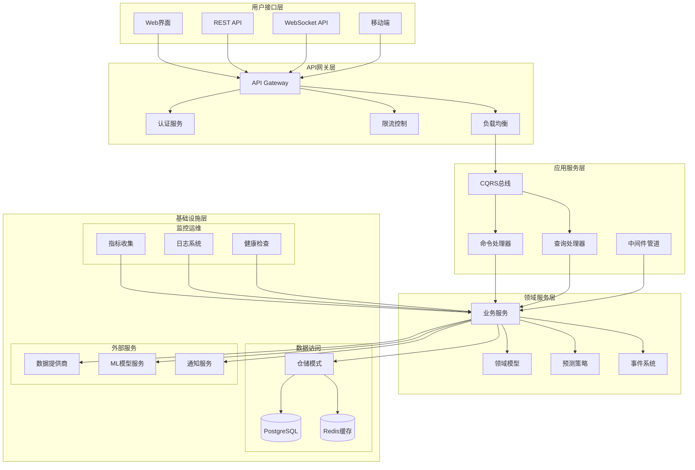
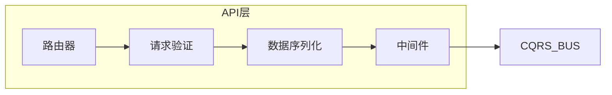
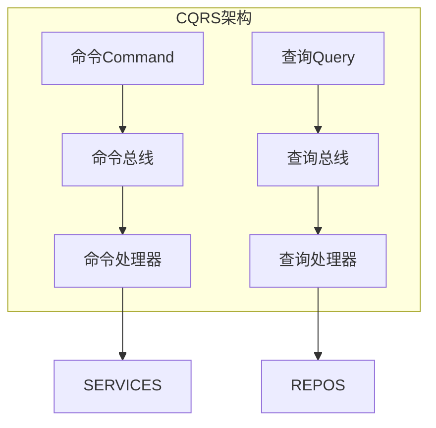
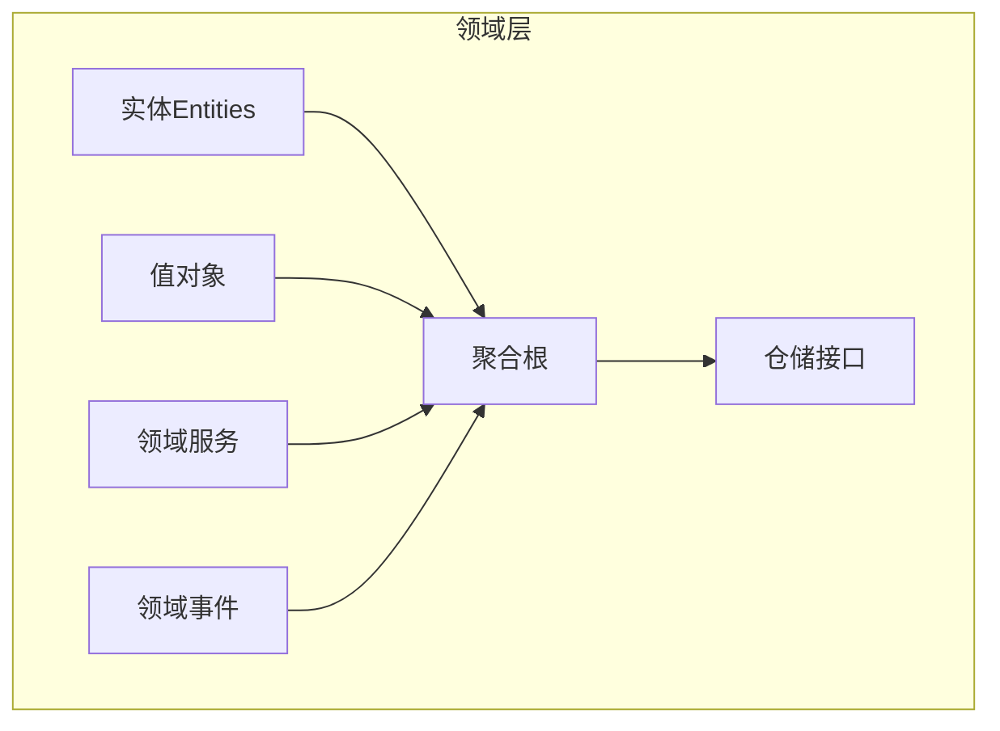
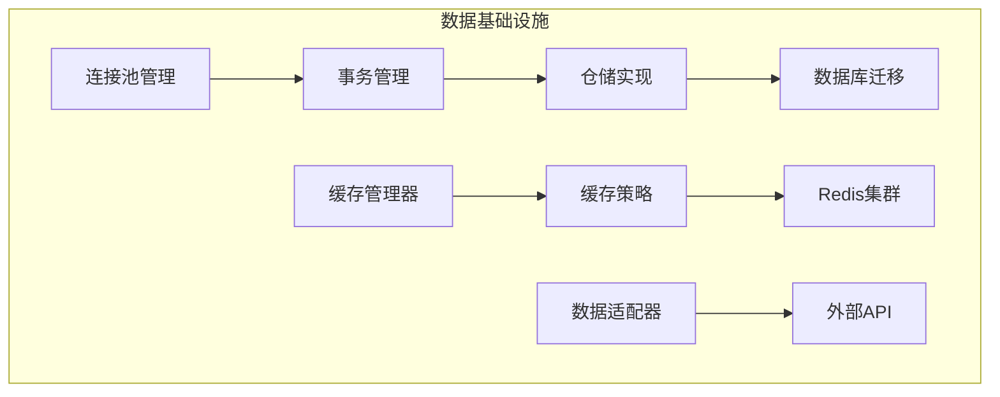
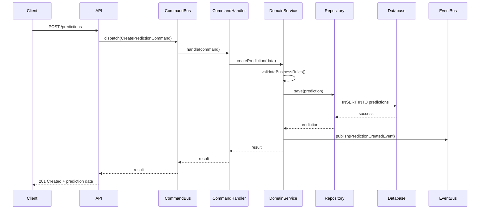
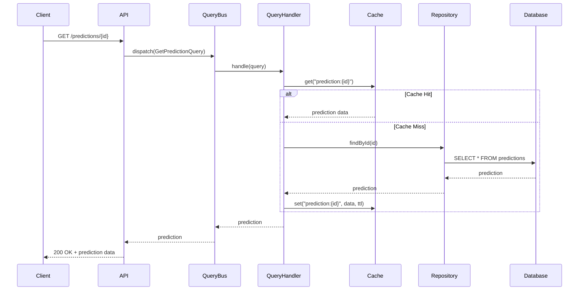

# 足球预测系统架构概览

## 📋 系统概述

足球预测系统是一个基于现代Python技术栈的企业级Web应用，采用DDD（领域驱动设计）+ CQRS（命令查询责任分离）架构模式，专注于提供准确、高效的足球比赛预测服务。

### 🎯 核心特性
- **异步架构**: 全面采用async/await，提供高并发处理能力
- **智能预测**: 集成机器学习模型和数据科学算法
- **实时数据**: 支持实时比赛数据流和动态预测更新
- **可扩展性**: 模块化设计，支持水平扩展和功能扩展
- **高可用性**: 完整的缓存、监控和容错机制

---

## 🏗️ 系统架构图

---

## 📦 核心模块架构

### 1. API层 (`src/api/`)
**职责**: 提供RESTful API和WebSocket接口，处理HTTP请求和响应

**关键组件**:
- **路由管理**: FastAPI路由器，支持OpenAPI文档自动生成
- **请求验证**: Pydantic模型验证，确保数据完整性
- **中间件**: 认证、CORS、日志、性能监控
- **WebSocket**: 实时数据推送和双向通信

### 2. CQRS层 (`src/cqrs/`)
**职责**: 实现命令查询责任分离模式，提供高性能的数据读写分离

**设计优势**:
- **读写分离**: 优化查询性能，支持独立扩展
- **命令模式**: 确保业务操作的一致性和可追溯性
- **事件驱动**: 支持异步处理和最终一致性
- **中间件支持**: 横切关注点处理（日志、缓存、验证）

### 3. 领域层 (`src/domain/`)
**职责**: 核心业务逻辑，包含领域模型、业务规则和领域服务

**核心概念**:
- **足球比赛聚合**: 管理比赛相关的业务规则和数据一致性
- **预测聚合**: 处理预测计算和结果验证
- **用户聚合**: 管理用户权限和个性化设置
- **领域事件**: 预测创建、比赛更新、用户行为等事件

### 4. 基础设施层 (`src/database/`, `src/cache/`)
**职责**: 数据持久化、缓存管理和外部服务集成

---

## 🔄 数据流架构

### 写操作流程 (Command)

### 读操作流程 (Query)

---

## 🎯 设计原则

### 1. 单一职责原则 (SRP)
每个模块和类都有明确的单一职责，避免功能耦合。

### 2. 依赖倒置原则 (DIP)
高层模块不依赖低层模块，都依赖于抽象接口。

### 3. 开闭原则 (OCP)
系统对扩展开放，对修改关闭，通过插件化架构支持功能扩展。

### 4. 接口隔离原则 (ISP)
客户端不应该依赖它不需要的接口，接口设计小而专一。

### 5. 领域驱动设计 (DDD)
以业务领域为中心，使用通用语言建立业务模型。

---

## 🚀 技术选型

### 后端技术栈
- **Web框架**: FastAPI 0.104+ - 高性能异步Web框架
- **ORM**: SQLAlchemy 2.0 - 现代化的Python ORM
- **数据库**: PostgreSQL 13+ - 可靠的关系型数据库
- **缓存**: Redis 6+ - 高性能内存数据库
- **异步**: asyncio + asyncpg - 全异步I/O处理

### 架构模式
- **DDD**: 领域驱动设计，业务逻辑清晰
- **CQRS**: 命令查询分离，读写性能优化
- **事件驱动**: 异步事件处理，系统解耦
- **依赖注入**: 轻量级DI容器，组件化管理

### 开发工具
- **测试**: pytest + pytest-asyncio - 完整的测试框架
- **代码质量**: ruff + mypy - 静态分析和类型检查
- **文档**: OpenAPI + Sphinx - 自动化文档生成
- **CI/CD**: GitHub Actions - 持续集成和部署

---

## 📊 性能特性

### 高并发处理
- **异步I/O**: 全栈异步支持，单线程处理高并发
- **连接池**: 数据库和Redis连接池管理
- **缓存策略**: 多级缓存，减少数据库压力
- **负载均衡**: 支持水平扩展和负载分发

### 响应时间优化
- **查询优化**: 索引优化和查询性能调优
- **预加载**: 关联数据预加载，减少N+1查询
- **分页查询**: 大数据集分页处理
- **CDN支持**: 静态资源CDN加速

### 可扩展性
- **微服务就绪**: 模块化设计支持服务拆分
- **容器化**: Docker支持，便于部署和扩展
- **数据库分片**: 支持读写分离和分库分表
- **消息队列**: 异步任务处理，系统解耦

---

## 🛡️ 安全特性

### 认证授权
- **JWT Token**: 无状态身份验证
- **RBAC**: 基于角色的访问控制
- **OAuth2**: 第三方登录集成
- **API密钥**: 客户端API密钥管理

### 数据安全
- **数据加密**: 敏感数据加密存储
- **SQL注入防护**: 参数化查询防护
- **XSS防护**: 输入验证和输出编码
- **CSRF防护**: CSRF令牌验证

### 系统安全
- **HTTPS**: 全站HTTPS加密传输
- **CORS**: 跨域资源共享控制
- **限流保护**: API调用频率限制
- **审计日志**: 完整的操作审计记录

---

## 📈 监控和运维

### 应用监控
- **性能指标**: 响应时间、吞吐量、错误率
- **业务指标**: 预测准确率、用户活跃度
- **资源监控**: CPU、内存、磁盘、网络
- **日志聚合**: 结构化日志和日志分析

### 健康检查
- **服务健康**: 服务可用性检查
- **依赖健康**: 数据库、缓存等依赖检查
- **业务健康**: 核心业务功能检查
- **自动恢复**: 故障自动检测和恢复

### 部署运维
- **容器化**: Docker镜像和容器编排
- **蓝绿部署**: 零停机部署策略
- **回滚机制**: 快速回滚到稳定版本
- **备份恢复**: 数据备份和灾难恢复

---

这个架构文档为开发团队提供了系统的全面技术视图，帮助新开发者快速理解系统设计，并为后续的技术决策提供参考依据。
