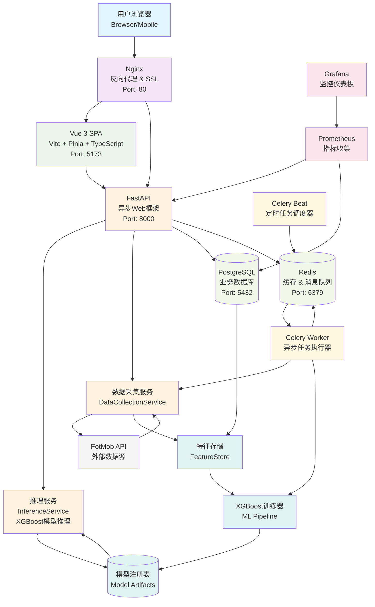
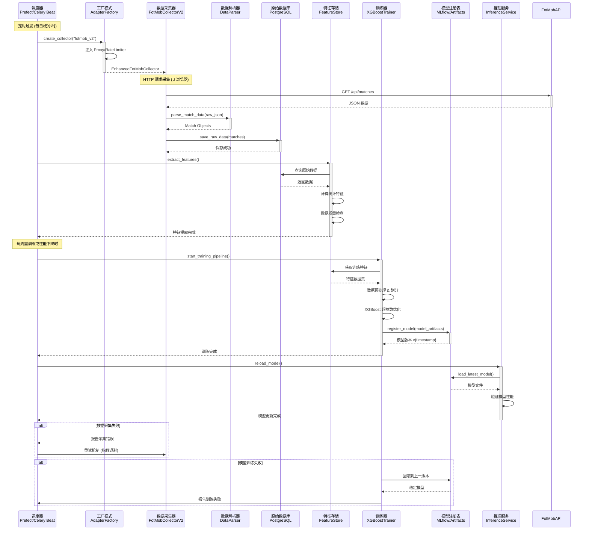
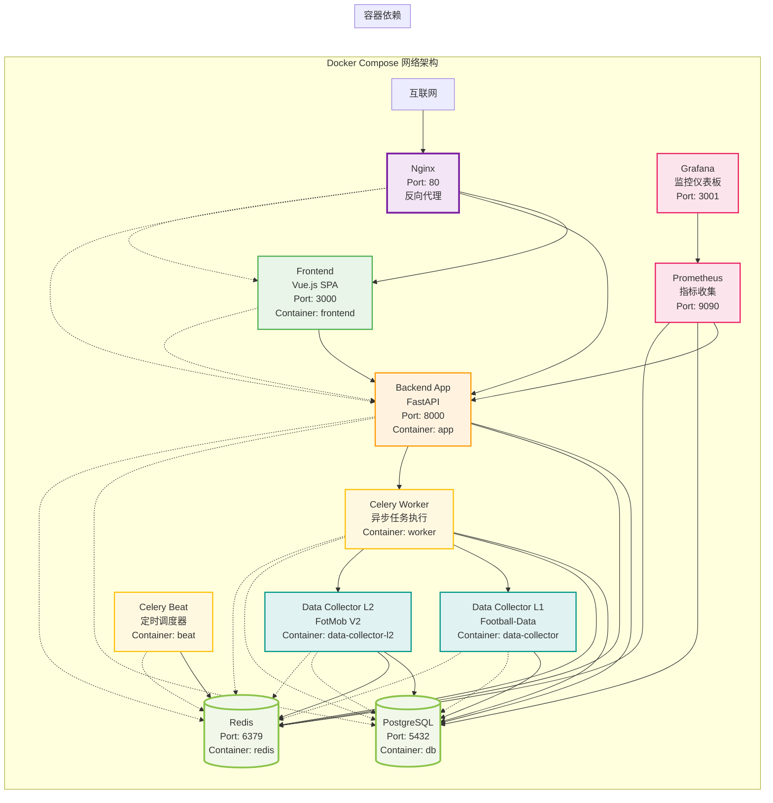

# ⚽ 足球博彩预测系统架构可视化图表 (v4.0.0)

**项目名称**: Football Betting Prediction System
**当前版本**: v4.0.0-stable (生产就绪)
**创建时间**: 2025-12-07
**文档作者**: System Architect

本文档包含系统的核心架构图表，用于技术文档归档和团队协作。

---

## 📊 图表 A: 高层系统架构图 (C4 Container Diagram)

---

## 🔄 图表 B: 数据采集与 ML 流水线 (Data Pipeline Flow)

---

## 🐳 图表 C: 部署架构图 (Deployment View)

---

## 📋 图表说明

### 系统架构特点

1. **微服务架构**: 采用Docker容器化部署，各服务职责分离
2. **异步优先**: 全面使用async/await模式，支持高并发
3. **事件驱动**: 基于Celery的消息队列系统，实现松耦合
4. **数据驱动**: 统一的特征存储和模型注册表
5. **监控完备**: Prometheus + Grafana全方位监控

### 关键技术栈

- **前端**: Vue.js 3 + TypeScript + Vite + Pinia
- **后端**: FastAPI + SQLAlchemy 2.0 + PostgreSQL 15
- **缓存**: Redis 7.0 (缓存 + 消息队列)
- **机器学习**: XGBoost + MLflow + Optuna
- **任务调度**: Celery + Celery Beat
- **容器化**: Docker + Docker Compose
- **监控**: Prometheus + Grafana

### 部署端口映射

| 服务 | 内部端口 | 外部端口 | 说明 |
|------|----------|----------|------|
| Nginx | 80 | 80 | 反向代理 |
| Frontend | 80 | 3000 | Vue.js应用 |
| Backend | 8000 | 8000 | FastAPI服务 |
| PostgreSQL | 5432 | 5432 | 数据库 |
| Redis | 6379 | 6379 | 缓存/队列 |
| Prometheus | 9090 | - | 内部监控 |
| Grafana | 3000 | 3001 | 监控面板 |

---

**文档维护**: System Architect
**最后更新**: 2025-12-07
**版本**: v4.0.0