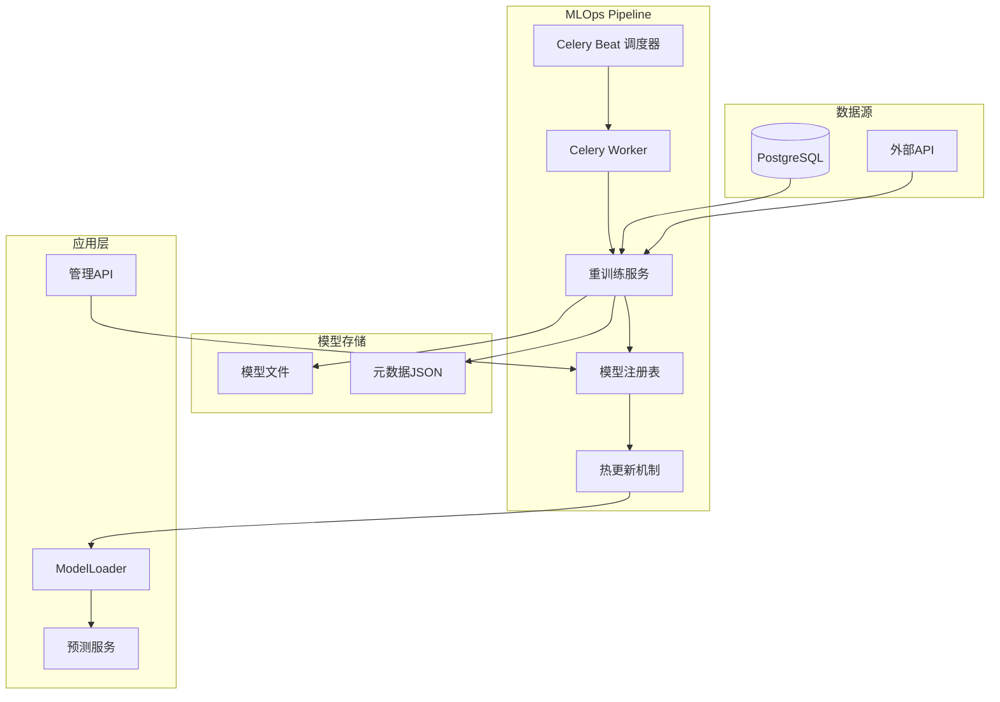

# MLOps 自动化重训练流水线设置指南

## 🤖 概述

Football Prediction v2.0 集成了完整的 MLOps 自动化重训练流水线，实现模型的自动重训练、热更新和版本管理。

## 🏗️ 架构组件



## ⚡ 快速启动

### 1. 启动完整的 MLOps 系统

```bash
# 启动所有服务，包括 Celery Worker 和 Beat
docker-compose up -d

# 查看服务状态
docker-compose ps

# 检查 Celery Worker 日志
docker-compose logs -f celery-worker

# 检查 Celery Beat 日志
docker-compose logs -f celery-beat
```

### 2. 验证系统运行

```bash
# 检查 Celery Worker 状态
docker-compose exec app celery -A src.tasks.schedule inspect active

# 检查调度的任务
docker-compose exec app celery -A src.tasks.schedule inspect scheduled

# 查看 Flower 界面（可选）
open http://localhost:5555
```

## 📅 调度任务配置

### 自动调度任务

| 任务名称 | 调度时间 | 队列 | 描述 |
|---------|----------|------|------|
| `train-new-model` | 每周一凌晨 3:00 | `ml_training` | 模型重训练 |
| `check-model-performance` | 每天早上 8:00 | `monitoring` | 模型性能检查 |
| `check-data-quality` | 每天凌晨 2:00 | `data_quality` | 数据质量检查 |
| `system-health-check` | 每 15 分钟 | `monitoring` | 系统健康检查 |
| `cleanup-old-models` | 每月 1 号凌晨 4:00 | `maintenance` | 清理旧模型 |

### 手动触发任务

```bash
# 进入应用容器
docker-compose exec app bash

# 手动触发模型重训练
python -c "from src.tasks.schedule import manual_retrain; manual_retrain.s('Manual trigger').apply()"

# 紧急回滚模型
python -c "from src.tasks.schedule import emergency_rollback; emergency_rollback.s('v2.1.20231201_030000').apply()"
```

## 🔧 管理接口

### API 端点

所有管理接口都需要 Bearer Token 认证：

```bash
# 设置认证头
export TOKEN="your-admin-token"

# 手动触发重训练
curl -X POST "http://localhost:8000/api/v1/admin/retrain" \
  -H "Authorization: Bearer $TOKEN" \
  -H "Content-Type: application/json" \
  -d '{"description": "Manual retraining via API"}'

# 切换模型版本
curl -X POST "http://localhost:8000/api/v1/admin/model/switch" \
  -H "Authorization: Bearer $TOKEN" \
  -H "Content-Type: application/json" \
  -d '{"target_version": "v2.1.20231201_030000"}'

# 获取模型状态
curl -X GET "http://localhost:8000/api/v1/admin/model/status" \
  -H "Authorization: Bearer $TOKEN"

# 获取所有模型列表
curl -X GET "http://localhost:8000/api/v1/admin/models" \
  -H "Authorization: Bearer $TOKEN"
```

### 可用接口列表

| 方法 | 路径 | 描述 |
|------|------|------|
| POST | `/api/v1/admin/retrain` | 手动触发模型重训练 |
| POST | `/api/v1/admin/model/switch` | 切换模型版本 |
| POST | `/api/v1/admin/model/rollback` | 紧急回滚模型 |
| GET | `/api/v1/admin/model/status` | 获取模型状态 |
| GET | `/api/v1/admin/models` | 获取所有模型列表 |
| GET | `/api/v1/admin/model/{version}` | 获取指定模型详情 |
| POST | `/api/v1/admin/model/reload` | 手动重新加载模型 |
| DELETE | `/api/v1/admin/model/{version}` | 删除指定模型版本 |
| GET | `/api/v1/admin/system/health` | 获取系统健康状态 |

## 📊 模型注册表

### 注册表结构

模型注册表存储在 `models/registry.json`：

```json
{
  "models": {
    "v2.1.20231201_030000": {
      "version": "v2.1.20231201_030000",
      "accuracy": 0.6542,
      "log_loss": 0.8921,
      "training_samples": 15000,
      "feature_count": 45,
      "training_time": 120.5,
      "model_path": "/app/data/models/v2.1.20231201_030000.json",
      "created_at": "2023-12-01T03:00:00+00:00",
      "description": "Scheduled weekly training"
    }
  },
  "current_best": "v2.1.20231201_030000",
  "last_updated": "2023-12-01T03:15:30+00:00"
}
```

### 当前最佳模型

当前最佳模型版本存储在 `models/current_best.txt`。

## 🔄 热更新机制

### 自动热更新

ModelLoader 会监听 `current_best.txt` 文件的变化：

1. 检测文件变更（每 30 秒）
2. 读取新版本号
3. 加载新模型到内存
4. 更新 Prometheus 指标

### 手动热更新

```bash
# 通过 API 触发
curl -X POST "http://localhost:8000/api/v1/admin/model/reload" \
  -H "Authorization: Bearer $TOKEN"

# 或通过代码
from src.ml.inference.model_loader import ModelLoader
loader = ModelLoader()
loader.trigger_model_reload()
```

## 📈 监控和告警

### Prometheus 指标

MLOps 相关指标：

- `cache_operations_total{cache_type="model", operation="hot_reload"}`: 热更新次数
- `model_training_duration_seconds`: 训练耗时
- `model_accuracy_score`: 模型准确率

### 日志监控

关键日志关键词：

- `模型重训练`：训练相关操作
- `热更新`：模型切换操作
- `回滚`：紧急回滚操作
- `注册表`：模型注册表操作

### Grafana 告警

预配置告警规则：

- 模型训练失败
- 模型准确率低于阈值
- 热更新失败
- Celery 任务积压

## 🔧 配置参数

### 环境变量

```bash
# MLOps 相关配置
ENABLE_METRICS=true              # 启用 Prometheus 指标
ENABLE_CELERY=true               # 启用 Celery
MODEL_PATH=/app/data/models      # 模型存储路径

# 重训练配置
RETRAINING_IMPROVEMENT_THRESHOLD=0.005  # 性能提升阈值 (0.5%)
RETRAINING_MIN_SAMPLES=1000           # 最少训练样本数
RETRAINING_TEST_SIZE=0.2              # 测试集比例

# 热更新配置
HOT_RELOAD_ENABLED=true         # 启用热更新
HOT_RELOAD_INTERVAL=30          # 检查间隔（秒）
```

### Celery 配置

```python
# worker 配置
worker_prefetch_multiplier=1
worker_max_tasks_per_child=1000
task_time_limit=30 * 60          # 30分钟超时
task_soft_time_limit=25 * 60     # 25分钟软超时
```

## 🚨 故障排查

### 常见问题

#### 1. Celery Worker 无响应

```bash
# 检查 Worker 状态
docker-compose exec app celery -A src.tasks.schedule inspect active

# 重启 Worker
docker-compose restart celery-worker

# 查看 Worker 日志
docker-compose logs -f celery-worker
```

#### 2. 模型热更新失败

```bash
# 检查模型文件权限
ls -la /app/data/models/

# 检查当前最佳文件
cat /app/data/models/current_best.txt

# 手动触发热更新
docker-compose exec app python -c "
from src.ml.inference.model_loader import ModelLoader
loader = ModelLoader()
print('Current version:', loader.get_current_version())
print('Hot reload result:', loader.trigger_model_reload())
"
```

#### 3. 重训练任务失败

```bash
# 查看 Celery 任务队列
docker-compose exec app celery -A src.tasks.schedule inspect reserved

# 检查任务执行日志
docker-compose logs -f celery-worker | grep -i error

# 手动执行重训练
docker-compose exec app python -c "
from src.services.mlops.retraining_service import RetrainingService
service = RetrainingService()
result = service.execute_pipeline('Debug retraining')
print(result)
"
```

### 性能优化

#### 1. Worker 配置优化

```bash
# 根据 CPU 核心数调整 Worker 数量
docker-compose exec app celery -A src.tasks.schedule worker --concurrency=4
```

#### 2. 内存管理

```bash
# 监控内存使用
docker-compose exec app python -c "
import psutil
print(f'Memory usage: {psutil.virtual_memory().percent}%')
print(f'Available memory: {psutil.virtual_memory().available / (1024**3):.2f}GB')
"
```

#### 3. 数据库优化

```sql
-- 创建训练数据索引
CREATE INDEX IF NOT EXISTS idx_matches_date ON matches(match_date);
CREATE INDEX IF NOT EXISTS idx_matches_teams ON matches(home_team, away_team);
```

## 📚 相关文档

- [Celery 官方文档](https://docs.celeryproject.org/)
- [XGBoost 文档](https://xgboost.readthedocs.io/)
- [FastAPI 文档](https://fastapi.tiangolo.com/)
- [Prometheus 文档](https://prometheus.io/docs/)