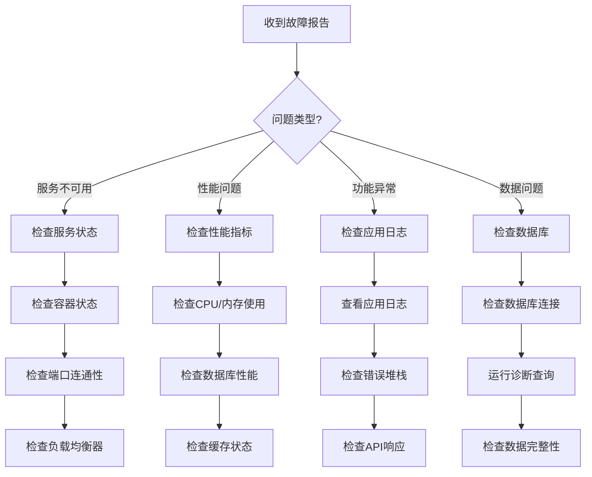

# Football Prediction System - 故障排查指南

## 概述

本指南提供了Football Prediction System常见问题的诊断和解决方案。

## 快速诊断流程



## 服务问题

### 1. 服务完全不可用

#### 症状
- 所有API请求返回502/503错误
- 健康检查失败
- 服务无响应

#### 诊断步骤

```bash
# 1. 检查容器状态
docker-compose -f docker-compose.production.yml ps

# Kubernetes
kubectl get pods -n football-prediction

# 2. 检查容器日志
docker-compose -f docker-compose.production.yml logs app

# Kubernetes
kubectl logs deployment/football-api -n football-prediction

# 3. 检查服务端口
netstat -tlnp | grep 8000

# 4. 检查资源使用
docker stats
```

#### 常见原因和解决方案

| 问题 | 原因 | 解决方案 |
|------|------|----------|
| 容器启动失败 | 配置错误 | 检查环境变量，修正配置 |
| 内存不足 | OOM错误 | 增加内存限制或优化代码 |
| 端口占用 | 残留进程 | 杀死占用端口的进程 |
| 数据库连接失败 | 数据库服务异常 | 重启数据库服务 |

### 2. 服务间歇性不可用

#### 症状
- 偶尔出现504网关超时
- 响应时间波动大
- 部分请求成功，部分失败

#### 诊断步骤

```bash
# 1. 检查负载均衡器状态
curl -I http://nginx/health

# 2. 检查后端服务
for i in {1..10}; do
  curl -w "%{time_total}\n" -o /dev/null -s http://app:8000/health
done

# 3. 检查系统负载
top -p $(pgrep gunicorn)
iostat -x 1
```

#### 解决方案

1. **调整超时设置**
   ```nginx
   # nginx.conf
   proxy_connect_timeout 60s;
   proxy_send_timeout 60s;
   proxy_read_timeout 60s;
   ```

2. **增加worker数量**
   ```bash
   # 增加Gunicorn worker
   WORKERS=8
   ```

3. **启用健康检查**
   ```yaml
   # docker-compose.yml
   healthcheck:
     test: ["CMD", "curl", "-f", "http://localhost:8000/health"]
     interval: 30s
     timeout: 10s
     retries: 3
   ```

## 性能问题

### 1. API响应缓慢

#### 症状
- 平均响应时间 > 1秒
- P95延迟 > 3秒
- 超时错误增多

#### 诊断步骤

```bash
# 1. 检查应用性能指标
curl http://localhost:9090/metrics | grep request_duration

# 2. 分析慢查询
docker-compose exec db-master psql -U football -d football_prod -c "
  SELECT query, mean_exec_time, calls
  FROM pg_stat_statements
  WHERE mean_exec_time > 100
  ORDER BY mean_exec_time DESC
  LIMIT 10;
"

# 3. 检查缓存命中率
redis-cli info stats | grep keyspace
redis-cli info stats | grep keyspace_misses
```

#### 解决方案

1. **优化数据库查询**
   ```sql
   -- 创建必要的索引
   CREATE INDEX CONCURRENTLY idx_matches_date ON matches(date);

   -- 分析查询计划
   EXPLAIN ANALYZE SELECT * FROM matches WHERE date = '2025-01-02';
   ```

2. **增加缓存层**
   ```python
   # 启用查询缓存
   @cache(expire=300)
   async def get_match_prediction(match_id: str):
       # ...
   ```

3. **启用压缩**
   ```python
   # FastAPI中间件
   app.add_middleware(GZipMiddleware, minimum_size=1000)
   ```

### 2. 高并发下性能下降

#### 症状
- 低并发时正常，高并发时性能急剧下降
- 错误率随并发增加
- 系统资源使用率接近100%

#### 诊断步骤

```bash
# 1. 并发测试
wrk -t12 -c400 -d30s http://localhost:8000/health

# 2. 检查连接数
netstat -an | grep :8000 | wc -l

# 3. 检查数据库连接池
docker-compose exec db-master psql -c "
  SELECT count(*) FROM pg_stat_activity WHERE state = 'active';
"
```

#### 解决方案

1. **优化连接池配置**
   ```python
   # database/config.py
   DATABASE_CONFIG = {
       "pool_size": 20,
       "max_overflow": 30,
       "pool_timeout": 30,
       "pool_recycle": 3600
   }
   ```

2. **实施速率限制**
   ```python
   # middleware/rate_limit.py
   @limiter.limit("1000/minute")
   async def api_endpoint(request: Request):
       # ...
   ```

3. **水平扩展**
   ```bash
   # 增加实例数量
   docker-compose up -d --scale app=5
   ```

## 数据库问题

### 1. 数据库连接失败

#### 症状
- 应用日志显示连接错误
- 健康检查失败
- 数据库相关API全部失败

#### 诊断步骤

```bash
# 1. 测试数据库连接
docker-compose exec app python -c "
import asyncpg
import asyncio

async def test():
    try:
        conn = await asyncpg.connect('postgresql://user:pass@db:5432/db')
        print('Connection successful')
        await conn.close()
    except Exception as e:
        print(f'Connection failed: {e}')

asyncio.run(test())
"

# 2. 检查数据库状态
docker-compose exec db-master pg_isready

# 3. 查看数据库日志
docker-compose logs db-master
```

#### 解决方案

1. **检查连接字符串**
   ```bash
   # 验证连接参数
   docker-compose exec db-master psql -U football -d football_prod -c "\l"
   ```

2. **调整连接池大小**
   ```python
   # 增加连接池大小
   engine = create_async_engine(
       DATABASE_URL,
       pool_size=20,
       max_overflow=30
   )
   ```

3. **重置数据库连接**
   ```bash
   # 重启应用容器
   docker-compose restart app
   ```

### 2. 数据库锁定

#### 症状
- 更新操作超时
- 查询等待时间长
- 应用响应缓慢

#### 诊断步骤

```bash
# 1. 查看活跃锁
docker-compose exec db-master psql -c "
  SELECT
    blocked_locks.pid AS blocked_pid,
    blocked_activity.usename AS blocked_user,
    blocking_locks.pid AS blocking_pid,
    blocking_activity.usename AS blocking_user,
    blocked_activity.query AS blocked_statement,
    blocking_activity.query AS current_statement_in_blocking_process
  FROM pg_catalog.pg_locks blocked_locks
  JOIN pg_catalog.pg_stat_activity blocked_activity
    ON blocked_activity.pid = blocked_locks.pid
  JOIN pg_catalog.pg_locks blocking_locks
    ON blocking_locks.locktype = blocked_locks.locktype
  JOIN pg_catalog.pg_stat_activity blocking_activity
    ON blocking_activity.pid = blocking_locks.pid
  WHERE NOT blocked_locks.granted;
"
```

#### 解决方案

1. **终止长时间运行的查询**
   ```sql
   -- 找到并终止长时间运行的查询
   SELECT pid, now() - pg_stat_activity.query_start AS duration, query
   FROM pg_stat_activity
   WHERE (now() - pg_stat_activity.query_start) > interval '5 minutes';

   -- 终止查询（谨慎使用）
   SELECT pg_terminate_backend(pid);
   ```

2. **优化事务**
   ```python
   # 保持事务简短
   async def update_prediction():
       async with transaction():
           # 最小化事务中的操作
           await update()
   ```

## 缓存问题

### 1. Redis连接失败

#### 症状
- 缓存未命中率高
- 应用响应变慢
- 错误日志显示Redis连接错误

#### 诊断步骤

```bash
# 1. 测试Redis连接
redis-cli -h redis-cluster ping

# 2. 检查Redis状态
docker-compose exec redis-cluster redis-cli info server

# 3. 查看Redis日志
docker-compose logs redis-cluster
```

#### 解决方案

1. **重启Redis服务**
   ```bash
   docker-compose restart redis-cluster
   ```

2. **检查Redis配置**
   ```conf
   # redis.conf
   maxmemory 2gb
   maxmemory-policy allkeys-lru
   save 900 1
   ```

3. **实现缓存降级**
   ```python
   async def get_with_cache_fallback(key: str):
       try:
           value = await redis.get(key)
           if value:
               return value
       except RedisError:
           pass
       # 降级到直接查询
       return await fallback_query()
   ```

## 安全问题

### 1. 认证失败

#### 症状
- 401未授权错误
- JWT令牌无效
- 用户无法登录

#### 诊断步骤

```bash
# 1. 验证JWT配置
curl -X POST http://localhost:8000/auth/token \
  -H "Content-Type: application/x-www-form-urlencoded" \
  -d "grant_type=password&username=test&password=test"

# 2. 检查令牌
echo "your-jwt-token" | cut -d. -f2 | base64 -d | jq .
```

#### 解决方案

1. **检查密钥配置**
   ```bash
   # 验证SECRET_KEY
   python -c "import jwt; jwt.decode(token, key, algorithms=['HS256'])"
   ```

2. **更新令牌过期时间**
   ```python
   # main.py
   ACCESS_TOKEN_EXPIRE_MINUTES = 30
   ```

### 2. 权限问题

#### 症状
- 403禁止访问错误
- 用户权限不足
- 资源访问被拒绝

#### 解决方案

1. **检查权限配置**
   ```python
   # 确保正确设置权限
   @app.get("/admin/data")
   def get_admin_data(current_user: User = Depends(get_current_user)):
       if not current_user.is_admin:
           raise HTTPException(403, "Admin access required")
   ```

2. **修复角色映射**
   ```bash
   # 更新用户角色
   UPDATE users SET role='admin' WHERE username='admin_user';
   ```

## 监控和告警

### 关键指标监控

1. **应用指标**
   - 请求率 (requests/sec)
   - 错误率 (%)
   - 响应时间 (P95, P99)

2. **系统指标**
   - CPU使用率
   - 内存使用率
   - 磁盘I/O
   - 网络流量

3. **业务指标**
   - 预测成功率
   - API调用量
   - 活跃用户数

### 告警配置

```yaml
# prometheus/rules.yml
groups:
- name: football-api
  rules:
  - alert: HighErrorRate
    expr: rate(http_requests_total{status=~"5.."}[5m]) > 0.05
    for: 5m
    labels:
      severity: critical
    annotations:
      summary: "High error rate detected"

  - alert: HighResponseTime
    expr: histogram_quantile(0.95, rate(http_request_duration_seconds_bucket[5m])) > 1
    for: 5m
    labels:
      severity: warning
    annotations:
      summary: "High response time detected"
```

## 应急响应流程

### 1. 故障分级

- **P0 - 严重**: 服务完全不可用，影响所有用户
- **P1 - 高**: 核心功能不可用，影响大部分用户
- **P2 - 中**: 部分功能异常，影响部分用户
- **P3 - 低**: 轻微问题，影响少量用户

### 2. 响应流程

1. **故障发现 (0-5分钟)**
   - 自动监控系统告警
   - 用户反馈
   - 定期健康检查

2. **初步诊断 (5-15分钟)**
   - 确认故障影响范围
   - 快速定位问题模块
   - 评估严重程度

3. **紧急修复 (15-60分钟)**
   - 实施临时解决方案
   - 恢复服务可用性
   - 通知相关方

4. **根因分析 (1-24小时)**
   - 深入分析问题原因
   - 制定长期解决方案
   - 更新运维文档

5. **后续改进 (1-7天)**
   - 实施永久修复
   - 优化监控告警
   - 团队培训和复盘

### 3. 联系方式

| 问题级别 | 联系方式 | 响应时间 |
|---------|---------|---------|
| P0 - 严重 | 电话 + Slack | 15分钟 |
| P1 - 高 | Slack + 邮件 | 30分钟 |
| P2 - 中 | Slack | 2小时 |
| P3 - 低 | 工单系统 | 24小时 |

- **紧急电话**: +86-xxx-xxxx-xxxx
- **Slack频道**: #alerts-football-prediction
- **邮件**: support@football-prediction.com

## 常用命令速查

### Docker命令

```bash
# 查看容器状态
docker-compose ps

# 查看实时日志
docker-compose logs -f app

# 重启服务
docker-compose restart app

# 进入容器调试
docker-compose exec app bash

# 查看资源使用
docker stats
```

### Kubernetes命令

```bash
# 查看Pod状态
kubectl get pods -n football-prediction

# 查看日志
kubectl logs -f deployment/football-api -n football-prediction

# 扩容
kubectl scale deployment football-api --replicas=5 -n football-prediction

# 查看事件
kubectl get events -n football-prediction --sort-by='.lastTimestamp'
```

### 数据库命令

```bash
# 连接数据库
docker-compose exec db-master psql -U football -d football_prod

# 查看活动连接
SELECT * FROM pg_stat_activity WHERE state = 'active';

# 查看慢查询
SELECT query, mean_exec_time FROM pg_stat_statements ORDER BY mean_exec_time DESC LIMIT 10;
```

### Redis命令

```bash
# 连接Redis
docker-compose exec redis-cluster redis-cli

# 查看信息
INFO memory
INFO stats
INFO clients

# 清理缓存（谨慎使用）
FLUSHDB
```

---

最后更新: 2025-01-02
版本: 1.0.0