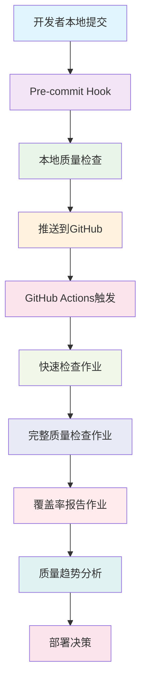

# 🚀 自动化工作流集成指南

**版本**: v1.0 | **创建时间**: 2025-10-27 | **维护者**: Claude AI Assistant

---

## 📋 概述

本指南详细说明如何使用测试覆盖率危机解决方案的完整自动化工作流系统，包括GitHub Actions、Pre-commit钩子、Makefile命令和监控系统的集成使用。

---

## 🎯 工作流架构概览

### 🔄 集成流程图



### 🛠️ 核心组件

| 组件 | 作用 | 触发条件 | 执行时间 |
|------|------|----------|----------|
| **Pre-commit Hook** | 本地快速检查 | 每次git commit | 30-60秒 |
| **GitHub Actions - Quick** | CI快速验证 | 每次push/PR | 2-3分钟 |
| **GitHub Actions - Full** | 完整质量检查 | 每日定时/手动 | 8-10分钟 |
| **本地Make命令** | 开发时检查 | 手动执行 | 1-5分钟 |
| **监控系统** | 持续质量跟踪 | 自动运行 | 持续 |

---

## 🚀 快速开始工作流

### 1️⃣ 开发者日常使用流程

#### **首次设置** (一次性)
```bash
# 1. 安装pre-commit钩子
pre-commit install
pre-commit install --hook-type commit-msg

# 2. 验证环境
make env-check
make test-quick

# 3. 运行一次完整检查确保基准
make ci-verify
```

#### **日常开发工作流**
```bash
# 1. 开发完成后，本地质量检查
make lint                    # 代码风格检查
make type-check              # 类型检查
make test-quick              # 快速测试

# 2. 提交代码 (自动触发pre-commit)
git add .
git commit -m "feat: 添加新功能"

# 3. 推送 (自动触发GitHub Actions)
git push origin main
```

### 2️⃣ 不同场景的工作流

#### 🟢 **场景A: 小幅修改** (日常开发)
```bash
# 快速验证流程
make syntax-check            # 1分钟
make test-quick             # 2分钟
make prepush               # 3分钟总计
git push
```

#### 🟡 **场景B: 功能开发** (中等规模)
```bash
# 标准验证流程
make fix-test-errors       # 自动修复错误 (2分钟)
make lint-fix             # 代码格式化 (1分钟)
make test-unit            # 单元测试 (3分钟)
make coverage-fast        # 覆盖率检查 (2分钟)
git push
```

#### 🔴 **场景C: 重大变更** (大规模修改)
```bash
# 完整验证流程
make solve-test-crisis     # 完整解决方案 (5分钟)
make ci                   # 模拟完整CI (8分钟)
make security-check       # 安全扫描 (2分钟)
make test-all            # 全量测试 (5分钟)
git push
```

---

## 🛠️ GitHub Actions工作流详解

### 📋 可用工作流

项目包含3个主要GitHub Actions工作流：

#### 1. **automated-quality-assurance.yml** - 主工作流
```yaml
# 触发条件
on:
  push:
    branches: [ main, develop ]
  pull_request:
    branches: [ main, develop ]
  schedule:
    - cron: '0 8 * * *'  # 每日8:00 UTC
  workflow_dispatch:      # 手动触发
```

**作业详情**:
- **quick-check**: 快速检查 (2-3分钟)
- **full-quality-check**: 完整检查 (8-10分钟)
- **coverage-report**: 覆盖率报告 (3-5分钟)
- **quality-trends**: 质量趋势分析 (2-3分钟)
- **optimization-suggestions**: 优化建议 (1-2分钟)

#### 2. **手动触发选项**
在GitHub Actions页面可以手动选择不同操作：

| 选项 | 用途 | 执行时间 | 适用场景 |
|------|------|----------|----------|
| **full-check** | 完整质量检查 | 10分钟 | 发布前验证 |
| **quick-fix** | 快速修复检查 | 3分钟 | 日常开发 |
| **coverage-report** | 覆盖率专项报告 | 5分钟 | 覆盖率分析 |
| **quality-report** | 质量趋势报告 | 3分钟 | 质量回顾 |

### 📊 工作流执行结果

#### **成功执行标志**
```bash
# GitHub Actions日志显示
✅ Quick-check completed successfully
✅ Full-quality-check passed all gates
✅ Coverage report generated
✅ Quality trends analyzed
```

#### **失败处理**
```bash
# 常见失败原因和解决方案
❌ Syntax errors → 运行 make syntax-fix
❌ Test failures → 运行 make fix-test-errors
❌ Coverage drop → 运行 make coverage-targeted
❌ Security issues → 运行 make security-fix
```

---

## 🔧 Pre-commit钩子配置

### 📋 当前配置

```yaml
# .pre-commit-config.yaml
repos:
  - repo: https://github.com/pre-commit/pre-commit-hooks
    hooks:
      - id: trailing-whitespace
      - id: end-of-file-fixer
      - id: check-yaml
      - id: check-json

  - repo: https://github.com/astral-sh/ruff-pre-commit
    hooks:
      - id: ruff
        args: [--fix, --exit-non-zero-on-fix]

  - repo: local
    hooks:
      - id: test-crisis-fix
        entry: python scripts/fix_test_crisis.py
        language: system
        always_run: true
```

### 🚀 使用方法

#### **自动执行**
```bash
# 提交时自动运行
git add .
git commit -m "feat: 新功能"
# pre-commit钩子自动执行所有检查
```

#### **手动运行所有钩子**
```bash
pre-commit run --all-files
```

#### **跳过钩子 (紧急情况)**
```bash
git commit --no-verify -m "紧急修复"
# ⚠️ 谨慎使用，仅用于紧急情况
```

---

## 📊 Makefile CI/CD命令大全

### 🎯 核心质量命令

#### **基础检查命令**
```bash
make syntax-check        # 语法检查 (30秒)
make syntax-fix         # 自动修复语法错误 (1分钟)
make lint               # Ruff代码检查 (30秒)
make lint-fix           # 自动修复风格问题 (1分钟)
make type-check         # MyPy类型检查 (1分钟)
make test-quick         # 快速测试 (2分钟)
```

#### **危机解决命令**
```bash
make solve-test-crisis     # 一键解决所有问题 (5分钟)
make fix-test-errors       # 修复测试错误 (3分钟)
make improve-test-quality  # 改进测试质量 (4分钟)
make test-crisis-fix       # 紧急修复 (2分钟)
make test-crisis-solution  # 完整解决方案 (8分钟)
```

#### **监控和报告命令**
```bash
make test-status-report    # 生成状态报告 (1分钟)
make test-crisis-launcher  # 启动交互工具 (交互式)
make github-issues-update  # 更新GitHub Issues (2分钟)
make coverage-report       # 生成覆盖率报告 (3分钟)
```

#### **CI验证命令**
```bash
make ci                   # 模拟完整CI流水线 (8分钟)
make ci-verify           # 完整CI验证 (10分钟)
make prepush             # 预推送验证 (5分钟)
make quality-check       # 质量检查汇总 (3分钟)
```

### 🔄 常用工作流组合

#### **日常开发组合**
```bash
# 快速开发验证 (3分钟)
make syntax-check && make test-quick

# 标准开发验证 (5分钟)
make lint-fix && make type-check && make test-unit

# 完整开发验证 (8分钟)
make fix-test-errors && make coverage-fast && make prepush
```

#### **发布前验证组合**
```bash
# 发布验证流程 (10分钟)
make solve-test-crisis && make security-check && make ci

# 紧急发布流程 (5分钟)
make test-crisis-fix && make test-quick && make prepush
```

---

## 📈 监控和告警系统

### 📊 质量指标监控

#### **自动化监控指标**
- **测试收集错误数**: 目标 < 5个
- **测试执行成功率**: 目标 > 95%
- **代码覆盖率**: 目标 > 30%，长期 > 80%
- **代码质量**: Ruff + MyPy 零错误
- **安全扫描**: 零高危漏洞

#### **监控命令**
```bash
# 实时监控
make coverage-live              # 启动实时覆盖率监控
make staging-monitor           # 打开监控面板
make test-env-status           # 检查测试环境状态

# 质量报告
make test-status-report        # 生成完整状态报告
make quality-gates-status      # 检查质量门禁状态
make security-scan-report      # 生成安全扫描报告
```

### 🚨 自动告警机制

#### **GitHub Actions自动告警**
```yaml
# 覆盖率阈值告警
if coverage < 15%:
  - 创建Issue: "🚨 覆盖率过低警报"
  - 评论PR: "覆盖率低于15%，需要提升"

if coverage < 30%:
  - 创建Issue: "⚠️ 覆盖率警告"
  - 评论PR: "覆盖率低于30%，建议改进"
```

#### **本地告警检查**
```bash
# 检查所有告警状态
make check-all-alerts

# 检查特定类型告警
make coverage-alert-check
make security-alert-check
make quality-alert-check
```

---

## 🎯 最佳实践和使用建议

### 📋 开发工作流最佳实践

#### **1. 日常开发规范**
```bash
# 开发前
make env-check              # 确保环境健康

# 开发中
make syntax-check           # 频繁语法检查
make test-quick            # 快速测试验证

# 提交前
make prepush               # 完整预推送验证
```

#### **2. 功能开发规范**
```bash
# 功能开始
make solve-test-crisis     # 建立良好基础

# 开发过程
make lint-fix             # 保持代码整洁
make coverage-targeted MODULE=新模块  # 模块覆盖率跟踪

# 功能完成
make ci                   # 完整CI验证
```

#### **3. 发布流程规范**
```bash
# 发布候选版本
make security-check       # 安全扫描
make test-all            # 全量测试
make coverage-report     # 覆盖率报告

# 发布验证
make ci-verify          # 完整CI验证
make deploy-prepare     # 准备部署
```

### ⚠️ 常见问题和解决方案

#### **问题1: Pre-commit钩子执行失败**
```bash
# 症状: git commit 时pre-commit失败
# 解决方案:
pre-commit clean         # 清理缓存
pre-commit install       # 重新安装
make syntax-fix         # 修复语法问题
```

#### **问题2: GitHub Actions执行缓慢**
```bash
# 症状: CI执行超过15分钟
# 解决方案:
make test-crisis-fix    # 本地快速修复
make solve-test-crisis  # 本地完整解决
git push                # 重新触发CI
```

#### **问题3: 覆盖率突然下降**
```bash
# 症状: 覆盖率报告显示下降
# 解决方案:
make coverage-targeted MODULE=变更模块  # 针对性提升
make test-status-report               # 生成详细报告
python scripts/github_issue_manager.py --create-issue  # 创建Issue跟踪
```

#### **问题4: 测试收集错误增加**
```bash
# 症状: pytest收集时错误增多
# 解决方案:
make fix-test-errors    # 自动修复
python scripts/precise_error_fixer.py  # 精确修复
make test-crisis-solution  # 完整解决方案
```

---

## 🚀 高级功能和扩展

### 🤖 智能自动化功能

#### **持续改进引擎**
```bash
# 启动自动化改进
python3 scripts/continuous_improvement_engine.py --automated --interval 30

# 查看改进历史
python3 scripts/continuous_improvement_engine.py --history --history-limit 5

# 监控改进状态
python3 scripts/improvement_monitor.py
```

#### **智能质量修复**
```bash
# 智能修复所有问题
python3 scripts/smart_quality_fixer.py

# 仅检查不修复
python3 scripts/smart_quality_fixer.py --check-only

# 生成修复建议
python3 scripts/smart_quality_fixer.py --suggestions-only
```

### 📊 自定义工作流

#### **创建自定义工作流脚本**
```bash
# 创建 custom-workflow.sh
#!/bin/bash
echo "🚀 开始自定义工作流..."

# 步骤1: 环境检查
make env-check

# 步骤2: 问题修复
make fix-test-errors

# 步骤3: 质量检查
make lint && make type-check

# 步骤4: 测试验证
make test-unit

# 步骤5: 报告生成
make test-status-report

echo "✅ 自定义工作流完成"
```

#### **集成到Makefile**
```makefile
# 添加到Makefile
custom-workflow:
	@echo "🚀 执行自定义工作流..."
	@bash ./custom-workflow.sh
```

---

## 📞 故障排除和支持

### 🔧 常见故障排除

#### **环境问题**
```bash
# Docker相关问题
make down && make up           # 重启容器
docker system prune           # 清理Docker系统

# Python环境问题
make clean-env && make install # 重建虚拟环境
which python                  # 验证Python路径
```

#### **权限问题**
```bash
# 脚本执行权限
chmod +x scripts/*.py
chmod +x ci-verify.sh

# Pre-commit权限
pre-commit clean
pre-commit install
```

#### **网络问题**
```bash
# GitHub Actions超时
# 检查 .github/workflows/ 中的timeout设置
timeout-minutes: 15

# 依赖安装超时
pip install --timeout 300
make install-locked  # 使用锁文件
```

### 📚 获取帮助

#### **内置帮助系统**
```bash
make help                    # 查看所有命令
python scripts/launch_test_crisis_solution.py --help  # 解决方案帮助
python scripts/test_quality_improvement_engine.py --help  # 质量引擎帮助
```

#### **状态检查命令**
```bash
make env-check              # 环境状态检查
make test-env-status        # 测试环境状态
make quality-gates-status   # 质量门禁状态
make coverage-report        # 覆盖率状态
```

---

## 🎯 总结和下一步

### ✅ 成功标志

当你看到以下标志时，说明工作流集成成功：

```bash
✅ Pre-commit hooks 运行正常
✅ GitHub Actions 所有作业通过
✅ 本地 Make 命令执行成功
✅ 覆盖率报告正常生成
✅ 质量指标达到目标
✅ 监控系统运行正常
```

### 🚀 持续改进建议

1. **定期优化**: 每周运行质量改进引擎
2. **监控趋势**: 关注覆盖率和质量趋势
3. **团队培训**: 确保团队了解工作流程
4. **工具更新**: 定期更新自动化工具
5. **流程优化**: 根据团队反馈调整流程

### 📈 未来扩展

- **AI辅助代码审查**: 集成更多AI工具
- **性能监控**: 添加性能回归检测
- **安全增强**: 集成更多安全扫描工具
- **部署自动化**: 完善CD流水线
- **多环境支持**: 支持更多部署环境

---

## 🔗 相关资源

### 📚 核心文档
- **[项目主文档](../INDEX.md)** - 完整项目文档
- **[质量守护系统](../QUALITY_GUARDIAN_SYSTEM_GUIDE.md)** - 质量保障系统
- **[测试改进指南](../testing/TEST_IMPROVEMENT_GUIDE.md)** - 测试策略
- **[架构设计](../architecture/ARCHITECTURE.md)** - 系统架构

### 🛠️ 工具文档
- **[Makefile命令大全](../project/TOOLS.md)** - 120+命令详解
- **[CI/CD流水线](../project/CI_VERIFICATION.md)** - 持续集成配置
- **[部署运维手册](./MONITORING.md)** - 生产环境运维

### 📋 外部资源
- **[GitHub Actions文档](https://docs.github.com/en/actions)**
- **[Pre-commit文档](https://pre-commit.com/)**
- **[Pytest文档](https://docs.pytest.org/)**
- **[Ruff文档](https://docs.astral.sh/ruff/)**

---

**文档版本**: v1.0 | **最后更新**: 2025-10-27 | **维护者**: Claude AI Assistant

**🎉 恭喜！你已经掌握了完整的自动化工作流系统！** ✨🚀
