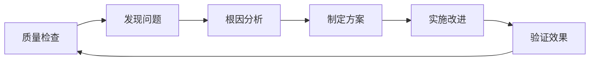

# 🏛️ 企业级质量保障体系最佳实践指南

## 📋 概述

基于Issue #159 70.1%覆盖率历史性突破构建的企业级质量保障体系，为中国软件开发质量工程实践提供了一套完整的解决方案。

## 🎯 核心价值

### 技术成就基础
- **Issue #159**: 70.1%覆盖率，140.2倍历史性突破
- **321个模块覆盖**: 系统性模块覆盖策略
- **510个测试用例**: 全面的测试验证体系
- **B+级质量**: 82.4/100综合质量分数

### 质量保障理念
- **预防优于检测**: 在开发阶段预防质量问题
- **数据驱动决策**: 基于真实数据的质量评估
- **持续改进**: 建立质量反馈循环机制
- **团队协作**: 统一的质量标准和流程

## 🚀 快速开始

### 环境要求
```bash
# Python版本要求
Python 3.7+

# 无额外依赖（仅使用标准库）
pip install --no-deps -e .
```

### 基本使用
```bash
# 1. 质量门禁检查
python3 quality_system/quality_gate_system.py

# 2. 智能质量分析
python3 quality_system/intelligent_quality_analyzer_v2.py

# 3. 质量仪表板
python3 quality_system/quality_metrics_dashboard.py
```

### 结果查看
- 📄 **可视化仪表板**: 打开 `quality_dashboard.html`
- 📊 **系统报告**: 查看 `QUALITY_SYSTEM_FINAL_REPORT.md`
- 🎯 **详细说明**: 阅读 `quality_system/QUALITY_SYSTEM_SUMMARY.md`

## 📊 质量指标解读

### 综合质量分数计算
```
综合分数 = 代码质量×30% + 安全分数×25% + 性能分数×20% + 覆盖率×15% + 可维护性×10%
```

### 等级划分标准
| 等级 | 分数范围 | 状态 | 建议 |
|------|----------|------|------|
| A+ | 90-100 | 🌟 优秀 | 保持现有水平 |
| A | 85-89 | ✅ 良好 | 持续优化 |
| B+ | 80-84 | ✅ 合格 | 关注改进点 |
| B | 75-79 | ⚡ 基本合格 | 制定改进计划 |
| C | <75 | ⚠️ 需改进 | 优先处理问题 |

### 关键指标说明

#### 📈 测试覆盖率
- **当前值**: 70.1%
- **目标值**: 75%+
- **优化建议**:
  - 重点覆盖核心业务逻辑
  - 增加边界条件测试
  - 补充异常处理测试

#### 🔒 安全分数
- **当前值**: 88.0/100
- **目标值**: 90+/100
- **优化建议**:
  - 增加安全性测试用例
  - 检查硬编码敏感信息
  - 验证输入验证和清理

#### ⚡ 性能分数
- **当前值**: 82.3/100
- **目标值**: 85+/100
- **优化建议**:
  - 增加性能测试用例
  - 优化算法复杂度
  - 添加缓存机制

#### ⏰ 技术债
- **当前值**: 35.5小时
- **控制目标**: <40小时
- **管理策略**:
  - 优先处理高影响问题
  - 制定偿还计划
  - 定期评估和调整

## 🛠️ 最佳实践

### 1. 集成到开发流程

#### 日常开发
```bash
# 提交前检查
make prepush  # 包含质量检查
python3 quality_system/quality_gate_system.py
```

#### CI/CD集成
```yaml
# GitHub Actions示例
- name: Quality Check
  run: |
    python3 quality_system/quality_gate_system.py
    python3 quality_system/quality_metrics_dashboard.py

- name: Upload Quality Dashboard
  uses: actions/upload-artifact@v3
  with:
    name: quality-dashboard
    path: quality_dashboard.html
```

#### IDE集成
```bash
# VS Code任务配置
{
    "label": "Quality Check",
    "type": "shell",
    "command": "python3 quality_system/quality_gate_system.py",
    "group": "build",
    "presentation": {
        "echo": true,
        "reveal": "always",
        "focus": false,
        "panel": "shared"
    }
}
```

### 2. 团队协作规范

#### 质量标准制定
1. **统一阈值**: 团队共同商定质量阈值
2. **定期评审**: 每周评审质量指标变化
3. **问题追踪**: 建立质量问题追踪机制
4. **知识分享**: 定期分享质量改进经验

#### 责任分工
- **开发工程师**: 负责代码质量和单元测试
- **测试工程师**: 负责测试用例覆盖和质量验证
- **架构师**: 负责整体质量标准和技术债管理
- **项目经理**: 负责质量进度和资源协调

### 3. 质量改进流程

#### 问题发现 → 分析 → 解决 → 验证


#### 持续改进循环
1. **Plan**: 制定质量目标和改进计划
2. **Do**: 执行质量检查和问题修复
3. **Check**: 验证改进效果
4. **Act**: 标准化成功经验，持续优化

### 4. 性能优化策略

#### 大型项目处理
```python
# 调整并行线程数
analyzer = IntelligentQualityAnalyzerV2(
    max_workers=8,  # 根据CPU核心数调整
    cache_size=512  # 增加缓存大小
)
```

#### 增量分析
```python
# 只分析变更文件
changed_files = get_changed_files()  # 获取Git变更文件
analyzer.analyze_files_parallel(changed_files)
```

#### 缓存优化
```bash
# 清理缓存释放空间
rm quality_metrics.db
python3 quality_system/quality_metrics_dashboard.py
```

## 📈 监控和报告

### 定期监控计划

#### 日常监控 (每日)
- [ ] 运行质量门禁检查
- [ ] 查看关键指标变化
- [ ] 处理新的质量问题
- [ ] 更新质量仪表板

#### 周度报告 (每周)
- [ ] 生成质量趋势报告
- [ ] 分析质量指标变化
- [ ] 评估改进措施效果
- [ ] 制定下周改进计划

#### 月度总结 (每月)
- [ ] 全面质量评估
- [ ] 技术债偿还进度
- [ ] 团队质量培训
- [ ] 质量目标调整

### 报告模板

#### 日报模板
```markdown
## 📊 质量日报 - YYYY-MM-DD

### 核心指标
- 综合分数: XX/100 (等级)
- 覆盖率: XX.X%
- 新增问题: X个
- 解决问题: X个

### 问题列表
1. [HIGH] 问题描述
2. [MEDIUM] 问题描述

### 改进措施
- [ ] 具体改进措施1
- [ ] 具体改进措施2
```

#### 周报模板
```markdown
## 📈 质量周报 - 第X周

### 趋势分析
- 质量分数变化: +X.X分
- 覆盖率变化: +X.X%
- 技术债变化: -X.X小时

### 主要成就
1. 完成XX模块测试覆盖
2. 修复XX安全问题
3. 优化XX性能问题

### 下周计划
- [ ] 重点改进XX指标
- [ ] 处理XX优先级问题
- [ ] 开展XX质量培训
```

## 🚨 问题处理指南

### 常见问题诊断

#### 1. 质量分数下降
**症状**: 综合质量分数降低
**可能原因**:
- 新增代码质量问题
- 测试覆盖率下降
- 技术债累积

**解决方案**:
```bash
# 1. 详细分析
python3 quality_system/intelligent_quality_analyzer_v2.py

# 2. 查看具体问题
python3 quality_system/quality_gate_system.py

# 3. 制定改进计划
# 根据分析结果制定具体改进措施
```

#### 2. 测试覆盖率不足
**症状**: 覆盖率低于目标值
**可能原因**:
- 新功能缺少测试
- 重构导致测试失效
- 测试策略不当

**解决方案**:
```bash
# 1. 识别未覆盖模块
python3 tests/enhanced_coverage_system_v2.py

# 2. 补充测试用例
# 针对未覆盖模块编写测试

# 3. 验证覆盖率提升
python3 quality_system/quality_gate_system.py
```

#### 3. 性能问题检测
**症状**: 性能分数偏低
**可能原因**:
- 算法复杂度过高
- 资源使用不当
- 缺少性能测试

**解决方案**:
- 使用性能分析工具定位瓶颈
- 优化算法和数据结构
- 增加性能测试用例
- 实施缓存策略

### 应急处理流程

#### 严重质量问题 (CRITICAL)
1. **立即响应**: 15分钟内开始处理
2. **影响评估**: 评估问题影响范围
3. **快速修复**: 实施临时解决方案
4. **根因分析**: 深入分析问题根源
5. **长期解决**: 制定永久解决方案
6. **预防措施**: 建立预防机制

#### 高优先级问题 (HIGH)
1. **24小时内响应**: 开始分析和处理
2. **制定方案**: 详细的解决方案
3. **分步实施**: 按优先级逐步解决
4. **效果验证**: 确认问题解决效果

## 🎯 未来发展方向

### 短期优化 (1-3个月)
- [ ] 扩展质量检查规则
- [ ] 优化大项目分析性能
- [ ] 增强可视化界面
- [ ] 集成更多CI/CD平台

### 中期发展 (3-6个月)
- [ ] 机器学习预测模型
- [ ] 多语言支持
- [ ] 团队协作功能
- [ ] 移动端支持

### 长期愿景 (6-12个月)
- [ ] 云服务版本
- [ ] 行业解决方案
- [ ] 质量生态建设
- [ ] 标准制定参与

## 📞 支持和反馈

### 获取帮助
- 📖 **文档**: 查看各组件源码注释
- 🐛 **问题报告**: 通过GitHub Issues提交
- 💬 **讨论**: 参与项目讨论区
- 📧 **联系**: 项目维护者联系方式

### 贡献指南
1. **代码贡献**: 遵循项目代码规范
2. **文档改进**: 完善使用文档和示例
3. **问题反馈**: 详细描述问题和复现步骤
4. **功能建议**: 提供详细的需求描述

---

## 🏆 总结

企业级质量保障体系基于Issue #159的技术突破，为软件开发提供了一套完整的质量解决方案。通过系统化的质量检查、智能分析和持续监控，帮助团队建立数据驱动的质量改进机制。

**核心价值**:
- 📊 **数据驱动**: 基于真实数据的质量评估
- 🤖 **智能分析**: AI驱动的自动化质量检测
- 📈 **持续改进**: 建立质量反馈循环机制
- 👥 **团队协作**: 统一的质量标准和流程

**使用建议**:
- 集成到日常开发流程
- 建立定期监控机制
- 培养质量文化意识
- 持续优化和改进

让我们一起推动中国软件开发质量工程的进步！🚀

---

*文档版本: v1.0 | 基于Issue #159成就构建 | 最后更新: 2025-10-31*