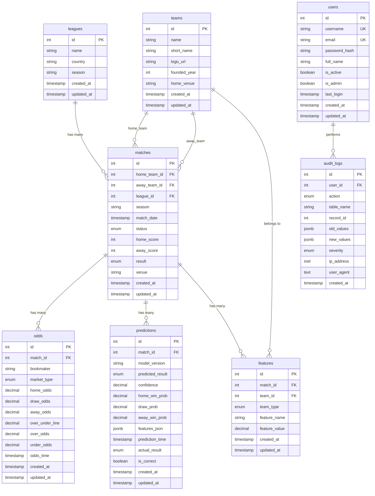

# 数据库架构文档

## 📋 概述

足球预测系统采用PostgreSQL作为主数据库，使用SQLAlchemy 2.0作为ORM框架。数据库设计遵循领域驱动设计（DDD）原则，支持完整的足球预测业务流程。

## 🏗️ 数据库架构

### 核心设计原则

- **领域驱动**: 按业务领域划分表结构
- **时间戳**: 所有业务表包含创建时间和更新时间
- **外键约束**: 确保数据完整性
- **索引优化**: 针对查询性能优化
- **审计追踪**: 完整的操作日志记录

### 技术栈

- **数据库**: PostgreSQL 14+
- **ORM**: SQLAlchemy 2.0 (异步支持)
- **迁移**: Alembic
- **连接池**: asyncpg
- **备份**: pg_dump + WAL归档

## 📊 数据表结构

### 1. 核心业务表

#### 1.1 联赛表 (leagues)

```sql
CREATE TABLE leagues (
    id SERIAL PRIMARY KEY,
    name VARCHAR(100) NOT NULL COMMENT '联赛名称',
    country VARCHAR(50) NOT NULL COMMENT '国家',
    season VARCHAR(20) NOT NULL COMMENT '赛季',
    created_at TIMESTAMP DEFAULT CURRENT_TIMESTAMP,
    updated_at TIMESTAMP DEFAULT CURRENT_TIMESTAMP
);

-- 索引
CREATE INDEX idx_leagues_country_season ON leagues(country, season);
CREATE INDEX idx_leagues_name ON leagues(name);
```

**字段说明**:
- `id`: 主键，自增
- `name`: 联赛名称（如：英超、西甲、德甲）
- `country`: 联赛所属国家
- `season`: 赛季（如：2024-25）

#### 1.2 球队表 (teams)

```sql
CREATE TABLE teams (
    id SERIAL PRIMARY KEY,
    name VARCHAR(100) NOT NULL COMMENT '球队名称',
    short_name VARCHAR(50) COMMENT '简称',
    logo_url VARCHAR(255) COMMENT '队徽URL',
    founded_year INTEGER COMMENT '成立年份',
    home_venue VARCHAR(100) COMMENT '主场',
    created_at TIMESTAMP DEFAULT CURRENT_TIMESTAMP,
    updated_at TIMESTAMP DEFAULT CURRENT_TIMESTAMP
);

-- 索引
CREATE INDEX idx_teams_name ON teams(name);
CREATE INDEX idx_teams_founded_year ON teams(founded_year);
```

**字段说明**:
- `id`: 主键，自增
- `name`: 球队全称
- `short_name`: 球队简称
- `logo_url`: 球队徽标URL
- `founded_year`: 成立年份
- `home_venue`: 主场球场名称

#### 1.3 比赛表 (matches)

```sql
CREATE TYPE match_status AS ENUM ('scheduled', 'live', 'finished', 'cancelled');
CREATE TYPE match_result AS ENUM ('home_win', 'away_win', 'draw');

CREATE TABLE matches (
    id SERIAL PRIMARY KEY,
    home_team_id INTEGER NOT NULL REFERENCES teams(id) ON DELETE CASCADE,
    away_team_id INTEGER NOT NULL REFERENCES teams(id) ON DELETE CASCADE,
    league_id INTEGER NOT NULL REFERENCES leagues(id) ON DELETE CASCADE,
    season VARCHAR(20) NOT NULL,
    match_date TIMESTAMP NOT NULL,
    status match_status DEFAULT 'scheduled',
    home_score INTEGER COMMENT '主队得分',
    away_score INTEGER COMMENT '客队得分',
    result match_result COMMENT '比赛结果',
    venue VARCHAR(100) COMMENT '比赛场地',
    created_at TIMESTAMP DEFAULT CURRENT_TIMESTAMP,
    updated_at TIMESTAMP DEFAULT CURRENT_TIMESTAMP,

    -- 约束
    CONSTRAINT chk_different_teams CHECK (home_team_id != away_team_id),
    CONSTRAINT chk_scores CHECK (
        (status = 'finished' AND home_score IS NOT NULL AND away_score IS NOT NULL) OR
        (status != 'finished')
    )
);

-- 索引
CREATE INDEX idx_matches_date_status ON matches(match_date, status);
CREATE INDEX idx_matches_teams ON matches(home_team_id, away_team_id);
CREATE INDEX idx_matches_league_season ON matches(league_id, season);
CREATE INDEX idx_matches_result ON matches(result) WHERE result IS NOT NULL;
```

**字段说明**:
- `id`: 主键，自增
- `home_team_id`: 主队ID（外键）
- `away_team_id`: 客队ID（外键）
- `league_id`: 联赛ID（外键）
- `season`: 赛季
- `match_date`: 比赛时间
- `status`: 比赛状态（scheduled/live/finished/cancelled）
- `home_score/away_score`: 比分
- `result`: 比赛结果（home_win/away_win/draw）
- `venue`: 比赛场地

#### 1.4 赔率表 (odds)

```sql
CREATE TYPE market_type AS ENUM ('match_winner', 'over_under', 'handicap');

CREATE TABLE odds (
    id SERIAL PRIMARY KEY,
    match_id INTEGER NOT NULL REFERENCES matches(id) ON DELETE CASCADE,
    bookmaker VARCHAR(50) NOT NULL COMMENT '博彩公司',
    market_type market_type NOT NULL,
    home_odds DECIMAL(10,4) COMMENT '主胜赔率',
    draw_odds DECIMAL(10,4) COMMENT '平局赔率',
    away_odds DECIMAL(10,4) COMMENT '客胜赔率',
    over_under_line DECIMAL(4,2) COMMENT '大小球盘口',
    over_odds DECIMAL(10,4) COMMENT '大球赔率',
    under_odds DECIMAL(10,4) COMMENT '小球赔率',
    handicap_line DECIMAL(4,2) COMMENT '让球盘口',
    handicap_home_odds DECIMAL(10,4) COMMENT '主队让球赔率',
    handicap_away_odds DECIMAL(10,4) COMMENT '客队受让赔率',
    odds_time TIMESTAMP DEFAULT CURRENT_TIMESTAMP COMMENT '赔率时间',
    created_at TIMESTAMP DEFAULT CURRENT_TIMESTAMP,
    updated_at TIMESTAMP DEFAULT CURRENT_TIMESTAMP
);

-- 索引
CREATE INDEX idx_odds_match_time ON odds(match_id, odds_time);
CREATE INDEX idx_odds_bookmaker ON odds(bookmaker);
CREATE INDEX idx_odds_market ON odds(market_type);
```

**字段说明**:
- `id`: 主键，自增
- `match_id`: 比赛ID（外键）
- `bookmaker`: 博彩公司名称
- `market_type`: 市场类型
- `home_odds/draw_odds/away_odds`: 胜平负赔率
- `over_under_line`: 大小球盘口
- `over_odds/under_odds`: 大小球赔率
- `handicap_line`: 让球盘口
- `handicap_home_odds/handicap_away_odds`: 让球赔率

#### 1.5 预测表 (predictions)

```sql
CREATE TYPE predicted_result AS ENUM ('home_win', 'away_win', 'draw');

CREATE TABLE predictions (
    id SERIAL PRIMARY KEY,
    match_id INTEGER NOT NULL REFERENCES matches(id) ON DELETE CASCADE,
    model_version VARCHAR(20) NOT NULL COMMENT '模型版本',
    predicted_result predicted_result NOT NULL,
    confidence DECIMAL(5,4) NOT NULL CHECK (confidence >= 0 AND confidence <= 1),
    home_win_prob DECIMAL(5,4) NOT NULL CHECK (home_win_prob >= 0 AND home_win_prob <= 1),
    draw_prob DECIMAL(5,4) NOT NULL CHECK (draw_prob >= 0 AND draw_prob <= 1),
    away_win_prob DECIMAL(5,4) NOT NULL CHECK (away_win_prob >= 0 AND away_win_prob <= 1),
    features_json JSONB COMMENT '特征数据JSON',
    prediction_time TIMESTAMP DEFAULT CURRENT_TIMESTAMP,
    actual_result predicted_result COMMENT '实际结果',
    is_correct BOOLEAN COMMENT '预测是否正确',
    created_at TIMESTAMP DEFAULT CURRENT_TIMESTAMP,
    updated_at TIMESTAMP DEFAULT CURRENT_TIMESTAMP,

    -- 约束
    CONSTRAINT chk_prob_sum CHECK (
        home_win_prob + draw_prob + away_win_prob = 1.0
    )
);

-- 索引
CREATE INDEX idx_predictions_match_time ON predictions(match_id, prediction_time);
CREATE INDEX idx_predictions_model ON predictions(model_version);
CREATE INDEX idx_predictions_correct ON predictions(is_correct) WHERE is_correct IS NOT NULL;
CREATE INDEX idx_predictions_features ON predictions USING GIN(features_json);
```

**字段说明**:
- `id`: 主键，自增
- `match_id`: 比赛ID（外键）
- `model_version`: 预测模型版本
- `predicted_result`: 预测结果
- `confidence`: 预测置信度
- `home_win_prob/draw_prob/away_win_prob`: 各结果概率
- `features_json`: 特征数据（JSON格式）
- `prediction_time`: 预测时间
- `actual_result`: 实际结果（赛后填写）
- `is_correct`: 预测是否正确

#### 1.6 特征表 (features)

```sql
CREATE TYPE team_type AS ENUM ('home', 'away');

CREATE TABLE features (
    id SERIAL PRIMARY KEY,
    match_id INTEGER NOT NULL REFERENCES matches(id) ON DELETE CASCADE,
    team_id INTEGER NOT NULL REFERENCES teams(id) ON DELETE CASCADE,
    team_type team_type NOT NULL,
    feature_name VARCHAR(100) NOT NULL,
    feature_value DECIMAL(15,6) NOT NULL,
    created_at TIMESTAMP DEFAULT CURRENT_TIMESTAMP,
    updated_at TIMESTAMP DEFAULT CURRENT_TIMESTAMP,

    -- 唯一约束
    UNIQUE(match_id, team_id, team_type, feature_name)
);

-- 索引
CREATE INDEX idx_features_match_team ON features(match_id, team_id);
CREATE INDEX idx_features_name ON features(feature_name);
CREATE INDEX idx_features_value ON features(feature_value);
```

**字段说明**:
- `id`: 主键，自增
- `match_id`: 比赛ID（外键）
- `team_id`: 球队ID（外键）
- `team_type`: 球队类型（主队/客队）
- `feature_name`: 特征名称
- `feature_value`: 特征值

### 2. 用户管理表

#### 2.1 用户表 (users)

```sql
CREATE TABLE users (
    id SERIAL PRIMARY KEY,
    username VARCHAR(50) UNIQUE NOT NULL,
    email VARCHAR(100) UNIQUE NOT NULL,
    password_hash VARCHAR(255) NOT NULL,
    full_name VARCHAR(100),
    is_active BOOLEAN DEFAULT TRUE,
    is_admin BOOLEAN DEFAULT FALSE,
    last_login TIMESTAMP,
    created_at TIMESTAMP DEFAULT CURRENT_TIMESTAMP,
    updated_at TIMESTAMP DEFAULT CURRENT_TIMESTAMP
);

-- 索引
CREATE INDEX idx_users_username ON users(username);
CREATE INDEX idx_users_email ON users(email);
CREATE INDEX idx_users_active ON users(is_active);
```

### 3. 数据管道表

#### 3.1 数据收集日志表 (data_collection_logs)

```sql
CREATE TYPE collection_status AS ENUM ('pending', 'running', 'completed', 'failed');
CREATE TYPE collection_type AS ENUM ('matches', 'odds', 'results', 'features');

CREATE TABLE data_collection_logs (
    id SERIAL PRIMARY KEY,
    collection_type collection_type NOT NULL,
    source VARCHAR(100) NOT NULL COMMENT '数据源',
    status collection_status DEFAULT 'pending',
    start_time TIMESTAMP,
    end_time TIMESTAMP,
    records_processed INTEGER DEFAULT 0,
    records_failed INTEGER DEFAULT 0,
    error_message TEXT,
    metadata_json JSONB COMMENT '元数据JSON',
    created_at TIMESTAMP DEFAULT CURRENT_TIMESTAMP,
    updated_at TIMESTAMP DEFAULT CURRENT_TIMESTAMP
);

-- 索引
CREATE INDEX idx_collection_logs_type_status ON data_collection_logs(collection_type, status);
CREATE INDEX idx_collection_logs_time ON data_collection_logs(start_time);
```

#### 3.2 原始数据表

```sql
-- 原始比赛数据
CREATE TABLE raw_match_data (
    id SERIAL PRIMARY KEY,
    source VARCHAR(100) NOT NULL,
    source_id VARCHAR(100) NOT NULL,
    raw_data JSONB NOT NULL,
    processed_at TIMESTAMP,
    created_at TIMESTAMP DEFAULT CURRENT_TIMESTAMP,
    UNIQUE(source, source_id)
);

-- 原始赔率数据
CREATE TABLE raw_odds_data (
    id SERIAL PRIMARY KEY,
    source VARCHAR(100) NOT NULL,
    source_id VARCHAR(100) NOT NULL,
    raw_data JSONB NOT NULL,
    processed_at TIMESTAMP,
    created_at TIMESTAMP DEFAULT CURRENT_TIMESTAMP,
    UNIQUE(source, source_id)
);

-- 原始比分数据
CREATE TABLE raw_scores_data (
    id SERIAL PRIMARY KEY,
    source VARCHAR(100) NOT NULL,
    source_id VARCHAR(100) NOT NULL,
    raw_data JSONB NOT NULL,
    processed_at TIMESTAMP,
    created_at TIMESTAMP DEFAULT CURRENT_TIMESTAMP,
    UNIQUE(source, source_id)
);
```

### 4. 审计日志表

#### 4.1 审计日志表 (audit_logs)

```sql
CREATE TYPE audit_action AS ENUM ('create', 'read', 'update', 'delete', 'login', 'logout');
CREATE TYPE audit_severity AS ENUM ('low', 'medium', 'high', 'critical');

CREATE TABLE audit_logs (
    id SERIAL PRIMARY KEY,
    user_id INTEGER REFERENCES users(id) ON DELETE SET NULL,
    action audit_action NOT NULL,
    table_name VARCHAR(50),
    record_id INTEGER,
    old_values JSONB,
    new_values JSONB,
    severity audit_severity DEFAULT 'low',
    ip_address INET,
    user_agent TEXT,
    created_at TIMESTAMP DEFAULT CURRENT_TIMESTAMP
);

-- 索引
CREATE INDEX idx_audit_logs_user_time ON audit_logs(user_id, created_at);
CREATE INDEX idx_audit_logs_action ON audit_logs(action);
CREATE INDEX idx_audit_logs_table ON audit_logs(table_name);
CREATE INDEX idx_audit_logs_severity ON audit_logs(severity);
```

## 🔍 数据库关系图



## 🚀 性能优化

### 索引策略

1. **主键索引**: 所有表都有自增主键
2. **外键索引**: 所有外键字段都建立索引
3. **查询索引**: 针对常用查询模式建立复合索引
4. **JSON索引**: JSONB字段使用GIN索引

### 分区策略

```sql
-- 按时间分区预测表（可选）
CREATE TABLE predictions_2024 PARTITION OF predictions
FOR VALUES FROM ('2024-01-01') TO ('2025-01-01');

-- 按赛季分区比赛表（可选）
CREATE TABLE matches_2024_25 PARTITION OF matches
FOR VALUES IN ('2024-25');
```

### 查询优化

1. **预编译语句**: 使用参数化查询
2. **连接池**: 配置合适的连接池大小
3. **批量操作**: 批量插入和更新
4. **缓存策略**: 热点数据Redis缓存

## 🔧 数据库维护

### 备份策略

```bash
# 全量备份
pg_dump -h localhost -U football_user -d football_prediction > backup_$(date +%Y%m%d).sql

# 增量备份（WAL归档）
archive_command = 'cp %p /backup/wal/%f'
```

### 监控指标

- 连接数使用率
- 查询响应时间
- 锁等待统计
- 表膨胀率
- 索引使用率

### 清理策略

```sql
-- 清理旧审计日志（保留1年）
DELETE FROM audit_logs WHERE created_at < NOW() - INTERVAL '1 year';

-- 清理旧原始数据（保留3个月）
DELETE FROM raw_match_data WHERE created_at < NOW() - INTERVAL '3 months';
```

## 🔒 安全配置

### 权限控制

```sql
-- 创建应用用户
CREATE USER football_app WITH PASSWORD 'secure_password';

-- 创建只读用户
CREATE USER football_reader WITH PASSWORD 'reader_password';

-- 授权
GRANT CONNECT ON DATABASE football_prediction TO football_app;
GRANT USAGE ON SCHEMA public TO football_app;
GRANT SELECT, INSERT, UPDATE, DELETE ON ALL TABLES IN SCHEMA public TO football_app;

GRANT CONNECT ON DATABASE football_prediction TO football_reader;
GRANT USAGE ON SCHEMA public TO football_reader;
GRANT SELECT ON ALL TABLES IN SCHEMA public TO football_reader;
```

### 数据加密

- **传输加密**: SSL/TLS连接
- **静态加密**: 透明数据加密（TDE）
- **字段加密**: 敏感字段加密存储

## 📋 迁移管理

### Alembic配置

```python
# alembic/env.py
from sqlalchemy import create_engine
from src.database.base import Base

target_metadata = Base.metadata

def run_migrations_online():
    connectable = create_engine(
        DATABASE_URL,
        pool_pre_ping=True,
        pool_recycle=300
    )

    with connectable.connect() as connection:
        context.configure(
            connection=connection,
            target_metadata=target_metadata
        )

        with context.begin_transaction():
            context.run_migrations()
```

### 迁移历史

| 版本号 | 日期 | 描述 | 状态 |
|--------|------|------|------|
| `d56c8d0d5aa0` | 2025-09-07 | 初始数据库架构 | ✅ 已应用 |
| `002_add_raw_scores_data` | 2025-09-08 | 添加原始评分数据和JSONB升级 | ✅ 已应用 |
| `004_configure_database_permissions` | 2025-09-10 | 配置数据库权限 | ✅ 已应用 |
| `005_create_audit_logs_table` | 2025-09-12 | 创建审计日志表 | ✅ 已应用 |
| `006_add_missing_database_indexes` | 2025-09-15 | 添加缺失的数据库索引 | ✅ 已应用 |
| `007_improve_phase3_implementations` | 2025-09-18 | 改进Phase3实现 | ✅ 已应用 |
| `c1d8ae5075f0_add_jsonb_sqlite_compatibility` | 2025-09-20 | 添加JSONB SQLite兼容性 | ✅ 已应用 |
| `a20f91c49306_add_business_constraints` | 2025-09-22 | 添加业务约束 | ✅ 已应用 |
| `09d03cebf664_implement_partitioned_tables` | 2025-09-25 | 实现分区表和索引 | ✅ 已应用 |
| `d3bf28af22ff_add_performance_critical_indexes` | 2025-09-28 | 添加性能关键索引 | ✅ 已应用 |
| `d6d814cc1078_database_performance_optimization` | 2025-10-01 | 数据库性能优化 | ✅ 已应用 |
| `d82ea26f05d0_add_mlops_support_to_predictions_table` | 2025-10-05 | 为预测表添加MLOps支持 | ✅ 已应用 |
| `f48d412852cc_add_data_collection_logs_and_bronze_layer` | 2025-10-10 | 添加数据收集日志和Bronze层表 | ✅ 已应用 |
| `9ac2aff86228_merge_multiple_migration_heads` | 2025-10-15 | 合并多个迁移分支 | ✅ 已应用 |
| `9de9a8b8aa92_merge_remaining_heads` | 2025-10-20 | 合并剩余分支 | ✅ 已应用 |

**版本说明**:
- **初始架构** (v1.0): 包含核心业务表（联赛、球队、比赛、赔率、预测）
- **数据增强** (v1.1): 添加JSONB支持和原始数据存储
- **性能优化** (v1.2): 添加关键索引和分区表支持
- **MLOps集成** (v1.3): 添加机器学习运维支持
- **数据管道** (v1.4): 完善数据收集和审计功能

### 迁移命令

```bash
# 创建新迁移
alembic revision --autogenerate -m "Add new feature"

# 应用迁移
alembic upgrade head

# 回滚迁移
alembic downgrade -1

# 查看当前版本
alembic current

# 查看迁移历史
alembic history

# 检查未应用的迁移
alembic heads
```

## 📊 相关文档

### 📚 核心文档
- [系统架构文档](../architecture/ARCHITECTURE.md) - 了解整体系统设计
- [开发指南](DEVELOPMENT_GUIDE.md) - 开发环境搭建和规范
- [数据采集配置指南](DATA_COLLECTION_SETUP.md) - 数据采集和处理流程
- [机器学习模型指南](../ml/ML_MODEL_GUIDE.md) - ML模型设计和训练
- [监控系统指南](../ops/MONITORING.md) - 系统监控和告警
- [API文档](API_REFERENCE.md) - REST API接口说明

### 🛠️ 运维相关
- [部署指南](../ops/PRODUCTION_READINESS_PLAN.md) - 生产环境部署
- [运维手册](../ops/runbooks/README.md) - 运维操作指南
- [安全配置](../maintenance/SECURITY_AUDIT_GUIDE.md) - 安全配置和修复

### 🧪 测试相关
- [测试策略文档](../testing/TEST_IMPROVEMENT_GUIDE.md) - 测试策略和方法
- [测试用例示例](../testing/examples.md) - 测试用例编写指南

---

## 📋 文档信息

- **数据库版本**: PostgreSQL 14+
- **架构版本**: v1.4 (MLOps集成)
- **ORM框架**: SQLAlchemy 2.0
- **迁移系统**: Alembic
- **最后更新**: 2025-10-23
- **维护团队**: 数据库团队
- **审核状态**: ✅ 已审核

**版本历史**:
- v1.0 (2025-09-07): 初始架构设计
- v1.1 (2025-09-20): 添加JSONB支持
- v1.2 (2025-09-28): 性能优化和索引
- v1.3 (2025-10-05): MLOps功能集成
- v1.4 (2025-10-20): 数据管道完善
