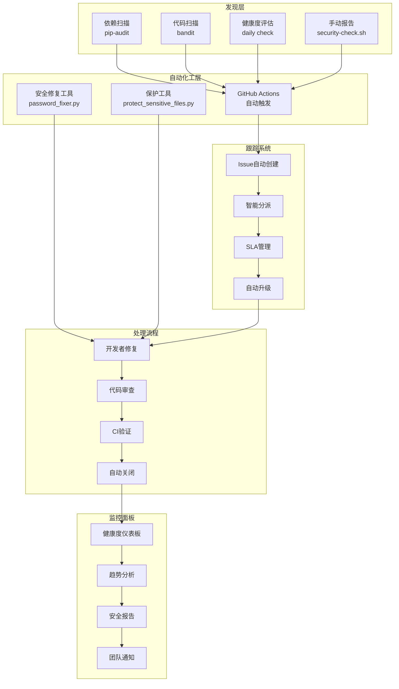
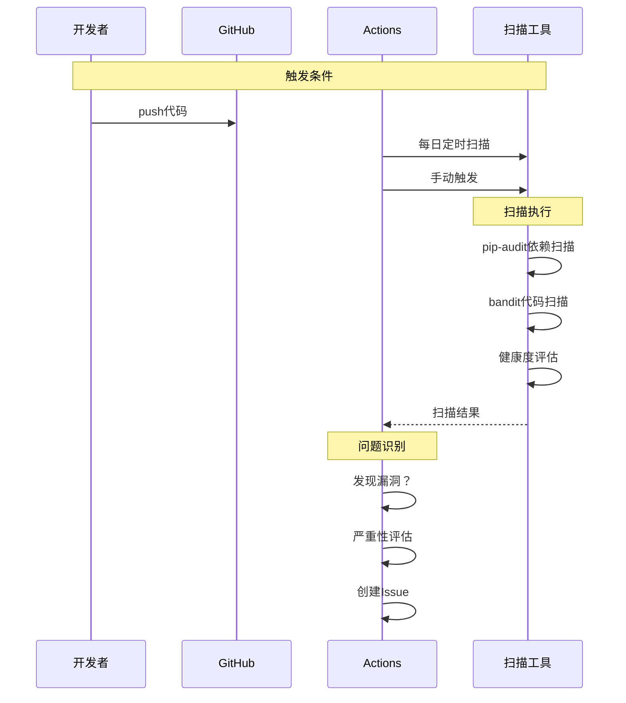
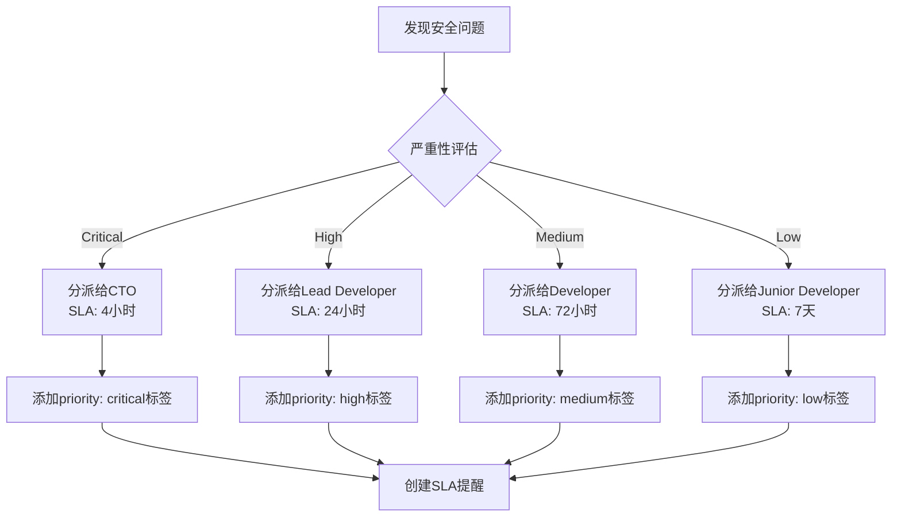
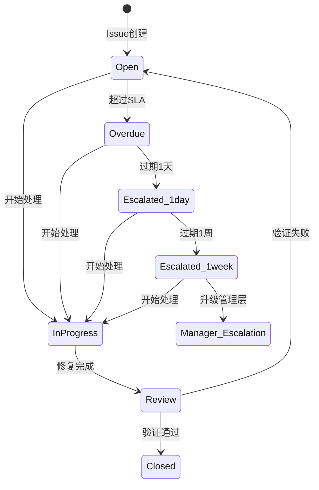
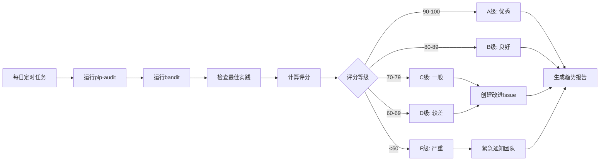
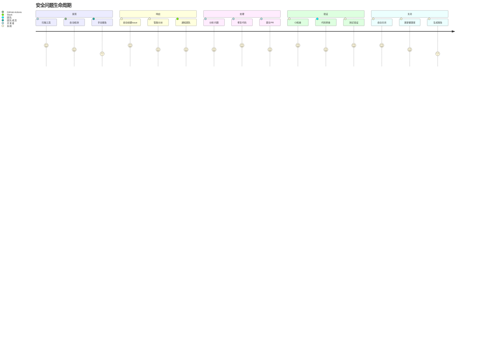

# 安全问题跟踪闭环流程图

## 📊 整体架构



## 🔄 详细流程说明

### 1. 问题发现阶段



### 2. 自动分派机制



### 3. 升级机制



### 4. 健康度评估流程



## 📋 实际运行示例

### 场景1：发现新的依赖漏洞

```yaml
时间线:
  09:00 UTC: GitHub Actions定时运行dependency-security.yml
  09:02: pip-audit发现requests库有高危漏洞CVE-2025-XXXX
  09:03: 自动创建Issue："🔒 依赖漏洞发现 - requests CVE-2025-XXXX"
  09:04: 自动添加标签：security, high-priority, dependency
  09:05: 自动分派给@lead-developer
  09:06: Slack通知安全团队
  09:07: 健康度评分从92.5降到72.5
  09:08: 创建健康度下降Issue
  14:00: 开发者开始修复
  15:30: 提交修复代码
  15:35: CI验证通过
  15:40: 自动关闭Issue
  15:41: 健康度恢复到95.0
```

### 场景2：安全问题过期升级

```yaml
时间线:
  Day 1: 发现中危问题，分派给Developer
  Day 2: 每日检查，未过期
  Day 3: 72小时SLA到期，标记为overdue
  Day 4: 自动添加@lead-developer到参与者
  Day 5: 仍未处理，添加升级评论
  Day 8: 过期一周，升级给CTO和Engineering Manager
  Day 9: CTO介入，协调资源
  Day 10: 问题得到解决
```

## 🎯 闭环的关键特征

### 1. **自动化** 🤖
- 无需人工干预的问题发现
- 自动创建和分派Issue
- 自动升级过期问题
- 自动关闭已解决问题

### 2. **可追溯** 🔍
- 所有问题都有Issue记录
- 完整的历史数据保存
- 趋势分析和预测
- 详细的修复报告

### 3. **响应式** ⚡
- SLA驱动的响应时间
- 自动升级确保问题不被忽视
- 健康度下降立即告警
- 多渠道通知（GitHub, Slack）

### 4. **持续改进** 📈
- 每日健康度评分
- 历史趋势分析
- 预防性建议
- 知识库积累

## 📊 监控面板视图

```
安全健康度仪表板 (实时更新)
┌─────────────────────────────────────┐
│  当前评分: 92.5/100 (A级)          │
│  趋势: ↗ 稳定上升 (+2.5)         │
├─────────────────────────────────────┤
│  开放问题: 3个                     │
│  - 严重: 0                        │
│  - 高危: 1                        │
│  - 中危: 2                        │
│  - 过期: 0                        │
├─────────────────────────────────────┤
│  最近活动:                         │
│  ✓ 修复了requests CVE-2025-XXXX   │
│  ⏳ 修复SQL注入问题 (进行中)       │
│  ⏳ 更新过期的依赖 (待分配)       │
└─────────────────────────────────────┘
```

## 🔄 完整的生命周期



这就是我们建立的完整安全问题跟踪闭环系统，从问题发现到最终解决，全程自动化、可追溯、有响应机制！