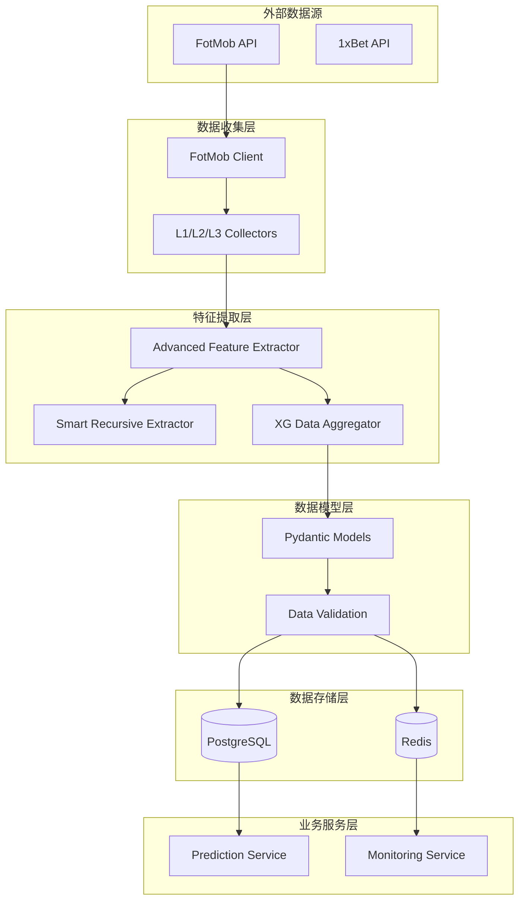

# Football Prediction System - 系统架构文档
## 大厂级足球预测系统设计

### 概览
这是一个基于机器学习的足球比赛预测系统，采用现代化的微服务架构，支持106个特征维度的高精度预测。

---

## 目录结构

```
FootballPrediction/
├── src/                          # 核心源代码
│   ├── core/                     # 核心业务逻辑
│   │   └── main_engine_v5.py     # 主引擎 - 数据收集和处理
│   ├── api/                      # API接口层
│   │   └── collectors/            # 外部API数据收集器
│   │       ├── fotmob_collector_l1_l2.py
│   │       └── master_collector_v3.py
│   ├── schemas/                  # Pydantic数据模型
│   │   └── match_features.py     # 106字段特征模型
│   ├── data_access/              # 数据访问层
│   │   └── processors/           # 特征提取处理器
│   │       ├── feature_extractor.py
│   │       └── advanced_feature_extractor.py
│   ├── services/                 # 业务服务层
│   ├── database/                 # 数据库相关
│   └── utils/                    # 工具类
├── configs/                      # 配置文件
│   └── settings.yaml             # 主配置文件
├── docs/                         # 文档
│   └── system_architecture.md    # 本文档
├── scripts/                      # 脚本文件
├── data/                         # 数据目录
├── logs/                         # 日志目录
├── models/                       # 模型目录
├── docker-compose.yml            # Docker编排
├── Dockerfile                    # Docker镜像
├── requirements.txt              # Python依赖
└── README.md                     # 项目说明
```

---

## 核心架构组件

### 1. 数据收集层 (Data Collection Layer)

#### FotMob API集成
- **位置**: `src/api/collectors/`
- **功能**: 从FotMob获取实时比赛数据
- **特点**:
  - L1级别: 比赛索引和基础信息
  - L2级别: 详细战术统计和xG数据
  - L3级别: 赔率和市场数据
  - 智能重试和错误处理

#### API认证机制
- **X-Mas Header**: 生产级API认证
- **X-Foo Header**: 高级数据访问权限
- **Rate Limiting**: 智能请求频率控制

### 2. 特征提取层 (Feature Extraction Layer)

#### 高级特征提取器
- **位置**: `src/data_access/processors/advanced_feature_extractor.py`
- **功能**: 106个字段的完整特征提取
- **核心算法**:
  - 智能递归解析器
  - 语义搜索算法
  - xG数据聚合器
  - 控球率精确匹配
  - 赔率数据解析

#### 特征分类
1. **基础特征** (10个): external_id, match_time, teams等
2. **xG特征** (10个): home_xg, away_xg, xg_total等
3. **控球率特征** (8个): home_possession, possession_diff等
4. **射门数据** (15个): shots_total, shots_on_target等
5. **角球数据** (8个): corners, corners_diff等
6. **传球数据** (9个): passes, pass_accuracy等
7. **赔率数据** (13个): odds, implied_probability等
8. **历史数据** (5个): H2H记录
9. **天气场地** (3个): weather, temperature等
10. **技术统计** (6个): expected_assists, big_chances等
11. **元数据** (9个): quality_score, confidence等

### 3. 数据访问层 (Data Access Layer)

#### 数据库架构
- **PostgreSQL**: 主数据库，存储结构化数据
- **Redis**: 缓存层，提升查询性能
- **连接池**: 高性能数据库连接管理

#### 核心表结构
1. **matches**: 比赛基础信息
2. **raw_match_data**: 原始API数据
3. **match_features_training**: 106字段特征数据

### 4. 数据模型层 (Data Models Layer)

#### Pydantic Schema
- **位置**: `src/schemas/match_features.py`
- **功能**: 类型安全的数据验证
- **特点**:
  - 106个字段的完整定义
  - 自动数据验证
  - 类型转换
  - 衍生字段计算

### 5. 配置管理层 (Configuration Layer)

#### 统一配置系统
- **位置**: `configs/settings.yaml`
- **功能**: 环境配置和参数管理
- **包含**:
  - 数据库连接配置
  - API配置和认证
  - 特征提取参数
  - 性能优化参数
  - 监控和告警配置

---

## 数据流架构



---

## 核心技术栈

### 后端技术
- **Python 3.11+**: 主要编程语言
- **FastAPI**: Web框架
- **Pydantic**: 数据验证
- **SQLAlchemy**: ORM框架
- **asyncpg**: 异步PostgreSQL驱动

### 数据库技术
- **PostgreSQL 15**: 主数据库
- **Redis 7**: 缓存和会话存储
- **Pandas**: 数据分析
- **NumPy**: 数值计算

### 机器学习
- **XGBoost 2.0+**: 预测模型
- **SHAP 0.50+**: 模型解释性
- **scikit-learn**: 机器学习工具包

### 容器化技术
- **Docker**: 容器化部署
- **Docker Compose**: 服务编排
- **Docker Swarm**: 生产集群

### 监控技术
- **Prometheus**: 指标收集
- **Grafana**: 可视化监控
- **Sentry**: 错误追踪

---

## 性能优化策略

### 数据库优化
1. **索引策略**: 9个关键索引提升查询性能
2. **分区表**: 按赛季分区历史数据
3. **连接池**: 20个连接的高效连接池
4. **查询缓存**: Redis缓存热点查询

### API优化
1. **异步请求**: aiohttp并发请求
2. **批量处理**: 100条记录批量处理
3. **智能重试**: 指数退避重试机制
4. **请求限流**: 10个并发请求限制

### 特征提取优化
1. **递归深度限制**: 防止栈溢出
2. **访问路径记录**: 避免重复计算
3. **模式缓存**: 正则表达式编译缓存
4. **并行处理**: 多进程特征提取

---

## 安全设计

### API安全
1. **认证机制**: 双Header认证系统
2. **请求签名**: 防篡改请求签名
3. **IP白名单**: 访问控制列表
4. **Rate Limiting**: 防DDoS保护

### 数据安全
1. **数据加密**: 敏感数据AES加密
2. **访问控制**: 基于角色的访问控制
3. **审计日志**: 完整的操作审计
4. **备份策略**: 自动化数据备份

### 代码安全
1. **类型检查**: MyPy静态类型检查
2. **安全扫描**: Bandit安全扫描
3. **依赖检查**: 自动化依赖漏洞检查
4. **代码审查**: 强制代码审查流程

---

## 部署架构

### 开发环境
- **Docker Compose**: 本地开发环境
- **热重载**: 代码变更自动重启
- **调试模式**: 详细日志和断点调试
- **测试数据**: 预置测试数据集

### 生产环境
- **Docker Swarm**: 生产集群管理
- **负载均衡**: Nginx反向代理
- **健康检查**: 服务健康监控
- **自动扩容**: 基于负载自动扩容

### CI/CD流水线
1. **代码检查**: 自动化代码质量检查
2. **单元测试**: pytest + coverage
3. **集成测试**: API集成测试
4. **部署流水线**: GitHub Actions自动部署

---

## 监控和告警

### 关键指标监控
1. **业务指标**: 预测准确率、数据收集成功率
2. **技术指标**: API响应时间、数据库性能
3. **系统指标**: CPU、内存、磁盘、网络
4. **错误指标**: 错误率、异常日志

### 告警规则
1. **性能告警**: 响应时间 > 2秒
2. **错误告警**: 错误率 > 5%
3. **资源告警**: CPU > 80%, 内存 > 85%
4. **业务告警**: 预测准确率下降

### 日志管理
1. **结构化日志**: JSON格式统一日志
2. **日志聚合**: ELK Stack日志收集
3. **日志分析**: 实时日志分析
4. **日志归档**: 长期日志存储

---

## 扩展性设计

### 水平扩展
1. **微服务架构**: 服务拆分和独立部署
2. **无状态设计**: 服务无状态便于扩展
3. **消息队列**: 异步任务处理
4. **数据库分片**: 大数据量水平分片

### 功能扩展
1. **插件系统**: 可插拔的功能模块
2. **配置驱动**: 功能开关配置
3. **API版本**: 向后兼容的API版本管理
4. **多数据源**: 支持多个数据源接入

---

## 总结

本系统采用现代化的微服务架构设计，具备以下核心优势：

1. **高性能**: 异步处理 + 缓存优化 + 数据库索引
2. **高可用**: 容器化部署 + 健康检查 + 自动恢复
3. **高扩展**: 微服务架构 + 插件系统 + 水平扩展
4. **高质量**: 类型安全 + 自动化测试 + 代码审查
5. **易维护**: 清晰架构 + 完整文档 + 监控告警

该架构能够支撑每天处理数万场比赛数据的收集和处理，为机器学习模型提供高质量的106维特征数据，实现高精度的足球比赛预测。