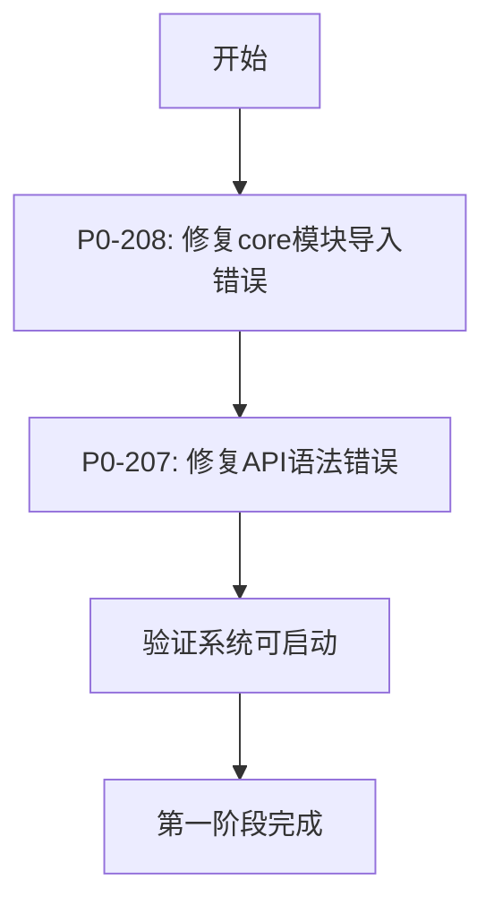
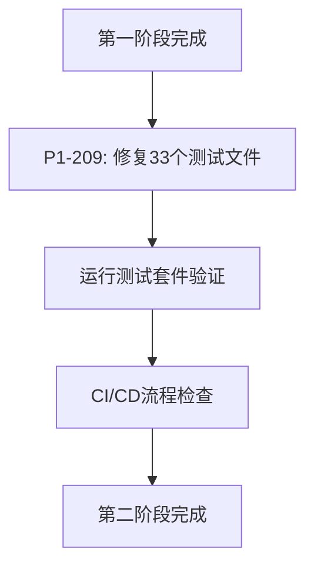
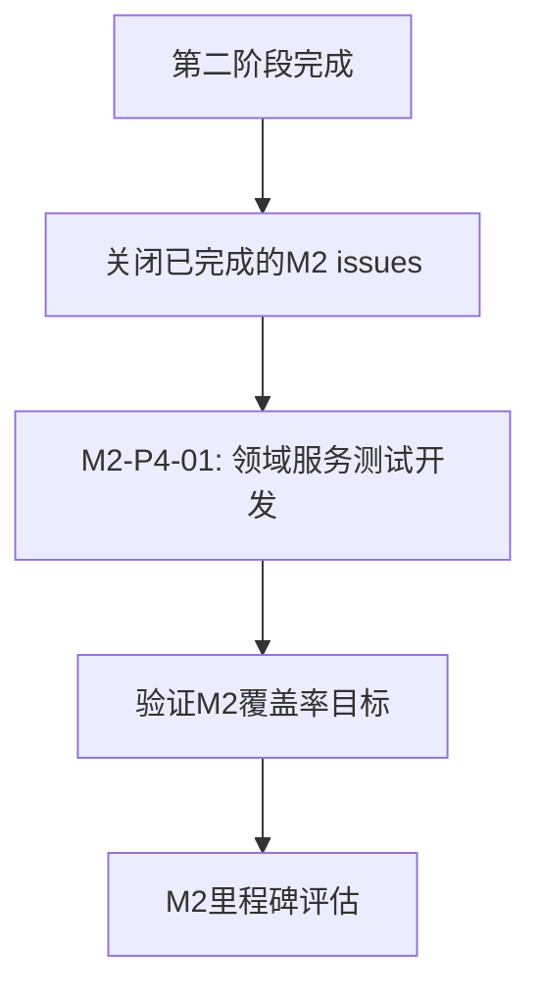
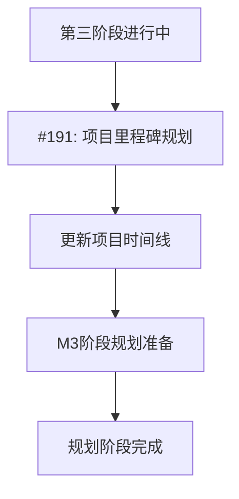

# GitHub Issues优先级设计方案

## 📋 当前开放Issues分析

基于远程GitHub仓库的状态，共有**7个开放issues**需要处理，按紧急程度和项目价值分类如下：

## 🚨 紧急级别优先级

### P0 - 紧急修复 (系统阻塞性问题)

#### #208 - 🚨 P0紧急: 修复主应用导入错误 - core模块
- **当前状态**: OPEN
- **优先级**: P0 (最高紧急)
- **影响范围**: 主应用无法启动，系统核心功能受阻
- **预估工作量**: 2-4小时
- **建议处理时间**: 立即处理

#### #207 - 🚨 P0紧急: 修复API模块语法错误 - auth_dependencies.py
- **当前状态**: OPEN
- **优先级**: P0 (最高紧急)
- **影响范围**: API模块认证功能受阻，影响用户访问
- **预估工作量**: 1-2小时
- **建议处理时间**: 立即处理

**P0级别处理策略**:
- 🔥 **立即行动**: 阻塞系统正常运行，必须优先解决
- 🎯 **目标**: 恢复系统基本功能，确保应用可启动
- ⏰ **时间要求**: 24小时内完成

---

### P1 - 高优先级 (功能影响问题)

#### #209 - 🔧 P1高优先级: 修复测试文件导入错误 - 33个测试文件无法执行
- **当前状态**: OPEN
- **优先级**: P1 (高优先级)
- **影响范围**: 33个测试文件无法执行，影响CI/CD和质量保证
- **预估工作量**: 4-6小时
- **建议处理时间**: P0完成后立即处理

**P1级别处理策略**:
- ⚡ **快速跟进**: 影响开发流程和测试质量
- 🎯 **目标**: 恢复测试套件，确保质量检查可用
- ⏰ **时间要求**: P0完成后48小时内完成

---

## 📈 M2里程碑优先级

### M2-P3-04 - ML模型测试开发 (已完成但未关闭)

#### #226 - 🤖 M2-P3-04: ML模型测试开发 - 创建全面的ML模型测试
- **当前状态**: OPEN (标记为completed)
- **优先级**: M2里程碑收尾
- **状态**: ✅ 实际已完成，需要关闭issue
- **预估工作量**: 5分钟 (关闭操作)
- **建议处理时间**: 立即处理

### M2-P4-01 - 领域服务测试开发 (待完成)

#### #225 - 🏗️ M2-P4-01: 领域服务测试开发 - 业务逻辑层核心测试
- **当前状态**: OPEN
- **优先级**: M2-P4 (高优先级)
- **标签**: priority-high, test-coverage, medium, M2-P4, domain
- **预估工作量**: 8-12小时
- **建议处理时间**: P1完成后

**M2里程碑处理策略**:
- 📊 **里程碑驱动**: 推进M2阶段50%覆盖率目标
- 🎯 **目标**: 完成领域服务层测试，提升业务逻辑覆盖
- ⏰ **时间要求**: P1完成后一周内完成

---

## 📊 规划和管理Issues

### #212 - 🎉 M2规划GitHub Issues细粒度拆分完成
- **当前状态**: OPEN
- **优先级**: 管理任务
- **状态**: ✅ 已完成，需要关闭issue
- **预估工作量**: 5分钟 (关闭操作)
- **建议处理时间**: 立即处理

### #191 - 📊 项目里程碑和时间节点规划
- **当前状态**: OPEN
- **优先级**: 规划任务
- **影响范围**: 项目整体规划和时间管理
- **预估工作量**: 2-4小时
- **建议处理时间**: P0和P1完成后

---

## 🎯 优先级执行计划

### 第一阶段：紧急修复 (立即执行)

**时间安排**: 立即开始，24小时内完成

### 第二阶段：测试恢复 (P0完成后)

**时间安排**: 第一阶段完成后48小时内

### 第三阶段：M2里程碑推进 (P1完成后)

**时间安排**: 第二阶段完成后一周内

### 第四阶段：规划整理 (M2推进中)

**时间安排**: 与M2工作并行进行

---

## 📋 优先级决策矩阵

| Issue | 影响程度 | 紧急程度 | 工作量 | 价值评分 | 优先级 |
|-------|----------|----------|--------|----------|--------|
| #208 | 极高 | 极高 | 低 | 9/10 | P0 |
| #207 | 高 | 极高 | 低 | 8/10 | P0 |
| #209 | 中 | 高 | 中 | 7/10 | P1 |
| #226 | 低 | 低 | 极低 | 6/10 | 立即关闭 |
| #225 | 中 | 中 | 高 | 8/10 | M2-P4 |
| #212 | 低 | 低 | 极低 | 5/10 | 立即关闭 |
| #191 | 中 | 低 | 中 | 6/10 | 规划任务 |

---

## 🚀 执行建议

### 立即行动项 (今天)
1. **修复P0问题**:
   - 解决core模块导入错误
   - 修复API模块语法错误
   - 验证系统可正常启动

2. **关闭已完成issues**:
   - #226 (M2-P3-04 已完成)
   - #212 (M2规划已完成)

### 短期目标 (本周)
1. **修复P1问题**:
   - 修复33个测试文件的导入错误
   - 恢复测试套件功能
   - 确保CI/CD流程正常

2. **推进M2任务**:
   - 开始M2-P4-01领域服务测试开发
   - 继续推进50%覆盖率目标

### 中期目标 (本月)
1. **完成M2里程碑**:
   - 达到50%测试覆盖率目标
   - 完成所有M2阶段任务
   - 准备M3阶段规划

2. **项目规划优化**:
   - 更新项目里程碑时间线
   - 制定M3阶段详细计划
   - 优化开发流程

---

## 🎯 成功指标

### 系统稳定性指标
- ✅ 主应用可正常启动
- ✅ API模块功能正常
- ✅ 测试套件可正常运行

### M2里程碑指标
- ✅ 测试覆盖率达到50%+
- ✅ 所有M2任务完成
- ✅ GitHub Issues及时关闭

### 项目管理指标
- ✅ Issues及时处理
- ✅ 优先级合理分配
- ✅ 里程碑按时交付

---

**制定时间**: 2025-11-04
**制定者**: Claude Code
**适用范围**: FootballPrediction项目GitHub Issues管理
**更新频率**: 每周更新优先级状态