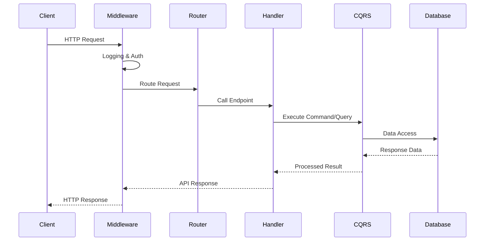
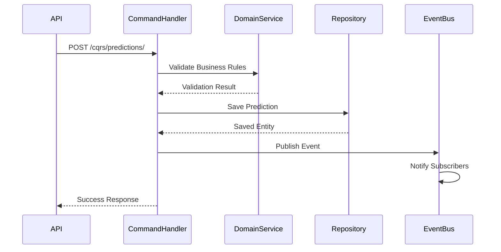

# API Layer - API层

## 🎯 概述

API层是足球预测系统的对外接口层，基于FastAPI框架构建，提供RESTful API接口。该层实现了CQRS模式，支持命令查询职责分离，提供了完整的预测、数据查询、健康检查和监控功能。

## 🏗️ 架构设计

### 核心设计原则
- **RESTful设计**: 遵循REST架构风格
- **CQRS模式**: 命令查询职责分离
- **异步处理**: 全面支持异步操作
- **统一响应格式**: 标准化的API响应模型
- **自动文档生成**: 基于OpenAPI的交互式文档

### 技术栈
- **FastAPI**: 现代高性能Web框架
- **Pydantic**: 数据验证和序列化
- **Uvicorn**: ASGI服务器
- **CORS**: 跨域资源共享支持
- **Middleware**: 请求处理中间件

## 📁 目录结构

```
src/api/
├── __init__.py              # API模块初始化
├── app.py                   # FastAPI主应用
├── schemas.py               # API响应模型定义
├── middleware.py            # 自定义中间件
├── decorators.py            # API装饰器
├── dependencies.py          # 依赖注入
├── cqrs.py                  # CQRS API端点
├── predictions.py           # 预测API路由
├── health.py                # 健康检查API
├── monitoring.py            # 监控指标API
├── auth.py                  # 认证授权
├── data_integration.py      # 数据集成API
├── data_router.py           # 数据路由
├── adapters/                # 适配器模式实现
│   └── router.py
├── betting_api.py           # 投注相关API
├── features.py              # 特征工程API
├── batch_analytics.py       # 批量分析API
├── realtime_streaming.py    # 实时流API
├── tenant_management.py     # 租户管理API
├── performance_management.py # 性能管理API
└── prometheus_metrics.py    # Prometheus指标
```

## 🎯 核心组件详解

### 1. FastAPI主应用 (Main Application)

#### 应用配置和启动
```python
from src.api.app import app

# FastAPI应用配置
app = FastAPI(
    title="Football Prediction API",
    description="足球预测系统API - 提供比赛预测、数据查询和统计分析功能",
    version="1.0.0",
    docs_url="/docs",           # Swagger UI
    redoc_url="/redoc",         # ReDoc
    openapi_url="/openapi.json" # OpenAPI规范
)

# 应用生命周期管理
@asynccontextmanager
async def lifespan(app: FastAPI):
    # 启动时初始化
    await init_prediction_engine()
    logger.info("服务启动完成")

    yield

    # 关闭时清理
    await close_prediction_engine()
    logger.info("服务已关闭")
```

#### 中间件配置
```python
# CORS中间件
app.add_middleware(
    CORSMiddleware,
    allow_origins=["*"],  # 生产环境应配置具体域名
    allow_credentials=True,
    allow_methods=["*"],
    allow_headers=["*"]
)

# Gzip压缩中间件
app.add_middleware(GZipMiddleware, minimum_size=1000)

# 请求日志中间件
app.add_middleware(RequestLoggingMiddleware)
```

### 2. API响应模型 (Response Schemas)

#### 统一响应格式
```python
from src.api.schemas import APIResponse, ErrorResponse

# 通用响应模型
class APIResponse(BaseModel):
    success: bool = Field(..., description="请求是否成功")
    message: str = Field(..., description="响应消息")
    data: Any | None = Field(None, description="响应数据")
    errors: list[str] | None = Field(None, description="错误信息列表")
    timestamp: str | None = Field(None, description="响应时间戳")

# 错误响应模型
class ErrorResponse(BaseModel):
    error: bool = Field(..., description="是否为错误")
    status_code: int = Field(..., description="HTTP状态码")
    message: str = Field(..., description="错误消息")
    path: str = Field(..., description="请求路径")
```

#### 健康检查响应
```python
from src.api.schemas import HealthCheckResponse, ServiceCheck

# 服务检查结果
class ServiceCheck(BaseModel):
    status: str = Field(..., description="服务状态")
    response_time_ms: float = Field(..., description="响应时间(毫秒)")
    details: dict[str, Any] | None = Field(None, description="详细信息")

# 健康检查响应
class HealthCheckResponse(BaseModel):
    status: str = Field(..., description="整体健康状态")
    timestamp: str = Field(..., description="检查时间")
    service: str = Field(..., description="服务名称")
    version: str = Field(..., description="服务版本")
    uptime: float = Field(..., description="应用运行时间(秒)")
    checks: dict[str, ServiceCheck] = Field(..., description="各服务检查结果")
```

### 3. 预测API (Prediction API)

#### 预测端点
```python
from src.api.predictions import router as predictions_router

# 获取比赛预测
GET /api/v1/predictions/{match_id}
# 响应示例
{
    "success": true,
    "data": {
        "match_id": 12345,
        "predicted_result": "home_win",
        "confidence": 0.85,
        "home_win_prob": 0.65,
        "draw_prob": 0.25,
        "away_win_prob": 0.10
    }
}

# 实时生成预测
POST /api/v1/predictions/{match_id}/predict
# 请求体
{
    "strategy": "ml_model",
    "features": ["home_form", "away_form", "head_to_head"]
}

# 批量预测
POST /api/v1/predictions/batch
# 请求体
{
    "match_ids": [12345, 12346, 12347],
    "strategy": "ensemble"
}
```

#### 预测历史查询
```python
# 获取预测历史
GET /api/v1/predictions/history/{match_id}
# 查询参数
?limit=10&offset=0&user_id=123

# 获取最近预测
GET /api/v1/predictions/recent
# 查询参数
?hours=24&limit=50

# 验证预测结果
POST /api/v1/predictions/{match_id}/verify
# 请求体
{
    "actual_result": "home_win",
    "actual_home_score": 2,
    "actual_away_score": 1
}
```

### 4. CQRS API端点

#### 命令端点 (Commands)
```python
from src.api.cqrs import router, PredictionCreateCommand

# 创建预测命令
POST /cqrs/predictions/
{
    "match_id": 12345,
    "user_id": 678,
    "predicted_home": 2,
    "predicted_away": 1,
    "confidence": 0.85,
    "strategy_used": "ml_model_v2",
    "notes": "基于历史数据分析"
}

# 响应
{
    "id": 987,
    "match_id": 12345,
    "user_id": 678,
    "predicted_home": 2,
    "predicted_away": 1,
    "confidence": 0.85,
    "strategy_used": "ml_model_v2",
    "notes": "基于历史数据分析",
    "created_at": "2025-01-15T10:30:00Z",
    "updated_at": "2025-01-15T10:30:00Z"
}
```

#### 查询端点 (Queries)
```python
# 获取单个预测
GET /cqrs/predictions/{prediction_id}

# 列出预测
GET /cqrs/predictions/?user_id=678&limit=10&offset=0

# 获取比赛信息
GET /cqrs/matches/{match_id}

# 列出比赛
GET /cqrs/matches/?date_from=2025-01-01&date_to=2025-01-31

# 获取用户信息
GET /cqrs/users/{user_id}

# 获取分析数据
GET /cqrs/analytics/?user_id=678&days=30
```

### 5. 健康检查API (Health Check API)

#### 基础健康检查
```python
from src.api.health import router as health_router

# 简单健康检查
GET /api/health
# 响应
{
    "status": "healthy",
    "timestamp": "2025-01-15T10:30:00Z",
    "service": "football-prediction-api"
}

# 详细健康检查
GET /api/v1/health/detailed
# 响应
{
    "status": "healthy",
    "timestamp": "2025-01-15T10:30:00Z",
    "service": "football-prediction-api",
    "version": "1.0.0",
    "uptime": 3600.5,
    "checks": {
        "database": {
            "status": "healthy",
            "response_time_ms": 15.2,
            "details": {
                "connection_pool": "8/10 active",
                "query_time_ms": 12.1
            }
        },
        "redis": {
            "status": "healthy",
            "response_time_ms": 2.3,
            "details": {
                "memory_usage": "45%",
                "connected_clients": 3
            }
        },
        "prediction_engine": {
            "status": "healthy",
            "response_time_ms": 125.8,
            "details": {
                "model_loaded": true,
                "cache_hit_rate": "78%"
            }
        }
    }
}
```

### 6. 监控指标API (Monitoring API)

#### 系统指标
```python
from src.api.monitoring import router as monitoring_router

# 获取系统指标
GET /api/v1/metrics
# 响应
{
    "status": "ok",
    "response_time_ms": 25.3,
    "system": {
        "cpu_usage": 45.2,
        "memory_usage": 67.8,
        "disk_usage": 23.1,
        "load_average": [1.2, 1.5, 1.8]
    },
    "database": {
        "connections": 8,
        "query_time_avg_ms": 15.6,
        "slow_queries": 2
    },
    "runtime": {
        "active_requests": 12,
        "total_requests": 15847,
        "error_rate": 0.02
    },
    "business": {
        "predictions_today": 234,
        "accuracy_rate": 0.73,
        "active_users": 45
    }
}

# Prometheus格式指标
GET /metrics
# 响应 (text/plain格式)
# HELP http_requests_total Total number of HTTP requests
# TYPE http_requests_total counter
http_requests_total{method="GET",endpoint="/api/health"} 1247
http_requests_total{method="POST",endpoint="/api/v1/predictions"} 523

# HELP request_duration_seconds Request duration in seconds
# TYPE request_duration_seconds histogram
request_duration_seconds_bucket{le="0.1"} 856
request_duration_seconds_bucket{le="0.5"} 1247
request_duration_seconds_bucket{le="1.0"} 1398
request_duration_seconds_bucket{le="+Inf"} 1421
```

### 7. 数据集成API (Data Integration API)

#### 外部数据源集成
```python
from src.api.data_integration import router as data_integration_router

# 同步比赛数据
POST /api/v1/data/sync/matches
# 请求体
{
    "source": "api_football",
    "date_range": {
        "from": "2025-01-15",
        "to": "2025-01-16"
    },
    "leagues": [39, 140, 78]
}

# 同步赔率数据
POST /api/v1/data/sync/odds
# 请求体
{
    "match_ids": [12345, 12346],
    "bookmakers": ["bet365", "william_hill"]
}

# 数据质量检查
GET /api/v1/data/quality/check
# 查询参数
?table=matches&date_from=2025-01-01

# 响应
{
    "table": "matches",
    "total_records": 1250,
    "valid_records": 1198,
    "invalid_records": 52,
    "quality_score": 0.958,
    "issues": [
        {
            "type": "missing_value",
            "field": "home_score",
            "count": 23
        },
        {
            "type": "invalid_format",
            "field": "match_date",
            "count": 29
        }
    ]
}
```

### 8. 认证授权 (Authentication & Authorization)

#### JWT认证
```python
from src.api.auth import router as auth_router

# 用户登录
POST /api/v1/auth/login
# 请求体
{
    "username": "user123",
    "password": "secure_password"
}

# 响应
{
    "access_token": "eyJ0eXAiOiJKV1QiLCJhbGciOiJIUzI1NiJ9...",
    "token_type": "bearer",
    "expires_in": 3600,
    "user": {
        "id": 678,
        "username": "user123",
        "email": "user@example.com"
    }
}

# 刷新令牌
POST /api/v1/auth/refresh
# 请求头
Authorization: Bearer <refresh_token>

# 用户注册
POST /api/v1/auth/register
# 请求体
{
    "username": "new_user",
    "email": "new_user@example.com",
    "password": "secure_password"
}
```

#### 权限控制
```python
# 受保护的端点
GET /api/v1/predictions/my
# 请求头
Authorization: Bearer <access_token>

# 权限检查
from src.api.auth_dependencies import get_current_user, require_permission

@router.get("/admin/stats")
async def get_admin_stats(
    current_user: User = Depends(get_current_user),
    _: None = Depends(require_permission("admin"))
):
    # 管理员统计逻辑
    pass
```

## 🔄 业务流程

### API请求处理流程


### CQRS命令处理流程


## 📋 使用指南

### 基础API使用
```python
import requests
import asyncio
from datetime import datetime

# API基础URL
BASE_URL = "http://localhost:8000"

# 1. 健康检查
def health_check():
    response = requests.get(f"{BASE_URL}/api/health")
    return response.json()

# 2. 获取比赛预测
def get_match_prediction(match_id: int):
    response = requests.get(f"{BASE_URL}/api/v1/predictions/{match_id}")
    if response.status_code == 200:
        return response.json()
    else:
        raise Exception(f"API Error: {response.status_code}")

# 3. 创建预测
def create_prediction(match_id: int, user_id: int, prediction_data: dict):
    url = f"{BASE_URL}/cqrs/predictions/"
    headers = {"Content-Type": "application/json"}
    response = requests.post(url, json=prediction_data, headers=headers)
    return response.json()

# 4. 批量预测
def batch_predict_matches(match_ids: list, strategy: str = "ml_model"):
    url = f"{BASE_URL}/api/v1/predictions/batch"
    payload = {
        "match_ids": match_ids,
        "strategy": strategy
    }
    response = requests.post(url, json=payload)
    return response.json()
```

### 异步API客户端
```python
import aiohttp
import asyncio

async def async_api_client():
    async with aiohttp.ClientSession() as session:
        # 获取多个比赛预测
        tasks = []
        match_ids = [12345, 12346, 12347]

        for match_id in match_ids:
            task = get_prediction_async(session, match_id)
            tasks.append(task)

        predictions = await asyncio.gather(*tasks)
        return predictions

async def get_prediction_async(session, match_id: int):
    url = f"http://localhost:8000/api/v1/predictions/{match_id}"
    async with session.get(url) as response:
        return await response.json()

# 使用示例
async def main():
    predictions = await async_api_client()
    for prediction in predictions:
        print(f"比赛 {prediction['data']['match_id']}: {prediction['data']['predicted_result']}")
```

### WebSocket实时数据
```python
import websockets
import asyncio
import json

async def listen_realtime_predictions():
    uri = "ws://localhost:8000/ws/predictions"

    async with websockets.connect(uri) as websocket:
        # 订阅特定比赛
        subscribe_msg = {
            "action": "subscribe",
            "match_ids": [12345, 12346]
        }
        await websocket.send(json.dumps(subscribe_msg))

        # 监听实时更新
        async for message in websocket:
            data = json.loads(message)
            print(f"实时预测更新: {data}")

# 运行WebSocket客户端
asyncio.run(listen_realtime_predictions())
```

## 🔧 设计模式应用

### 1. 路由模式 (Router Pattern)
- **APIRouter**: 模块化路由管理
- **Prefix & Tags**: 路由分组和文档组织
- **Dependency Injection**: 路由级依赖注入

### 2. 中间件模式 (Middleware Pattern)
- **RequestLogging**: 请求日志记录
- **Authentication**: 身份验证中间件
- **CORS**: 跨域资源共享
- **GZip**: 响应压缩

### 3. 依赖注入模式 (Dependency Injection)
- **FastAPI Depends**: 依赖注入装饰器
- **Service Locator**: 服务定位器模式
- **Factory Pattern**: 服务工厂创建

### 4. 适配器模式 (Adapter Pattern)
- **Data Adapters**: 数据源适配器
- **External APIs**: 第三方API适配
- **Protocol Buffers**: 数据格式适配

### 5. 观察者模式 (Observer Pattern)
- **WebSocket**: 实时数据推送
- **Event Handlers**: 事件处理器
- **Message Queue**: 消息队列集成

## 🧪 测试策略

### 单元测试
```python
import pytest
from fastapi.testclient import TestClient
from src.api.app import app

# 测试客户端
client = TestClient(app)

def test_health_check():
    """测试健康检查端点"""
    response = client.get("/api/health")
    assert response.status_code == 200
    data = response.json()
    assert data["status"] == "healthy"

def test_get_prediction():
    """测试获取预测"""
    response = client.get("/api/v1/predictions/12345")
    assert response.status_code == 200
    data = response.json()
    assert "data" in data
    assert "match_id" in data["data"]

def test_create_prediction():
    """测试创建预测"""
    payload = {
        "match_id": 12345,
        "user_id": 678,
        "predicted_home": 2,
        "predicted_away": 1,
        "confidence": 0.85,
        "strategy_used": "ml_model"
    }
    response = client.post("/cqrs/predictions/", json=payload)
    assert response.status_code == 200
    data = response.json()
    assert data["match_id"] == 12345
```

### 集成测试
```python
@pytest.mark.asyncio
async def test_prediction_workflow():
    """测试完整预测工作流"""
    # 1. 创建预测
    payload = {...}
    response = client.post("/cqrs/predictions/", json=payload)
    prediction_id = response.json()["id"]

    # 2. 获取预测
    response = client.get(f"/cqrs/predictions/{prediction_id}")
    assert response.status_code == 200

    # 3. 验证预测
    verify_payload = {
        "actual_result": "home_win",
        "actual_home_score": 2,
        "actual_away_score": 1
    }
    response = client.post(f"/api/v1/predictions/{payload['match_id']}/verify",
                          json=verify_payload)
    assert response.status_code == 200

@pytest.mark.asyncio
async def test_api_performance():
    """测试API性能"""
    import time

    start_time = time.time()
    response = client.get("/api/v1/predictions/12345")
    end_time = time.time()

    assert response.status_code == 200
    assert end_time - start_time < 1.0  # 响应时间小于1秒
```

## 📈 性能优化

### 1. 异步处理
- **Async/Await**: 全面的异步支持
- **Concurrency**: 并发请求处理
- **Background Tasks**: 后台任务处理

### 2. 缓存策略
- **Response Caching**: 响应缓存
- **Database Query Cache**: 查询结果缓存
- **Redis Integration**: Redis分布式缓存

### 3. 连接池管理
- **Database Pool**: 数据库连接池
- **HTTP Connection Pool**: HTTP连接复用
- **Resource Management**: 资源自动回收

### 4. 压缩和优化
- **Gzip Compression**: 响应数据压缩
- **JSON Serialization**: 高效JSON序列化
- **Static File Serving**: 静态文件优化

## 🔮 扩展指南

### 添加新的API端点
1. 在相应模块中创建路由器
2. 定义请求/响应模型
3. 实现端点处理逻辑
4. 添加认证和权限控制
5. 编写API测试

### 集成外部服务
1. 创建适配器类
2. 实现错误处理和重试
3. 添加监控和日志
4. 编写集成测试

### 实现实时功能
1. 配置WebSocket端点
2. 实现消息广播
3. 添加连接管理
4. 处理连接异常

### API版本管理
1. 使用URL路径版本控制
2. 实现向后兼容性
3. 版本废弃策略
4. 文档版本同步

## 📚 相关文档

- [领域层架构指南](../domain/README.md)
- [CQRS模式实现指南](../cqrs/README.md)
- [事件驱动架构说明](../events/README.md)
- [核心组件使用指南](../core/README.md)
- [测试最佳实践](../../docs/testing/TESTING_GUIDE.md)

---

*最后更新: 2025-11-07*
*维护者: API Team*
