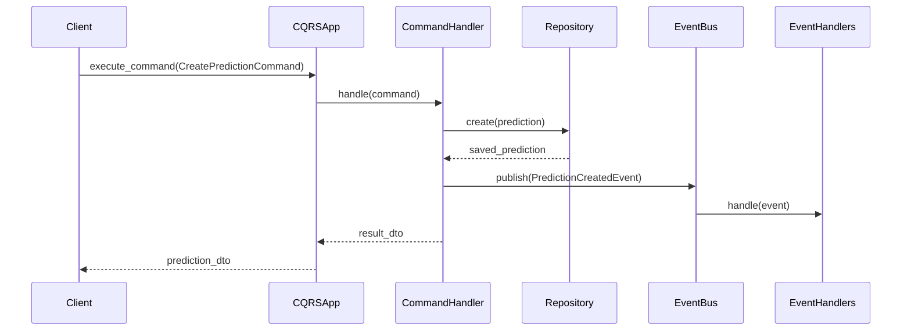
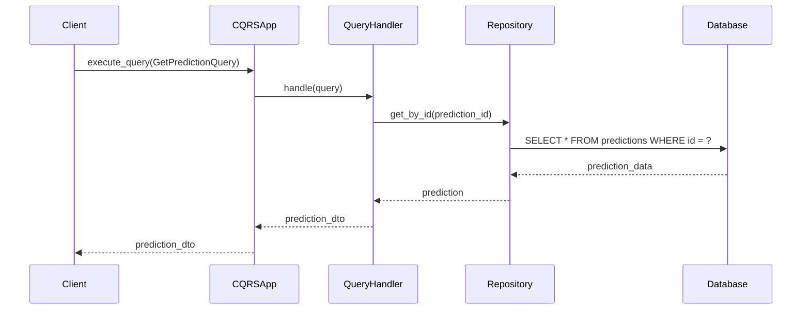

# CQRS - 命令查询职责分离

## 🎯 概述

CQRS (Command Query Responsibility Segregation) 是一种架构模式，它将系统的**写操作(Commands)**和**读操作(Queries)**分离到不同的模型中。这种模式提高了系统的可扩展性、性能和可维护性。

## 🏗️ 架构设计

### 核心概念
- **命令(Commands)**: 改变系统状态的写操作
- **查询(Queries)**: 读取系统状态的操作，不改变状态
- **处理器(Handlers)**: 处理命令和查询的业务逻辑
- **事件总线(Event Bus)**: 处理命令发布的事件通知
- **数据传输对象(DTOs)**: 在命令和查询中传输数据

### 架构优势
- **读写分离**: 读模型和写模型可以独立优化
- **性能优化**: 针对读写场景分别优化数据访问
- **可扩展性**: 读写操作可以独立扩展
- **业务逻辑清晰**: 命令和查询职责明确分离

## 📁 目录结构

```
src/cqrs/
├── __init__.py              # CQRS模块初始化
├── base.py                  # 基础接口定义
├── application.py           # CQRS应用程序
├── bus.py                   # 事件总线实现
├── dto.py                   # 数据传输对象
├── router.py                # CQRS路由配置
├── commands.py              # 命令定义
├── queries.py               # 查询定义
└── handlers.py              # 命令和查询处理器
```

## 🎯 核心组件详解

### 1. 基础接口 (Base Interfaces)

#### 命令接口
```python
@dataclass
class Command:
    """命令基类"""
    command_id: str
    timestamp: datetime
    user_id: Optional[str] = None

class ValidatableCommand(Command):
    """可验证的命令基类"""

    def validate(self) -> ValidationResult:
        """验证命令数据"""
        raise NotImplementedError

@dataclass
class ValidationResult:
    """验证结果"""
    is_valid: bool
    errors: List[str] = field(default_factory=list)
```

#### 查询接口
```python
@dataclass
class Query:
    """查询基类"""
    query_id: str
    timestamp: datetime

class GenericQuery(Generic[QueryResultType], Query):
    """泛型查询基类"""
    pass
```

### 2. 命令定义 (Commands)

#### 预测命令
```python
class CreatePredictionCommand(ValidatableCommand):
    """创建预测命令"""

    def __init__(self, match_id: int, prediction_data: dict, user_id: str = None):
        super().__init__(
            command_id=str(uuid.uuid4()),
            timestamp=datetime.now(),
            user_id=user_id
        )
        self.match_id = match_id
        self.prediction_data = prediction_data

    def validate(self) -> ValidationResult:
        """验证创建预测命令"""
        errors = []

        if not self.match_id or self.match_id <= 0:
            errors.append("比赛ID必须大于0")

        if not self.prediction_data:
            errors.append("预测数据不能为空")

        return ValidationResult(is_valid=len(errors) == 0, errors=errors)

class UpdatePredictionCommand(ValidatableCommand):
    """更新预测命令"""

    def __init__(self, prediction_id: int, update_data: dict, user_id: str = None):
        super().__init__(
            command_id=str(uuid.uuid4()),
            timestamp=datetime.now(),
            user_id=user_id
        )
        self.prediction_id = prediction_id
        self.update_data = update_data

    def validate(self) -> ValidationResult:
        """验证更新预测命令"""
        errors = []

        if not self.prediction_id or self.prediction_id <= 0:
            errors.append("预测ID必须大于0")

        if not self.update_data:
            errors.append("更新数据不能为空")

        return ValidationResult(is_valid=len(errors) == 0, errors=errors)
```

### 3. 查询定义 (Queries)

#### 预测查询
```python
class GetPredictionQuery(GenericQuery[PredictionDTO]):
    """获取预测查询"""

    def __init__(self, prediction_id: int):
        super().__init__(
            query_id=str(uuid.uuid4()),
            timestamp=datetime.now()
        )
        self.prediction_id = prediction_id

class GetPredictionsByMatchQuery(GenericQuery[List[PredictionDTO]]):
    """获取比赛的所有预测查询"""

    def __init__(self, match_id: int, limit: int = 100, offset: int = 0):
        super().__init__(
            query_id=str(uuid.uuid4()),
            timestamp=datetime.now()
        )
        self.match_id = match_id
        self.limit = limit
        self.offset = offset

class GetPredictionsByUserQuery(GenericQuery[List[PredictionDTO]]):
    """获取用户的所有预测查询"""

    def __init__(self, user_id: str, limit: int = 100, offset: int = 0):
        super().__init__(
            query_id=str(uuid.uuid4()),
            timestamp=datetime.now()
        )
        self.user_id = user_id
        self.limit = limit
        self.offset = offset
```

### 4. 数据传输对象 (DTOs)

#### 预测DTO
```python
@dataclass
class PredictionDTO:
    """预测数据传输对象"""
    prediction_id: int
    match_id: int
    user_id: str
    predicted_result: str
    home_win_prob: float
    draw_prob: float
    away_win_prob: float
    confidence: float
    created_at: datetime
    updated_at: datetime
    status: str

@dataclass
class MatchDTO:
    """比赛数据传输对象"""
    match_id: int
    home_team_id: int
    away_team_id: int
    home_team_name: str
    away_team_name: str
    home_score: Optional[int]
    away_score: Optional[int]
    match_date: datetime
    status: str
    league_id: int

@dataclass
class UserDTO:
    """用户数据传输对象"""
    user_id: str
    username: str
    email: str
    created_at: datetime
    last_login: Optional[datetime]
```

### 5. 处理器 (Handlers)

#### 命令处理器
```python
class CreatePredictionHandler:
    """创建预测处理器"""

    def __init__(self, prediction_repository, event_bus):
        self.prediction_repository = prediction_repository
        self.event_bus = event_bus

    async def handle(self, command: CreatePredictionCommand) -> PredictionDTO:
        """处理创建预测命令"""
        # 验证命令
        validation = command.validate()
        if not validation.is_valid:
            raise ValueError(f"命令验证失败: {validation.errors}")

        # 创建预测实体
        prediction = Prediction(
            match_id=command.match_id,
            user_id=command.user_id,
            predicted_result=command.prediction_data["result"],
            home_win_prob=command.prediction_data.get("home_win_prob", 0.0),
            draw_prob=command.prediction_data.get("draw_prob", 0.0),
            away_win_prob=command.prediction_data.get("away_win_prob", 0.0),
            confidence=command.prediction_data.get("confidence", 0.0)
        )

        # 保存预测
        saved_prediction = await self.prediction_repository.create(prediction)

        # 发布事件
        event = PredictionCreatedEvent(
            prediction_id=saved_prediction.id,
            match_id=command.match_id,
            user_id=command.user_id,
            timestamp=datetime.now()
        )
        await self.event_bus.publish(event)

        # 返回DTO
        return PredictionDTO.from_entity(saved_prediction)

class UpdatePredictionHandler:
    """更新预测处理器"""

    def __init__(self, prediction_repository, event_bus):
        self.prediction_repository = prediction_repository
        self.event_bus = event_bus

    async def handle(self, command: UpdatePredictionCommand) -> PredictionDTO:
        """处理更新预测命令"""
        # 验证命令
        validation = command.validate()
        if not validation.is_valid:
            raise ValueError(f"命令验证失败: {validation.errors}")

        # 获取现有预测
        existing_prediction = await self.prediction_repository.get_by_id(
            command.prediction_id
        )
        if not existing_prediction:
            raise ValueError(f"预测不存在: {command.prediction_id}")

        # 更新预测
        for key, value in command.update_data.items():
            if hasattr(existing_prediction, key):
                setattr(existing_prediction, key, value)

        # 保存更新
        updated_prediction = await self.prediction_repository.update(existing_prediction)

        # 发布事件
        event = PredictionUpdatedEvent(
            prediction_id=updated_prediction.id,
            user_id=command.user_id,
            timestamp=datetime.now()
        )
        await self.event_bus.publish(event)

        return PredictionDTO.from_entity(updated_prediction)
```

#### 查询处理器
```python
class GetPredictionHandler:
    """获取预测处理器"""

    def __init__(self, prediction_repository):
        self.prediction_repository = prediction_repository

    async def handle(self, query: GetPredictionQuery) -> Optional[PredictionDTO]:
        """处理获取预测查询"""
        prediction = await self.prediction_repository.get_by_id(query.prediction_id)
        if prediction:
            return PredictionDTO.from_entity(prediction)
        return None

class GetPredictionsByMatchHandler:
    """获取比赛预测处理器"""

    def __init__(self, prediction_repository):
        self.prediction_repository = prediction_repository

    async def handle(self, query: GetPredictionsByMatchQuery) -> List[PredictionDTO]:
        """处理获取比赛预测查询"""
        predictions = await self.prediction_repository.get_by_match_id(
            query.match_id,
            limit=query.limit,
            offset=query.offset
        )
        return [PredictionDTO.from_entity(p) for p in predictions]

class GetPredictionsByUserHandler:
    """获取用户预测处理器"""

    def __init__(self, prediction_repository):
        self.prediction_repository = prediction_repository

    async def handle(self, query: GetPredictionsByUserQuery) -> List[PredictionDTO]:
        """处理获取用户预测查询"""
        predictions = await self.prediction_repository.get_by_user_id(
            query.user_id,
            limit=query.limit,
            offset=query.offset
        )
        return [PredictionDTO.from_entity(p) for p in predictions]
```

### 6. CQRS应用程序

#### 应用程序入口
```python
class CQRSApplication:
    """CQRS应用程序"""

    def __init__(self):
        self.command_handlers = {}
        self.query_handlers = {}
        self._register_handlers()

    def _register_handlers(self):
        """注册处理器"""
        # 注册命令处理器
        self.command_handlers[CreatePredictionCommand] = CreatePredictionHandler(
            prediction_repository=self._get_prediction_repository(),
            event_bus=self._get_event_bus()
        )
        self.command_handlers[UpdatePredictionCommand] = UpdatePredictionHandler(
            prediction_repository=self._get_prediction_repository(),
            event_bus=self._get_event_bus()
        )

        # 注册查询处理器
        self.query_handlers[GetPredictionQuery] = GetPredictionHandler(
            prediction_repository=self._get_prediction_repository()
        )
        self.query_handlers[GetPredictionsByMatchQuery] = GetPredictionsByMatchHandler(
            prediction_repository=self._get_prediction_repository()
        )
        self.query_handlers[GetPredictionsByUserQuery] = GetPredictionsByUserHandler(
            prediction_repository=self._get_prediction_repository()
        )

    async def execute_command(self, command: Command) -> Any:
        """执行命令"""
        handler_class = self.command_handlers.get(type(command))
        if not handler_class:
            raise ValueError(f"未找到命令处理器: {type(command)}")

        handler = handler_class()
        return await handler.handle(command)

    async def execute_query(self, query: Query) -> Any:
        """执行查询"""
        handler_class = self.query_handlers.get(type(query))
        if not handler_class:
            raise ValueError(f"未找到查询处理器: {type(query)}")

        handler = handler_class()
        return await handler.handle(query)
```

## 🔄 业务流程

### 命令执行流程


### 查询执行流程


## 📋 使用指南

### 执行命令
```python
from src.cqrs.application import CQRSApplication
from src.cqrs.commands import CreatePredictionCommand

# 初始化CQRS应用
cqrs_app = CQRSApplication()

# 创建预测命令
command = CreatePredictionCommand(
    match_id=123,
    prediction_data={
        "result": "home_win",
        "home_win_prob": 0.65,
        "draw_prob": 0.25,
        "away_win_prob": 0.10,
        "confidence": 0.85
    },
    user_id="user_123"
)

# 执行命令
prediction_dto = await cqrs_app.execute_command(command)
print(f"创建预测成功: {prediction_dto.prediction_id}")
```

### 执行查询
```python
from src.cqrs.application import CQRSApplication
from src.cqrs.queries import GetPredictionQuery, GetPredictionsByMatchQuery

# 初始化CQRS应用
cqrs_app = CQRSApplication()

# 获取单个预测
query = GetPredictionQuery(prediction_id=456)
prediction_dto = await cqrs_app.execute_query(query)

# 获取比赛的所有预测
query = GetPredictionsByMatchQuery(
    match_id=123,
    limit=50,
    offset=0
)
predictions_dto = await cqrs_app.execute_query(query)

print(f"找到 {len(predictions_dto)} 个预测")
```

### FastAPI集成
```python
from fastapi import APIRouter, Depends
from src.cqrs.application import CQRSApplication
from src.cqrs.commands import CreatePredictionCommand
from src.cqrs.queries import GetPredictionQuery

router = APIRouter(prefix="/cqrs", tags=["CQRS"])

@router.post("/predictions", response_model=PredictionDTO)
async def create_prediction(
    command: CreatePredictionCommand,
    cqrs_app: CQRSApplication = Depends(get_cqrs_app)
):
    """创建预测"""
    return await cqrs_app.execute_command(command)

@router.get("/predictions/{prediction_id}", response_model=PredictionDTO)
async def get_prediction(
    prediction_id: int,
    cqrs_app: CQRSApplication = Depends(get_cqrs_app)
):
    """获取预测"""
    query = GetPredictionQuery(prediction_id=prediction_id)
    prediction = await cqrs_app.execute_query(query)
    if not prediction:
        raise HTTPException(status_code=404, detail="预测不存在")
    return prediction
```

## 🔧 设计模式应用

### 1. 命令模式 (Command Pattern)
- **Command**: 封装操作请求为对象
- **Handler**: 处理特定类型的命令
- 支持命令的序列化和持久化

### 2. 处理器模式 (Handler Pattern)
- **Handler**: 处理特定类型的命令或查询
- **Dispatcher**: 路由命令/查询到合适的处理器
- 支持异步处理

### 3. 仓储模式 (Repository Pattern)
- **Repository**: 封装数据访问逻辑
- **写仓储**: 处理命令相关的数据操作
- **读仓储**: 处理查询相关的数据操作

### 4. 事件驱动架构 (Event-Driven Architecture)
- **EventBus**: 发布和处理领域事件
- **EventHandler**: 处理特定的领域事件
- 支持异步事件处理

## 🧪 测试策略

### 命令处理器测试
```python
import pytest
from unittest.mock import AsyncMock, patch

@pytest.mark.asyncio
async def test_create_prediction_handler():
    # 准备
    mock_repository = AsyncMock()
    mock_event_bus = AsyncMock()
    handler = CreatePredictionHandler(mock_repository, mock_event_bus)

    # 创建测试数据
    command = CreatePredictionCommand(
        match_id=123,
        prediction_data={"result": "home_win"},
        user_id="user_123"
    )

    # 模拟仓储返回
    mock_prediction = Prediction(id=1, match_id=123, user_id="user_123")
    mock_repository.create.return_value = mock_prediction

    # 执行
    result = await handler.handle(command)

    # 验证
    assert result is not None
    assert result.match_id == 123
    mock_repository.create.assert_called_once()
    mock_event_bus.publish.assert_called_once()
```

### 查询处理器测试
```python
@pytest.mark.asyncio
async def test_get_prediction_handler():
    # 准备
    mock_repository = AsyncMock()
    handler = GetPredictionHandler(mock_repository)

    # 创建测试查询
    query = GetPredictionQuery(prediction_id=123)

    # 模拟仓储返回
    mock_prediction = Prediction(id=123, match_id=456)
    mock_repository.get_by_id.return_value = mock_prediction

    # 执行
    result = await handler.handle(query)

    # 验证
    assert result is not None
    assert result.prediction_id == 123
    mock_repository.get_by_id.assert_called_once_with(123)
```

### CQRS应用集成测试
```python
@pytest.mark.asyncio
async def test_cqrs_application():
    # 准备
    cqrs_app = CQRSApplication()

    # 测试命令执行
    command = CreatePredictionCommand(
        match_id=123,
        prediction_data={"result": "home_win"},
        user_id="user_123"
    )

    with patch('src.cqrs.handlers.CreatePredictionHandler') as mock_handler:
        mock_instance = AsyncMock()
        mock_handler.return_value = mock_instance
        mock_instance.handle.return_value = PredictionDTO(
            prediction_id=1,
            match_id=123,
            user_id="user_123",
            predicted_result="home_win"
        )

        result = await cqrs_app.execute_command(command)

        assert result is not None
        assert result.match_id == 123
        mock_instance.handle.assert_called_once_with(command)
```

## 📈 性能优化

### 1. 异步处理
- 所有命令和查询处理器都支持异步处理
- 使用异步数据库操作提高并发性能
- 事件发布采用异步模式

### 2. 批量操作
- 支持批量命令处理
- 查询结果缓存机制
- 数据库批量操作优化

### 3. 读写分离优化
- 读模型可以使用专门的读数据库
- 写模型可以进行写优化
- 支持不同的数据访问策略

## 🔮 扩展指南

### 添加新的命令
1. 在 `commands.py` 中定义新的命令类
2. 继承 `ValidatableCommand` 基类
3. 实现 `validate()` 方法
4. 在 `handlers.py` 中创建对应的处理器
5. 在 `CQRSApplication` 中注册处理器

### 添加新的查询
1. 在 `queries.py` 中定义新的查询类
2. 继承 `GenericQuery` 基类
3. 在 `handlers.py` 中创建对应的处理器
4. 在 `CQRSApplication` 中注册处理器

### 添加新的DTO
1. 在 `dto.py` 中定义新的数据传输对象
2. 使用 `@dataclass` 装饰器
3. 实现与实体对象的转换方法

### 集成新的事件处理器
1. 创建新的事件处理器类
2. 实现事件处理方法
3. 在事件总线中注册处理器
4. 编写事件处理测试

## 📚 相关文档

- [领域层架构指南](../domain/README.md)
- [事件驱动架构说明](../events/README.md)
- [API设计原则](../api/README.md)
- [测试最佳实践](../../docs/testing/TESTING_GUIDE.md)

---

*最后更新: 2025-11-07*
*维护者: CQRS Team*
