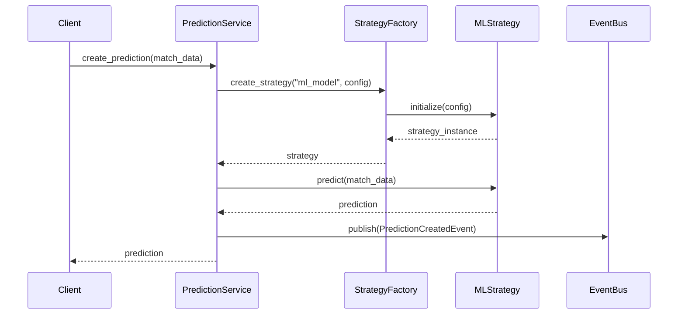

# Domain Layer - 领域层

## 🎯 概述

领域层(Domain Layer)是足球预测系统的核心，实现了**领域驱动设计(DDD)**架构模式。它包含业务逻辑、实体、值对象、领域服务和领域事件，确保业务规则的封装和业务概念的清晰表达。

## 🏗️ 架构设计

### 核心设计原则
- **领域驱动设计(DDD)**: 以业务领域为中心的设计方法
- **富领域模型**: 包含业务行为和规则的领域对象
- **领域服务**: 协调多个领域对象的业务操作
- **事件驱动**: 通过领域事件实现松耦合的架构
- **策略模式**: 封装可预测算法，支持策略切换

## 📁 目录结构

```
src/domain/
├── entities.py              # 领域实体
├── models/                  # 领域模型
│   ├── __init__.py
│   ├── match.py             # 比赛实体
│   ├── team.py              # 队伍实体
│   ├── league.py            # 联赛实体
│   └── prediction.py        # 预测实体
├── services/                # 领域服务
│   ├── __init__.py
│   ├── match_service.py     # 比赛业务服务
│   ├── team_service.py      # 队伍业务服务
│   ├── scoring_service.py   # 评分服务
│   └── prediction_service.py # 预测业务服务
├── strategies/              # 预测策略
│   ├── __init__.py
│   ├── base.py              # 策略基类
│   ├── factory.py           # 策略工厂
│   ├── statistical.py       # 统计策略
│   ├── historical.py        # 历史策略
│   ├── ml_model.py          # 机器学习策略
│   └── ensemble.py          # 集成策略
└── events/                  # 领域事件
    ├── __init__.py
    ├── base.py              # 事件基类
    ├── prediction_events.py # 预测相关事件
    └── match_events.py      # 比赛相关事件
```

## 🎯 核心组件详解

### 1. 领域实体 (Entities)

#### 比赛实体 (Match)
```python
class MatchStatus(Enum):
    SCHEDULED = "SCHEDULED"
    LIVE = "LIVE"
    FINISHED = "FINISHED"
    POSTPONED = "POSTPONED"
    CANCELLED = "CANCELLED"

@dataclass
class Match:
    match_id: int
    home_team_id: int
    away_team_id: int
    home_score: int
    away_score: int
    match_date: datetime
    status: MatchStatus
    league_id: int
```

#### 队伍实体 (Team)
```python
@dataclass
class Team:
    team_id: int
    name: str
    country: str
    founded_year: int
    stadium: str
```

### 2. 领域服务 (Domain Services)

#### 比赛服务 (MatchService)
```python
class MatchService:
    """比赛业务逻辑服务"""

    def calculate_match_result(self, match: Match) -> str:
        """计算比赛结果"""
        if match.home_score > match.away_score:
            return "home_win"
        elif match.away_score > match.home_score:
            return "away_win"
        else:
            return "draw"

    def is_match_finished(self, match: Match) -> bool:
        """检查比赛是否结束"""
        return match.status == MatchStatus.FINISHED
```

#### 预测服务 (PredictionService)
```python
class PredictionService:
    """预测业务逻辑服务"""

    def create_prediction(self, match_data: dict, strategy) -> Prediction:
        """创建预测"""
        # 业务逻辑验证
        self._validate_prediction_data(match_data)

        # 使用策略创建预测
        return strategy.predict(match_data)

    def calculate_prediction_confidence(self, prediction: Prediction) -> float:
        """计算预测置信度"""
        # 基于历史数据和模型准确性计算置信度
        pass
```

### 3. 预测策略 (Prediction Strategies)

#### 策略工厂模式
```python
class PredictionStrategyFactory:
    """预测策略工厂"""

    def __strategies = {
        "statistical": StatisticalStrategy,
        "historical": HistoricalStrategy,
        "ml_model": MLModelStrategy,
        "ensemble": EnsembleStrategy
    }

    async def create_strategy(self, strategy_type: str, config: dict) -> PredictionStrategy:
        """创建预测策略实例"""
        if strategy_type not in self.__strategies:
            raise ValueError(f"Unknown strategy type: {strategy_type}")

        strategy_class = self.__strategies[strategy_type]
        return await strategy_class.create(config)
```

#### 策略基类
```python
class PredictionStrategy(ABC):
    """预测策略抽象基类"""

    @abstractmethod
    async def predict(self, match_data: dict) -> Prediction:
        """执行预测"""
        pass

    @abstractmethod
    def validate_config(self, config: dict) -> bool:
        """验证配置"""
        pass
```

### 4. 领域事件 (Domain Events)

#### 事件基类
```python
class DomainEvent(ABC):
    """领域事件基类"""

    def __init__(self, event_id: str, timestamp: datetime, aggregate_id: str):
        self.event_id = event_id
        self.timestamp = timestamp
        self.aggregate_id = aggregate_id
        self.version = 1
```

#### 预测事件
```python
class PredictionCreatedEvent(DomainEvent):
    """预测创建事件"""

    def __init__(self, event_id: str, timestamp: datetime, prediction_id: str,
                 prediction_data: dict):
        super().__init__(event_id, timestamp, prediction_id)
        self.prediction_data = prediction_data

class PredictionUpdatedEvent(DomainEvent):
    """预测更新事件"""

    def __init__(self, event_id: str, timestamp: datetime, prediction_id: str,
                 old_data: dict, new_data: dict):
        super().__init__(event_id, timestamp, prediction_id)
        self.old_data = old_data
        self.new_data = new_data
```

## 🔄 业务流程

### 预测创建流程


## 📋 使用指南

### 创建预测
```python
from src.domain.services.prediction_service import PredictionService
from src.domain.strategies.factory import PredictionStrategyFactory

# 初始化服务和策略
prediction_service = PredictionService()
strategy_factory = PredictionStrategyFactory()

# 创建预测策略
strategy = await strategy_factory.create_strategy("ml_model", {
    "model_path": "/path/to/model.pkl",
    "features": ["home_form", "away_form", "head_to_head"]
})

# 执行预测
prediction = prediction_service.create_prediction(match_data, strategy)
```

### 处理领域事件
```python
from src.domain.events.prediction_events import PredictionCreatedEvent

# 发布事件
event = PredictionCreatedEvent(
    event_id="pred_123",
    timestamp=datetime.now(),
    prediction_id=prediction.id,
    prediction_data={"match_id": 456, "predicted_result": "home_win"}
)

await event_bus.publish(event)
```

## 🔧 设计模式应用

### 1. 工厂模式 (Factory Pattern)
- **PredictionStrategyFactory**: 动态创建预测策略
- 支持策略的配置化创建
- 便于扩展新的预测算法

### 2. 策略模式 (Strategy Pattern)
- **PredictionStrategy**: 封装不同的预测算法
- 支持运行时策略切换
- 便于A/B测试和算法比较

### 3. 事件驱动架构 (Event-Driven Architecture)
- **DomainEvent**: 解耦业务组件
- 支持异步事件处理
- 便于实现最终一致性

### 4. 依赖注入 (Dependency Injection)
- 通过构造函数注入依赖
- 便于单元测试和模块替换
- 支持配置驱动的组件组装

## 🧪 测试策略

### 单元测试
```python
# 测试领域实体
def test_match_creation():
    match = Match(
        match_id=1,
        home_team_id=10,
        away_team_id=20,
        home_score=2,
        away_score=1,
        match_date=datetime.now(),
        status=MatchStatus.FINISHED,
        league_id=39
    )
    assert match.home_team_id == 10

# 测试领域服务
def test_match_service_calculate_result():
    service = MatchService()
    match = create_test_match(home_score=2, away_score=1)
    result = service.calculate_match_result(match)
    assert result == "home_win"
```

### 集成测试
```python
def test_prediction_workflow():
    # 集成测试预测完整流程
    factory = PredictionStrategyFactory()
    service = PredictionService()

    strategy = await factory.create_strategy("statistical", {})
    prediction = service.create_prediction(test_match_data, strategy)

    assert prediction is not None
    assert prediction.predicted_result in ["home_win", "away_win", "draw"]
```

## 📈 性能优化

### 1. 策略缓存
- 策略实例缓存，避免重复创建
- 配置信息缓存，减少配置读取开销

### 2. 批量处理
- 支持批量预测，提高吞吐量
- 异步策略执行，充分利用并发

### 3. 事件处理优化
- 事件异步发布，避免阻塞主流程
- 事件批处理，减少I/O开销

## 🔮 扩展指南

### 添加新的预测策略
1. 继承 `PredictionStrategy` 基类
2. 实现 `predict()` 和 `validate_config()` 方法
3. 在 `PredictionStrategyFactory` 中注册新策略
4. 编写相应的单元测试

### 添加新的领域事件
1. 继承 `DomainEvent` 基类
2. 定义事件数据结构
3. 实现事件处理器
4. 更新事件发布逻辑

### 添加新的领域服务
1. 在 `services/` 目录下创建服务文件
2. 实现业务逻辑方法
3. 编写服务测试
4. 更新依赖注入配置

## 📚 相关文档

- [CQRS模式实现指南](../cqrs/README.md)
- [事件驱动架构说明](../events/README.md)
- [API设计原则](../api/README.md)
- [测试最佳实践](../../docs/testing/TESTING_GUIDE.md)

---

*最后更新: 2025-11-07*
*维护者: Domain Team*
