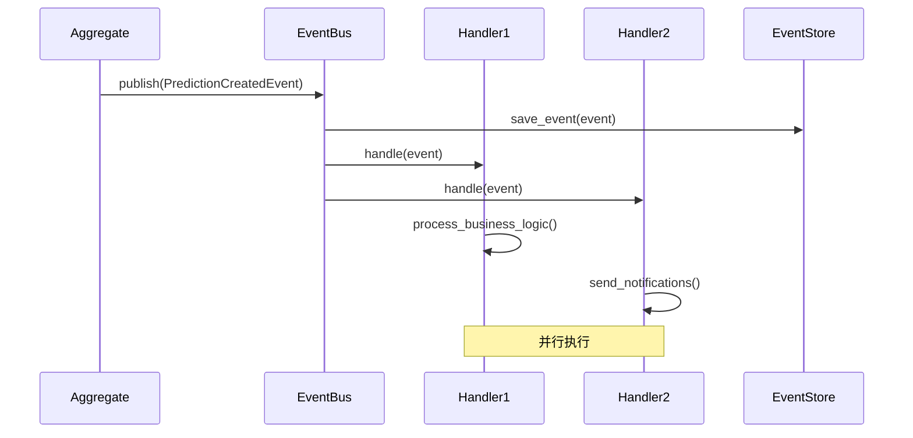
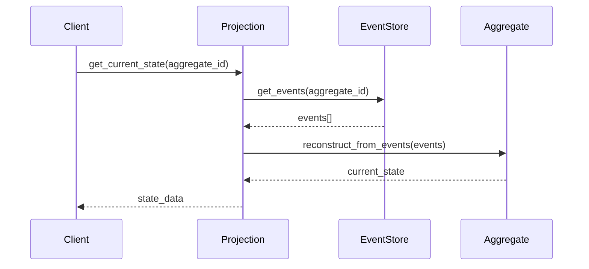

# Event-Driven Architecture - 事件驱动架构

## 🎯 概述

事件驱动架构(Event-Driven Architecture, EDA)是一种分布式系统架构模式，通过事件的产生、检测、消费和反应来驱动系统行为。在足球预测系统中，EDA实现了组件间的松耦合，提高了系统的可扩展性和可维护性。

## 🏗️ 架构设计

### 核心概念
- **事件(Events)**: 系统中发生的重要业务事实
- **事件总线(Event Bus)**: 事件的传输和路由机制
- **事件处理器(Event Handlers)**: 处理特定事件的业务逻辑
- **事件存储(Event Store)**: 持久化存储事件历史
- **事件溯源(Event Sourcing)**: 通过事件重建状态的模式

### 架构优势
- **松耦合**: 组件间通过事件通信，减少直接依赖
- **可扩展性**: 支持异步处理和水平扩展
- **可靠性**: 事件持久化确保数据不丢失
- **可审计性**: 完整的事件历史记录
- **实时性**: 事件的实时通知和处理

## 📁 目录结构

```
src/events/
├── __init__.py              # 事件模块初始化
├── base.py                  # 事件基类和接口定义
├── bus.py                   # 事件总线实现
├── handlers.py              # 事件处理器集合
├── store.py                 # 事件存储管理
├── dispatcher.py            # 事件分发器
├── projection.py            # 事件投影
├── domain/                  # 领域事件
│   ├── __init__.py
│   ├── prediction_events.py # 预测相关事件
│   ├── match_events.py      # 比赛相关事件
│   └── user_events.py       # 用户相关事件
├── integration/             # 集成事件
│   ├── __init__.py
│   ├── notification_events.py # 通知事件
│   └── analytics_events.py    # 分析事件
└── infrastructure/          # 基础设施事件
    ├── __init__.py
    ├── system_events.py     # 系统事件
    └── monitoring_events.py # 监控事件
```

## 🎯 核心组件详解

### 1. 事件基类 (Base Events)

#### 领域事件基类
```python
from abc import ABC, abstractmethod
from dataclasses import dataclass, field
from datetime import datetime
from typing import Dict, Any, Optional
from uuid import uuid4

@dataclass
class DomainEvent(ABC):
    """领域事件基类"""
    event_id: str = field(default_factory=lambda: str(uuid4()))
    timestamp: datetime = field(default_factory=datetime.now)
    aggregate_id: str = ""
    aggregate_type: str = ""
    version: int = 1
    metadata: Dict[str, Any] = field(default_factory=dict)

    @abstractmethod
    def get_event_type(self) -> str:
        """获取事件类型"""
        pass

    def to_dict(self) -> Dict[str, Any]:
        """转换为字典"""
        return {
            "event_id": self.event_id,
            "event_type": self.get_event_type(),
            "timestamp": self.timestamp.isoformat(),
            "aggregate_id": self.aggregate_id,
            "aggregate_type": self.aggregate_type,
            "version": self.version,
            "metadata": self.metadata
        }
```

#### 集成事件基类
```python
@dataclass
class IntegrationEvent(DomainEvent):
    """集成事件基类"""
    correlation_id: str = ""
    causation_id: str = ""
    source_service: str = ""
    destination_services: List[str] = field(default_factory=list)

    def __post_init__(self):
        if not self.correlation_id:
            self.correlation_id = self.event_id
```

### 2. 领域事件 (Domain Events)

#### 预测事件
```python
@dataclass
class PredictionCreatedEvent(DomainEvent):
    """预测创建事件"""
    prediction_id: int = 0
    match_id: int = 0
    user_id: str = ""
    predicted_result: str = ""
    confidence: float = 0.0

    def get_event_type(self) -> str:
        return "PredictionCreated"

    def __post_init__(self):
        self.aggregate_id = str(self.prediction_id)
        self.aggregate_type = "Prediction"
        self.metadata.update({
            "match_id": self.match_id,
            "user_id": self.user_id,
            "predicted_result": self.predicted_result,
            "confidence": self.confidence
        })

@dataclass
class PredictionUpdatedEvent(DomainEvent):
    """预测更新事件"""
    prediction_id: int = 0
    old_result: str = ""
    new_result: str = ""
    update_reason: str = ""

    def get_event_type(self) -> str:
        return "PredictionUpdated"

    def __post_init__(self):
        self.aggregate_id = str(self.prediction_id)
        self.aggregate_type = "Prediction"
        self.metadata.update({
            "old_result": self.old_result,
            "new_result": self.new_result,
            "update_reason": self.update_reason
        })

@dataclass
class PredictionAccuracyCalculatedEvent(DomainEvent):
    """预测准确率计算事件"""
    prediction_id: int = 0
    actual_result: str = ""
    predicted_result: str = ""
    was_correct: bool = False
    accuracy_impact: float = 0.0

    def get_event_type(self) -> str:
        return "PredictionAccuracyCalculated"
```

#### 比赛事件
```python
@dataclass
class MatchFinishedEvent(DomainEvent):
    """比赛结束事件"""
    match_id: int = 0
    home_score: int = 0
    away_score: int = 0
    final_result: str = ""
    match_date: datetime = None

    def get_event_type(self) -> str:
        return "MatchFinished"

    def __post_init__(self):
        self.aggregate_id = str(self.match_id)
        self.aggregate_type = "Match"
        self.metadata.update({
            "home_score": self.home_score,
            "away_score": self.away_score,
            "final_result": self.final_result,
            "match_date": self.match_date.isoformat() if self.match_date else None
        })

@dataclass
class MatchPostponedEvent(DomainEvent):
    """比赛延期事件"""
    match_id: int = 0
    original_date: datetime = None
    new_date: Optional[datetime] = None
    postponement_reason: str = ""

    def get_event_type(self) -> str:
        return "MatchPostponed"
```

### 3. 事件总线 (Event Bus)

#### 内存事件总线
```python
from typing import Callable, List, Dict, Type
from asyncio import Queue, create_task, gather
import logging

class EventBus:
    """内存事件总线实现"""

    def __init__(self):
        self._handlers: Dict[str, List[Callable]] = {}
        self._event_queue: Queue = Queue()
        self._running = False
        self._background_tasks = []
        self.logger = logging.getLogger(__name__)

    async def start(self):
        """启动事件总线"""
        self._running = True
        # 启动事件处理任务
        self._background_tasks.append(
            create_task(self._process_events())
        )
        self.logger.info("事件总线已启动")

    async def stop(self):
        """停止事件总线"""
        self._running = False
        # 等待所有任务完成
        for task in self._background_tasks:
            task.cancel()
        await gather(*self._background_tasks, return_exceptions=True)
        self.logger.info("事件总线已停止")

    def subscribe(self, event_type: Type[DomainEvent], handler: Callable):
        """订阅事件"""
        event_name = event_type.__name__
        if event_name not in self._handlers:
            self._handlers[event_name] = []
        self._handlers[event_name].append(handler)
        self.logger.debug(f"已注册事件处理器: {event_name}")

    def unsubscribe(self, event_type: Type[DomainEvent], handler: Callable):
        """取消订阅事件"""
        event_name = event_type.__name__
        if event_name in self._handlers:
            if handler in self._handlers[event_name]:
                self._handlers[event_name].remove(handler)
                self.logger.debug(f"已移除事件处理器: {event_name}")

    async def publish(self, event: DomainEvent):
        """发布事件"""
        await self._event_queue.put(event)
        self.logger.debug(f"事件已发布: {event.get_event_type()}")

    async def _process_events(self):
        """处理事件队列"""
        while self._running:
            try:
                # 等待事件
                event = await self._event_queue.get()

                # 分发事件到处理器
                await self._dispatch_event(event)

                # 标记任务完成
                self._event_queue.task_done()

            except Exception as e:
                self.logger.error(f"事件处理错误: {e}", exc_info=True)

    async def _dispatch_event(self, event: DomainEvent):
        """分发事件到处理器"""
        event_name = type(event).__name__
        handlers = self._handlers.get(event_name, [])

        if not handlers:
            self.logger.warning(f"未找到事件处理器: {event_name}")
            return

        # 并行执行所有处理器
        tasks = []
        for handler in handlers:
            task = create_task(self._execute_handler(handler, event))
            tasks.append(task)

        if tasks:
            await gather(*tasks, return_exceptions=True)

    async def _execute_handler(self, handler: Callable, event: DomainEvent):
        """执行事件处理器"""
        try:
            if asyncio.iscoroutinefunction(handler):
                await handler(event)
            else:
                handler(event)
        except Exception as e:
            self.logger.error(f"事件处理器执行失败: {e}", exc_info=True)

    def get_handler_count(self, event_type: Type[DomainEvent]) -> int:
        """获取事件处理器数量"""
        return len(self._handlers.get(event_type.__name__, []))
```

#### Redis事件总线（分布式）
```python
import json
import aioredis
from typing import Optional

class RedisEventBus:
    """Redis分布式事件总线"""

    def __init__(self, redis_url: str, channel_prefix: str = "events"):
        self.redis_url = redis_url
        self.channel_prefix = channel_prefix
        self.redis: Optional[aioredis.Redis] = None
        self.pubsub = None
        self._handlers: Dict[str, List[Callable]] = {}
        self.logger = logging.getLogger(__name__)

    async def connect(self):
        """连接Redis"""
        self.redis = aioredis.from_url(self.redis_url)
        self.pubsub = self.redis.pubsub()
        self.logger.info("Redis事件总线已连接")

    async def disconnect(self):
        """断开Redis连接"""
        if self.pubsub:
            await self.pubsub.close()
        if self.redis:
            await self.redis.close()
        self.logger.info("Redis事件总线已断开")

    async def publish(self, event: DomainEvent):
        """发布事件到Redis"""
        if not self.redis:
            raise RuntimeError("Redis未连接")

        channel = f"{self.channel_prefix}:{type(event).__name__}"
        message = json.dumps(event.to_dict())

        await self.redis.publish(channel, message)
        self.logger.debug(f"事件已发布到Redis: {channel}")

    async def subscribe(self, event_type: Type[DomainEvent], handler: Callable):
        """订阅Redis事件"""
        if not self.redis:
            raise RuntimeError("Redis未连接")

        event_name = event_type.__name__
        channel = f"{self.channel_prefix}:{event_name}"

        # 注册本地处理器
        if event_name not in self._handlers:
            self._handlers[event_name] = []
            # 开始监听Redis频道
            await self.pubsub.subscribe(channel)
            create_task(self._listen_redis_events())

        self._handlers[event_name].append(handler)
        self.logger.debug(f"已订阅Redis事件: {channel}")

    async def _listen_redis_events(self):
        """监听Redis事件"""
        if not self.pubsub:
            return

        async for message in self.pubsub.listen():
            if message['type'] == 'message':
                await self._handle_redis_message(message)

    async def _handle_redis_message(self, message):
        """处理Redis消息"""
        try:
            data = json.loads(message['data'])
            event = self._deserialize_event(data)

            # 分发到本地处理器
            await self._dispatch_to_local_handlers(event)

        except Exception as e:
            self.logger.error(f"Redis消息处理失败: {e}", exc_info=True)

    async def _dispatch_to_local_handlers(self, event: DomainEvent):
        """分发事件到本地处理器"""
        event_name = type(event).__name__
        handlers = self._handlers.get(event_name, [])

        for handler in handlers:
            try:
                if asyncio.iscoroutinefunction(handler):
                    await handler(event)
                else:
                    handler(event)
            except Exception as e:
                self.logger.error(f"本地事件处理器失败: {e}", exc_info=True)

    def _deserialize_event(self, data: Dict[str, Any]) -> DomainEvent:
        """反序列化事件"""
        # 根据事件类型创建相应的事件对象
        event_type = data.get('event_type')
        if event_type == 'PredictionCreated':
            return PredictionCreatedEvent(**data.get('metadata', {}))
        # ... 其他事件类型
        raise ValueError(f"未知事件类型: {event_type}")
```

### 4. 事件处理器 (Event Handlers)

#### 预测事件处理器
```python
from typing import Dict, Any
from src.database.repositories.prediction_repository import PredictionRepository
from src.services.notification_service import NotificationService

class PredictionEventHandler:
    """预测事件处理器"""

    def __init__(self,
                 prediction_repository: PredictionRepository,
                 notification_service: NotificationService):
        self.prediction_repository = prediction_repository
        self.notification_service = notification_service
        self.logger = logging.getLogger(__name__)

    async def handle_prediction_created(self, event: PredictionCreatedEvent):
        """处理预测创建事件"""
        try:
            self.logger.info(f"处理预测创建事件: {event.prediction_id}")

            # 更新统计数据
            await self._update_prediction_stats(event)

            # 发送通知
            await self._send_creation_notification(event)

            # 触发相关分析
            await self._trigger_analysis(event)

        except Exception as e:
            self.logger.error(f"预测创建事件处理失败: {e}", exc_info=True)

    async def handle_prediction_updated(self, event: PredictionUpdatedEvent):
        """处理预测更新事件"""
        try:
            self.logger.info(f"处理预测更新事件: {event.prediction_id}")

            # 记录更新历史
            await self._record_update_history(event)

            # 如果是重要更新，发送通知
            if self._is_significant_update(event):
                await self._send_update_notification(event)

        except Exception as e:
            self.logger.error(f"预测更新事件处理失败: {e}", exc_info=True)

    async def handle_accuracy_calculated(self, event: PredictionAccuracyCalculatedEvent):
        """处理预测准确率计算事件"""
        try:
            self.logger.info(f"处理准确率计算事件: {event.prediction_id}")

            # 更新用户准确率统计
            await self._update_user_accuracy(event)

            # 更新模型性能指标
            await self._update_model_metrics(event)

            # 如果是高准确率预测，发送祝贺
            if event.was_correct and event.confidence > 0.8:
                await self._send_accuracy_notification(event)

        except Exception as e:
            self.logger.error(f"准确率计算事件处理失败: {e}", exc_info=True)

    async def _update_prediction_stats(self, event: PredictionCreatedEvent):
        """更新预测统计"""
        # 实现统计更新逻辑
        pass

    async def _send_creation_notification(self, event: PredictionCreatedEvent):
        """发送创建通知"""
        message = f"新预测已创建 - 比赛{event.match_id}, 预测结果: {event.predicted_result}"
        await self.notification_service.send_notification(event.user_id, message)

    async def _trigger_analysis(self, event: PredictionCreatedEvent):
        """触发相关分析"""
        # 实现分析触发逻辑
        pass

    def _is_significant_update(self, event: PredictionUpdatedEvent) -> bool:
        """判断是否为重要更新"""
        return event.old_result != event.new_result

    async def _record_update_history(self, event: PredictionUpdatedEvent):
        """记录更新历史"""
        # 实现历史记录逻辑
        pass

    async def _update_user_accuracy(self, event: PredictionAccuracyCalculatedEvent):
        """更新用户准确率"""
        # 实现用户准确率更新逻辑
        pass

    async def _update_model_metrics(self, event: PredictionAccuracyCalculatedEvent):
        """更新模型性能指标"""
        # 实现模型指标更新逻辑
        pass

    async def _send_accuracy_notification(self, event: PredictionAccuracyCalculatedEvent):
        """发送准确率通知"""
        message = f"恭喜！您的预测完全正确 - 比赛{event.aggregate_id}"
        await self.notification_service.send_notification(event.aggregate_id, message)
```

#### 比赛事件处理器
```python
class MatchEventHandler:
    """比赛事件处理器"""

    def __init__(self,
                 prediction_repository: PredictionRepository,
                 accuracy_service: AccuracyService):
        self.prediction_repository = prediction_repository
        self.accuracy_service = accuracy_service
        self.logger = logging.getLogger(__name__)

    async def handle_match_finished(self, event: MatchFinishedEvent):
        """处理比赛结束事件"""
        try:
            self.logger.info(f"处理比赛结束事件: {event.match_id}")

            # 获取该比赛的所有预测
            predictions = await self.prediction_repository.get_by_match_id(
                event.match_id
            )

            # 计算每个预测的准确率
            for prediction in predictions:
                accuracy_event = PredictionAccuracyCalculatedEvent(
                    prediction_id=prediction.id,
                    aggregate_id=str(prediction.id),
                    actual_result=event.final_result,
                    predicted_result=prediction.predicted_result,
                    was_correct=prediction.predicted_result == event.final_result
                )

                # 发布准确率计算事件
                await event_bus.publish(accuracy_event)

            # 更新比赛统计数据
            await self._update_match_statistics(event)

        except Exception as e:
            self.logger.error(f"比赛结束事件处理失败: {e}", exc_info=True)

    async def handle_match_postponed(self, event: MatchPostponedEvent):
        """处理比赛延期事件"""
        try:
            self.logger.info(f"处理比赛延期事件: {event.match_id}")

            # 通知相关用户
            await self._notify_postponement(event)

            # 更新预测状态
            await self._update_prediction_status(event)

        except Exception as e:
            self.logger.error(f"比赛延期事件处理失败: {e}", exc_info=True)

    async def _update_match_statistics(self, event: MatchFinishedEvent):
        """更新比赛统计"""
        # 实现比赛统计更新逻辑
        pass

    async def _notify_postponement(self, event: MatchPostponedEvent):
        """通知延期"""
        # 实现延期通知逻辑
        pass

    async def _update_prediction_status(self, event: MatchPostponedEvent):
        """更新预测状态"""
        # 实现预测状态更新逻辑
        pass
```

### 5. 事件存储 (Event Store)

#### 内存事件存储
```python
from typing import List, Optional
from collections import defaultdict

class InMemoryEventStore:
    """内存事件存储实现"""

    def __init__(self):
        self._events: Dict[str, List[DomainEvent]] = defaultdict(list)
        self._global_events: List[DomainEvent] = []
        self.logger = logging.getLogger(__name__)

    async def save_event(self, event: DomainEvent):
        """保存事件"""
        aggregate_key = f"{event.aggregate_type}:{event.aggregate_id}"
        self._events[aggregate_key].append(event)
        self._global_events.append(event)

        # 按时间戳排序
        self._global_events.sort(key=lambda e: e.timestamp)
        self._events[aggregate_key].sort(key=lambda e: e.timestamp)

        self.logger.debug(f"事件已保存: {event.get_event_type()}")

    async def get_events(self,
                        aggregate_type: str,
                        aggregate_id: str) -> List[DomainEvent]:
        """获取聚合的所有事件"""
        aggregate_key = f"{aggregate_type}:{aggregate_id}"
        return self._events.get(aggregate_key, []).copy()

    async def get_events_by_type(self,
                                event_type: Type[DomainEvent]) -> List[DomainEvent]:
        """按类型获取事件"""
        event_name = event_type.__name__
        return [
            event for event in self._global_events
            if type(event).__name__ == event_name
        ]

    async def get_events_in_range(self,
                                 start_time: datetime,
                                 end_time: datetime) -> List[DomainEvent]:
        """获取时间范围内的事件"""
        return [
            event for event in self._global_events
            if start_time <= event.timestamp <= end_time
        ]

    async def get_all_events(self) -> List[DomainEvent]:
        """获取所有事件"""
        return self._global_events.copy()

    async def count_events(self, aggregate_type: str, aggregate_id: str) -> int:
        """计算聚合的事件数量"""
        aggregate_key = f"{aggregate_type}:{aggregate_id}"
        return len(self._events.get(aggregate_key, []))
```

#### 数据库事件存储
```python
from sqlalchemy import Column, String, DateTime, Text, Integer
from sqlalchemy.ext.declarative import declarative_base
from sqlalchemy.dialects.postgresql import UUID
import uuid

Base = declarative_base()

class EventModel(Base):
    """事件数据模型"""
    __tablename__ = "events"

    id = Column(UUID(as_uuid=True), primary_key=True, default=uuid.uuid4)
    event_id = Column(String, nullable=False, unique=True)
    event_type = Column(String, nullable=False)
    aggregate_id = Column(String, nullable=False)
    aggregate_type = Column(String, nullable=False)
    event_data = Column(Text, nullable=False)  # JSON数据
    version = Column(Integer, default=1)
    timestamp = Column(DateTime, nullable=False)
    metadata = Column(Text)  # JSON数据

class DatabaseEventStore:
    """数据库事件存储实现"""

    def __init__(self, db_session):
        self.db_session = db_session
        self.logger = logging.getLogger(__name__)

    async def save_event(self, event: DomainEvent):
        """保存事件到数据库"""
        try:
            event_model = EventModel(
                event_id=event.event_id,
                event_type=event.get_event_type(),
                aggregate_id=event.aggregate_id,
                aggregate_type=event.aggregate_type,
                event_data=json.dumps(event.to_dict()),
                version=event.version,
                timestamp=event.timestamp,
                metadata=json.dumps(event.metadata)
            )

            self.db_session.add(event_model)
            await self.db_session.commit()

            self.logger.debug(f"事件已保存到数据库: {event.get_event_type()}")

        except Exception as e:
            await self.db_session.rollback()
            self.logger.error(f"事件保存失败: {e}", exc_info=True)
            raise

    async def get_events(self,
                        aggregate_type: str,
                        aggregate_id: str) -> List[DomainEvent]:
        """从数据库获取聚合事件"""
        try:
            result = await self.db_session.query(EventModel).filter(
                EventModel.aggregate_type == aggregate_type,
                EventModel.aggregate_id == aggregate_id
            ).order_by(EventModel.timestamp).all()

            events = []
            for event_model in result:
                event_data = json.loads(event_model.event_data)
                event = self._reconstruct_event(event_data)
                events.append(event)

            return events

        except Exception as e:
            self.logger.error(f"获取事件失败: {e}", exc_info=True)
            return []

    def _reconstruct_event(self, event_data: Dict[str, Any]) -> DomainEvent:
        """重构事件对象"""
        event_type = event_data.get('event_type')
        metadata = event_data.get('metadata', {})

        # 根据事件类型重构对象
        if event_type == 'PredictionCreated':
            return PredictionCreatedEvent(
                event_id=event_data['event_id'],
                timestamp=datetime.fromisoformat(event_data['timestamp']),
                aggregate_id=event_data['aggregate_id'],
                **metadata
            )
        # ... 其他事件类型
        else:
            raise ValueError(f"未知事件类型: {event_type}")
```

### 6. 事件投影 (Event Projections)

#### 预测统计投影
```python
from dataclasses import dataclass
from typing import Dict, Any

@dataclass
class PredictionStatistics:
    """预测统计数据"""
    total_predictions: int = 0
    correct_predictions: int = 0
    accuracy_rate: float = 0.0
    confidence_sum: float = 0.0
    average_confidence: float = 0.0

class PredictionStatisticsProjection:
    """预测统计投影"""

    def __init__(self, event_store):
        self.event_store = event_store
        self.logger = logging.getLogger(__name__)

    async def project(self, aggregate_id: str) -> PredictionStatistics:
        """生成预测统计投影"""
        try:
            # 获取预测的所有相关事件
            events = await self.event_store.get_events("Prediction", aggregate_id)

            stats = PredictionStatistics()

            for event in events:
                await self._apply_event(stats, event)

            return stats

        except Exception as e:
            self.logger.error(f"生成投影失败: {e}", exc_info=True)
            return PredictionStatistics()

    async def _apply_event(self, stats: PredictionStatistics, event: DomainEvent):
        """应用事件到投影"""
        if isinstance(event, PredictionCreatedEvent):
            stats.total_predictions += 1
            stats.confidence_sum += event.confidence
            stats.average_confidence = stats.confidence_sum / stats.total_predictions

        elif isinstance(event, PredictionAccuracyCalculatedEvent):
            if event.was_correct:
                stats.correct_predictions += 1

            # 重新计算准确率
            if stats.total_predictions > 0:
                stats.accuracy_rate = stats.correct_predictions / stats.total_predictions

    async def get_user_statistics(self, user_id: str) -> PredictionStatistics:
        """获取用户统计"""
        try:
            # 获取用户所有事件
            user_events = []
            all_events = await self.event_store.get_all_events()

            for event in all_events:
                if hasattr(event, 'user_id') and event.user_id == user_id:
                    user_events.append(event)

            # 生成统计
            stats = PredictionStatistics()
            for event in user_events:
                await self._apply_event(stats, event)

            return stats

        except Exception as e:
            self.logger.error(f"获取用户统计失败: {e}", exc_info=True)
            return PredictionStatistics()
```

## 🔄 业务流程

### 事件处理流程


### 事件溯源流程


## 📋 使用指南

### 基础使用
```python
# 初始化事件系统
from src.events.bus import EventBus
from src.events.handlers import PredictionEventHandler
from src.events.domain.prediction_events import PredictionCreatedEvent

# 创建事件总线
event_bus = EventBus()
await event_bus.start()

# 创建并注册事件处理器
handler = PredictionEventHandler(prediction_repo, notification_service)
event_bus.subscribe(PredictionCreatedEvent, handler.handle_prediction_created)

# 发布事件
event = PredictionCreatedEvent(
    prediction_id=123,
    match_id=456,
    user_id="user_789",
    predicted_result="home_win",
    confidence=0.85
)

await event_bus.publish(event)

# 清理
await event_bus.stop()
```

### 分布式事件系统
```python
from src.events.bus import RedisEventBus

# 创建Redis事件总线
redis_bus = RedisEventBus("redis://localhost:6379")
await redis_bus.connect()

# 订阅事件
await redis_bus.subscribe(PredictionCreatedEvent, handler.handle_prediction_created)

# 发布事件（会被多个服务接收）
await redis_bus.publish(event)

# 断开连接
await redis_bus.disconnect()
```

### 事件查询和投影
```python
from src.events.store import DatabaseEventStore
from src.events.projection import PredictionStatisticsProjection

# 创建事件存储
event_store = DatabaseEventStore(db_session)

# 创建投影
projection = PredictionStatisticsProjection(event_store)

# 获取预测统计
stats = await projection.project("prediction_123")
print(f"准确率: {stats.accuracy_rate:.2%}")

# 获取用户统计
user_stats = await projection.get_user_statistics("user_456")
print(f"总预测数: {user_stats.total_predictions}")
```

## 🔧 设计模式应用

### 1. 观察者模式 (Observer Pattern)
- **EventBus**: 主题(Subject)角色
- **EventHandlers**: 观察者(Observer)角色
- 支持动态订阅和取消订阅

### 2. 发布订阅模式 (Publish-Subscribe Pattern)
- **Publisher**: 事件发布者
- **Subscriber**: 事件订阅者
- **Event Bus**: 消息中介

### 3. 事件溯源模式 (Event Sourcing Pattern)
- **Event Store**: 事件存储
- **Snapshots**: 状态快照
- 通过事件重建聚合状态

### 4. 投影模式 (Projection Pattern)
- **Projections**: 读取模型
- **Event Handlers**: 投影更新器
- 分离读写模型

## 🧪 测试策略

### 单元测试
```python
import pytest
from unittest.mock import AsyncMock, patch

@pytest.mark.asyncio
async def test_event_bus_publish_and_handle():
    """测试事件总线发布和处理"""
    # 准备
    event_bus = EventBus()
    mock_handler = AsyncMock()

    event_bus.subscribe(PredictionCreatedEvent, mock_handler)
    await event_bus.start()

    # 创建测试事件
    event = PredictionCreatedEvent(
        prediction_id=123,
        match_id=456,
        user_id="user_789",
        predicted_result="home_win"
    )

    # 执行
    await event_bus.publish(event)

    # 等待异步处理完成
    await asyncio.sleep(0.1)
    await event_bus.stop()

    # 验证
    mock_handler.assert_called_once_with(event)

@pytest.mark.asyncio
async def test_prediction_event_handler():
    """测试预测事件处理器"""
    # 准备
    mock_repo = AsyncMock()
    mock_notification = AsyncMock()
    handler = PredictionEventHandler(mock_repo, mock_notification)

    event = PredictionCreatedEvent(
        prediction_id=123,
        match_id=456,
        user_id="user_789",
        predicted_result="home_win"
    )

    # 执行
    await handler.handle_prediction_created(event)

    # 验证
    mock_notification.send_notification.assert_called_once()
```

### 集成测试
```python
@pytest.mark.asyncio
async def test_full_event_workflow():
    """测试完整事件工作流"""
    # 准备
    event_store = InMemoryEventStore()
    event_bus = EventBus()
    handler = PredictionEventHandler(mock_repo, mock_notification)

    # 设置
    event_bus.subscribe(PredictionCreatedEvent, handler.handle_prediction_created)
    await event_bus.start()

    # 执行
    event = PredictionCreatedEvent(...)
    await event_store.save_event(event)
    await event_bus.publish(event)

    # 等待处理完成
    await asyncio.sleep(0.1)
    await event_bus.stop()

    # 验证
    events = await event_store.get_events("Prediction", str(event.prediction_id))
    assert len(events) == 1
    assert events[0].event_id == event.event_id
```

## 📈 性能优化

### 1. 异步处理
- 所有事件处理器支持异步执行
- 并行处理多个事件处理器
- 非阻塞I/O操作

### 2. 批量处理
- 支持批量事件保存
- 事件处理器批处理优化
- 减少数据库往返次数

### 3. 缓存策略
- 投影结果缓存
- 事件处理器缓存
- 减少重复计算

### 4. 连接池管理
- Redis连接池
- 数据库连接池
- 连接复用优化

## 🔮 扩展指南

### 添加新的事件类型
1. 继承相应的基类(`DomainEvent`或`IntegrationEvent`)
2. 实现必要的字段和方法
3. 更新事件类型注册
4. 编写事件处理器

### 添加新的事件处理器
1. 实现处理器类
2. 定义处理方法
3. 在事件总线中注册
4. 编写单元测试

### 扩展事件存储
1. 实现EventStore接口
2. 添加必要的存储方法
3. 处理序列化和反序列化
4. 考虑性能和一致性

### 集成外部系统
1. 创建集成事件类
2. 实现外部服务适配器
3. 添加错误处理和重试机制
4. 监控和日志记录

## 📚 相关文档

- [领域层架构指南](../domain/README.md)
- [CQRS模式实现指南](../cqrs/README.md)
- [API设计原则](../api/README.md)
- [测试最佳实践](../../docs/testing/TESTING_GUIDE.md)

---

*最后更新: 2025-11-07*
*维护者: Events Team*
